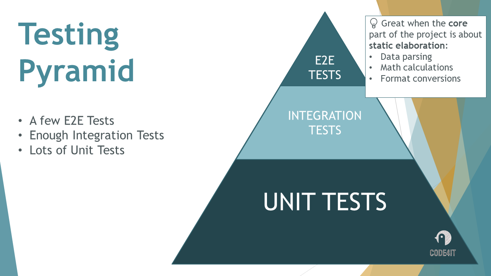
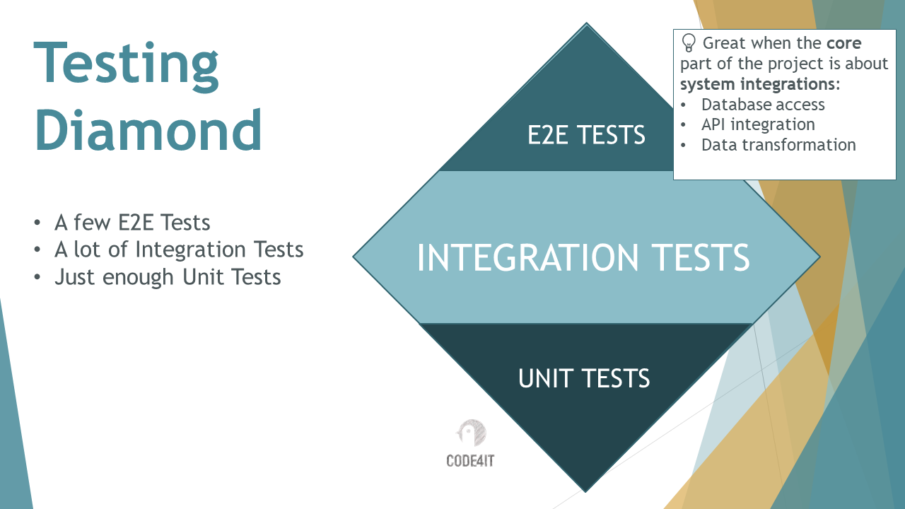

Every software project requires some sort of testing. You can execute them manually or put in place a whole suite of automatic tests that run timely, for example when you close a PR or daily, every day at the same time.

Still, not every project requires the same amount of tests, nor the same kind of tests.

Every test has a purpose to exist and has some intrinsic pros and cons. Talking about Unit Tests, the more tests you write, the more difficult it will be to change them if you update the whole architecture of the project.

Therefore, we should carefully choose the right strategy to test the most critical parts of our system. Meaningless tests can cause more trouble than benefits.

In this article, we're gonna learn about the types of tests, their purposes, and the best testing strategies we can apply to our projects.

## Different types of testing: Unit Tests vs Integration Tests vs End-to-end Tests

As we introduced before, there are lots of types of tests that you can write. Each test has a purpose, some pros, and some cons.

### Unit Tests: easy to write, fast to run, but coupled with implementation details

Usually, when we think about tests, we implicitly think about Unit Tests.

As we all know, a Unit Test is a test that refers to a unit. Ok, but *what the heck is a unit?* There is no official definition: in fact, everything can be a unit. Or, better, **everything that can be tested independently is a unit**.

**You can write Unit Tests about a class.** For example, when you create a Priority Queue - like [the one recently released in .NET 🔗](https://www.code4it.dev/blog/intro-priority-queue/) - you can write tests on the initialization and on the methods it exposes. For example, when you enqueue an item you want to test that the total count is increased. When you dequeue an item, you want to test that the retrieved item is the one with the highest priority. In this case, **the whole class is the Unit**.

Or **you can write a test on a specific method;** an example is the application of a Regular Expression: you might want to have a set of Unit Tests that verify that the RegEx works correctly with some input test strings and fails correctly with invalid strings. You are testing the correctness of the application of a single method. In this case, **a single method is the Unit**.

In the end, Unit Tests are the most common type of tests.

They have some **advantages**:

* they are **fast to write**;
* they are **fast to execute**;
* they don't require access to external dependencies, such as a database;

But they also have some **disadvantages**:

* **they are tightly coupled with the production code**: if you add a new parameter to the method under test, you have to update all the tests that use the newly-modified method;
* **they don't test the interaction between real components**: you must use fakes, stubs, and mocks to test the correctness of your tests;
* **they don't help in discovering side effects of a change**: say that you have a fictious method `Sanitize(string text)`, exposed by the class `StringUtilities`. `Sanitize` returns an empty string if the `text` variable is invalid. Now you change the implementation to return `null` instead of an empty string if the input string is invalid. And say that an external class `TextHandler` injects, using DI, the `StringUtilities` class in order to use the `Sanitize` method. When writing tests for the `TextHandler` method, you don't create a concrete instance of `StringUtilities`, but rely on stubs or mocks. Then, if you change the implementation of `Sanitize` without updating also the tests of `TextHandler`, you won't notice the change and the related side effects, and the production code is probably going to break because you are performing operations on a `null` value instead of an empty string.

### Integration Tests: focus on the interaction between components, but harder to write

Integration Tests are meant to validate that different parts of the system (for example, two concrete classes) work well together.

One kind of Integration Test that I find particularly effective is the one that **tests API functionalities**: you spin up an *in-memory* test server that runs your APIs with all the concrete *internal* dependencies (no stubs or mocks), and then you call such endpoints and validate the final result.

You can also - as I'd recommend - use an in-memory database instead of a real one. And all the *external* dependencies, such as external API systems, to ensure that your tests don't have dependencies upon systems you can't control.

We can list some advantages of Integration Tests:

* they ensure that the system, with **real classes**, works correctly;
* they **test upon functionalities, not implementations**. If you add a new parameter to an internal method, you don't have to worry about updating the tests: **implementation details do not matter**;
* you can focus on the expected result of the whole elaboration; say that your system needs to integrate data coming from different sources: with Integration Tests, you can mock such sources with realistic data and ensure that the whole execution brings the expected result.
* they are **easy to maintain**: since they're not tightly coupled with the production code, they change only if the functionalities change;
* they can act as **real-life documentation**: your tests explain how the system behaves instead of how the single parts of the system are built.

Clearly, there are some downsides:

* they are harder to write if compared to Unit Tests;
* a *single* Integration Test is slower than a single Unit Test, because you have to spin up a whole server and execute complex operations. Clearly, if you expect your system to respond in X milliseconds, you can expect your test to run in around X milliseconds (plus the initialization of the server);

### E2E Tests: use concrete external dependencies to ensure real-life tests

Finally, End-to-end (E2E) Tests are the most similar to manual tests.

They **run against the whole stack of the application**, using real instances of frontend, backend, database, and external services, and run in a system almost identical to the one used by real users.

They are the most difficult of the three to write, but they are also incredibly useful to cover the most important execution paths.

An example of an E2E Test could be made of the following steps:

1. the user logs in;
2. the user searches for a product;
3. the user adds a product to the cart;
4. the user confirms the payment;

that would bring to the following assertions:

1. the user can complete those paths successfully;
2. the order is received by the system;
3. the payment is correctly handled by the third-party system;
4. an email is sent to the user

As you can see, we cover the most critical user paths.

Again, we have advantages and disadvantages:

Advantages:

* they cover **business-critical paths**;
* they use production-like systems and dependencies, to ensure that the system as a whole works correctly;

Disadvantages:

* the hardest to write;
* the slowest to run;
* can be difficult to maintain: if your tests rely on the UI, and it slightly changes (for example, you change the class of the button that sends the Complete Checkout command), the whole E2E fails.

## Testing Pyramid: focus on Unit Tests

The "Testing Pyramid" is a way to think of a testing strategy where the main focus is on Unit Tests.

Have a look at the proportions between testing types. Using Testing Pyramid, we have:

* a lot of Unit Tests: run a lot of fast tests to cover most of the functionalities;
* a bunch of Integration Tests: since they are slower, but still important, run just a bunch of them;
* a few E2E Tests: sometimes you can even skip them, but in general it's a good practice to cover at least the most critical paths.

## Testing Diamond: focus on Integration Tests

Testing Diamond is another way to think of a testing strategy, opposed as to the Testing Pyramid. Here, our focus is on Integration Tests.

Unit Tests, Integration Tests, and E2E Tests have a different proportions:

* a few Unit Tests: write only strictly necessary Unit Tests: for example, data transformation, text parsing, and complex calculations;
* a lot of Integration Tests: since they cover business-critical functionalities, here is where you should spend most of your time and effort;
* a bunch of E2E Tests: again, cover only the critical operations.

## What to choose?

As we saw, Testing Pyramid is focused more on fast and easy-to-write tests, while Testing Diamond is more about business-critical tests.

Below you can see a GIF that explains why Integration Tests are more important than Unit Tests: the door alone works correctly, and the lock works correctly, so Unit Tests for both systems pass correctly. But the overall system does not work: the Integration Tests would fail.

So, what to choose? As always, **there is no silver bullet**: it always depends on your project and your team.

But, in general, **I'd prefer Testing Diamond**: our tests should verify that the overall system works properly, without worrying about implementation details.

If you rename a class or change the internal data access (eg: you transform a static class into a service), you don't want to update the tests: as long as the final result is correct, the test is more than enough.

## Code Coverage and Testing Strategies

As I often say, **reaching a high Code Coverage is not a useful goal**: a system with 100% test coverage still has bugs - it's just that you haven't found them yet.

Also, if you mark every class as to be ignored by code coverage (in C#, using `ExcludeFromCodeCoverage`), you can have 100% code coverage without a single test.

So, **don't write tests for the sake of reaching 100% code coverage**; on the contrary, **use code coverage to see which parts of the systems have not been tested**.

In my opinion, **code coverage works best with Testing Pyramid**: write Integration Tests, and make sure that your system works correctly. Then use code coverage indicators to learn which parts have not been tested (for example, you validated an empty string but not a null value). You can use Unit Tests to cover those specific cases.

## Further readings

There are lots of articles out there about Unit Tests, and they often say the same things. So, I want to highlight an article that focuses on Integration Tests and E2E Tests: this article is well-written and explores such topics in detail:

🔗 [End-to-End Testing vs Integration Testing | Testim](https://www.testim.io/blog/end-to-end-testing-vs-integration-testing/)

You might be wondering: how can we run Integration Tests for .NET APIs? I wrote an article with a simple, basic approach, that can help you understand it: 

🔗[How to run Integration Tests for .NET API | Code4IT](https://www.code4it.dev/blog/integration-tests-for-dotnet-api/)

_This article first appeared on [Code4IT 🐧](https://www.code4it.dev/)_

Finally, we learned how Code Coverage impacts, and is impacted by, the testing strategy. You can have a Code Coverage report in Visual Studio by installing a tool: Coverlet.

🔗 [How to view code coverage with Coverlet and Visual Studio 2019 | Code4IT](https://www.code4it.dev/blog/code-coverage-vs-2019-coverlet/)

## Wrapping up

In this article, we've learned the main differences between Unit Tests, Integration Tests, and End-to-end Tests.

We've also learned two testing strategies, Testing Pyramid and Testing Diamond, and what are their strengths and their weaknesses.

I hope you enjoyed this article! Let's keep in touch on [Twitter](https://twitter.com/BelloneDavide) or [LinkedIn](https://www.linkedin.com/in/BelloneDavide/)! 🤜🤛

Happy coding!

🐧
