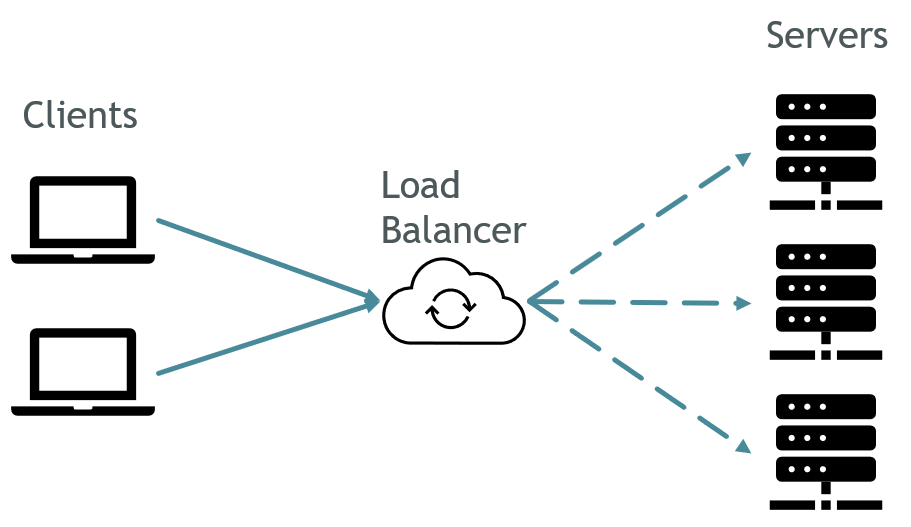
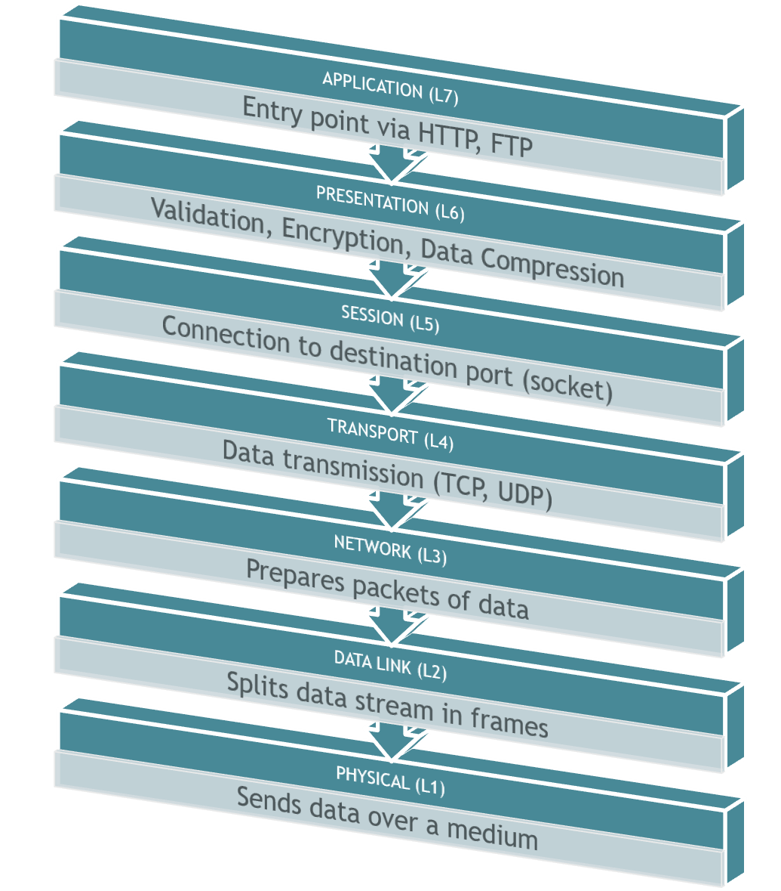

When handling a massive amount of requests, a system generally needs to balance the incoming load to avoid overloading a single server. To do that, we typically use a Load Balancer in front of our applications to handle all the incoming traffic.

In this article, we will learn what is a Load Balancer, what problems it solves, and we will delve into the main categories of Load Balancing: L7 and L4.

## What is a Load Balancer?

**A Load Balancer is a piece of the network architecture that deals with incoming requests** and, through a specific process, forwards each request to a specific node of the "internal" architecture.

It can be a distinct piece of hardware, as well as a software component already part of the network architecture.

Despite the name, a Load Balancer does not only balance the load: some of its core functionalities are:

- **Load Balancing**: of course, it has a way to determine which server will handle a specific request;
- **Service Discovery**: to understand where to redirect requests, a Load Balancer need to keep track of the available resources and their addresses;
- **Abstraction**: clients will not know the real address of the destination servers: they will only know the address of the Load Balancer;
- **Health Checking**: a destination server must not only exist, but it must also be in a healthy state. Unhealthy servers are excluded from the possible destination servers.

Health checking is one of the vital parts of a Load Balancer, and how to handle unhealthy services is a complex topic.

Suppose you have two servers, Server1 and Server2, that can handle 50 requests per second each. Suddenly, Server1 becomes unhealthy, and the Load Balancer removes it from the list of available servers. The same 100 users keep accessing the service, but now, since Server1 is unavailable, Server2 will have to handle 100 requests/sec. If it's not able to handle that spike, the whole application will be offline, and none of the users will be able to access the system. So, just **moving all the traffic to a single instance should be avoided**, and you must think of a more complex mechanism.

Depending on the type of Load Balancer (L4 vs L7), you can also have more functionalities, such as _Authentication_ and _Observability_.

## The OSI Model

Before moving to L4 and L7, we need to have a look at the OSI model.

**The OSI Model is the definition of the abstractions used in networking**. It's composed of 7 different _layers_ (L1 to L7), each with its specific responsibilities, protocols, and behaviors.

- **L7 - Application layer**: is the entry point of the stack, and is the one accessed by computers; it works with HTTP, FTP, and more;
- **L6 - Presentation layer**: validates data format, applies encryption, and applies data compression; it encrypts data when using SSL, and validates data formats like JPEG or TXT;
- **L5 - Session layer**: maintains the connection to the destination port; operates via network sockets;
- **L4 - Transport layer**: transmits data using a transmission protocol (namely, TCP and UDP), guaranteeing connection reliability and handling transmission errors;
- **L3 - Network layer**: working on packets of data, this layer defines which physical path data will take; works with IPs and ICMP;
- **L2 - Data Link layer**: it defines the format of the data on the network, dividing the source of data into smaller chunks (_frames_);
- **L1 - Physical layer**: this layer transmits the raw stream of bits over a physical medium (such as a wire);

When a client tries to access a host, every request passes through all seven layers. A Load Balancer that works on a specific layer can perform different operations because it "knows" different metadata of the same connection.

## L7 Load Balancer: handle requests by looking at the content

**An L7 Load Balancer acts on the Application layer**. Since it works at this layer, the Load Balancer can balance requests based on the whole payload of the request.

For instance, an L7 Load Balancer can handle:

- **Routing**: since it knows the full URL, it can redirect the request to a specific server. For instance, if the path is _/images/avatar.png_, the Load Balancer can send the request to a server dedicated to images;
- **SSL Termination**: encryption and decryption are resource-expensive operations. You can free up some resources on the destination servers by **delegating encryption and decryption to the Load Balancer**, making your applications able to handle more requests (because they no longer need to encrypt and decrypt data);
- **Authentication**: given that an L7 Load Balancer has access to all the metadata related to a request, such as HTTP Headers, it can work as an authentication layer that returns 401 - Unauthorized in case, for example, a specific HTTP Header is missing;
- **Observability**: an L7 Load Balancer can be used to apply observability to a resource, by tracing the incoming requests, the response time, and more;
- **Security**: an L7 Load Balancer can protect your application from DDoS attacks ;

You can find a lot of Load Balancers that work at the Application layer, such as:

- [Azure Application Gateway](https://learn.microsoft.com/en-us/azure/application-gateway/overview)
- [AWS Classic/Application Load Balancer](https://aws.amazon.com/elasticloadbalancing/features/)
- [Traefik (Open Source)](https://traefik.io/)
- [NGINX (Open Source)](https://github.com/nginx/nginx)

## L4 Load Balancer: handle requests by looking at connections and IPs

**An L4 Load Balancer acts at the TCP/UDP level**: it does not have access to the request Body or its HTTP Headers, so it cannot perform smart decisions based on the actual content of the request.

Even though it's not as smart as an L7 Load Balancer, but still, has some advantages:

- Since it works at the transport layer, and does not perform any check on the request payload, it's way **faster** than an L7 Load balancer;
- It's unaware of the type of data it is receiving: bytes can come from an HTTP request as well as from a MongoDB connection;
- Can choose the destination server based on the IP address;

As you can imagine, many teams prefer an L7 Load Balancer over an L4 Load Balancer.

However, you can find some good L4 Load Balancers on the web:

- [Azure Load Balancer](https://learn.microsoft.com/en-us/azure/load-balancer/load-balancer-overview)
- [AWS Network/Gateway/Classing Load Balancer](https://aws.amazon.com/elasticloadbalancing/features/)
- [HAProxy Technologies](https://www.haproxy.com/solutions/load-balancing)
- [VMWare](https://docs.vmware.com/en/VMware-Tanzu-Kubernetes-Grid-Integrated-Edition/1.16/tkgi/GUID-network-profiles-ncp-lb.html)

## Further readings

We've just scratched the surface of the topic.

For sure, to understand better the differences between L7 and L4, have a look at the definition and the structure of the OSI Model:

🔗 [OSI Model | Wikipedia](https://en.wikipedia.org/wiki/OSI_model)

Then, an amazing article about all the possible functionalities of a Load Balancer, as well as the different types (Edge, Sidecar, Middle):

🔗 [Introduction to modern network load balancing and proxying | Matt Klein](https://blog.envoyproxy.io/introduction-to-modern-network-load-balancing-and-proxying-a57f6ff80236)

_This article first appeared on [Code4IT 🐧](https://www.code4it.dev/)_

Finally, a short but valuable article about L4 and L7 Load Balancers, with a demo created using Docker and Envoy:

🔗 [L4 vs L7 Load Balancing | Mohak Puri](https://levelup.gitconnected.com/l4-vs-l7-load-balancing-d2012e271f56)

## Wrapping up

In this article, we've learned how L7 and L4 Load Balancers differ, and what are the functionalities provided by both types.

Here's a short table to sum up the differences.

| L4 Load Balancing                                                                                        | L7 Load Balancing                                                                                                |
| -------------------------------------------------------------------------------------------------------- | ---------------------------------------------------------------------------------------------------------------- |
| Works at the transport layer                                                                             | Works at the application layer                                                                                   |
| Uses TCP and UDP protocols                                                                               | Uses HTTP and SMTP protocols                                                                                     |
| Makes routing decisions based on simple algorithms and network information such as ports and protocols   | Makes routing decisions based on content information such as headers, message content, URL type, and cookie data |
| Does not inspect or decrypt messages                                                                     | Terminates, inspects, and decrypts messages                                                                      |
| Fast, efficient, and secure                                                                              | Complex, informed, and application-aware                                                                         |
| Deals with individual connection flows                                                                   | Deals with individual requests                                                                                   |
| Cannot do smart load balancing or content optimization based on the media type, localization rules, etc. | Can do smart load balancing and content optimization based on the media type, localization rules, etc.           |

I hope you enjoyed this article! Let's keep in touch on [Twitter](https://twitter.com/BelloneDavide) or [LinkedIn](https://www.linkedin.com/in/BelloneDavide/)! 🤜🤛

Happy coding!

🐧
