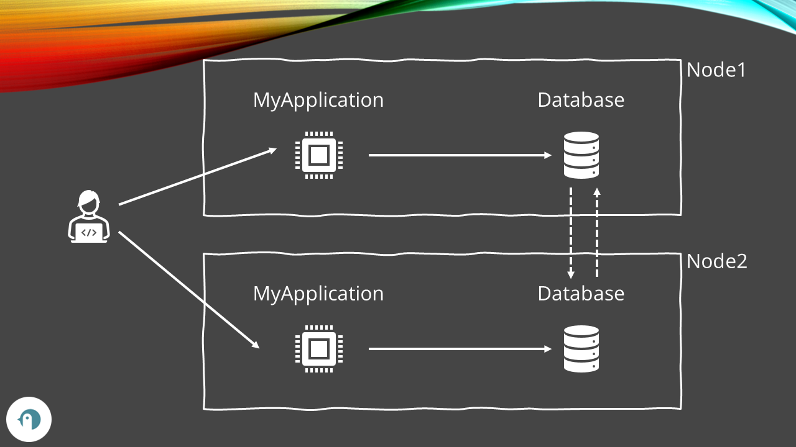
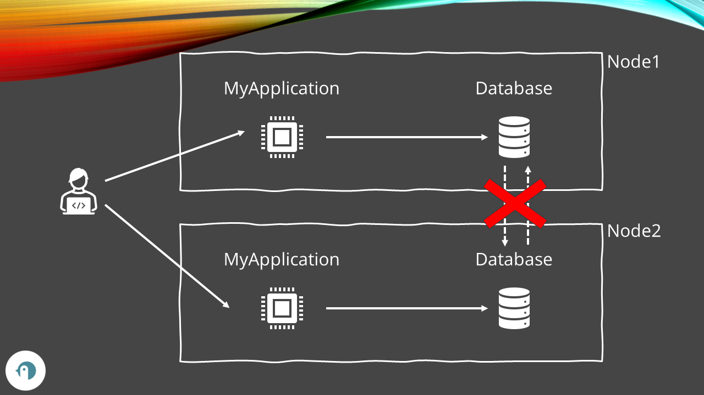
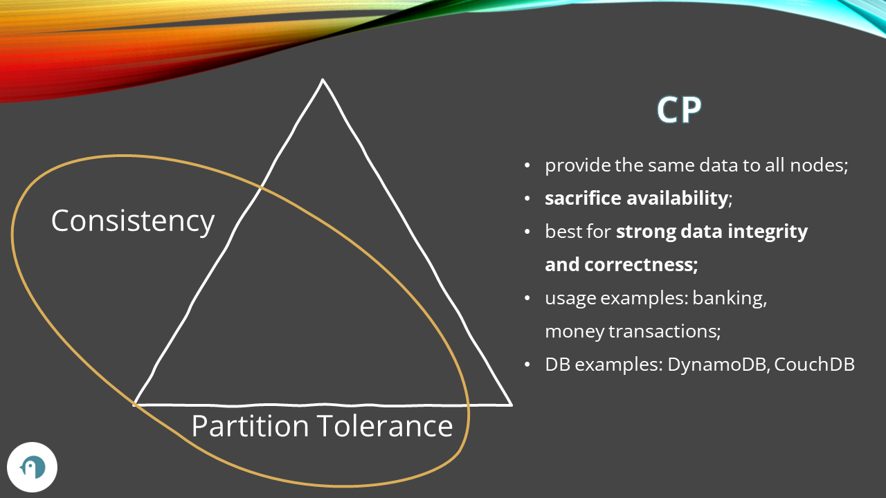
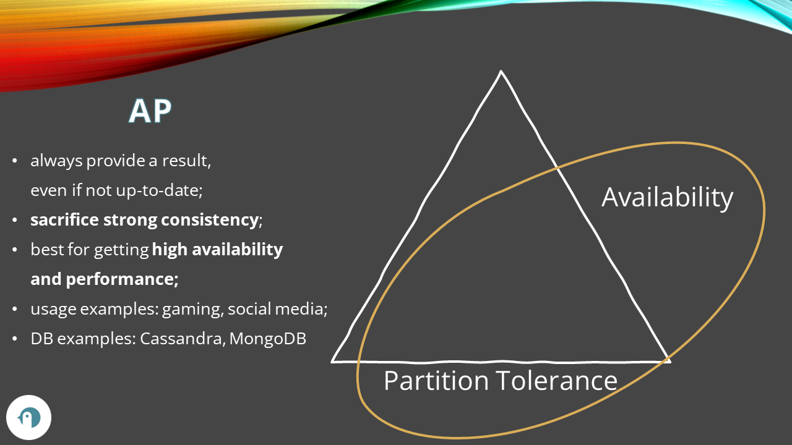
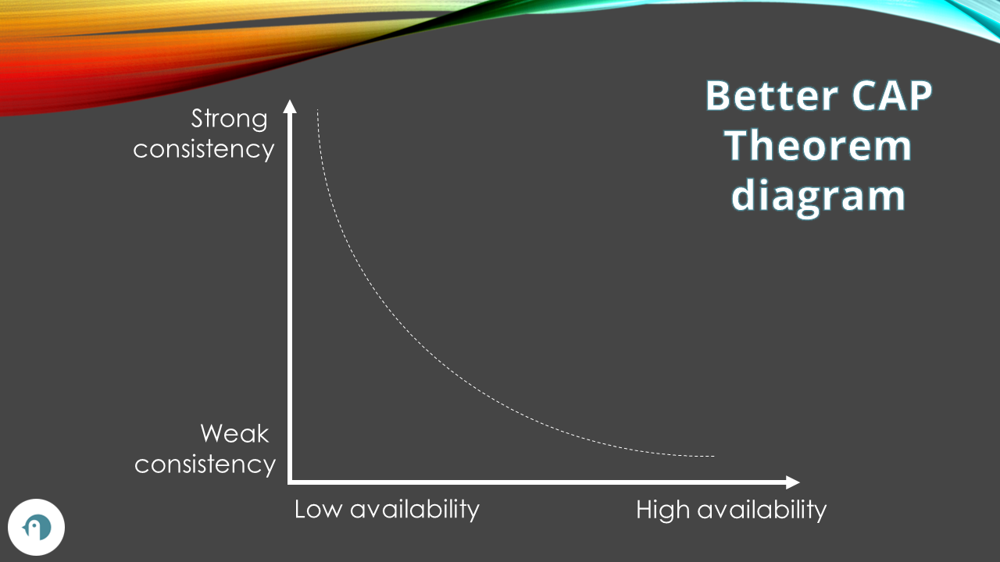

One of the most important things to handle when building distributed systems is data consistency. Will your users always get the most recent data? Is it really THAT necessary?

In 1998, Eric Brewer came up with the idea of the CAP Theorem: it is often presented with the formula «You have **C**onsistency, **A**vailability, and **P**artition Tolerance. You can't have all of them. You have to **pick two**». Is it really that simple? Are we missing something?

In this article, we are going to learn about the CAP Theorem in a not-so-shallow way. We will learn what the CAP theorem actually means, what are its limits, and how we can use this theorem to build a system that fits our necessities.

## What is a distributed system

The first thing to define is what is a distributed system.

As you can imagine, we are talking about a system that is distributed. Ok, but how?

When we create distributed systems, we often deploy our systems in multiple nodes distributed across a region, or even worldwide, to give each single node the responsibility to handle a certain amount of load. This also helps us in the case of a node not available: we won't have the whole application down since we can define a strategy to handle this kind of failure.

To help you visualize the idea of a distributed system, have a look at the diagram below. We have two nodes, Node1 and Node2, each of them includes an instance of MyApplication and an instance of the Database. Those two instances of the database must be kept in sync, so we have a process (usually implemented by the database vendor) that synchronizes the data between the two instances. Finally, we have one or more clients that communicate with MyApplication, accessing the instance deployed on one of those nodes.



As you can see, the two database instances communicate via network. Everything would work fine if it wasn't for a tiny detail: **the network is not reliable!** There cannot exist (well, give the current technology) a totally reliable network: packets can be lost, data can be corrupted, servers can be temporary unavailable. We must then consider this property of a network when building our distributed systems.

Now that we have defined what a distributed system is, we can move to the actual topic: what do the letters in CAP mean?

## Consistency, Availability, Partition Tolerance«

As you can imagine, CAP is an acronym.

We are going to explain what each letter means in this context.

### C: (strong) Consistency

The C in CAP stands for Consistency, meaning that every read either returns the latest data or, in case it is not possible, it returns an error. As a matter of fact, this is called *Strong Consistency**, as opposed to Weak Consistency or Eventual Consistency.

You will always receive the latest data.

Say that the database stores some data about me. We have

```plaintext
name=Davide
```

and this value is available both on Node1 and Node2.

Now a client updates the value by accessing Node2. 

```plaintext
name=DavideBellone
```

A system has the property of being **Strongly Consistent** if every access to that data always return the newer value (in this case, DavideBellone), independently from the node that the client accessed.

In case the system cannot guarantee that the result is the most recent data, the system returns an error.

### A: Availability

Availability is the property of a system of always responding to a request. In the case of a database, we can define that it has the Availability attribute if a query is always guaranteed to return a value, even if it is not the most recent one.

Let's use again the previous example. We have the two nodes, each of them contains 

```plaintext
name=Davide
```

Now a client updates the value to DavideBellone.

The system is defined as Available if every query to it returns a value, regardless of the exact value: it might be the new one (DavideBellone) or the old one (Davide). The important thing is that it always responds.

### P: Partition tolerance

Partition tolerance refers to a system that is able to keep working even in the case of a network error, where some messages are being dropped during the communication between nodes.

When the systems cannot communicate, we talk about **network partition failures**, meaning that, given that the network cannot guarantee the communication between nodes, such nodes are isolated (so, partitioned).

**Network failures cannot be avoided.** It's a matter of physical communication, and the only thing we can do is keeping this kind of issue in mind and building our systems in a way that such failures can be managed gracefully.


## CP, AP, CA: pick two?

The CAP Theorem is often defined as «pick two», and, generally speaking, you will see the famous triangle diagram where each side of the triangle represents one of the 3 letters in CAP.


So, you just have pick 2 sides of the triangle as the most important characteristics, in order to make your technical choices according to the project needs.

But we already know that network errors will occur!

Let's get back to the initial example: two nodes whose database instances are kept in sync via network. Now imagine that a user writes data on the Node1, but for some reasons it is impossible to propagate the change to Node2.



What can we do?

### CP: Consistency and Partition tolerance

You can have have Consistency and Partition tolerance sacrificing the Availability.



A system that guarantees CP guarantees that in case of a network error, if the system is not able to return the latest data, it will return an error.

This, at least, until the network failure is fixed: once the network starts working again, the two database instances can communicate again, and the data can be synchronized.

📩 A question for you: a user updates some data on Node1. Due to a network error, the data is not updated on Node2. How can Node2 "know" that some new data has been posted on Node1, and therefore return an error instead of returning the old value? 📩

**Databases that support CP generally use the ACID consistency model**: a transaction either completes successfully on every node or it is rolled back. This ensures that data is strongly consistent in all the database nodes.

### AP: Availability and Partition tolerance

On the other side, we have AP: Availability and Partition tolerance.

Systems like this sacrifice strong consistency in exchange of availability: sometimes it's better to receive a not-so-updated data rather than not receiving anything.




Let's simulate what happens in an AP system:

1. both systems have name=Davide in their database;
2. a user updates the value to DavideBellone on Node1;
3. the database on Node1 updates the value;
4. the network between the two DB instances becomes unavailable: Node2 does not receive the updated value;
5. a user accesses Node2 to get the value, and receives Davide (the old value)
6. the network starts working again; the synchronization can happen;
7. Node2 updates its value;

Generally speaking, non-relational databases support the AP mode: using the BASE consistency model (Basically Available, Soft state, Eventually consistency), they can ensure that every query does return a value, even if with the data that does not reflect the latest values.


### CA: Consistency and Availability (this cannot exist)

Network errors cannot be avoided. There is no way to create a system that prevents them, so every system will have to deal with network partitioning.

This also means that you cannot have a system that supports Consistency and Availability, but does not support Partition Tolerance: every system, in fact, needs to deal with network partitioning, so the CA combination just cannot exist.

## Limits of the CAP theorem

The CAP theorem is pretty famous in the formula «pick two out of three». However, this statement has some limitations:

1. it's not formally correct: you can only pick AP and CP, but never CA;
2. in any case, you have consistency; when considering CP, we can have strong consistency, while when considering AP we can have only eventual consistency;
3. a system cannot be 100% available; we can try to get high availability, measured with the nines.
4. in short, we cannot get a system 100% immediately consistent or 100% available, since there will always be some **latency**; the choice between Consistency and Availability is not a binary choice, but it's a spectrum.

So, **I came up with this new diagram** to explain the CAP theorem:



We cannot just «pick two», but we have to decide which levels of Consistency and Availability we need for our system.

## Further readings

There are a lots of articles out there that talk about the CAP theorem, so here's a few interesting resources.

The first one is this YouTube video by Mark Richards:

🔗 [CAP Theorem Illustrated | Mark Richards](https://www.youtube.com/watch?v=9SSvdLnmDiI)

Next is the best book on Distributed systems I've ever read: "Understanding distributed systems" by Roberto Vitillo. In his book, Roberto explains **everything** you need to know about distributed systems; to better understand the CAP theorem you need some more theoretical knowledge that I omitted here but you can find in his book:

🔗 [Understanding distributed systems | Roberto Vitillo](https://understandingdistributed.systems/)

_This article first appeared on [Code4IT 🐧](https://www.code4it.dev/)_

Finally, since the CAP Theorem does not fully describe the essence of distributed databases since it does not consider latency, you can read about another theorem that builds upon the CAP theorem:

🔗 [PACELC Theorem | Wikipedia](https://en.wikipedia.org/wiki/PACELC_theorem)

## Wrapping up

In this article, we've learned about the CAP theorem and why it's not just «pick two».

As we've learned, it's not just a choice between the 3 edges of the triangle: it's a matter of choosing what is more important: consistency or availability?

I hope you enjoyed this article! Let's keep in touch on [Twitter](https://twitter.com/BelloneDavide) or [LinkedIn](https://www.linkedin.com/in/BelloneDavide/)! 🤜🤛

Happy coding!

🐧


[ ] Titoli
[ ] Frontmatter
[ ] Rinomina immagini
[ ] Alt Text per immagini
[ ] Grammatica
[ ] Bold/Italics
[ ] Nome cartella e slug devono combaciare
[ ] Immagine di copertina
[ ] Rimuovi secrets dalle immagini
[ ] Pulizia formattazione
