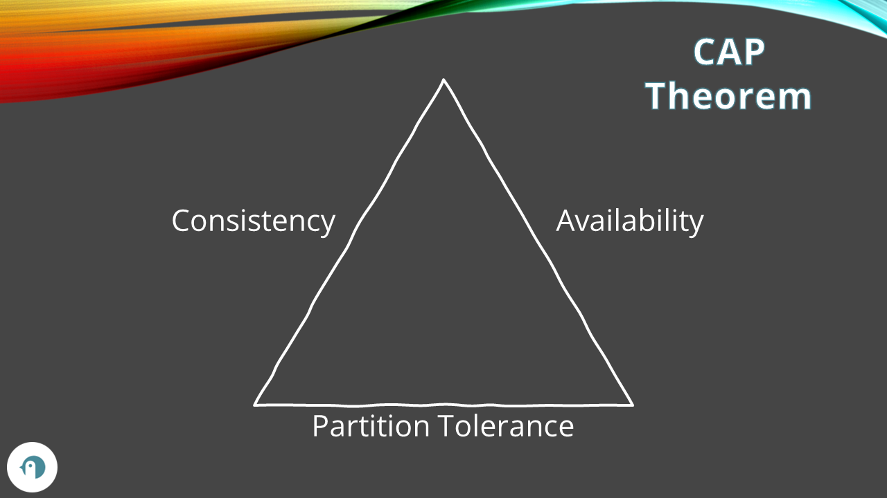

One of the most important things to handle when building distributed systems is data consistency. Will your users always get the most recent data? Is it really THAT necessary?

In 1998, Eric Brewer came up with the idea of the CAP Theorem: it is often presented with the formula «You have **C**onsistency, **A**vailability, and **P**artition Tolerance. You can't have all of them. You have to **pick two**». Is it really that simple? Are we missing something?

In this article, we are going to learn about the CAP Theorem in a not-so-shallow way. We will learn what the CAP theorem actually means, what are its limits, and how we can use this theorem to build a system that fits our necessities.

## What is a distributed system

The first thing to define is what is a distributed system.

As you can imagine, we are talking about a system that is distributed. Ok, but how?

When we create distributed systems, we often deploy our systems in multiple nodes distributed across a region, or even worldwide, to give each single node the responsibility to handle a certain amount of load. This also helps us in the case of a node not available: we won't have the whole application down since we can define a strategy to handle this kind of failure.

To help you visualize the idea of a distributed system, have a look at the diagram below. We have two nodes, NodeA and NodeB, each of them includes an instance of MyApplication and an instance of the Database. Those two instances of the database must be kept in sync, so we have a process (usually implemented by the database vendor) that synchronizes the data between the two instances. Finally, we have one or more clients that communicate with MyApplication, accessing the instance deployed on one of those nodes.


As you can see, the two database instances communicate via network. Everything would work fine if it wasn't for a tiny detail: **the network is not reliable!** There cannot exist (well, give the current technology) a totally reliable network: packets can be lost, data can be corrupted, servers can be temporary unavailable. We must then consider this property of a network when building our distributed systems.

Now that we have defined what a distributed system is, we can move to the actual topic: what do the letters in CAP mean?

## Consistency, Availability, Partition Tolerance«

As you can imagine, CAP is an acronym.

We are going to explain what each letter means in this context.

### C: (strong) Consistency

The C in CAP stands for Consistency, meaning that every read either returns the latest data or, in case it is not possible, it returns an error. As a matter of fact, this is called *Strong Consistency**, as opposed to Weak Consistency or Eventual Consistency.

You will always receive the latest data.

Say that the database stores some data about me. We have

```plaintext
name=Davide
```

and this value is available both on NodeA and NodeB.

Now a client updates the value by accessing NodeB. 

```plaintext
name=DavideBellone
```

A system has the property of being **Strongly Consistent** if every access to that data always return the newer value (in this case, DavideBellone), independently from the node that the client accessed.

In case the system cannot guarantee that the result is the most recent data, the system returns an error.

### A: Availability

Availability is the property of a system of always responding to a request. In the case of a database, we can define that it has the Availability attribute if a query is always guaranteed to return a value, even if it is not the most recent one.

Let's use again the previous example. We have the two nodes, each of them contains 

```plaintext
name=Davide
```

Now a client updates the value to DavideBellone.

The system is defined as Available if every query to it returns a value, regardless of the exact value: it might be the new one (DavideBellone) or the old one (Davide). The important thing is that it always responds.

### P: Partition tolerance

Partition tolerance refers to a system that is able to keep working even in the case of a network error, where some messages are being dropped during the communication between nodes.

When the systems cannot communicate, we talk about **network partition failures**, meaning that, given that the network cannot guarantee the communication between nodes, such nodes are isolated (so, partitioned).

**Network failures cannot be avoided.** It's a matter of physical communication, and the only thing we can do is keeping this kind of issue in mind and building our systems in a way that such failures can be managed gracefully.


## CP, AP, CA: pick two?

The CAP Theorem is often defined as «pick two», and, generally speaking, you will see the famous triangle diagram where each side of the triangle represents one of the 3 letters in CAP.



So, you just have pick 2 sides of the triangle as the most important characteristics, in order to make your technical choices according to the project needs.

But we already know that network errors will occur!

Let's get back to the initial example: two nodes whose database instances are kept in sync via network. Now imagine that a user writes data on the NodeA, but for some reasons it is impossible to propagate the change to NodeB.


What can we do?

### CP: Consistency and Partition tolerance

You can have have Consistency and Partition tolerance sacrificing the Availability.


A system that guarantees CP guarantees that in case of a network error, if the system is not able to return the latest data, it will return an error.


### AP: Availability and Partition tolerance

### CA: Consistency and Availability (this cannot exist)

## Limits of the CAP theorem


## Further readings

https://www.developertoarchitect.com/lessons/lesson111.html

_This article first appeared on [Code4IT 🐧](https://www.code4it.dev/)_

https://en.wikipedia.org/wiki/CAP_theorem

## Wrapping up


I hope you enjoyed this article! Let's keep in touch on [Twitter](https://twitter.com/BelloneDavide) or [LinkedIn](https://www.linkedin.com/in/BelloneDavide/)! 🤜🤛

Happy coding!

🐧


[ ] Titoli
[ ] Frontmatter
[ ] Rinomina immagini
[ ] Alt Text per immagini
[ ] Grammatica
[ ] Bold/Italics
[ ] Nome cartella e slug devono combaciare
[ ] Immagine di copertina
[ ] Rimuovi secrets dalle immagini
[ ] Pulizia formattazione
