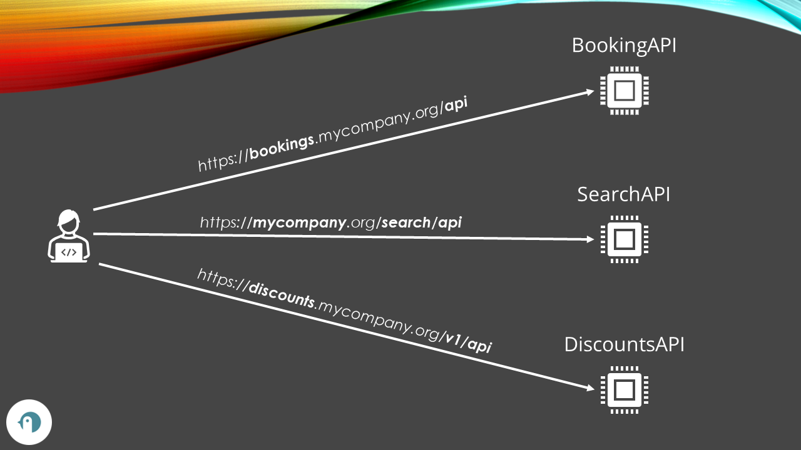
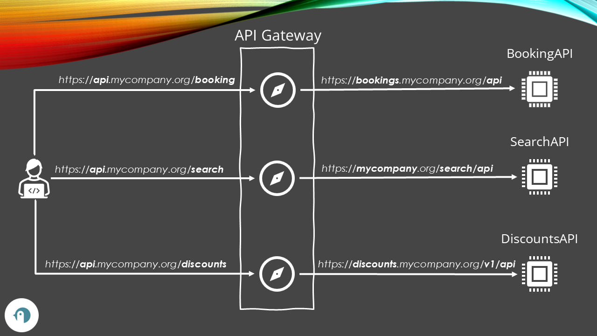
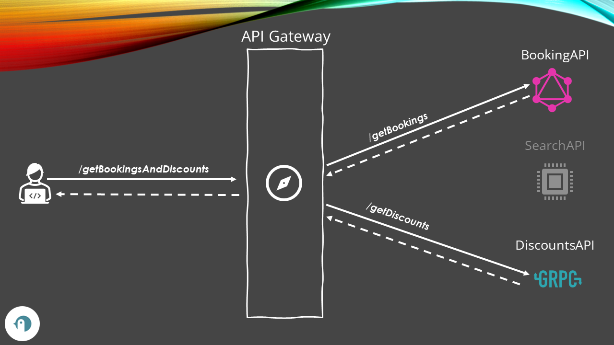
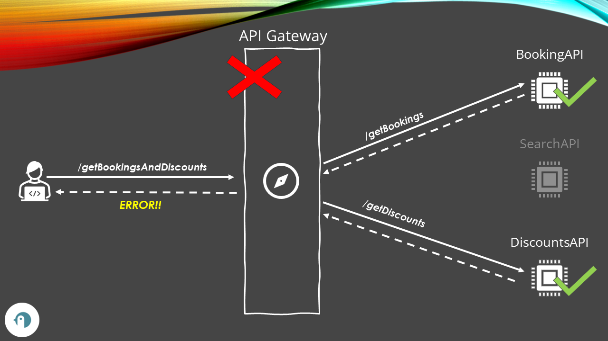
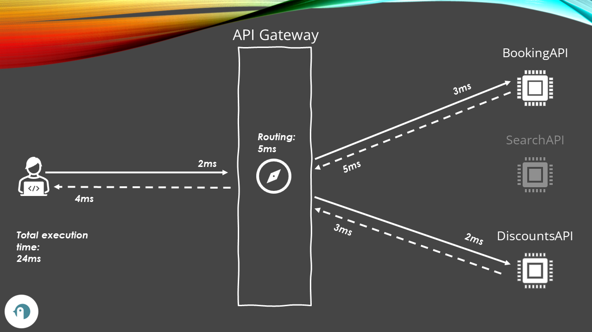

Especially when talking about _microservices_, many articles and videos focus on an architectural element that, in their opinion, is absolutely necessary for building such kinds of applications: _API Gateways_.

Yes, they are actually useful, but they are not the solution to every architectural problem.

In this article, we will learn what API Gateways are, their pros and cons, why you should distinguish them from Load Balancers, and more.

## What is an API Gateway?

Imagine that your application is made of several web services and APIs. Each of them will be deployed on a separate host, therefore having a different URL.

While it can be helpful for internal development - you have a clear separation of operations available in your system - it can become cumbersome for the developers who have to integrate all those endpoints in their application.

That's where API Gateways come into play: they **add a sort of _façade_ in front of your set of APIs** to uniform the access to your system.

Say that you've built a Hotel booking system that is made of 3 services:

- _BookingAPI_, deployed at *https://bookings.mycompany.org/api*
- _SearchAPI_, deployed at *https://mycompany.org/search/api*
- _DiscountAPI_, deployed at *https://discounts.mycompany.org/v1/api* (notice the _v1_)

By adding an API Gateway, you can hide these APIs behind a single host, like *https://api.mycompany.org/*, mapping the route path to the original services' URLs.

As with everything in the world, there are advantages and disadvantages. Let's learn! 🔥

## Advantages of an API Gateway

API Gateways have lots of advantages. It's not a coincidence that they are being used in many architectures.

Let's see some of the best characteristics of an API Gateway.

### Internal API security

Since your internal APIs are hidden behind an API Gateway, you make them _less_ discoverable by intruders that might want to access your systems and data.

Let's go back to the Hotel Booking system in our example. External users will only see the _api.mycompany.com_ host without knowing the structure of the internal API services. This **reduces the attack surface**.

You can also **centralize Access Control Policies** by adding them to the API Gateway and have them applied to all the APIs behind the Gateway.

Finally, you can **monitor all the incoming requests** and analyze the traffic to spot unusual behaviour in a single place.

### Reduced complexity

Some concerns are common to all the APIs within the same system, such as **rate limiting**, **throttling**, and **access control**.

With API Gateways, you can **centralize the settings** for such common concerns in a single point. For example, once you have defined some rate limiting policies on your Gateway, you can have the same settings automatically applied to every internal API endpoint (well, not "physically" applied to the internal APIs, but since the Gateway block some incoming requests, they will not reach the internal systems as well).

API Gateways also help with **service documentation**: since you have all the internal services listed in the API Gateway, just by looking at its configurations, you can see the list of the deployed APIs and their hostname.

### Flexibility

Since API Gateways act as a façade in front of other services, you can integrate services that work with **different protocols or formats**.

For example, you can have one service that exposes GraphQL APIs, another one that works with GRPC, and have them all exposed as REST APIs using the API Gateway as a wrapper/converter to and from such formats.

Hiding the actual API endpoints behind a Gateway also allows you to **implement [API Composition](https://www.code4it.dev/blog/overview-api-gateways/#api-composition)**, which is a technique that will enable you to aggregate the results from different internal API calls and return the caller only the final result (as opposed as making the client call each single service and compose the result afterwards).

### Enhanced performance

Depending on the vendor, you can have different tools to improve the overall performance.

For example, you can **cache responses** to get quicker response times, or you can apply uniformed **data compressions**.

Some vendors allow you to have multiple instances of the same service available behind the API Gateway, acting as a sort of Load Balancer.

Another powerful technique you can implement is [SSL Termination](https://www.code4it.dev/blog/overview-api-gateways/#ssl-termination). In a simple architecture, if you have to communicate securely with 3 systems to aggregate the result, you have to validate the SSL connection three times. With **SSL Termination**, you can move these operations on the API Gateway component and avoid doing that in all the other services, making the application more performant.

## Disadvangages

### Single point of failure

Since we placed an API Gateway in front of all the other API applications, all the external communication passes through the API Gateway.

This means that **if the API Gateway is unavailable, the whole system becomes unavailable as well**, even though the single APIs are still up and running.

So, when using an API Gateway:

- **beware of the settings**: an error in the configurations can have consequences on the whole system;
- ensure that the Gateway is capable of handling the incoming load of requests: if the API Gateway cannot cope with the number of incoming requests, it may become unavailable and make the whole system offline.
- ensure that you have some **protection against DDoS attacks** (see the previous point).

### Increased latency

An API Gateway is an **additional hop** in the API processing: when a client wants to call an API application, all requests must first pass through the API Gateway, which, in turn, will call the internal API.

This processing, this routing, adds some network latency. Maybe it's not noticeable, but it depends on the Gateway you choose, the underlying infrastructure, and the processing done by the Gateway.

### Vendor Lock-in

Once you have deployed and configured an API Gateway, moving to another vendor might be difficult.

You risk vendor lock-in, with all the consequences: if the price goes up or if they remove some functionalities that you need, you will have to come up with a solution to migrate that specific part of your infrastructure to another vendor.

It might not be so easy - some straightforward ways to mitigate the risk are to **make your systems platform agnostic** and to **create e2e tests** that validate the routing and the functionalities.

## API Gateway VS Load Balancer

Some people I know, and the authors of some articles I read, use API Gateway and Load Balancer as synonyms.

Let me get it straight: **they are not the same!**

Yes, they both are components that work with incoming requests. But they serve two totally different purposes.

While Load Balancers "just" spread incoming requests across multiple instances of the same service, API Gateways act as a façade in front of different types of services.

They are two totally different components of an architecture.

Some vendors provide both functionalities, while others don't. So, keep the two meanings distinct, and try to use the correct wording.

## API Gateway vendors comparison

Here is a list of some API Gateway vendors' prices, pros, and cons.

Notice: _I have yet to try all these vendors_. The info in this list comes primarily from their official documentation and, in some cases, from other resources that compare such products.

- **[Kong](https://konghq.com/products/kong-gateway)**: it's an Open Source product that provides features such as authentication, rate limiting, logging, caching, and more. It is written in Lua and runs on top of Nginx.
  - Price: Kong offers free community and paid enterprise editions.
  - Pros: Kong is easy to install and configure, supports many plugins and integrations, and has a large and active community.
  - Cons: Kong may have performance issues when handling large volumes of traffic, requires Nginx as a dependency, and has limited support for GraphQL, available only for the enterprise edition.
- **[Tyk](https://tyk.io/)**: it's a lightweight API Gateway written in Go. It offers API analytics, a developer portal, a dashboard, security, and other features. It can be deployed on-premises, in the cloud, or as a hybrid.
  - Price: Tyk offers a 5-week free trial and four payment tiers. The Starter edition costs $600 per month for up to 10 million API calls.
  - Pros: Tyk is fast, scalable, and flexible and has a rich set of features and plugins.
  - Cons: Even though Tyk is open source, it has no free tier.
- **[Express Gateway](https://www.express-gateway.io/)**: an API Gateway that is based on Express.js. It provides a single package with dynamic routing, access control, and API management. It is written in JavaScript.
  - Price: Express Gateway is free and open source.
  - Pros: Express Gateway is simple to use and customize, supports Node.js ecosystem and middleware, and can be easily extended with plugins.
  - Cons: Express Gateway may not be suitable for complex scenarios, as it lacks some advanced features such as caching (which is in the Medium Term roadmap).
- **[Zuul](https://github.com/Netflix/zuul)**: an open-source API Gateway that is part of the Netflix OSS stack. It provides dynamic routing, resiliency, security, and monitoring for microservices. It is written in Java and can be integrated with other Netflix components.
  - Price: Zuul is free and open source.
  - Pros: Zuul is robust, reliable, and battle-tested by Netflix, and supports filters for request processing.
  - Cons: Zuul has limited documentation.
- **[Azure API Management](https://azure.microsoft.com/en-us/pricing/details/api-management/)**: it offers features such as a developer portal, Gateway, policies, throttling, caching, and more.
  - Price: Azure API Management offers a free tier and several paid tiers. The paid tiers start from $0.07 per hour for the Developer tier and go up to $3.83 per hour for the Premium tier.
  - Pros: Azure API Management is easy to integrate with other Azure services, supports multiple protocols and formats, and has a rich set of features and policies.
  - Cons: Azure API Management may have a complex pricing model, and it requires Azure Active Directory for authentication.
- **[Amazon API Gateway](https://aws.amazon.com/api-gateway/)**: It provides complete lifecycle API management, from design and development to security and analytics.
  - Price: Amazon API Gateway offers a free tier and a pay-as-you-go model. The pay-as-you-go model charges per million API calls received, plus data transfer and caching fees.
  - Pros: Amazon API Gateway is scalable, reliable, and secure; it supports serverless architectures and WebSocket APIs.
  - Cons: Amazon API Gateway may have a steep learning curve for beginners, requires AWS Lambda for custom logic, and has limited documentation and support. It has a complex pricing tier.
- **[Google Cloud API Gateway](https://cloud.google.com/api-gateway)**: It supports OpenAPI Specification v2 and gRPC APIs.
  - Price: Google Cloud API Gateway offers tiers based on the number of API calls. From 0 to 2 million calls, the service is free. From 2 million to 1 billion calls, you pay $3.00 per million API calls, while from 1 billion on, you pay $1.5 per million API calls.
  - Pros: Google Cloud API Gateway is easy to use and deploy, supports multiple authentication methods and protocols, and integrates well with other Google Cloud services.
  - Cons: It has limited plugins and integrations.

## Further readings

It's not the first time we talked about API Gateways in this blog: in fact, there's an old article where I shared some things I learned about API Gateways the first time I heard about them:

🔗 [API Gateways - an overview | Code4IT](https://www.code4it.dev/blog/overview-api-gateways/)

We also learned how to use Azure API Management to integrate the API Gateways product provided by Azure to organize some .NET APIs.

🔗 [How to create an API Gateway using Azure API Management | Code4IT](https://www.code4it.dev/blog/intro-azure-api-management/)

_This article first appeared on [Code4IT 🐧](https://www.code4it.dev/)_

This article taught us that API Gateways are different from Load Balancers. Do you know what are some types of Load Balancers and why you should care?

🔗 [Davide's Code and Architecture Notes - L4 vs L7 Load Balancer | Code4IT](https://www.code4it.dev/architecture-notes/l4-vs-l7-load-balancers/)

## Wrapping up

Beware those who say that API Gateways are «the best thing to add to a microservice architecture»! As we learned, there are some downsides, too.

Always make sure that the products and the components you choose fit your necessities and that you learn when something is **not** for you.

I hope you enjoyed this article! Let's keep in touch on [Twitter](https://twitter.com/BelloneDavide) or [LinkedIn](https://www.linkedin.com/in/BelloneDavide/)! 🤜🤛

Happy coding!

🐧
