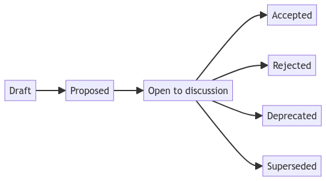

Picture this: you are the architect in charge with the design of the the project. You make some choices, everything goes well for months. Then, all of a sudden, a new requirement arrives. That kind of requirement that make you think "is this architecture the right one? should we change anything?".

Why did you build your application as such? Why did you use gRPC instead of HTTP? Why Blazor instead of VueJS? If only you had something to remind you why you made some choices...

Architecture Decision Record (ADR) is a way to describe, track, and discuss architectural and design decisions. It allows you have a well-defined process to make informed decisions, and to keep track of the _whys_ behind your choices.

In this article, we will learn what ADRs are, what are the main parts, and how to generate documentation with an open source project.

## Strucure of an ADR

An Architecture Decision Record (ADR) is a document that summarize, tracks, and explains a important architectural decisions. It's not just the list of decision: it's a document that tracks also the current **context**, the alternatives considered, and the **consequences** of the final choice.

ADR is made up of a set of files, each describing a decision. For each file you describe:

- **The decision being made**. For example, "Use Azure Service Bus as a queue vendor".
- **The status of the decision**. For example "Under discussion", "Accepted", "Superseded".
- **The time of this decision**. For each ADR you should specify when it has been created and when it has reached a new status.
- **The context around the decision**. For example "We are currently using Azure as a main vendor".
- **The consequences of the decision**. For example, "We accept to have higher execution costs but we can more easily have support from the infrastructure team".

Usually, you might want to have a strict flow of status, making sure that once it has reached a final status, the ADR cannot be changed. **You can add more details**, of course, **but you should not change the decision taken.**



Special mention to the **superseded status**: once a decision reaches the Accepted status, if you change your mind you must create a new ADR to supersede the previous one. For example, say that ADR-30 was about "Use SOAP communication". Then, you notice that you must change the communication protocol to gRPC. You can procede in the following way:

1. Create a new ADR, say ADR-105.
2. Add a tag to ADR-105, something like _supersedes ADR-30_.
3. Update the status of ADR-30 moving it to the _superseded_ status, adding a reference to ADR-105.

This way, you can reconstruct the history behind a specific choice.

## Best practices for ADRs

Let's see some of the best practices for creating and maintaining ADRs:

- Use a consistent format and structure for each ADR. You can find several templates online.
- Store ADRs in a text file (even a simple Markdown is file) close to the code base relevant to that decision, or in a central repository if the decision affects multiple code bases. In this way, putting the ADRs under source control, you can always review the history of the updates and keep everything tracked.
- Use a clear and descriptive file name, such as `ADR-001-use-azure-service-bus.md` or `0001-use-azure-service-bus.md`.
- Keep ADRs concise and focused on one decision per document. Add only the necessary info to understand the rationale behind a decision.
- Update ADRs as the decision evolves or changes over time. Include the previous decision and why a change is made.
- Review ADRs periodically to ensure they are still relevant, accurate, and consistent with the current state of the architecture and the business needs.

If you want a nice list of ADR templates, have a look at [this Github repository by Joel Parker Henderson](https://github.com/joelparkerhenderson/architecture-decision-record/tree/main/locales/en/templates).

## A realistic example of ADR

Say that we have to pick a cloud provider for our serverless system. We need to choose between Azure and AWS.

Let's see how a ADR describes the existing status, the reasons behind our decision, and also considers the possible drawbacks.

```markdown
# ADR 001: Use Azure Functions instead of AWS Lambda

## Status

Accepted (2024-01-11)

## Context

We are developing a serverless system that needs to run various functions in response to events such as HTTP requests, database changes, or message queue triggers. We need to choose a cloud provider that offers a reliable, scalable, and cost-effective platform for running these functions.

## Decision

We have decided to use **Azure Functions** as our serverless platform instead of AWS Lambda. The main reasons for this decision are:

- Azure Functions supports more programming languages than AWS Lambda, including C#, Java, JavaScript, Python, PowerShell, and TypeScript. This gives us more flexibility and choice in developing our functions.
- Azure Functions has a better integration with other Azure services, such as Azure Storage, Azure Cosmos DB, Azure Event Hubs, and Azure Service Bus. This makes it easier to connect our functions to various data sources and destinations.
- Azure Functions has a lower cold start latency than AWS Lambda, which means that our functions will start faster when they are invoked for the first time or after a period of inactivity. This improves the user experience and reduces the response time of our system.
- Azure Functions has a more transparent and predictable pricing model than AWS Lambda, which charges based on the number of requests, the execution time, and the memory allocation of each function. Azure Functions charges based on the number of executions, the execution time, and the memory consumption of the whole function app, which is a logical grouping of functions. This makes it easier to estimate and control our costs.

## Consequences

By choosing Azure Functions over AWS Lambda, we expect to achieve the following benefits:

- We can use our preferred programming languages and tools to develop our functions.
- We can leverage the existing Azure ecosystem and services to enhance our system functionality and performance.
- We can reduce the latency and improve the responsiveness of our system.
- We can optimize our costs and avoid unexpected charges.

However, we also need to consider the following drawbacks and risks:

- We are locking ourselves into the Azure platform and creating a dependency on a single cloud provider. This may limit our options and increase our switching costs in the future.
- We need to learn how to use Azure Functions and its associated services and tools. This may require additional training and documentation for our team members.
- We need to monitor and troubleshoot our functions using the Azure portal or other third-party tools. This may introduce some complexity and overhead in our system operations.
```

## Tools to generate ADRs

There are several tools to generate ADR tools for your project.

- **[adr-tools by npryce](https://github.com/npryce/adr-tools)**: an CLI tool that automatically creates and manages the history of your ADRs. It's a nice tool, but it hasn't been updated in the last five years.
- **[adr-tools-python by tinkerer](https://bitbucket.org/tinkerer_/adr-tools-python/src/master/)**: available on BitBucket, relies on Python. It's newer than the one by Npryce, but it hasn't been updated since 2021.
- **[adr-cli by Jandev](https://github.com/Jandev/adr-cli)**, which is a porting of adr-tools by npryce, but written in .NET
- [ADR Manager](https://github.com/adr/adr-manager), a UI tool that connects to your GitHub repository and generate ADR files.
- **my own cli tool: [adr-power-cli by me, Davide Bellone](https://github.com/bellons91/adr-power-cli)**: it's a recent fork from Jandev's repo, and I plan to add lots of more functionalities. **Feel free to suggest improvements, functionalities, and everything needed to create ADRs**.

## Further readings

_This article first appeared on [Code4IT 🐧](https://www.code4it.dev/)_
https://www.ozimmer.ch/practices/2022/11/22/MADRTemplatePrimer.html

## Wrapping up

I hope you enjoyed this article! Let's keep in touch on [Twitter](https://twitter.com/BelloneDavide) or [LinkedIn](https://www.linkedin.com/in/BelloneDavide/)! 🤜🤛

Happy coding!

🐧

[ ] Titoli
[ ] Frontmatter
[ ] Rinomina immagini
[ ] Alt Text per immagini
[ ] Grammatica
[ ] Bold/Italics
[ ] Nome cartella e slug devono combaciare
[ ] Immagine di copertina
[ ] Rimuovi secrets dalle immagini
[ ] Pulizia formattazione
[ ] Metti la giusta OgTitle
[ ] Fai resize della immagine di copertina
