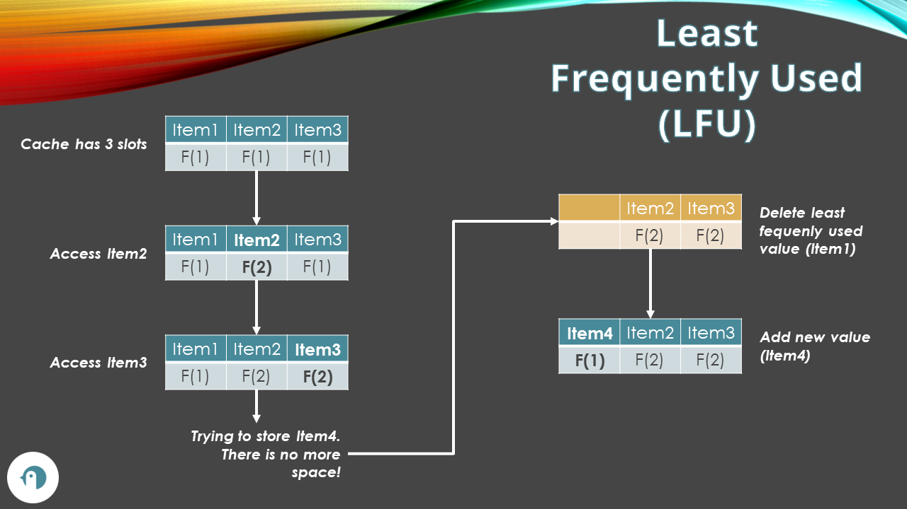
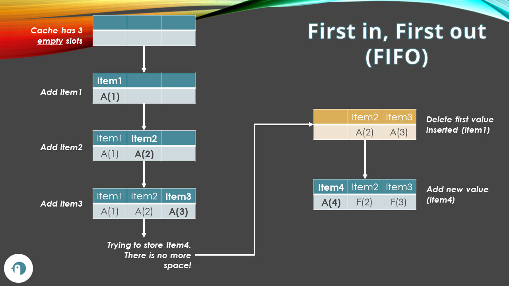
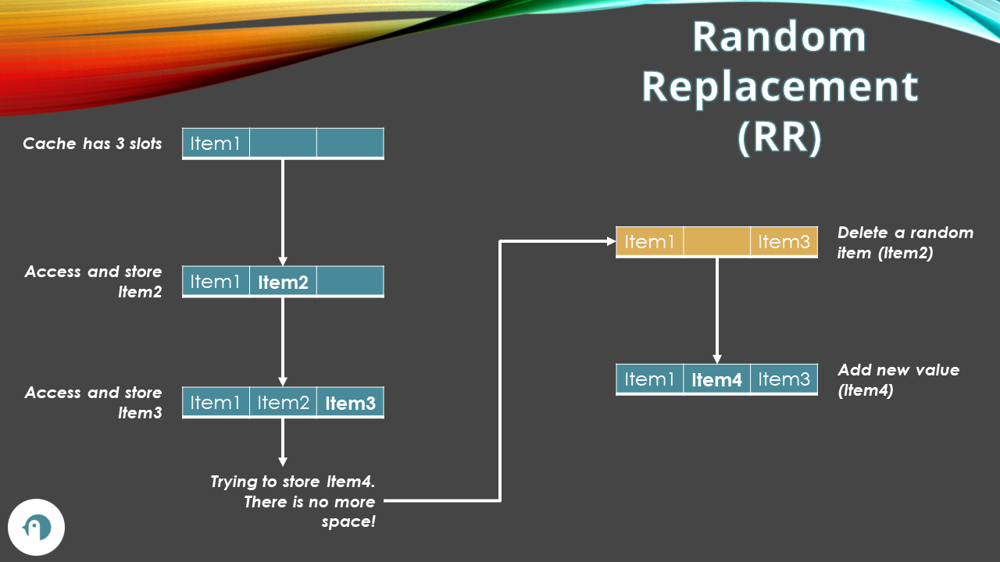

Caching is one of the most used tecniques to improve an application's performance by avoiding too many calls to external systems. In fact, every time you call an API, a database, or any external system, you add some latency to the operation you are executing. Also, if you have to perform some heavy calculations, doing them over and over again can be a waste of time.

With caching, you save the data that is heavy to read or generate in a storage with one important characteristic: it has fast access. It can be either in-memory or in an external system; the important part is that you need to be able to get a specific value, which can be accessed using its unique ID, in a fast way.

But memory has a limit, and you cannot store everything in a cache. In this article, we will learn how to free up some memory by using Cache Expiration and Cache Evition; we will then see them most used Cache Eviction Policies to define how and when we should delete items from the cache.

## Cache Expiration: items are removed based on the TTL

We can assign a **Time-To-Live (TTL)** to each value stored in the cache. When the TTL value is reached, the data is considered expired and is removed from the cache. In this case, we are talking about Cache Expiration.

In C#, you can define the TTL by setting a value to the `AbsoluteExpirationRelativeToNow` property of the `MemoryCacheEntryOptions` class, like in the following example, where the item is set to expire after 3 seconds from its creation.

```cs
var cache = new MemoryCache(new MemoryCacheOptions());
cache.Set("myKey", "myValue", new MemoryCacheEntryOptions()
{
    AbsoluteExpirationRelativeToNow = TimeSpan.FromSeconds(3)
});

var exist1 = cache.TryGetValue("myKey", out _);
output.WriteLine($"Exists1: {exist1}"); // TRUE

await Task.Delay(3500); // We've now reached the TTL

var exist2 = cache.TryGetValue("myKey", out _);
output.WriteLine($"Exists2: {exist2}"); // FALSE
```

By setting a **short TTL value**, you can ensure that the data in the cache is always up-to-date.

By setting a **long TTL value**, you can ensure that the remote resource (for example, the DB) is not called too many times. This is useful when the data is expected not to change.

### Pros of Cache Expiration

By setting a correct TTL, we can **ensure that the data in the cache is always up-to-date**. Since data is expected to expire automatically after a certain amount of time, **you will not have stale data**.

Also, since you can manually set the TTL, **you can define the expiration policies based on the type of entity being cached**. For example, you may want to store the info about a city (name, region, country, etc.) in a cache item with a long TTL, while storing more "volatile" data (such as weather info, stock values, etc) in items with a short TTL. **You have full control on the TTL**.

### Cons of Cache Expiration

There are also some downsides of using Cache Expiration.

If the TTL value is too long, **the data being served can become stale or out-of-date**. You have to tune in the TTL values to get the best result.

Also, if the cache item is accessed frequently, but the underneath value does not change, you'll end up in a loop of *cache expires* -> *access data on the db* -> *store the data in cache* -> *cache expires* which does not add any value, since the data is always the same.

## Cache Eviction: items are removed based on usage policies

While cache expiration is something done automatically based on the TTL, **cache eviction** is the process of removing data from the cache to make room for new data following certain policies. This may be necessary when the cache is full, and there is no more room to store new data.

To determine which items must be removed from the cache, we rely on **cache eviction policies** based on the usage of such data.

Nobody stops you from creating custom policies. However, there are some well known patterns that it's interesting to know.

### Least Recently Used (LRU) Policy

With **Least Recently Used (LRU)** you remove the items that were used the least recently. 

If you suppose that in a certain moment most users will access the same set of data, you can keep in cache these items and remove the ones that are not being accessed.

This policy, in fact, assumes that items recently used are likely to be accessed again soon.

**LRU works well for temporal-related items**, such as recent Tweets, latest news, and so on.


In the above picture, you can see a cache with a max of three items. Let's see what happens:

1. each item has a time information associated to the entry: T0, T1, T2 represent the moment in time when they were added to the cache;
2. the system accesses Item2. The cache then updates the T-value, setting it to T3;
3. the system accesses Item3. Again, we update the T-value;
4. the system now tries to access and store Item4. There is no more space in the cachem, so we have to remove one item;
5. since we are using LRU, we remove the item with the lowest T-value; in our case, we remove Item1;
6. Item4 can then be stored in cache.


### Least Frequently Used (LFU) Policy





### First in, First Out (FIFO) Policy




### Random Replacement (RR) Policy




## Further readings

🔗 [Server-side caching strategies: how do they work? | Code4IT](https://www.code4it.dev/architecture-notes/caching-strategies/)

https://www.linkedin.com/pulse/unlocking-efficiency-exploring-cache-eviction-policies-baligh-mehrez/

_This article first appeared on [Code4IT 🐧](https://www.code4it.dev/)_


## Wrapping up


| Policy Name | Item to be removed | Ideal usage | Pros | Cons |
|--|--|--|--|--|
| Least Recently Used (LRU) | Older items | Temporal data | Predictable, easy to understand |  High overhead for large caches |


>> Eviction e Expiration devono essere usate assieme, sennó si rischia di aver dati troppo vecchi salvati in cache (se l'item é usato frequentemente ma il dato sotto é cambiato, il valore restituito é sbagliato).

I hope you enjoyed this article! Let's keep in touch on [Twitter](https://twitter.com/BelloneDavide) or [LinkedIn](https://www.linkedin.com/in/BelloneDavide/)! 🤜🤛

Happy coding!

🐧

- [ ] Grammatica
- [ ] Titoli
- [ ] Frontmatter
- [ ] Immagine di copertina
- [ ] Fai resize della immagine di copertina
- [ ] Metti la giusta OgTitle
- [ ] Bold/Italics
- [ ] Nome cartella e slug devono combaciare
- [ ] Rinomina immagini
- [ ] Trim corretto per bordi delle immagini
- [ ] Alt Text per immagini
- [ ] Rimuovi secrets dalle immagini 
- [ ] Pulizia formattazione
  

## Appunti

**Cache expiration** and **cache eviction** are two concepts that are commonly used in caching systems. 


**Cache eviction** is the process of removing data from the cache to make room for new data. This can happen when the cache is full, and there is no more room to store new data. Cache eviction policies determine which data gets removed from the cache when that happens. Some example cache eviction policies include least recently used (LRU), least frequently used (LFU), and random eviction. Cache eviction is useful when you want to ensure that the cache is always up-to-date with the most frequently accessed data. However, it can lead to increased load on the database server if the cache is not refreshed frequently enough.

Here are some **use cases** for cache expiration and cache eviction:

- **Cache expiration** is useful when you have data that changes frequently, such as stock prices or weather data. By setting a short TTL value, you can ensure that the data in the cache is always up-to-date.
- **Cache eviction** is useful when you have limited memory available for caching. By using an eviction policy, you can ensure that the most frequently accessed data is always in the cache.

Here are some **pros and cons** of cache expiration and cache eviction:

- **Cache expiration**
    - Pros:
        - Ensures that the data in the cache is always up-to-date.
        - Reduces the load on the database server by caching frequently accessed data.
    - Cons:
        - Can lead to increased load on the database server if the cache is not refreshed frequently enough.
        - Can result in stale data being served if the TTL value is too long.

- **Cache eviction**
    - Pros:
        - Ensures that the most frequently accessed data is always in the cache.
        - Useful when you have limited memory available for caching.
    - Cons:
        - Can lead to increased load on the database server if the cache is not refreshed frequently enough.
        - Can result in less frequently accessed data being removed from the cache, which can result in more cache misses.


When choosing a cache eviction policy, you should consider the following factors:

- **Cache size**: If you have limited memory available for caching, you should choose an eviction policy that ensures that the most frequently accessed data is always in the cache. The **Least Recently Used (LRU)** policy is a good choice in this case.

- **Data volatility**: If your data changes frequently, you should choose an eviction policy that ensures that the data in the cache is always up-to-date. The **Least Frequently Used (LFU)** policy is a good choice in this case.

- **Data access patterns**: If your data access patterns are predictable, you can choose an eviction policy that takes advantage of this. For example, if you know that certain data will be accessed frequently, you can choose the **Most Recently Used (MRU)** policy.

Here are some **pros and cons** of different cache eviction policies:

- **Least Recently Used (LRU)**
    - Pros:
        - Removes the least recently used items from the cache.
        - Useful when you have limited memory available for caching.
    - Cons:
        - Can result in frequently accessed data being removed from the cache, which can result in more cache misses.

- **Least Frequently Used (LFU)**
    - Pros:
        - Removes the least frequently used items from the cache.
        - Useful when your data changes frequently.
    - Cons:
        - Can result in stale data being served if the data is not accessed frequently enough.

- **Most Recently Used (MRU)**
    - Pros:
        - Removes the most recently used items from the cache.
        - Useful when your data access patterns are predictable.
    - Cons:
        - Can result in frequently accessed data being removed from the cache, which can result in more cache misses.

You can also consider using a hybrid approach that combines two or more eviction policies to take advantage of their strengths and mitigate their weaknesses. For example, you can use the **LRU-K** policy, which combines the LRU and LFU policies to remove the least recently used items that have been accessed fewer than K times ¹.
 