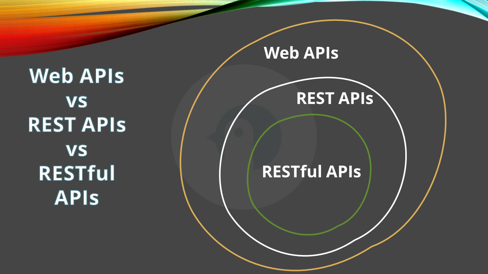

In a world full of acronyms and terms, some nuances can get lost.

People claim they're developing REST APIs even though their APIs do not follow the REST principles. In the same way, people confuse RESTful APIs with plain REST APIs.

In this article, we will explain the differences and similarities between the three approaches to exposing services and data over the network.

## What are Web APIs?

API stands for Application Programming Interface. It's a common term that indicates how to interact with a system by specifying its list of operations, inputs, and outputs.

A specific type of API is the Web API: a **Web API** is an interface that allows communication between different software applications **over the web**.

**Communication occurs via HTTP or HTTPS**, and data can be exchanged in several formats, such as JSON, XML, or even plain text.

**Not every Web API is also a REST API**: we'll learn why in a second.

## What are REST APIs?

In REST APIs, **everything revolves around the idea of a _resource_**: your APIs do not expose endpoints that represent generic operations (`/getItem`), but using a combination of URL and HTTP method, you can define everything you can do _with a resource_.

A REST API is a specific type of Web API that adheres to some guidelines, such as:

- **Statelessness**: Each request from the client must contain all necessary information; **the server doesn't store the client state**. There is no context shared across different requests, making the system easier to scale and maintain.
- **Cacheability**: Responses can be cached to improve performance. You can use the ETag header to understand whether the cache is valid.
- **Resource-Based**: REST APIs expose resource operations via URL, and clients interact with these resources using standard HTTP methods. Each HTTP method has a specific meaning (so, put short, if you are using a POST to retrieve an entity's information, you are not adhering to the REST specification)
- **Uniform Interface**: Resources are exposed via a consistent representation (using URLs). In general, you want your URLs to be structured like `/{resource-type}/{id}`; for example, information about the book with ID 555 should be retrieved at the URL `/book/555` (notice that it's `book`, singular, and not `books`).
- **Operations via HTTP methods**: You must standard HTTP methods (GET, POST, PUT, DELETE) to represent the operations on a resource. For example, GET must be used to retrieve information, while DELETE to delete an entity. You must not use GET to delete a resource.
- **Scalability**: REST APIs are lightweight and scalable.

REST is a guideline: you may then create a set of APIs that even partially follow these principles. Not the best idea, though.

## What are RESTful APIs?

A **RESTful API** is a type of REST API that if **fully compliant with the REST principles**.

So, we can say that a RESTful API has the following characteristics:

- **Use all the HTTP Methods**: They use ALL the standard HTTP methods (GET, POST, PUT, PATCH, DELETE, HEAD, OPTIONS) to manipulate resources. Yes, even HEAD and OPTIONS.
- **Resource-Oriented**: RESTful APIs focus on resources (entities) and their representations. You never expose a, for example `/update-address`, but you use the proper HTTP Method to manipulate the address value.
- **Self-Descriptive**: Responses include metadata to describe the data. Such metadata can be about the media type, the ETag, and similar information that describe the operation and the resource referenced.
- **HATEOAS**: Some RESTful APIs also include HATEOAS (_Hypermedia as the Engine of Application State_), allowing clients to navigate the API dynamically.

## Finding the differences between Web, REST, and RESTful APIs

Here's a table to highlight the key differences between Web APIs, REST APIs, and RESTful APIs:

| Aspect                   | Web API                                                                                   | REST API                                           | RESTful API                                        |
| ------------------------ | ----------------------------------------------------------------------------------------- | -------------------------------------------------- | -------------------------------------------------- |
| **Protocol**             | Typically uses HTTP or other protocols                                                    | Specifically uses HTTP/HTTPS                       | Specifically uses HTTP/HTTPS                       |
| **Formats**              | Supports various data formats (e.g., JSON, XML)                                           | Primarily uses JSON or XML                         | Primarily uses JSON or XML                         |
| **Design**               | Flexible design; not strictly adherent to REST principles                                 | Adheres to REST architectural constraints          | Adheres to all REST architectural constraints      |
| **Customization**        | Provides a more customized experience. You can define any kind of operation needed.       | Lightweight and interchangeable in many situations | Lightweight and interchangeable in many situations |
| **Complex Interactions** | Supports complex interactions with binary data                                            | Focused on simplicity and uniformity               | Focused on simplicity and uniformity               |
| **Available operations** | Custom operations based on path name (or whatever is wanted)                              | Operations depend on the HTTP Method               | Operations depend on the HTTP Method               |

In short, you'd better remember the following diagram:

## Further readings

REST APIs were first described by Dr Roy Fielding in his doctorial dissertation. The original paper is available online:

🔗 [Architectural Styles and the Design of Network-based Software Architectures | Roy Thomas Fielding](https://ics.uci.edu/~fielding/pubs/dissertation/fielding_dissertation.pdf)

_This article first appeared on [Code4IT 🐧](https://www.code4it.dev/)_

When you create a resource using RESTful APIs you should also return the reference to the details of the newly created resource. In ASP.NET, it's easy: you can use `CreatedAtAction` and `CreatedAtRoute`.

🔗 [Getting resource location with CreatedAtAction and CreatedAtRoute action results | Code4IT](https://www.code4it.dev/blog/createdatroute-createdataction/)

## Wrapping up

Understanding the correct terminology helps us use a shared language, avoiding misunderstandings.

Even if you don't need to know all the details of the REST principles, it's important to at least know that not all Web APIs are REST APIs.

I hope you enjoyed this article! Let's keep in touch on [Twitter](https://twitter.com/BelloneDavide) or [LinkedIn](https://www.linkedin.com/in/BelloneDavide/)! 🤜🤛

Happy coding!

🐧
