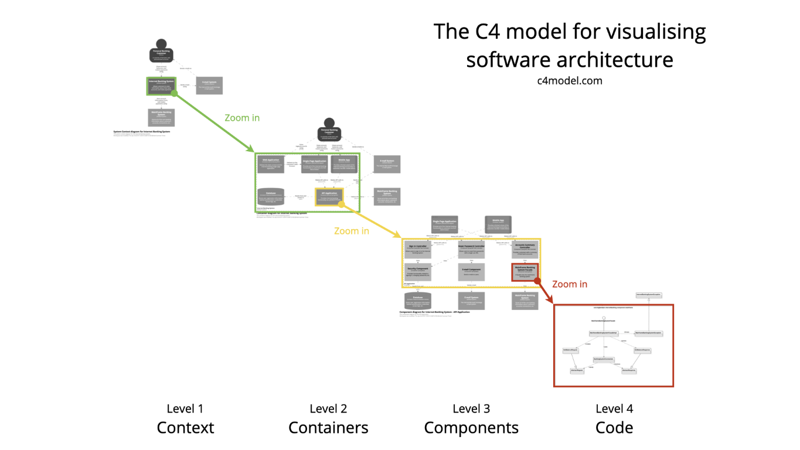
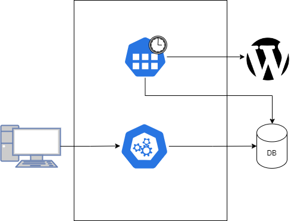
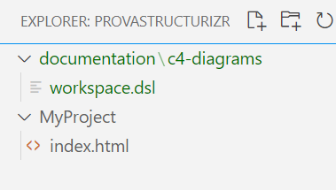
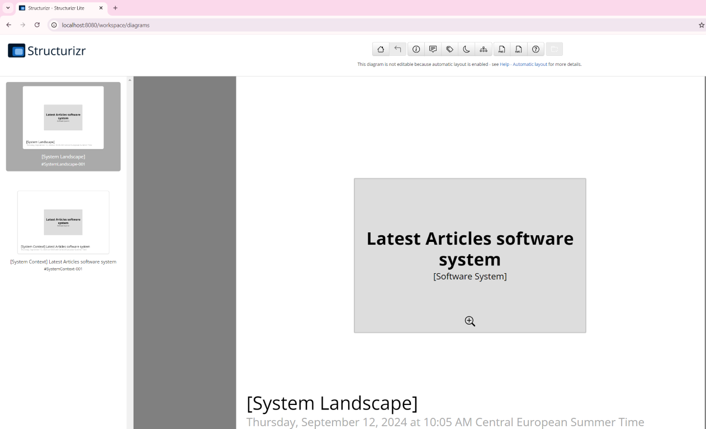
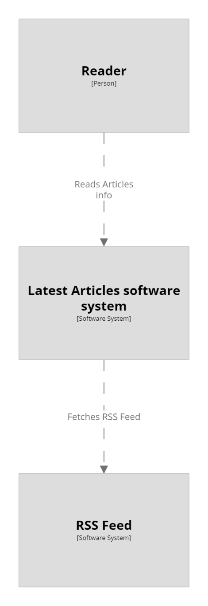
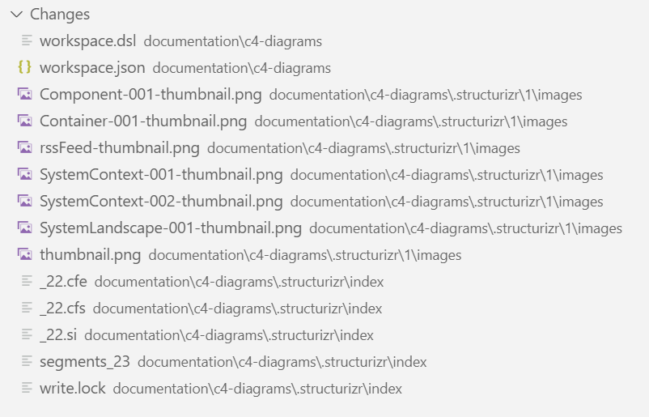
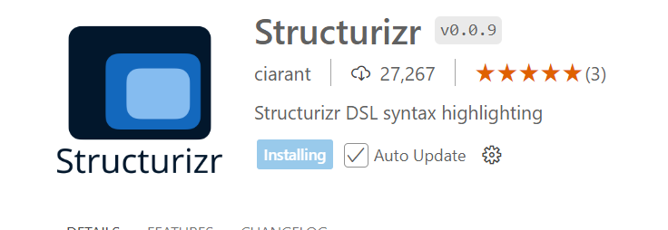

The C4 Model is a well-known way of representing software architectures, describing the different parts via code in a hierarchical way: you start from the high-level view and gradually describe the details of each component and their interactions.

I'm sure you've already heard of it. But have you ever used it in an actual project?

I have used the C4 Model to describe the architecture of a - quite complex - project, and I decided to use Structurizr as a tool to generate such diagrams.

In this article, I will share my experience with it, as well as some practical tips for using it. I have used Windows 11, but almost everything I share here can be used with other Operating Systems as well.

## An overview of the C4 Model

The C4 Model is a framework, created by [Simon Brown](https://x.com/simonbrown), used in software architecture to provide a clear and structured way of describing complex software systems.

Generating diagrams with different levels of abstraction provides users with various ways to look at how components are organized, how they communicate, and so on.

[](https://c4model.com/images/c4-overview.png)

It consists of **four levels of abstraction**: Context, Containers, Components, and Code, each serving a distinct purpose.

### Context: a high-level view, with external dependencies

The Context level is the highest level of the model and provides a **full-system view**, showing how the software system interacts with **external entities** such as users, systems, and external services.

By looking at this level, readers can see the external parts communicating with the software system.

In general, here is where you want to **describe the parts that are _not_ under your control**: if you store data in a database managed by somebody else, you can show it here. If you manage the database (even if it is in the cloud - as long as you have some control over it), you should list it at a lower level, like Containers.

### Containers: the internal architecture's main modules

The Container level breaks down the system into its **major modules**, which are typically applications, data stores, microservices, etc.

This level outlines the high-level technology choices and how these containers interact with one another.

Here, for example, you can describe all your microservices, listing the dependencies, the frameworks used to implement them, and so on.

### Components: the main parts within a Container

The Component level describes **the various modules and parts that are part of the parent Container**.

These components are detailed in a way that shows their responsibilities, interactions, and how they work together to fulfil the container's purpose.

In the case of an application based on .NET, you can think of components as the different class libraries within the solution. However, **this level works better if you think of the logical separation of the components, not the physical separation**.

### Code: the low-level view of the code

The most granular level of the C4 Model, the Code level, is often optional but, in some specific cases, it can be incredibly informative.

It provides the **implementation details of the system's components**, often visualized through class or interface diagrams that show the code structure and dependencies.

From my experience, since the code changes frequently, the Code level risks being outdated; and since **wrong info is worse than no info**, I generally choose not to include this level.

## What is (and what is not) the C4 Model

The C4 Model is particularly beneficial for several reasons. It helps create a common language for team members to discuss architecture, **facilitates the onboarding of new developers** by providing them with a clear system map, and helps in risk identification and threat modelling.

Moreover, since it's based on abstractions, it's flexible enough to be used at various stages of development, from initial design to documenting existing systems.

It's important to remember that **C4 Model is a way of describing software. But it's not a Language, nor a Tool**.

To generate a C4 Model, you can use many tools, like [Structurizr](https://structurizr.com/) (created by Simon Brown, the creator of the C4 Model). Structurizr has its own DSL (_Domain Specific Language_), but nothing stops you from creating C4 Model diagrams using any tool - even a simple handwritten sketch can be acceptable.

Let's create the diagrams for a realistic application: a Web UI that shows the latest articles from a website.

This project is composed of two main parts:

A background job (something like an Azure Function) that accesses an RSS feed and stores the published articles' data on a DB.
A web UI, accessed by users, that reads the info of the articles on the DB and shows them on screen.



## Step-by-step C4 diagrams with Structurizr

As we have seen before, the C4 Model is not a language or tool but a type of visual representation.

In this article, we will use Structurizr. To generate diagrams with it, we have to use its specific syntax and have access to it (either in the cloud or locally).

I have my project saved in a Desktop folder. Alongside the production code, I have a folder named "documentation" that stores everything related to - guess what? - docs. Within that folder, I have a "c4-diagrams" directory containing the diagrams and the C4 Model.

### File structure for Structurizr

**Every "project" is described by its own workspace**, which contains everything needed to describe the different levels and modules.

**A workspace is nothing but a text file with the .dsl extension**. You can create a _workspace.dsl_ file in any directory (though I suggest you do that in a specific "documentation" folder).

Since it's a plain text file, you can add it to source control - this simple tip allows your colleagues to collaborate with the diagram creation.



To start with a very basic example, create a `workspace` node within the _workspace.dsl_ file.

```text
workspace {
    model {
        mainSystem = softwareSystem "Latest Articles software system" {
        }
    }
}
```

This workspace contains a `model` node, that is used to list all the components and modules that are part of the workspace.

In this case, we have only one item: `mainSystem`, which is an object of type `softwareSystem`, whose label is "Latest Articles software system".

We will add some real items soon.

### 2 ways to install Structurizr locally (on Windows 11)

**You can use Structurizr on the cloud or locally**. I generally prefer having Structurizr Lite installed on my local machine so that I can generate the diagrams locally and, when necessary, modify them before saving the changes.

To use it, have two ways:

- Install it as a Java application (it requires Java 17+) running on a UNIX-based system: you must be able to run a Bash script to make it work;
- Install it via Docker: pull the Docker image and run the application as a Docker container.

Since I work with Windows, I prefer using Docker.

To pull the image, you have to run the following command.

```powershell
docker pull structurizr/lite
```

If you are an absolute beginner with Docker, [I published a short article](https://www.code4it.dev/blog/run-mongodb-on-docker/) that explains the main concepts without all the fuzz around it.

### Run Structurizr locally with Docker

Once you have pulled its Docker image, you can run it specifying the path to the Workspace file:

```docker
docker run -it --rm -p 8080:8080 -v C:/Users/d.bellone/Desktop/ProvaStructurizr/documentation/c4-diagrams:/usr/local/structurizr structurizr/lite
```

There are some important things to notice:

- you have to use the full path to the _dsl_ file.
- the path separator must be `/`.
- if the workspace file does not exist, it will be created automatically with a default template.

Of course, replace the local path with your own one.

Now, if everything goes well, you will be able to see the empty diagram on _localhost:8080_.



### Set up the Context elements

The first level of the C4 Model is the Context: here, you list all the top-level parts that are involved with the software systems, like external dependencies and users.

First, we have the user that interacts with our system. We can call it "Reader".

Then we have the RSS feed that we are integrating, which we can call "RSS Feed".

```text
workspace {
    model {
        reader = person "Reader"
        mainSystem = softwareSystem "Latest Articles software system"
        rssFeed = softwareSystem "RSS Feed"
    }
}
```

Now we can see the result on Structurizr:


Please note that the order in which the elements appear is the same as the order in which the elements are listed in the `model` node.

Also, note that three parts characterize each element:

- the variable name, `reader`, that allows us to reference this element in other parts of the diagram;
- the type of element, `person`;
- the label associated with the element, `Reader`, that is shown as box title.

### Describe Containers and their interactions

The Containers level describes the different modules of the software system.

In our specific example, we have the following modules:

- The _Web Application_, accessed by the user;
- The "_FetchJob_" job application, that reads the content from the RSS Feed;
- The _internal Database_, that contains the data stored by the FetchJob and read by the Web Application;

All these items are part of the "Latest Articles software system", so they need to be included as children of that node:

```text
workspace {
    model {
        reader = person "Reader"
        rssFeed = softwareSystem "RSS Feed"
        mainSystem = softwareSystem "Latest Articles software system" {
            webapplication = container "Web Application" {
            reader -> this "Reads Articles info"
            }
            fetchJob = container "FetchJob" {
                this -> rssFeed "Fetches RSS Feed"
            }
            database = container "Internal Database" {
                webapplication -> this "Reads articles info"
                fetchJob -> this "Stores articles info"
            }
        }
    }
}
```

Notice that you can use the `this` keyword to refer to the active element.

Another important part to consider **is that you cannot reference an element that hasn't already been declared**. That's why, compared with the previous example, I had to move the `rssFeed` item before the `mainSystem`.

Now that we have all the components and their interactions, we can see that the Context layer also shows the inbound and outbound interactions with the external systems.



If we look into the Components layer, we can see how the different components interact with each other and with the external sources.


Even with just these two levels, we have enough info to understand how the system behaves and what are the main moving parts.

### Define Components

Each container is made of one or more components.

In our example, the Web Application is made of two components: the _Web UI_ and the _Backend Application_, which interacts with the database.

```text
workspace {
    model {
        reader = person "Reader"
        rssFeed = softwareSystem "RSS Feed"
        mainSystem = softwareSystem "Latest Articles software system" {
            webapplication = container "Web Application" {
                ui = component "Web UI" {
                    reader -> this "Reads Articles info"
                }
                backend = component "Backend" {
                    ui -> this "Asks for data"
                }
            }
            fetchJob = container "FetchJob" {
                this -> rssFeed "Fetches RSS Feed"
            }
            database = container "Internal Database"{
            backend -> this "Reads articles info"
            fetchJob -> this "Stores articles info"
            }
        }
    }
}
```

We now have the UI and Backend components. Of course, since they describe the components within the web application in better detail, they replace the content within the `webapplication` node.

Also, the `backend` node is now referenced within the `database` container.


### Code level

The Code level is used so rarely that the Structurizr DSL does not even include it.

However, you can use other tools to generate the code diagrams and then reference those diagrams in the C4 Model.

## Practical tips for working with Structurizr

Now that we have seen how to create the basic structure of a C4 Model with Structurizer, let's have a look at some practical tips that I found useful when describing the application I was working on. Of course, if you know some others, let me know in the comments section!

- **Store all the documentation in a single folder**: the more scattered the documentation across your systems, the harder it becomes to find what you are looking for and remember to keep everything up-to-date.
- **Remember to follow the DSL grammar**: while the C4 Model is an abstract way to represent a software system, if you want to use Structurizr to generate such type of models, you have to [follow its DSL](https://docs.structurizr.com/dsl/language). It's a strict grammar, with some rules you'll get to know while working on it (like the fact that you cannot reference an item before it has been referenced).
- **Use verbs in the active form**: instead of "Is called by", use "Calls", following the arrow direction.
- **Separate by logical meaning, not physical division**: using as an example a .NET application, even if two functionalities (aka: Modules) are part of the same Class Library, you should represent them as separate entities.
- **Use tags and colours to mark external and internal components**: each element can be represented with a specific colour and can be tagged with custom values. Make use of these capabilities to help readers identify internal and external components.
- **Use themes to customize how the diagram is rendered**: Structurizr allows you to [apply themes](https://docs.structurizr.com/ui/diagrams/themes) to your diagram to change how the rendering looks like. For example, you can configure it to use Azure icons.
- **Save your diagrams in GIT**: you want to keep track of the changes to your diagrams, ensuring that the description matches the actual structure of the system.
- **Update the .gitignore file**: even if you just update the _workspace.dsl_ file, Structurizr creates some temporary files (metadata, thumbnails, and so on), as you can see in the screenshot below. These files are stored in the `.structurizr` folder. So, remember to add the `.structuriz` folder to your gitignore file.



- **Split the diagram into different parts, and join them using "includes"**: when the application grows in a way that it becomes difficult to read and manage, you can create separate sub-diagrams and join them using the [includes operator](https://docs.structurizr.com/dsl/includes). For example, if you have a solution with 15 projects, you can create one diagram inside each of the 15 projects and join them all in a root diagram.
- **Export the diagrams to other formats**: Structurizr is not the only tool you can use to analyze the structure of your system. You can export the diagram in different formats using [Mermaid](https://docs.structurizr.com/export/mermaid) or [Ilograph](https://docs.structurizr.com/export/ilograph).
- **Install the Structurizr extension on VSCode**: since Structurizr DSL is a custom language, it is not natively supported by the most popular IDEs. To have a nice syntax highlighting, you can install the Structurizr extension for VSCode, as seen below.



## Further readings

As always, the best way to learn how something works is by trying it.

You may want to reference the official documentation, provided by Simon Brown:

🔗 [C4 Model website](https://c4model.com/)

_This article first appeared on [Code4IT 🐧](https://www.code4it.dev/)_

Simon himself wrote an article that explains how to get started with it. It does not go in detail like the one you've just read, but since it's written by the tool author, I think it's a valuable read

🔗 [Getting started with Structurizr Lite | Dev.TO](https://dev.to/simonbrown/getting-started-with-structurizr-lite-27d0)

Another cool part about Structurizr is that you can use it to generate ADRs. You don't know what ADRs are? I've got you covered!

🔗 [Tracking decision with Architecture Decision Records (ADRs)](https://www.code4it.dev/architecture-notes/architecture-decision-records/)

## Wrapping up

It's not necessary to use Structurizr to generate such C4 Model diagrams. However, it's probably one of the most complete tools you can find online.

Remember, you should describe the architecture to the best level of detail: not too many details (or you'll lose time describing stuff with little to no value) nor too few (or you won't get the sense of the architecture).

I hope you enjoyed this article! Let's keep in touch on [LinkedIn](https://www.linkedin.com/in/BelloneDavide/) or [Twitter](https://twitter.com/BelloneDavide)! 🤜🤛

Happy coding!

🐧
