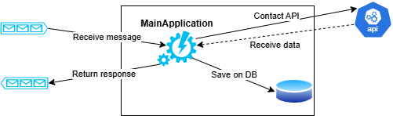
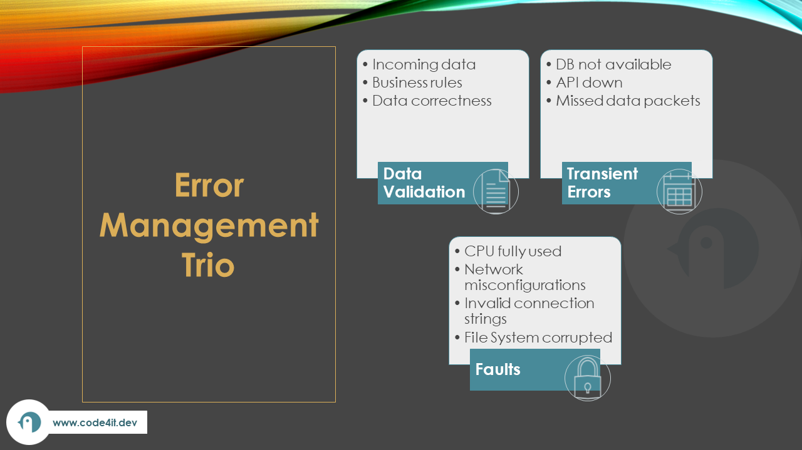
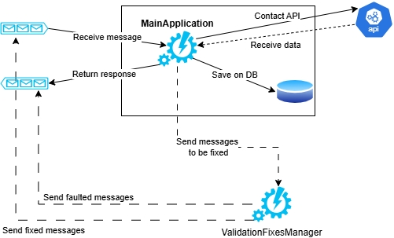
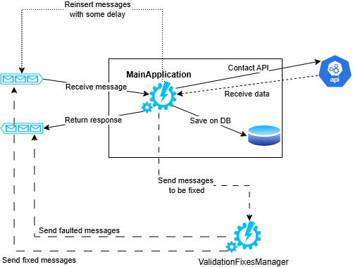
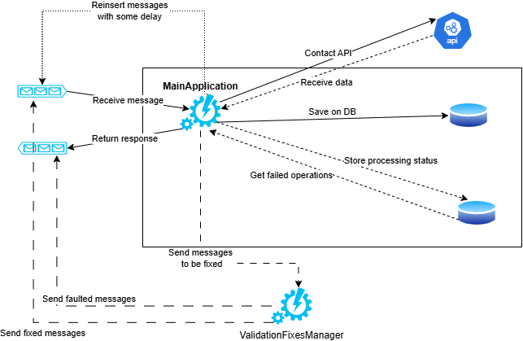

When designing a new software system, it's easy to focus mainly on the happy flow and forget that you must also handle errors.

You should carefully define and design how to handle errors: depending on the use case, error handling can have a huge impact on the architecture of your software system.

In this article, we'll explore the three main categories of errors that we must always remember to address; for each type of error, we will showcase how addressing it can impact the software architecture differently.

## An ideal system with only the happy path

To use a realistic example, let's design a simple system with a single module named *MainApplication*: this module reads data from an external API, manipulates the data, and stores the result on the DB.

The system is called asynchronously, via a Message Queue, by an external service - that we are going to ignore. 


The happy flow is pretty much the following:

1. An external system inserts some data into the Queue;
2. MainApplication reads the data from the Queue;
3. MainApplication calls an external API to retrieve some data;
4. MainApplication stores some data on the DB;
5. MainApplication sends a message on the queue with the operation result.



Now, the happy flow is simple. But we should have covered what to do in case of an error.

## Introducing the Error Management Trio

In general, errors that need to be handled fall into three categories (that I decided to call "the Error Management Trio"): data validation, transient errors, and faults.

Data validation focuses on the data used across the system, particularly the data you don't control.

Transient errors occur when the application's overall status or its dependencies temporarily change to an invalid state.

Faults are errors that take down the whole application, and you cannot recover immediately.

The Trio does not take into account "errors" that are not properly errors: null values, queries that do not return any value, and so on. These are all legitimate statuses that represent that lack of values but are not errors that have architectural relevance.



## Data Validation: the first defence against invalid status

The Data Validation category focuses on ensuring that relevant data is in a valid status.

In particular, it aims at ensuring that data coming from external sources (for example, from the Body in an incoming HTTP request or from the result of a query on the database) is both syntactically and logically valid.

Suppose that the messages we receive from the queue are in the following format:

```json
{
    "Username": "mr. captain",
    "BookId": 154,
    "Operation": "Add"
}
```

We definitely need to perform some sort of validation on the message content.

For example:
 
- The `Username` property must not be empty;
- The `BookId` property must be a positive number;
- The `Operation` property must have one of the following values: *Add*, *Remove*, *Refresh*;

How does it impact our design?

We have several choices to deal with an invalid incoming message:

1. ignore the whole message: if it doesn't pass the validation, discard the message;
2. send the message back to the caller, describing the type of error
3. try to fix it locally: if we are able to recreate a valid message, we could try to fix it and process the incoming message;
4. try to fix it in a separate service: you will need to create a distinct service that receives the invalid message and tries to fix it: if it manages to fix the message, it re-inserts it in the original queue; otherwise, it sends a message to the response queue to notify about the impossibility to recreate a valid message.

As you can see, even for the simple input validation, the choices we make can have an impact on the structure of the architecture.

Suppose that you choose option #4: you will need to implement a brand new service (let's call it *ValidationFixesManager*), configure a new queue, and keep track of the attempts to fix the message. 



All of this only when considering the static validation. **How would you validate your business rules?** How would you ensure that, for instance, the Username is valid and the user is still active on the system?

Maybe you discover that the data stored on the database in incomplete or stale. Then you have to work out a way to handle such type of data.

For example, you can:
run a background job that ensures that all the data is always valid;
enrich the data from the DB with newer data only when it is actually needed;
fine-tune the database consistency level.

We have just demonstrated a simple but important fact: data validation *looks* trivial, but depending on the needs of your system, it may impact how you design your system.

## Transient Errors: temporary errors that may randomly occur

Even if the validation passes, temporary issues may prevent your operations from completing.

In the previous example, there are some possible cases to consider:

1. the external API is temporarily down, and you cannot retrieve the data you need;
2. the return queue is full, and you cannot add response messages;
3. the application is not able to connect to the DB due to network issues;

These kinds of issues are due to a temporary status of the system or of one of its dependencies.

Sure, you may add automatic retries: for instance, you can use Polly to automatically retry access the API. But what if it's not enough?

Again, depending on your application's requirements and the overall structure you started designing, solving this problem may bring you to unexpected paths.

Let's say that the external API is returning a 500 HTTP error: this is a transient error, and it does not depend on the content of the request: the API is down, an you cannot to anything to solve it. 

What can we do if all the retries fail? 

If we can just accept the situation, we can return the error to the caller and move on with the next operation.

But if we need to keep trying until the operation goes well, we have (at least) two choices:

1. consume the message from the Queue, try calling the API, and, if it fails, re-insert the message on the queue (ideally, with some delay); 
2. peek the message from the queue and try calling the API. If it fails, the message stays on the queue (and you need a way to read it again). Otherwise, we consider the message completed and remove it from the queue.

These are just two of the different solutions. But, as you can see, this choice will have, in the long run, a huge effect on the future of the application, both in terms of maintainability and performance.

Below is how the structure changes if we decide to send the failed messages back in the queue with some delay.



In both cases, we must remember that trying to call a service that is temporarily down is useless: maybe it's time to use a Circuit Breaker?

## Fatal Errors: when everything goes wrong

There is one type of error that is often neglected but that may deeply influence how your system behaves: fatal errors.

Examples of fatal errors are:

- the host has consumed all the CPU or RAM;
- the file system is corrupted;
- the connection to an external system is interrupted due to network misconfigurations.

In short, fatal errors are errors you have no way to solve in the short run: they happen and stop everything you are doing.

This kind of error cannot be directly managed via application code, but you need to rely on other techniques.

For example, to make sure you won't consume all the available RAM, you should plan for autoscaling of your resources. So you have to design the system with autoscaling in mind: this means, for example, that the system must be stateless and the application must run on infrastructure objects that can be configured to automatically manage resources (like Azure Functions, Kubernetes, and Azure App Services). Also: do you need horizontal or vertical scaling?

And, talking about the integrity of the system, how do you ensure that operations that were ongoing when the fatal error occurred can be completed? 

One possible solution is to use a database table to keep track of the status of each operation, so that when the application restarts, it first completes pending operations, and then starts working on new operations.



## A practical approach to address the Error Management Trio

There are too many errors to manage and too much effort to cover everything!

How can we cover everything? Well, it's impossible: for every action we take to prevent an error, a new one may occur. 

Let's jump back to the example we saw for handling validation errors (using a new service that tries to fix the message). What if the ValidationFixesManager service is down or the message queue is unreachable? We tried to solve a problem, but we ended up with two more to be managed!

Let me introduce a practical approach to help you decide what needs to be addressed.

Step 1: list all the errors you can think of. Create a table to list all the possible errors that you expect they can happen. 

You can add a column to describe the category the error falls into, as well as a Probability and Impact on the system column with a value (in this example, Low, Medium and High) that represents the probability that this error occurs and the impact it has on the overall application.

| Problem | Category | Probability | Impact on the system |
|--|--|--|--|
| Invalid message from queue | Data Validation | Medium | High |
| Invalid user data on DB | Data Validation | Low | Medium |
| Missing user on DB | Data Validation | Low | Low |
| API not reachable | Transient | High | High |
| DB not reachable | Transient | Low | High |
| File system corrupted  | Fatal | Low | High |
| CPU limit reached  | Fatal | Medium | High |

From here, you can pick the most urgent elements to be addressed.

Step 2: evaluate alternatives. Every error can be addressed in several ways (ignoring the error is also a valid alternative!). Take some time to explore all the alternatives.

Again, a table can be a good companion for this step. You can describe, for example:
the effort required to solve the error (Low, Medium, High)
the positive and negative consequences in terms (also) of quality attributes (aka: "-ilities"). Maybe a solution works fine for data integrity but has a negative impact on maintainability.

Step 3: use ADRs to describe how (and why) you will handle that specific error.

Take your time to thoroughly describe, using ADR documents, the problems you are trying to solve, the solutions taken into consideration, and the final choice. Having everything written down in a shared file is fundamental for ensuring that, in the future, the present choices and necessities are taken into account, before saying "meh, that's garbage!"
 

## Further readings

Unfortunately, I feel that error handling is one of the most overlooked topics when designing a system. This also means that there are not lots and lots of articles and resources that explore this topic.

But, if you use queues, one of the components you should use to manage errors is the Dead Letter queue. Here's a good article by Dorin Baba where he explains how to use Dead Letter queues to handle errors in asynchronous systems.

🔗 [Handling errors like a pro or nah? Let’s talk about Dead Letters | Dorin Baba](https://medium.com/@dorinbaba/handling-errors-like-a-pro-or-nah-lets-talk-about-dead-letters-19a9a67869c1)

_This article first appeared on [Code4IT 🐧](https://www.code4it.dev/)_

In this article, we used a Queue to trigger the beginning of the operation. When using Azure services, we have two types of message queues: Queues and Topics. Do you know the difference? Hint: other vendors use the same names to represent different concepts.

🔗 [Azure Service Bus: Queues vs Topics | Code4IT](https://www.code4it.dev/blog/azure-service-bus-queue-vs-topic/)


Whichever the way you chose to solve manage an error, always remember to write down the reasons that guided you to use that specific solution. An incredibly helpful way is by using ADRs.

🔗 [Tracking decision with Architecture Decision Records (ADRs) | CodeIT](https://www.code4it.dev/architecture-notes/architecture-decision-records/)

## Wrapping up

This article highlights the importance of error management and the fact that even if we all want to avoid and prevent errors in our systems, we still have to take care of them and plan according to our needs.

I hope you enjoyed this article! Let's keep in touch on [LinkedIn](https://www.linkedin.com/in/BelloneDavide/) or [Twitter](https://twitter.com/BelloneDavide)! 🤜🤛

Happy coding!

🐧

- [ ] Fai resize della immagine di copertina
- [ ] Bold/Italics