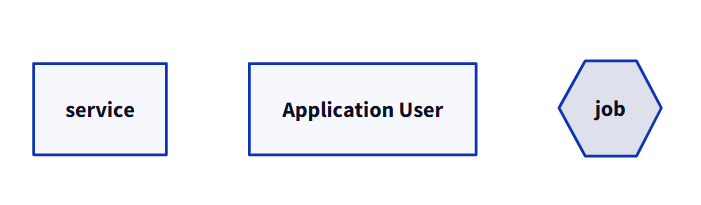
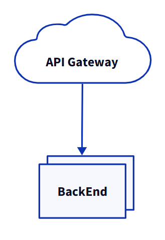
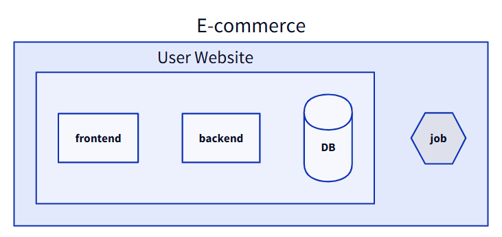
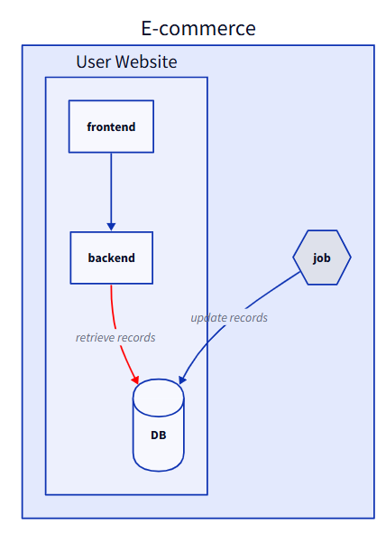
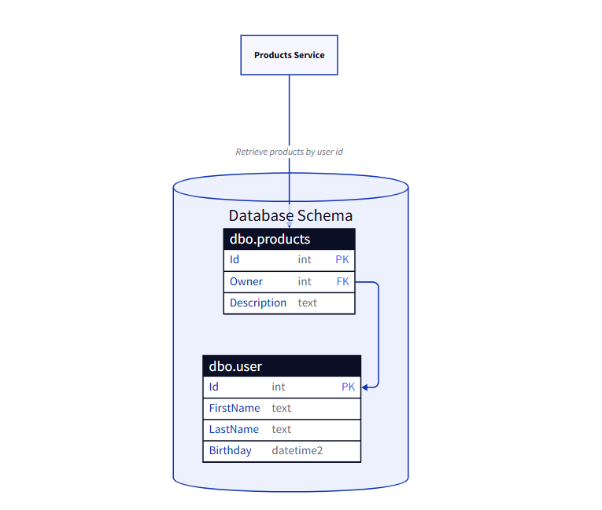
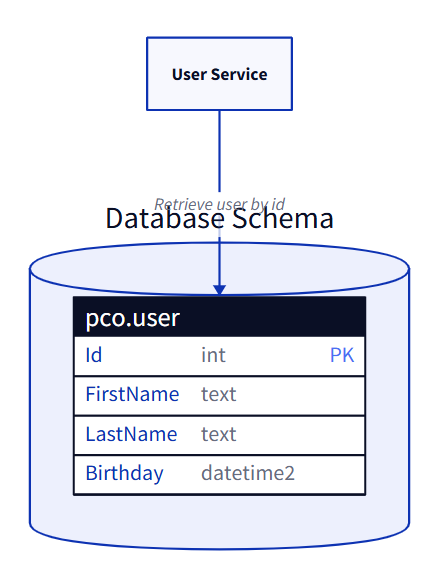

When defining the architecture of a system, I believe in the adage "a picture is worth a thousand words".

Diagramming helps understanding how the architecture is structured, what are the dependencies between components, how the different components communicate, which are their responsibilities.

A clear architectural diagram can be useful also for planning: once you have a general idea of the components, you can structure the planning according to the module dependencies and the priorities.

A lack of diagramming leads to "just words": how many times have you heard people talk about modules that do not exist or do not work as they were imagining? The whole team can benefit from having a common language and a shared understanding of the parts a system is made of: a clear diagram brings clear thoughts.

I tried several approaches: online tools like Draw.IO, DSL like Structurizr and Mermaid, but I wasn't happy with any of them.

Then I stumbled upon D2: it's rich set of elements make it my new go-to tool for describing architectures. Let's see how it works!


## D2 syntax

Just like the more famous Mermaid, in D2 all the elements and connections are defined as textual nodes.

You can generate your diagram using the [Playground](https://play.d2lang.com/) section available in the official website.

### Elements

Elements are defined as a set of names that can be enriched with a label and other metadata.

Here's an example of the simplest configurations for standalone elements.

```d2
service

user: Application User

job: {
  shape: hexagon
}
```

For each element, you can simply define its internal name (`service`), a label (`user: Application User`) and a shape (`shape: hexagon`).




Other than that, I love the fact that you can define elements to be displayed as multiple instances: this can be useful when a service has multiple instances of the same type, and you want to express it clearly without the need of manually creating multiple elements.

You can do it by setting the `multiple` property to `true`.


```d2
apiGtw: API Gateway {
  shape: cloud
}
be: BackEnd {
  style.multiple: true
}

apiGtw -> be
```



### Grouping

Of course, you may want to group elements. You can to that by using an hierarchical structure.

In the following example, the main container represents my Ecommerce application, which is composed of a website and a background job. The website is composed of a frontend, a backend, and a database.


```d2
ecommerce: E-commerce {
  website: User Website {
    frontend
    backend
    database: DB {
      shape: cylinder
    }
  }

  job: {
    shape: hexagon
  }
}
```

As you can see from the diagram definition, elements can be nested in a hierarchical structure using the `{}` symbols. Of course, you can still define styles and labels to nested elements.




### Connections

Clearly, an architectural diagram is useful if it can express connections between elements.

To connect two elements, you must use either the `--`, the `->` or the `<-` connector. Clearly, you have to link their IDs, not their labels.


```d2
ecommerce: E-commerce {
    website: User Website {
        frontend
    backend
    database: DB {
        shape: cylinder
    }
    frontend -> backend
    backend -> database: retrieve records {
        style.stroke: red
    }
  }

  job: {
      shape: hexagon
  }
  job -> website.database: update records
}
```
      
The previous example contains some interesting points.

- Elements within the same container can be referenced directly using the plain ID: `frontend -> backend`.
- You can choose if you want labels applied to a connection: `backend -> database: retrieve records`.
- You can apply styles to a connection: `style.stroke: red`.
- You can create connections between elements from different containers: `job -> website.database`

When referencing items from different containers, you must always include the container ID: `job -> website.database` works, but `job -> database` don't, because `database` is not defined (so it gets created from scratch).




### SQL Tables

An interesting part of D2 diagram is the possibility to add the description of SQL tables.

Clearly, the structure cannot be validated: the actual syntax depends on the database vendor. However, having the table schema defined in the diagram can be helpful to reason around the dependencies needed to complete a development.


```d2
serv: Products Service

db: Database Schema {
  direction: right
  shape: cylinder
  userTable: dbo.user {
    shape: sql_table
    Id: int {constraint: primary_key}
    FirstName: text
    LastName: text
    Birthday: datetime2
  }

  productsTable: dbo.products {
    shape: sql_table
    Id: int {constraint: primary_key}
    Owner: int {constraint: foreign_key}
    Description: text
  }

  productsTable.Owner -> userTable.Id
}

serv -> db.productsTable: Retrieve products by user id

```



## Install D2 on Windows

## Create D2 Diagrams on Visual Studio Code

## Create D2 Diagrams on Obsidian

## Tips for using D2

- prima elenca tutti i componenti e poi elenca le connessioni
- definisci uno stile




## D2 vs Mermaid: a comparison

D2 and Mermaid are similar, but have some key differences.

They both are diagram-as-a-code tools, meaning that the definition of a diagram is expressed as a text file, thus making it available under source control.

Mermaid is already supported by many tools, like Azure DevOps wikis, GitHub pages, and so on.
On the contrary, D2 must be installed (along with the Go language).

Mermaid is quite a "close" system: even if it allows you do define some basic styles, it's not that flexible.

On the contrary, D2 allows you to choose a [theme](https://d2lang.com/tour/themes) for the whole diagram, as well as choosing different layout engines.
Also, D2 has some functionalities that are (currently) missing on Mermaid:

- marking a component as multiple (as we saw previously);
- adding SQL table definitions;
- adding [markdown descriptions to the diagram](https://d2lang.com/tour/text/#standalone-text-is-markdown);
- using [variable substitutions](https://d2lang.com/tour/vars) to avoid repeating the same names over and over again.

Mermaid, on the contrary, allows to define more types of diagrams: State Diagrams, Gantt, Mindmaps, and so on. Also, as we saw, it's already supported in many of platforms.

So, my (current) choice is: use D2 for architectural diagrams, use Mermaid for everything else. I haven't tried D2 for Sequence Diagrams yet, so I won't express an opinion on that.

## Further readings

_This article first appeared on [Code4IT 🐧](https://www.code4it.dev/)_

https://play.d2lang.com/


## Wrapping up


I hope you enjoyed this article! Let's keep in touch on [LinkedIn](https://www.linkedin.com/in/BelloneDavide/), [Twitter](https://twitter.com/BelloneDavide) or [BlueSky](https://bsky.app/profile/bellonedavide.bsky.social)! 🤜🤛  

Happy coding!

🐧

- [ ] Grammatica
- [ ] Titoli
- [ ] Frontmatter
- [ ] Immagine di copertina
- [ ] Fai resize della immagine di copertina
- [ ] Metti la giusta OgTitle
- [ ] Bold/Italics
- [ ] Nome cartella e slug devono combaciare
- [ ] Rinomina immagini
- [ ] Trim corretto per bordi delle immagini
- [ ] Alt Text per immagini
- [ ] Rimuovi secrets dalle immagini 
- [ ] Pulizia formattazione
- [ ] Add wt.mc_id=DT-MVP-5005077 to links