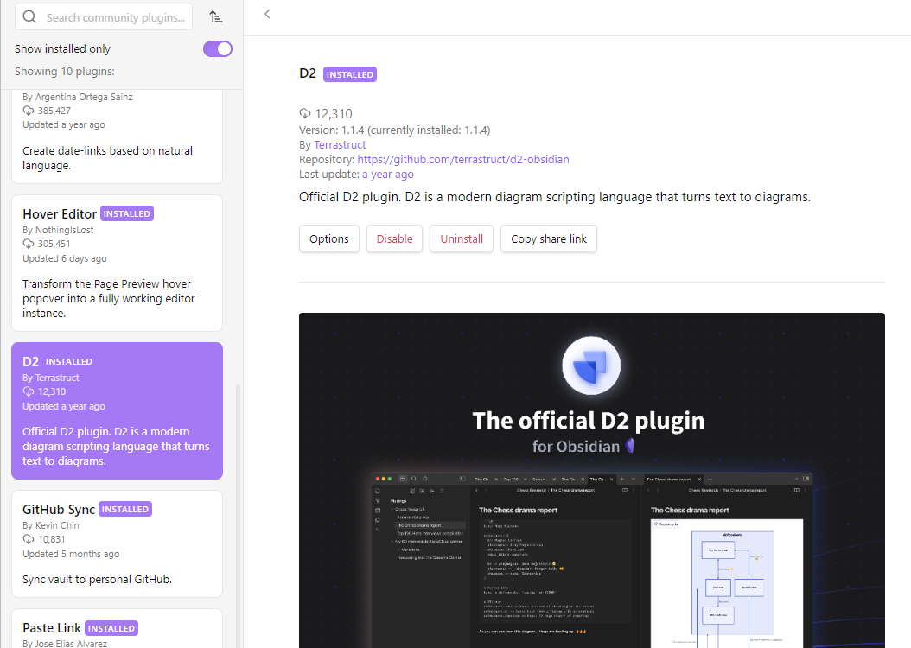
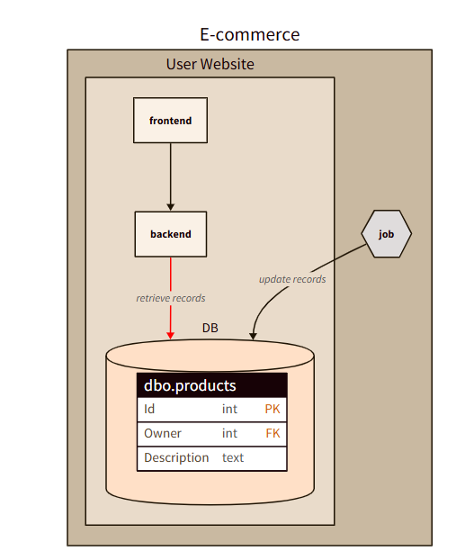

When defining the architecture of a system, I believe in the adage that says that «A picture is worth a thousand words».

Proper diagramming helps in understanding how the architecture is structured, the dependencies between components, how the different components communicate, and their responsibilities.

A clear architectural diagram can also be useful for planning. Once you have a general idea of the components, you can structure the planning according to the module dependencies and the priorities.

A lack of diagramming leads to a "just words" definition: how many times have you heard people talk about modules that do not exist or do not work as they were imagining? 

The whole team can benefit from having a common language: a clear diagram brings clear thoughts, helping all the stakeholders (developers, architects, managers) understand the parts that compose a system.

I tried several approaches: both online WYSIWYG tools like Draw.IO and DSL like Structurizr and Mermaid. For different reasons, I wasn't happy with any of them.

Then I stumbled upon D2: its rich set of elements makes it my new go-to tool for describing architectures. Let's see how it works!


## A quick guide to D2 syntax

Just like the more famous Mermaid, when using D2, you have to declare all the elements and connections as textual nodes.

You can generate diagrams online by using the [Playground](https://play.d2lang.com/) section available on the official website, or you can install it locally (as you will see later).

### Elements: the basic components of every diagram

Elements are defined as a set of names that can be enriched with a label and other metadata.

Here's an example of the most straightforward configurations for standalone elements.

```d2
service

user: Application User

job: {
  shape: hexagon
}
```

For each element, you can define its internal name (`service`), a label (`user: Application User`) and a shape (`shape: hexagon`).


Other than that, I love the fact that you can define elements to be displayed as multiple instances: this can be useful when a service has multiple instances of the same type, and you want to express it clearly without the need to manually create multiple elements.

You can do it by setting the `multiple` property to `true`.

```d2
apiGtw: API Gateway {
  shape: cloud
}
be: BackEnd {
  style.multiple: true
}

apiGtw -> be
```


### Grouping: nesting elements hierarchically

You may want to group elements. You can do that by using a hierarchical structure.

In the following example, the main container represents my e-commerce application, composed of a website and a background job. The website is composed of a frontend, a backend, and a database.


```d2
ecommerce: E-commerce {
  website: User Website {
    frontend
    backend
    database: DB {
      shape: cylinder
    }
  }

  job: {
    shape: hexagon
  }
}
```

As you can see from the diagram definition, elements can be nested in a hierarchical structure using the `{}` symbols. Of course, you can still define styles and labels to nested elements.


### Connections

An architectural diagram is helpful only if it can express connections between elements.

To connect two elements, you must use the `--`, the `->` or the `<-` connector. You have to link their IDs, not their labels.

```d2
ecommerce: E-commerce {
    website: User Website {
        frontend
    backend
    database: DB {
        shape: cylinder
    }
    frontend -> backend
    backend -> database: retrieve records {
        style.stroke: red
    }
  }

  job: {
      shape: hexagon
  }
  job -> website.database: update records
}
```
      
The previous example contains some interesting points.

- Elements within the same container can be referenced directly using their ID: `frontend -> backend`.
- You can add labels to a connection: `backend -> database: retrieve records`.
- You can apply styles to a connection, like choosing the arrow colour with `style.stroke: red`.
- You can create connections between elements from different containers: `job -> website.database`.


When referencing items from different containers, you must always include the container ID: `job -> website.database` works, but `job -> database` doesn't because `database` is not defined (so it gets created from scratch).

### SQL Tables

An interesting part of D2 diagrams is the possibility of adding the description of SQL tables.

Obviously, the structure cannot be validated: the actual syntax depends on the database vendor. 

However, having the table schema defined in the diagram can be helpful in reasoning around the dependencies needed to complete a development.

```d2
serv: Products Service

db: Database Schema {
  direction: right
  shape: cylinder
  userTable: dbo.user {
    shape: sql_table
    Id: int {constraint: primary_key}
    FirstName: text
    LastName: text
    Birthday: datetime2
  }

  productsTable: dbo.products {
    shape: sql_table
    Id: int {constraint: primary_key}
    Owner: int {constraint: foreign_key}
    Description: text
  }

  productsTable.Owner -> userTable.Id
}

serv -> db.productsTable: Retrieve products by user id

```


Notice how you can also define constraints to an element, like `{constraint: foreign_key}`, and specify the references from one table to another.

## How to install and run D2 locally

D2 is a tool written in Go.

Go is not natively present in every computer, so you have to install it. You can learn how to install it from [the official page](https://go.dev/doc/install).

Once Go is ready, you can install D2 in several ways. I use Windows 11, so my preferred installation approach is to use a *.msi* installer, [as described here](https://github.com/terrastruct/d2/blob/master/docs/INSTALL.md#windows).

If you are on macOS, you can use Homebrew to install it by running:

```shell
brew install d2`.
```

Regardless of the Operating System, you can have Go directly install D2 by running the following command:

```shell
go install oss.terrastruct.com/d2@latest
```

It's even possible to install it via Docker. However, this approach is quite complex, so I prefer installing D2 directly with the other methods I explained before.

You can find more information about the several installation approaches on [the GitHub page of the project](https://github.com/terrastruct/d2/blob/master/docs/INSTALL.md).

To work with D2 diagrams, you need to create a file with the `.d2` extension. That file will contain the textual representation of the diagrams, following the syntax we saw before.

Once D2 is installed and the file is present in the file system (in my case, I named the file `my-diagram.d2`), you can use the console to generate the diagram locally - remember, I'm using Windows11, so I need to run the *exe* file:


```shell
d2.exe --watch .\my-diagram.d2
```

Now you can open your browser, head to the localhost page displayed on the shell, and see how D2 renders the local file. Thanks to the `--watch- flag, you can update the file locally and see the result appear on the browser without the need to restart the application.

When the diagram is ready, you can export it as a PNG or SVG by running

```shell
d2.exe .\my-diagram.d2 my-wonderful-design.png
```

## Create D2 Diagrams on Visual Studio Code

Another approach is to install the D2 extension on VS Code.


Thanks to this extension, you can open any D2 file and, by using the command palette, see a preview of the final result. You can also format the document to have the diagram definition tidy and well-structured.


## Hot to install and use D2 Diagrams on Obsidian

Lastly, D2 can be easily integrated with tools like Obsidian. Among the community plugins, you can find the official D2 plugin.



As you can imagine, Go is required on your machine. 
And, if necessary, you are required to explicitly set the path to the `bin` folder of Go. In my case, I had to set it to `C:\Users\BelloneDavide\go\bin\`.


To insert a D2 diagram in a note generated with Obsidian, you have to use `d2` as a code fence language.

## Practical tips for using D2

D2 is easy to use once you have a basic understanding of how to create elements and connections. 

However, some tips may be useful to ease the process of creating the diagrams. Or, at least, these tips helped me write and maintain my diagrams.

### Tip 1: Separate elements and connections definition

A good approach is to declare the application's structure first, and then list all the connections between elements unless the elements are within the same components and are not expected to change.

```d2
ecommerce: E-commerce {
  website: User Website {
    backend
    database: DB {
      shape: cylinder
    }

    backend -> database: retrieve records {
      style.stroke: red
    }
  }

  job -> website.database: update records
}
```

Here, the connection between `backend` and `database` is internal to the `website` element, so it makes sense to declare it directly within the `website` element.

However, the other connection between the job and the database is cross-element. In the long run, it may bring readability problems.

So, you could update it like this:

```diff
ecommerce: E-commerce {
 website: User Website {
 backend
 database: DB {
 shape: cylinder
 }

 backend -> database: retrieve records {
 style.stroke: red
 }
 }

- job -> website.database: update records
}

+ ecommerce.job -> ecommerce.website.database: update records
```

This tip can be extremely useful when you have more than one element with the same name belonging to different parents.

Needless to say, since the order of the connection declarations does not affect the final rendering, write them in an organized way that best fits your needs. In general, I prefer creating sections (using *comments* to declare the area), and grouping connections by the outbound module.

### Pick a colour theme

D2 allows you to specify a theme for the diagram. There are some predefined themes (which are a set of colour palettes), each with a name and an ID.

To use a theme, you have to specify it in the `vars` element on top of the diagram:


```d2
vars: {
  d2-config: {
    theme-id: 103
  }
}
```

103 is the theme named "Earth tones", using a brown-based palette that, when applied to the diagram, renders it like this.



However, if you have a preferred colour palette, you can use your own colours by overriding the default values:

```d2
vars: {
  d2-config: {
    # Terminal theme code
    theme-id: 103
    theme-overrides: {
      B4: "#C5E1A5"
    }
  }
}
```


You can read more about themes and customizations [here](https://d2lang.com/tour/themes).

What is that `B4` key overridden in the previous example? Unfortunately, I don't know: you must try all the variables to understand how the diagram is rendered.

## Tip 3: Choose the right layout engine

You can choose one of the three supported layout engines to render the elements in a different way (more info [here](https://d2lang.com/tour/layouts)).

DAGRE and ELK are open source, but quite basic. TALA is more sophisticated, but it requires a paid licence.

Here's an example of how the same diagram is rendered using the three different engines.

**TODO: add diagram here!!**
https://1drv.ms/p/c/FB8217AEBEC67230/ATByxr6uF4IggPt6sgAAAAA?e=lfHisq

You can decide which engine to use by declaring it in the `layout-engine` element:

```d2
vars: {
  d2-config: {
    layout-engine: tala
  }
}
```

Choosing the right layout engine can be beneficial because sometimes some elements are not rendered correctly: here's a weird rendering with the DAGRE engine. 


## D2 vs Mermaid: a comparison

D2 and Mermaid are similar but have some key differences.

They both are diagram-as-a-code tools, meaning that the definition of a diagram is expressed as a text file, thus making it available under source control.

Mermaid is already supported by many tools, like Azure DevOps wikis, GitHub pages, and so on.
On the contrary, D2 must be installed (along with the Go language).

Mermaid is quite a "close" system: even if it allows you to define some basic styles, it's not that flexible.

On the contrary, D2 allows you to choose a [theme](https://d2lang.com/tour/themes) for the whole diagram, as well as choosing different layout engines.
Also, D2 has some functionalities that are (currently) missing on Mermaid:

- marking a component as multiple (as we saw previously);
- adding SQL table definitions;
- adding [markdown descriptions to the diagram](https://d2lang.com/tour/text/#standalone-text-is-markdown);
- using [variable substitutions](https://d2lang.com/tour/vars) to avoid repeating the same names over and over again.

Mermaid, on the contrary, allows us to define more types of diagrams: State Diagrams, Gantt, Mindmaps, and so on. Also, as we saw, it's already supported on many platforms.

So, my (current) choice is: use D2 for architectural diagrams, and use Mermaid for everything else. 

I haven't tried D2 for Sequence Diagrams yet, so I won't express an opinion on that.

## Further readings

D2 is available online with a playground you can use to try things out in a sandboxed environment.

🔗 [D2 Playground](https://play.d2lang.com/)

All the documentation can be found on GitHub or on the official website:

🔗 [D2 documentation](https://d2lang.com/tour/intro/)

And, if you want, you can use icons to create better diagrams: D2 exposes a set of SVG icons that can be easily integrated into your diagrams. You can find them here:

🔗 [D2 predefined icons](https://icons.terrastruct.com/)

_This article first appeared on [Code4IT 🐧](https://www.code4it.dev/)_

This article is all about how to create diagrams, but not about why (and how to structure them).

A good way to document your architectural choices is to define ADRs (Architecture Decision Records), as explained here:

🔗 [Tracking decision with Architecture Decision Records (ADRs) | Code4IT](https://www.code4it.dev/architecture-notes/architecture-decision-records/)

And, of course, just the architectural diagram is not enough: you should also describe the dependencies, the constraints, the deployment strategies, and so on. Arc42 is a template that can guide you to proper system documentation:

🔗 [Arc42 Documentation, for a comprehensive description of your project | Code4IT](https://www.code4it.dev/architecture-notes/arc42-documentation/)


## Wrapping up


I hope you enjoyed this article! Let's keep in touch on [LinkedIn](https://www.linkedin.com/in/BelloneDavide/), [Twitter](https://twitter.com/BelloneDavide) or [BlueSky](https://bsky.app/profile/bellonedavide.bsky.social)! 🤜🤛  

Happy coding!

🐧

- [ ] Grammatica
- [ ] Titoli+
- [ ] Frontmatter
- [ ] Immagine di copertina
- [ ] Fai resize della immagine di copertina
- [ ] Metti la giusta OgTitle
- [ ] Bold/Italics
- [ ] Nome cartella e slug devono combaciare
- [ ] Rinomina immagini
- [ ] Trim corretto per bordi delle immagini
- [ ] Alt Text per immagini
- [ ] Rimuovi secrets dalle immagini 
- [ ] Pulizia formattazione
- [ ] Add wt.mc_id=DT-MVP-5005077 to links