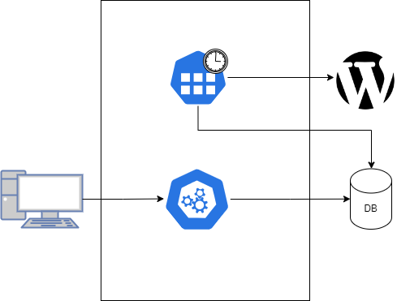
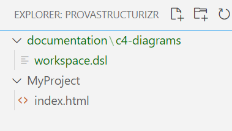
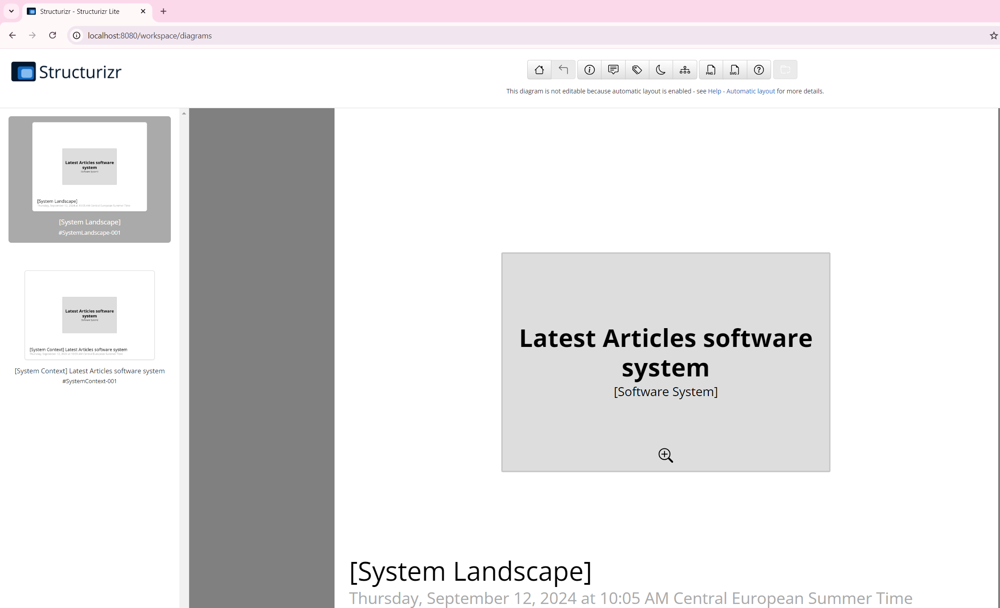
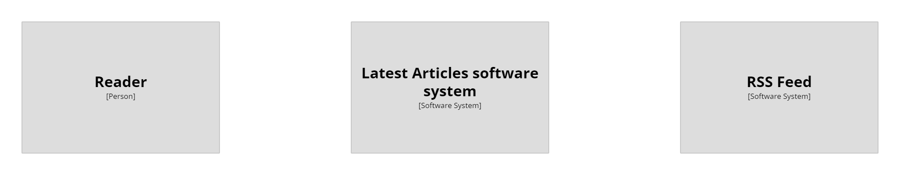
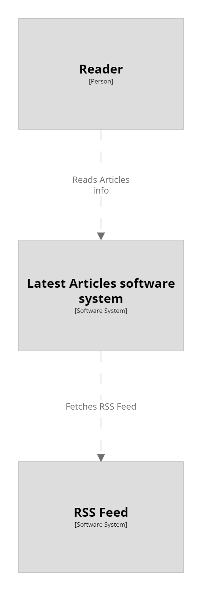
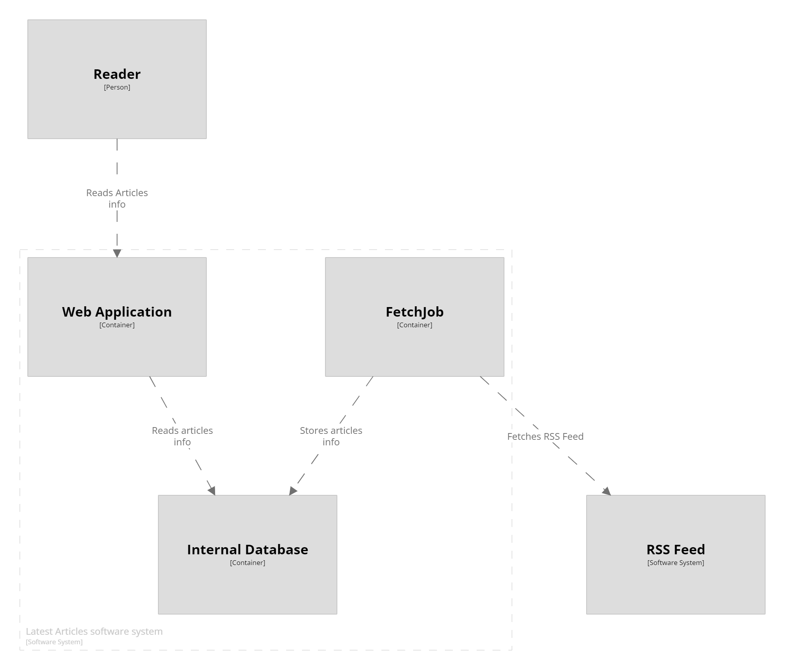
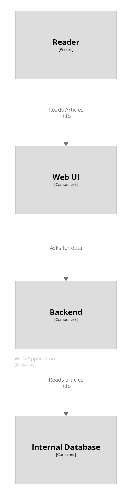
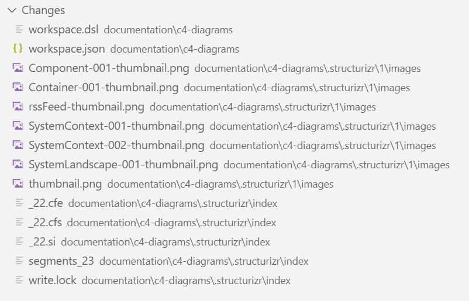
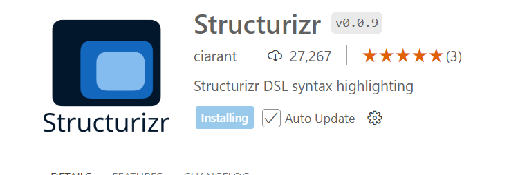

The C4 Model is a renomated way of representing software architectures, describing the different parts via code in a hierarchical way: you start from the high-level view, and gradually describe the details of each component and their interactions. 

I'm sure you've already have heard of it. But have you ever used it in a real project?

I have used the C4 Model to describe the architecture of a project, and I decided to use Structurizr as a tool to generate such diagrams. 

In this article, I will share my experience with it, as well as some practical tips to use it. I have used Windows 11, but almost everything I share here can be used with other Operating Systems as well.

## An overview of the C4 Model

The C4 Model is a framework, created by [Simon Brown](https://x.com/simonbrown), used in software architecture to provide a clear and structured way of describing complex software systems. 

By generating diagrams with different levels of abstractions, it provides users different ways to look at how components are organized, how they communicate, and so on.


It consists of **four levels of abstraction**: Context, Containers, Components, and Code, each serving a distinct purpose.


### Context: a high-level view, with external dependencies

This is the highest level of the model and provides a **full-system view**, showing how the software system interacts with **external entities** such as users, systems, and external services. 

Just by looking at this level, readers can see what are the external parts that communicate with the software system.

In general, here is where you want to **describe the parts that are *not* under your control**: if you store data in a database managed by somebody else, you can show it here. If the database is managed by you (even if in cloud - as long as you have some kind of control on it), you should list it in a lower level, like Containers.

### Containers: the internal architecture's main modules

The Container level breaks down the system into its **major modules**, which are typically applications, data stores, microservices, etc. 

This level outlines the high-level technology choices and how these containers interact with one another.

Here, for example, you can describe all your micorservices listing the dependencies, the frameworks used to implemnt them, and so on.

### Components: the main parts within a Container

The Component level describes **the various modules and parts that are part of the parent Container**.

These components are detailed in a way that shows their responsibilities, interactions, and how they work together to fulfill the container's purpose.

In the case of an application based on .NET, you can think of components as the different class libraries within the solution. However, **this level works better if you think of the logical separation of the components, not the physical separation**.

### Code: the UML view of the code

The most granular level of the C4 Model, the Code level, is often optional but, in some specific cases, it can be incredibly informative. 

It provides the **implementation details of the system's components**, often visualized through class or interface diagrams that show the code structure and dependencies. 

From my experience, since the code changes frequently, this level risks to be outdated; since **wrong info is worse than no info**, I generally choose not to include this level.


## What is (and what is NOT) the C4 Model
 
The C4 Model is particularly beneficial for several reasons. It helps in creating a common language for team members to discuss architecture, **facilitates the onboarding of new developers** by providing them with a clear map of the system, and helps in risk identification and threat modeling. 

Moreover, since it's based on abstractions, it's flexible enough to be used at various stages of development, from initial design to documenting existing systems. 

It's important to remember that **C4 Model is a way of describing software. But it's not a Language, nor a Tool**. 

To generate a C4 Model you can use many tools, like [Structurizr](https://structurizr.com/) (created by Simon Brown, the creator of the C4 Model). Structurizr has it own DSL (Domain Specific Language), but nothing stops you from creating C4 Models using any tool - even a simple handwritten sketch can be fine.

Let's create the diagrams for a realistic application: a Web UI that shows the latest articles from a website. This project is composed of two main parts: a job (something like an Azure Function) that accesses a RSS feed and stores the published articles data on a DB. A UI, accessed by users, that reads the articles info on the DB and shows them on screen. 




## Step-by-step diagrams with Structurizr

As we saw before, C4 Model is not a language or a tool, but a type of visual representation.

In this article, we will use Structurizr. To generate diagrams with it, we have to use its specific syntax and have access to it (either in cloud or locally).

I have my project saved on a Desktop folder. Aside with the production code, I have a folder named "documentation" that stores everything related to - guess what? - docs. Within that folder, I have a "c4-diagrams" directory that will contain the diagrams and for the C4 Model.   


### File structure for Structurizr 

**Every "project" is described by its own workspace**, that contains everything needed to describe the different levels and modules.

**A workspace is nothing but a text file with the .dsl extension**. You can create a workspace.dsl file in any directory (though I suggest you to do that in a specific "documentation" folder).

Since it's a plain text file, you can add it to source control - this simple tip allows your colleagues to collaborate with the diagram creation.
 



To start with a very basic example, create a `workspace` node within the workspace.dsl file.

```text
workspace {
  model {
        mainSystem = softwareSystem "Latest Articles software system" {
        }
    }
}
```

This workspace contains a `model` node, that it used to list all the components and modules that are part of the workspace.

In this case, we have only one item: `mainSystem`, that is an object of type `softwareSystem`, whose label is "Latest Articles software system".

We will add some real items soon.

### Install Structurizr on Windows 11

**You can use Structurizr on cloud or locally**. I generally prefer having Structurizr Lite installed on my machine, so that I can generate the diagrams locally and, in case, modify them before saving the changes.

To use it, have two ways:

- Install it as a Java application (it requires Java 17+) running on a UNIX-based system: you must be able to run a Bash script to make it work;
- Install it via Docker: pull and run the application to have it locally. 

Since I work with Windows, I prefer using Docker. 

To pull the image, you have to run the following command.

```powershell
docker pull structurizr/lite
```

If you are an absolute beginner with Docker, [I published a short article](https://www.code4it.dev/blog/run-mongodb-on-docker/) that explains the main concepts without all the fuzz around it.

### Run Structurizr locally with Docker

Once you have pulled its Docker image, you can run it specifying the path to the Workspace file:

```docker
docker run -it --rm -p 8080:8080 -v C:/Users/d.bellone/Desktop/ProvaStructurizr/documentation/c4-diagrams:/usr/local/structurizr structurizr/lite
```

There are some important thigns to notice:

- you have to use the full path to the dsl file.
- the path separator must be `/`.
- if the workspace file does not exist, it will be created automatically with a default template.

Needless to say it, replace the local path with your own one.

Now, if everything goes well, you will be able to see the empty diagram on *localhost:8080*.



### Set up the Context elements

The first level of the C4 Model is the Context: here you list all the top-level parts that are involved with the software systems, like external dependencies and users.

First, we have the user that interacts with our system. We can call it "Reader".

Then we have the RSS feed that we are integrating, that we can call "RSS Feed".

```text
workspace {
  model {
        reader = person "Reader"
        mainSystem = softwareSystem "Latest Articles software system"
        rssFeed = softwareSystem "RSS Feed"
    }
}
```

Now we can see the result on Structurizr:




Please note that the order in which the elements appear is the same of the order in which the elements are listed in the `model` node.

Also, note that each element is characterized by three parts:

- the variable name, `reader`, that allows us to reference to this element in other parts of the diagram;
- the type of element, `person`;
- the label associate to the element, `Reader`, that is shown as box title.

### Describe Containers and their interatction

The Containers level describes the different modules that are part of the software system.

In our specific example, we have the following modules:

- The *Web Application*, accessed by the user;
- The "*FetchJob*" job application, that reads the content from the RSS Feed;
- The *internal Database*, that contains the data stored by the FetchJob and read by the Web Application;

All these items are part of the "Latest Articles software system", so they need to be included as children of that node:

```text
workspace {
  model {
        reader = person "Reader"
        rssFeed = softwareSystem "RSS Feed"
        mainSystem = softwareSystem "Latest Articles software system" {
            webapplication = container "Web Application" {
                reader -> this "Reads Articles info"
            }
            fetchJob = container "FetchJob" {
                this -> rssFeed "Fetches RSS Feed"
            }
            database = container "Internal Database"            {
                webapplication -> this "Reads articles info"
                fetchJob -> this "Stores articles info"
            }
        }
    }
}
```

Notice that you can use the `this` keyword to refer the the active element.

Another imporant part to consider **is that you cannot reference an element that isn't already declared**. That's why, compared with the previous example, I had to move the `rssFeed` item before the `mainSystem`.

Now that we have all the components and their interactions, we can see that the Context layer also shows the inbound and outbound interactions with the external systesm.



And that, if we look into the Components layer, we can see how the different components interact with each other and with the external sources.




Even with just these two levels we have enough info to understand how the system behaves and what are the main moving parts.


### Components

Each container is made of one or more components.

In our example, the Web Application is made of two components: the *Web UI* and the *Backend Application*, that interacts with the database.

```text
workspace {
  model {
        reader = person "Reader"
        rssFeed = softwareSystem "RSS Feed"
        mainSystem = softwareSystem "Latest Articles software system" {
            webapplication = container "Web Application" {
                ui = component "Web UI" {
                    reader -> this "Reads Articles info"
                }
                backend = component "Backend" {
                    ui -> this "Asks for data"
                }
            }
            fetchJob = container "FetchJob" {
                this -> rssFeed "Fetches RSS Feed"
            }
            database = container "Internal Database"            {
                backend -> this "Reads articles info"
                fetchJob -> this "Stores articles info"
            }
        }
    }
}
```

We have now the UI and Backend components. Of course, since they describe with better details the components within the Web Application, they replace the content within the `webapplication` node.

Also, now the `backend` node is referenced within the `database` container.



### Code

The Code level is used so rarely that the Structurizr DSL does not even include it.

But you can use other tools to generate the Code diagrams and then reference those diagrams in the C4 Model.

## Practical tips for working with Structurizr

Now that we have seen how to create the basic structure of a C4 Model with Structurizer, let's have a look at some practical tips that I found useful when describing the application I was working on. Of course, if you know some others, let me know in the comments section!

- **Store all the documentation in a single folder**: the more scattered is the documentation across your systems, the harder it become to find what you are looking for and remember to keep everything up-to-date. 
- **Remember to follow the DSL grammar**: while C4 Model is an abstract way to represent a software system, if you want to use Structurizr to generate such model you have to [follow its DSL](https://docs.structurizr.com/dsl/language). It's a strict grammar, with some rules that you'll get to know while working on it (like the fact that you cannot reference an item before it has referenced).
- **Use verbs in the active form**: instead of "Is called by", use "Calls", following the arrow direction.
- **Separate by logical meaning, not phisical meaning**: using an example .NET applications, even if two functionalities (aka: Modules) are stored in the same Class Library, represent them as separate entities.
- **Use tags and colors to mark external and internal components**: each element can be represented with a specific colour and can be tagged with custom values. Make use of these capabilities to help readers identify internal and external components.
- **Use themes to customize how the diagram is rendered**: Structurizr allows you to [apply themes](https://docs.structurizr.com/ui/diagrams/themes) to your diagram to change how the rendering looks like. For example, you can configure it to use Azure icons.
- **Save your diagrams in GIT**: you want to keep track of the changes to your diagrams, ensuring that the description matches the actual structure of the system.
- **Update the gitignore file**: even if you just update the workspace.dsl file, Structurizr creates some temporary files (metadata, thumbnails, and so on), as you can see in the screenshot below. These files are stored in the `.structurizr` folder. So, remember to add the `.structuriz` folder to your gitignore.

- **Split the diagram into different parts, and join them using "includes"**: when the application grows in a way that it becomes difficult to read and manage, you can create separate sub-diagrams and join them using the [includes operator](https://docs.structurizr.com/dsl/includes). For example, if you have a solution with 15 projects, you can create one diagram inside each of the 15 projects and join them all in a root diagram.
- **Export the diagrams to other formats**: Structurizr is not the only tool you can use to analyze the structure of your system. You can export the diagram as different formats using [Mermaid](https://docs.structurizr.com/export/mermaid) or [Ilograph](https://docs.structurizr.com/export/ilograph).  
- **Install the Structurizr extension on VSCode**: since Structurizr DSL is a custom language, it is not natively supported by the most popular IDEs. To have a nice syntax highlighting, you can install the Structuriz extension for VSCode, as seen below.


## Further readings

As always, the best way to learn how something works is by trying it. 

You may want to reference the official documentation, provided by Simon Brown:

🔗 [C4 Model website](https://c4model.com/)


_This article first appeared on [Code4IT 🐧](https://www.code4it.dev/)_

Simon himself wrote an article that explains how to get started with it. It does not go in details like the one you've just read, but since it's written by the tool author I think it's a valuable read

🔗 [Getting started with Structurizr Lite | Dev.TO](https://dev.to/simonbrown/getting-started-with-structurizr-lite-27d0)

Another cool part about Structurizr is that you can use it to generate ADRs. You don't know that ADRs are? I've got you covered!

🔗 [Tracking decision with Architecture Decision Records (ADRs)](https://www.code4it.dev/architecture-notes/architecture-decision-records/)


## Wrapping up

It's not necessary to use Structurizr to generate such C4 Model diagrams. However, it's probably one of the most complete tools you can find online.

Remember, you should describe the architecture to the best level of details: not too many details (or you'll lose time descrbing stuff with little to no value) nor too few (or you won't get the sense of the architecture).

I hope you enjoyed this article! Let's keep in touch on [LinkedIn](https://www.linkedin.com/in/BelloneDavide/) or [Twitter](https://twitter.com/BelloneDavide)! 🤜🤛

Happy coding!

🐧

- [ ] Grammatica
- [ ] Titoli
- [ ] Frontmatter
- [ ] Immagine di copertina
- [ ] Fai resize della immagine di copertina
- [ ] Metti la giusta OgTitle
- [ ] Bold/Italics
- [ ] Nome cartella e slug devono combaciare
- [ ] Rinomina immagini
- [ ] Trim corretto per bordi delle immagini
- [ ] Alt Text per immagini
- [ ] Rimuovi secrets dalle immagini 
- [ ] Pulizia formattazione
- [ ] Add wt.mc_id=DT-MVP-5005077 to links

https://www.structurizr.com/
IloGraph: https://www.structurizr.com/dsl?example=big-bank-plc&view=Containers&renderer=ilograph
