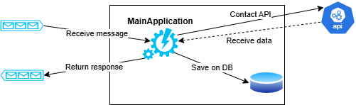
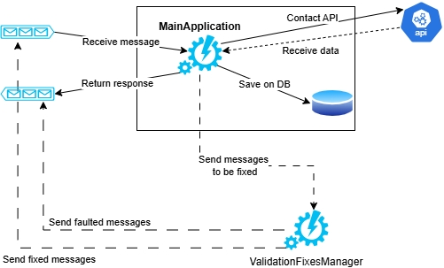
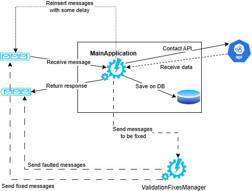
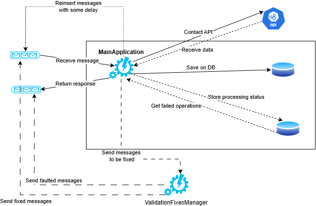

When designing a new software system it's easy to focus more on the happy path and forget that you also have to handle errors.

You should carefully define and design how to handle errors: depending on the use case, error handling can have a huge impact on the architecture of your software system.

In this article, we're going to explore the three main categories of errors that we must remember to take care of; for each type of error, we will and showcase how addressing it can have different impact on the software architecture.

For the sake of this article, I'm going to ignore errors that are not properly errors: null values, queries that do not return any value, and so on. These are all legitimate statuses that represent that lack of values, but are not errors that have architectural relevance.

## A system with only an happy path

To use a realistic example, let's design a simple system with a single module named *MainApplication*: this module reads data from an external API, manipulates the data, and stores the result on the DB.

The system is called asynchronously, via a Queue, by an external service - that we are going to ignore. 


The happy flow is pretty much the following:

1. An external system inserts some data on the queue;
2. MainApplication reads the data from the queue;
3. MainApplication calls an external API to retrieve some data;
4. MainApplication stores some data on the DB;
5. MainApplication sends a message on the queue with the operation result.



Now, the happy flow is simple. But we forgot to cover what to do in case of an error.

## Validation: the first defense against invalid data

Suppose that the messages we receive from the queue are in the following format:

```json
{
    "Username": "mr. captain",
    "BookId": 154,
    "Operation": "Add"
}
```

For sure, we need to perform some validation on the input we receive.

For example:
 
- The `Username` property must not be empty;
- The `BookId` property must be a positive number;
- The `Operation` property must have one of the following values: *Add*, *Remove*, *Refresh*;

How does it impact our design?

We have several choices to deal with an invalid incoming message:

1. ignore the whole message: if it doesn't pass the validation, discard the message;
2. send the message back to the caller, describing the type of error
3. try to fix it locally: if we are able to recreate a valid message, we could try to fix it and process the incoming message;
4. try to fix it in a separate service: you will need to create a distinct service that receives the invalid message and tries to fix it: if it manages to fix the message, it re-inserts it in the original queue; otherwise, it sends a message to the response queue to notify about the impossibility to recreate a valid message.


As you can see, even for the simple input validation, the choices we make can have an impact on the structure of the architecture.

In fact, if we choose option #4, we need to implement a brand new service (let's call it *ValidationFixesManager*), configure a new queue, and keep track of the attempts to fix the message. 



All of this only considering the static validation. **How would you validate your business rules?** How would you ensure that, for instance, the Username is valid and the user is still active on the system?

We have just demonstrated a simple but important fact: input validation *looks* trivial, but depending on the needs of your system, it may impact how you design your system.

## Transient Errors: temporary errors that still need to be considered

Even if the validation passes, there may be temporary issues that prevent your operations to complete.

In the previous example, there are some possible issues to consider:

1. the external API is temporarly down, and you cannot retrieve the data you need;
2. the return queue is full, and you cannot add response messages;
3. the application is not able to connect to the DB due to network issues;

These kinds of issues are due to a temporary status of the system or of one of its dependencies.

Sure, you may add automatic retries: for instance, you can use Polly to automatically retry access the API. But what if it's not enough?

Again, depending on the requirements for your application and on the overall structure you started designing, the solution may differ in many ways.

Let's say that the external API is returning a 500 HTTP error: this is a transient error, and it does not depend on the content of the request. 

What can we do if all the retries fail? 

If we can just accept the situation, we can return the error to the caller and move on with the other operations.

But if we need to keep trying until the operation goes well, we have two choices:

1. consume the message from the Queue, try calling the API and, if it fails, re-insert the message on the queue (ideally, with some delay); 
2. peek the message from the queue, try calling the API. If it fails, the message stays on the queue (and you need a way to read it again). Otherwise, you consider the message to be completed, and remove it from the queue.

These are just two of the different solutions. But, as you can see, this choice will have, in the long run, a huge effect on the future of the application, both in terms of maintainability and performance.

Below is how the structure changes if we decide to send the failed messages back in the queue with some delay.



In both cases, we must remember that it's useless trying to call a service that we know it's temporarly down: maybe it's time to use a Circuit Breaker?

## Fatal Errors: when everything goes does

There is one type of error that is often ignored but that may deeply influence how your system behaves: fatal errors.

Examples of fatal errors are:

- the host has consumed all the CPU or RAM;
- the file system is corrupted;
- the connection to an external system is interrupted because of network errors.

In short, fatal errors are errors you have no way to solve in the short run: they happen and stop everything you are doing.

This kind of error cannot be directly managed via application code, but you need to rely on other techniques.

For example, to make sure you won't consume all the available RAM, you should plan for autoscaling of your resources. So you have to design the system with autoscaling in mind: this means, for example, that the system must be stateless and the application must run on infrastructure objects that can be configured to automatically manage resources (like Azure Functions, Kubernetes, and Azure App Services). Also: do you need horizontal or vertical scaling?

And, talking about the integrity of the system, how do you ensure that operations that were ongoing when the fatal error occurred can be completed? One possible solution is to use a database table to keep track of the status of each operation, so that when the application restarts, it first completes pending operations, and then starts working on new operations.



## Further readings

Unfortunately, I feel that error handling is one of the most overlooked topics when designing a system. This also means that there are not lots and lots of articles and resources that explore this topic.

But, if you use queues, one of the components you should use to manage errors is the Dead Letter queue. Here's a good article by Dorin Baba where he explains how to use Dead Letter queues to handle errors in asynchronous systems.

🔗 [Handling errors like a pro or nah? Let’s talk about Dead Letters | Dorin Baba](https://medium.com/@dorinbaba/handling-errors-like-a-pro-or-nah-lets-talk-about-dead-letters-19a9a67869c1)

_This article first appeared on [Code4IT 🐧](https://www.code4it.dev/)_

## Wrapping up

I hope this article helps highlighting the importance of error handling, and the fact that even if we all want to avoid and prevent errors in our systems, we still have to take care of them and plan according to our needs.

I hope you enjoyed this article! Let's keep in touch on [LinkedIn](https://www.linkedin.com/in/BelloneDavide/) or [Twitter](https://twitter.com/BelloneDavide)! 🤜🤛

Happy coding!

🐧

- [ ] Grammatica
- [ ] Titoli
- [ ] Frontmatter
- [ ] Immagine di copertina
- [ ] Fai resize della immagine di copertina
- [ ] Metti la giusta OgTitle
- [ ] Bold/Italics
- [ ] Nome cartella e slug devono combaciare
- [ ] Rinomina immagini
- [ ] Trim corretto per bordi delle immagini
- [ ] Alt Text per immagini
- [ ] Rimuovi secrets dalle immagini 
- [ ] Pulizia formattazione
- [ ] Add wt.mc_id=DT-MVP-5005077 to links