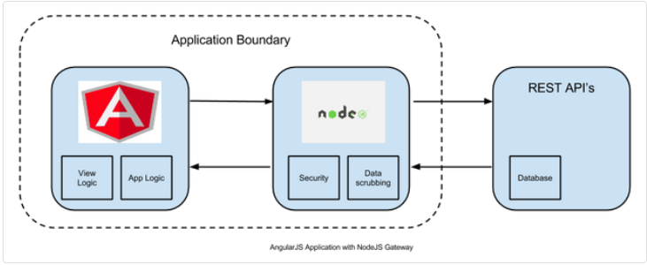

There's a lot of confusion about Node.js, NPM, and Angular. These 3 "entities" are often used together, especially for Angular applications, but they are not the same thing.

Let's make it clear!

## Node.js

Node.js is a **server environment** based on JavaScript. You can download it from the [official site](https://nodejs.org/ "Node.js website")  and run it on Windows, Linux, Mac, etc.

**Node.js uses asynchronous programming**: while a typical server handles one request per time (thus creating overhead while waiting for the request completion), Node.js accepts all the requests and handles them one by one in a manner that does not block other requests. This is obviously very efficient.

## NPM

[NPM](https://www.npmjs.com/package/npm "NPM website") is the package manager for Node.js packages. It contains thousands of free packages available to download; also, using the command line, it's easy to download and update those packages.

NPM is commonly used with Node.js, so it is installed with the server environment.

The way to install a package is with the command `npm install <package_name>`.

## Angular

Angular is a framework based on JavaScript that makes it easy to build applications for the web. Often you'll see Angular applications written in Typescript, a modern class-oriented language based on JavaScript. The result is the same: Typescript is compiled into JavaScript, so they are interchangeable. Well, at least the latest versions of JS, because types and decorators are required in order to, respectively, use _dependency injection_ and set metadata.

Being based on JavaScript - guess what? - it fits perfectly with Node.js. And of course, NPM, which allows you to download JavaScript
packages to include in the project.

_This article first appeared on [Code4IT](https://www.code4it.dev/)_

## Wrapping up

Now we know what Node.js, NPM, and Angular are, and how they fit together.

Node.js is just the server that handles the requests from the web page; these pages can call web APIs from whatever kind of server, and of course look up to data in any type of DB.
