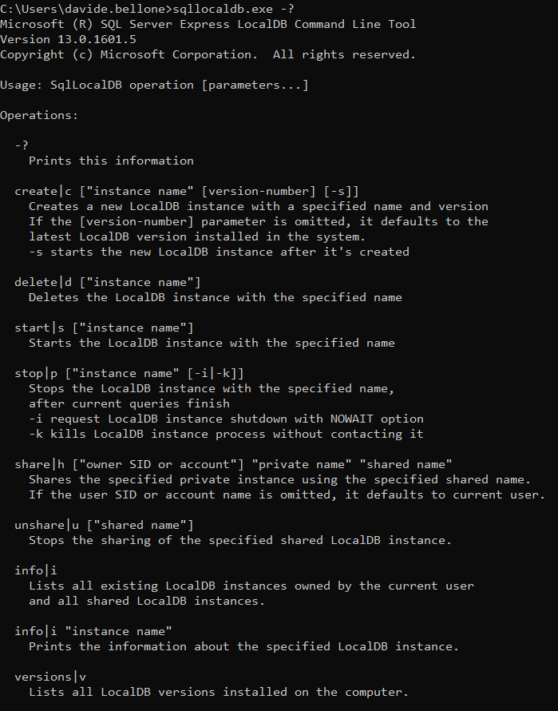

This article is just a note for something I forget the most: my LocalDB instance names.

Sometimes when I open **SQL Server Management Studio** (SSMS) I lose time thinking and trying to figure out what is the name of my LocalDb.

The solution is simple: open the terminal and run `SQLLocalDb.exe i`, where _i_ stand for _information_.

Now you can see the list of configured DBs.

**To use it in SSMS remember to use Windows Authentication.**

If you need more info about a specific instance, just run `SQLLocalDB.exe i "InstanceName"` where of course _InstanceName_ must be replaced with the real name you are looking for.

This command displays some info about the specified SQL instance: this info includes the version, the owner and the current state.

If you want to have a list of all available commands, run `SQLLocalDB.exe -?`. These commands allow you to create and delete SQL instances, stop and start existing instances and so on.

It's important to remember that here the spaces are treated as delimiters, so if your DB includes spaces inside its name, you must surround the name with quotes.

_This article first appeared on [Code4IT](https://www.code4it.dev/)_
