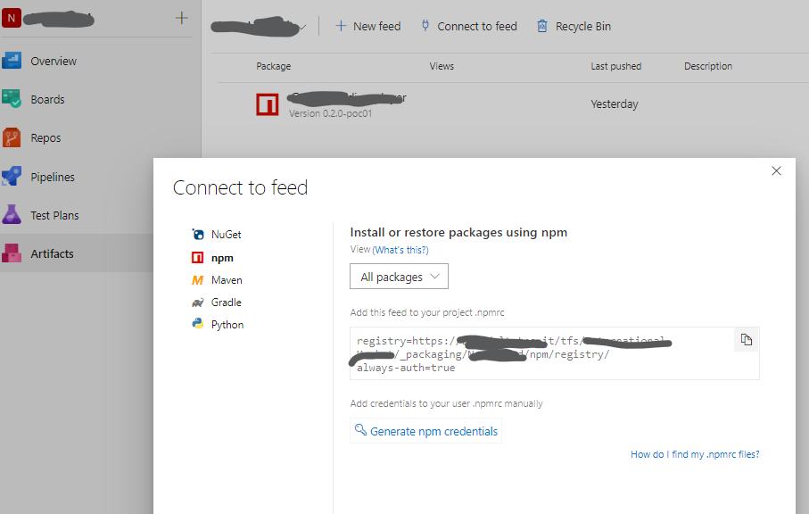
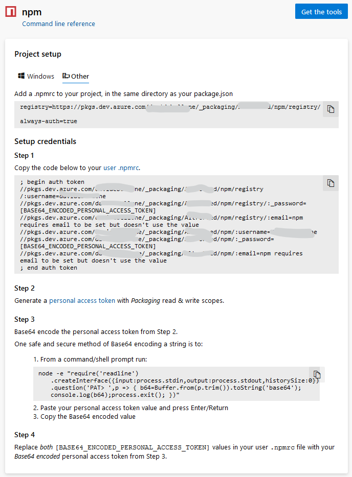

I use Azure DevOps to store some npm packages for my projects. As you may know, Azure DevOps has a section called _Artifacts_ that allows you to store and distribute packages from NuGet, npm, Maven and so on.

> Don't you know what npm is? [Check it out here](https://www.code4it.dev/blog/angular-vs-npm-vs-node-js#npm)!

You can have one or more _Feeds_ in your organization: each feed contains some packages, and you can administer each feed with granularity, for example by selecting specific users to be allowed to access those packages.

## How to connect to npm feed

In order to update and download packages to a feed, you must access that Artifact page, click on _Connect to feed_ and navigate to the _npm_ section.

Here you can get the two configurations that must be added to your project and to your Windows account: **feed info** and **user credentials**.

### Where to store npm feed info

Feed info must be copied under the .npmrc file **at the same level as your _package.json_ file**. The feed info is something like this:

```text
registry=https://my-site/my-organization/_packaging/my-project/npm/registry/
always-auth=true
```

This tells your project that it must look for npm packages under that registry.

### How to get npm user credentials

User credentials must be stored **under your user account, inside of a .npmrc file**, so under _C:\users\\{username}\\.npmrc_. That file must contain the credentials provided by Azure DevOps.

In the old version of Azure DevOps, to get the user credentials you can simply click on the _Generate npm credentials_ button.



From the newer versions, you can follow two processes, depending on your OS.

If you are working **on Windows**, you can run `vsts-npm-auth -config .npmrc` to have the .npmrc file correctly created under your user account.


If you are working on a different OS you must generate a _PAT_ - _Personal Access Token_ - that must be encoded and replaced in a template provided by Azure DevOps. All the steps are described in the relative page.



So now you can install packages from this feed by running `npm install package-name`.

## Solving error E401 - unable to authenticate

Sometimes, when running `npm install`, you can come across this error:

```shell
C:\Users\<my-user>\Desktop\{project-name}>npm install
npm ERR! code E401
npm ERR! Unable to authenticate, your authentication token seems to be invalid.
npm ERR! To correct this please trying logging in again with:
npm ERR!     npm login

npm ERR! A complete log of this run can be found in:
npm ERR!     C:\Users\<my-user>\AppData\Roaming\npm-cache\_logs\2020-01-30T10_16_27_550Z-debug.log
```

**DO NOT TRY THE NPM LOGIN!** It logs you in the npmjs.com website, not in your Azure DevOps organization. Or, better, it tries the login related to your default registry, which is usually https://registry.npmjs.org ; you can check it by running `npm config get registry`. So, by running `npm login` without knowing which registry you are using, you might log in to a different registry than expected.

### Solution #1: manually refresh the token

Maybe your token is simply expired. You can simply navigate to Azure DevOps and generate new credentials to be stored in the .npmrc file at user level.

### Solution #2: automatically refresh the token

Inside your project, you can open a terminal and run `vsts-npm-auth -F -C .npmrc`.

This script refreshes the npm token. Here I set two parameters: `-F` forces the refresh (if not set, the token is refreshed only if it is already expired), while `-C fileName` defines the configuration file.

As I said before, this command is available only on Windows.

### Solution #3: check if the URLs contain non-escaped characters

This is a subtle problem that blocked my developments for almost 2 days, and it's the reason why I decided to write this article.

My npm feed is available on Azure DevOps at this URL: https://my-site/my%20organization/my-project/\_packaging?\_a=feed&feed=my-feed

The .npmrc file for my project is

```
registry=https://my-site/my organization/_packaging/my-project/npm/registry/
always-auth=true
```

and the .npmrc file at user level is something like this

```
; begin auth token
//my-site/my organization/_packaging/my-project/npm/registry/:username=myusername
//my-site/my organization/_packaging/my-project/npm/registry/:_password=a-key==
//my-site/my organization/_packaging/my-project/npm/registry/:email=npm requires email to be set but doesn't use the value
//my-site/my organization/_packaging/my-project/npm/:username=myusername
//my-site/my organization/_packaging/my-project/npm/:_password=a-key==
//my-site/my organization/_packaging/my-project/npm/:email=npm requires email to be set but doesn't use the value
; end auth token
```

Everything looks fine, isn't it?

Have you noticed something odd that may cause trouble?

The name of my organization is _my organization_, with a space. I found out that when trying to authenticate, the two URLs somehow don't match because of that space. I noticed it by looking at my Artifact page URL, which contains %20.

Since the URLs don't match, I'm receiving the 401 error. The solution (in my case) is simply to manually edit the .npmrc file at user level and **replace every space with %20**.

In the .npmrc file at project level you can leave the space in the URL.

_This article first appeared on [Code4IT](https://www.code4it.dev/)_

## Conclusions

Here I explained how to connect to npm feeds from Azure DevOps and how to solve problems with authorization.

But, the future might bring something new: as you know, [GitHub has announced the acquisition of npm](https://github.blog/2020-03-16-npm-is-joining-github/ "GitHub acquires npm") in March 2020, and [Microsoft acquired GitHub](https://blogs.microsoft.com/blog/2018/10/26/microsoft-completes-github-acquisition?wt.mc_id=DT-MVP-5005077 "Microsoft acquires GitHub") in 2018. So probably we'll see a different way to integrate npm inside Azure DevOps. Who knows? 😊
