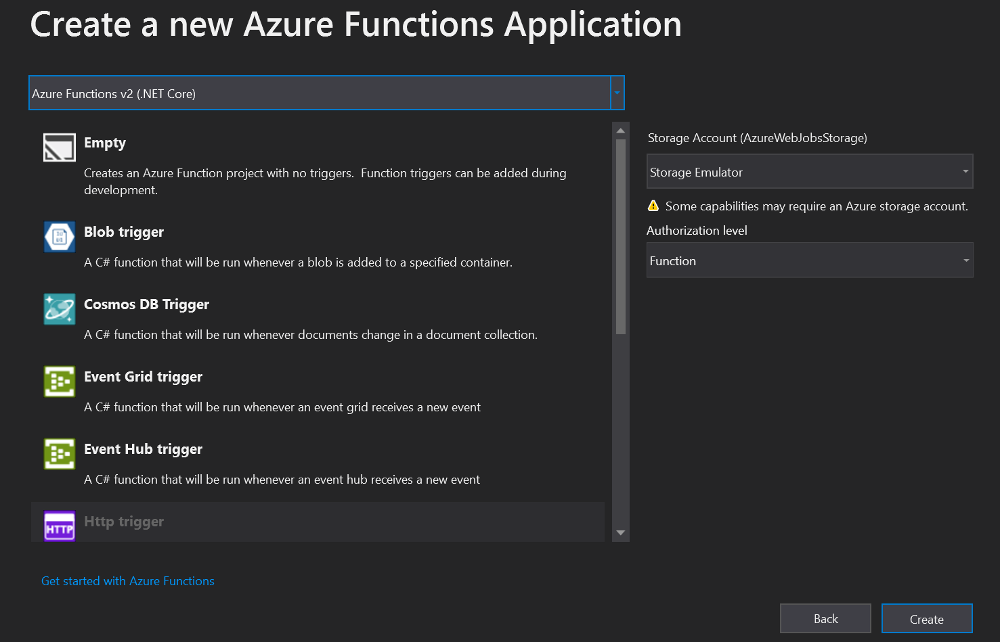

Azure Functions are a great way to implement serverless services. You can implement them with many languages, like C# and JavaScript, and can be configured both on the Azure Portal and on your local machine.

In this article I'm gonna demonstrate how to upgrade an Azure Function v2 to the new version, v3. You are not forced to upgrade your solution, but it has some advantages like the possibility to use .NET Core 3+, .NET Standard 2.1+; this means that you will have a longer supported version.

## Define the problem

If you use Visual Studio 2019 you can easily create an Azure Function within an existing solution.


In the wizard, you can select some capabilities to be scaffolded, like the **kind of trigger**, the associated **storage account**, and the Azure Function version. Using the dropdown list on the screen you can select which Azure Function version you prefer to use.



So now you have your Azure Function. But wait! You did it wrong! You wanted the version 3, not version 2! What can you do now?

The easiest way is - of course - to delete the empty project and recreate it with the right version.

Alternatively, you can update it manually.

Before moving on: do you know that you can add a Startup class to your project so that you can use Dependency Injection? It's easy, it's a matter of few steps. You can read [more in my previous article](https://www.code4it.dev/blog/azure-functions-startup-class)!

## Update the Azure Function version

First of all, you must **update the csproj file**: under _PropertyGroup > AzureFunctionsVersion_ you must set the value to _v3_. You should also update the .NET Core version to 3.0 by updating the _PropertyGroup > TargetFramework_ value.


As you might have noticed, inside the solution folder there is a file called _host.json_, and that file contains a `"version": "2.0"`. This is **not** the Azure function version, but the version of the schema of that file. The host file is [meant to include](https://docs.microsoft.com/en-us/azure/azure-functions/functions-host-json) configurations for the function. So, you must not touch this file.

## Install the new SDK version

Update the **Microsoft.NET.Sdk.Functions** package to a version at least greater than 3.0.1. Remember that this version has dependencies against other libraries, so pay attention while resolving dependency conflicts.


## Update the Startup class

If you have overridden the _Startup_ class as I explained in my previous article, you must update it. Now the assembly attribute is `[assembly: FunctionsStartup(typeof(Startup))]`, and the whole Startup class is a subclass of `FunctionsStartup`.

```cs
[assembly: FunctionsStartup(typeof(Startup))]
namespace MyNamespace
{
    public class Startup : FunctionsStartup
    {
        public override void Configure(IFunctionsHostBuilder builder)
        {
            // Configure your services here
        }
    }
}

```

Also, now the Configure method accepts an `IFunctionsHostBuilder` object instead of a `IWebJobsBuilder`.

So, if we want a comparison of the old and the new version of the Startup class, we have

```diff
- [assembly: WebJobsStartup(typeof(Startup))
+ [assembly: FunctionsStartup(typeof(Startup))]
namespace MyNamespace
{
- 	public class Startup : IWebJobsStartup
+ 	public class Startup : FunctionsStartup
    {
- 		public void Configure(IWebJobsBuilder builder)
+   	public override void Configure(IFunctionsHostBuilder builder)
        {
            // Configure your services here
        }
    }
}
```

## Fix all the breaking changes

If you are also updating the .NET version, remember that there are [some breaking changes](https://docs.microsoft.com/en-us/dotnet/core/compatibility/2.2-3.0) that you must consider. For example:

- Google+ authentication is now deprecated since the service shut down in 2019.

- Some classes changed their package and/or namespace; for example, _Microsoft.Extension.Caching.SqlServer_ moved from _System.Data.SqlClient_ to _Microsoft.Data.SqlClient_.

- Newtonsoft.Json is now replaced by default with System.Text.Json

_This article first appeared on [Code4IT](https://www.code4it.dev/)_

## Final thoughts

Here we've seen how to upgrade from Azure Functions v2 to v3. Staying up to date to the latest (stable) versions of such tools is important since performance and security issues would be fixed. So, take the time to update your functions.

Since you've updated your versions, remember to [update also your runtime version on Azure](https://docs.microsoft.com/en-us/azure/azure-functions/functions-versions#changing-version-of-apps-in-azure) and, if you are using them, your [Azure DevOps pipelines](https://about-azure.com/how-and-why-you-should-upgrade-your-net-azure-functions-to-3-0/).
