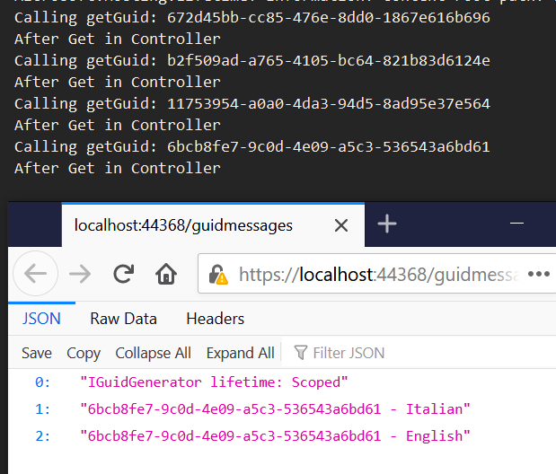
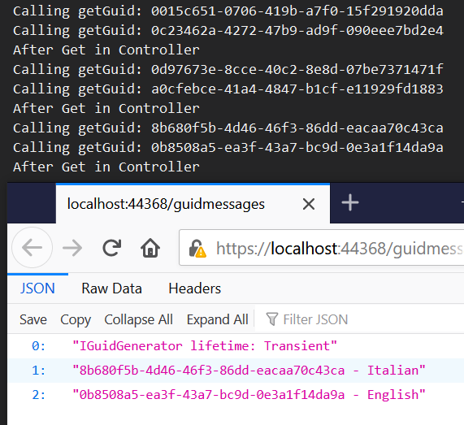

I'm pretty sure you already know what is Dependency Injection (shortened to DI) and why you should implement it in your applications.

Just as a recap, DI allows you to define an association between an interface and a concrete class, so that when another class requires to use that interface, it doesn't depend on the concrete class. Rather, it's the DI engine that injects the concrete class where it's needed. There are lots of articles about the benefits of DI, so I'll not dive into it here.

For .NET Core applications, you can register all the dependencies in the _Startup_ class, within the _ConfigureServices_ method.

You can register a dependency by specifying its **lifetime**, which is an indication about the way dependencies are created. **The three available lifetimes are Singleton, Transient and Scoped**.

_PSS! Do you know that you can use Dependency Injection even in Azure Functions? [Check it out here!](https://www.code4it.dev/blog/azure-functions-startup-class "How to add a Startup class to Azure Functions")_

## Project setup

_To explain well how lifetimes work I have to do a long explanation on I built the sample application; this will help you understand better what's going on, but you don't need to understand the details, just the overall structure._

I've created a simple Web API application in .NET Core 3. To explain how the lifetime impacts the injected instances, I've created an `IGuidGenerator` interface which contains only one method: `GetGuid()`;

This interface is implemented only by the GuidGenerator class, which creates a Guid **inside the constructor** and, every time someone calls the GetGuid method, it returns always the same. So the returned Guid is strictly related to the related GuidGenerator instance.

```cs
public interface IGuidGenerator
{
    Guid GetGuid();
}

public class GuidGenerator : IGuidGenerator
{
    private readonly Guid _guid;

    public GuidGenerator()
    {
        _guid = Guid.NewGuid();
        Debug.WriteLine($"Calling getGuid: {_guid}");
    }

    public Guid GetGuid()
    {
        return _guid;
    }
}
```

Till now, nothing difficult.

This `IGuidGenerator` is injected into two services: `EnglishGuidMessage` and `ItalianGuidMessage`. Both classes implement a method that calls the GetGuid method on the injected IGuidGenerator service: that Guid is finally wrapped in a string message and then returned.

This is the message for the Italian class:

```cs
public interface IItalianGuidMessage
{
    string GetGuidItalianMessage();
}

public class ItalianGuidMessage : IItalianGuidMessage
{
    private readonly IGuidGenerator guidGenerator;

    public ItalianGuidMessage(IGuidGenerator guidGenerator)
    {
        this.guidGenerator = guidGenerator;
    }
    public string GetGuidItalianMessage() => $"{guidGenerator.GetGuid()} - Italian";
}
```

and this one is for the English version:

```cs

    public interface IEnglishGuidMessage
    {
        string GetGuidEnglishMessage();
    }

    public class EnglishGuidMessage : IEnglishGuidMessage
    {
        private readonly IGuidGenerator guidGenerator;

        public EnglishGuidMessage(IGuidGenerator guidGenerator)
        {
            this.guidGenerator = guidGenerator;
        }
        public string GetGuidEnglishMessage() => $"{guidGenerator.GetGuid()} - English";
    }
```

_Yes, I know, I shouldn't create 2 identical interfaces, but it's only for having simpler examples!._

Lastly, let's move a step higher and inject the two interfaces in the API Controller.

```cs
public GuidMessagesController(IItalianGuidMessage italianGuidMessage, IEnglishGuidMessage englishGuidMessage, IServiceCollection serviceCollection)
{
    this.englishGuidMessage = englishGuidMessage;
    this.italianGuidMessage = italianGuidMessage;
    this.serviceCollection = serviceCollection;
}
```

and call them in the Get method:

```cs
[HttpGet]
public IEnumerable<string> Get()
{
    // Used to get the lifetime of the IGuidGenerator instance
    var guidLifetime = serviceCollection.Where(s => s.ServiceType == typeof(IGuidGenerator)).Last().Lifetime;

    var messages = new List<string>
    {
        $"IGuidGenerator lifetime: {guidLifetime}",
        italianGuidMessage.GetGuidItalianMessage(),
        englishGuidMessage.GetGuidEnglishMessage()
    };
    Debug.WriteLine("After Get in Controller");

    return messages;
}
```

Of course, we must add the dependencies in the Startup class:

```cs
public void ConfigureServices(IServiceCollection services)
{
    //  Others
    services.AddTransient<IItalianGuidMessage, ItalianGuidMessage>();
    services.AddTransient<IEnglishGuidMessage, EnglishGuidMessage>();
}
```

Yes, I haven't injected the IGuidGenerator dependency. We'll use that to explain the different lifetimes.

Looking at the code snippets above, you'll notice a `Debug.WriteLine` instruction on the API Controller and on the GuidGenerator constructor: this instruction will help us understanding when each method is called and which is the value of the Guid. In particular, when you'll see "After Get in Controller", you'll know that I hit refresh on the API endpoint.

Finally, after all of this setup, we're ready to go!

## Singleton: a single instance shared across the whole application lifetime

This is the simplest one: it creates a unique instance of the service, that will be shared across all the application for the whole run time.

```cs
services.AddSingleton<IGuidGenerator, GuidGenerator>();
```

If we start the application and we call multiple times the Get endpoint, we'll notice that **every time we are getting the same Guid**.


In the above screenshot notice that not only the Guid is always the same, but also the constructor is called only at the beginning: every time the application needs an IGuidGenerator instance, even when I call multiple times the Get method, it reuses always the same object.
This implies that **if you change the internal state of the injected class, all the classes will be affected!**

Let's say that the IGuidGenerator also exposes a SetGuid method: if you call it on the ItalianGuidMessage class, which is called before the English version (see the Get method of the API controller), the EnglishGuidMessage class will return a different Guid than the original one. All until you restart the application. So pay attention to this!

## Scoped: dependencies are shared per request

Services with a **scoped lifetime** are created once per client request, so if you call an API multiple times **while the same instance of the application is running**, you'll see that Italian and English messages will always have the same Guid, but the value changes every time you call the endpoint.



As you can see, Italian and English messages have the same value, _6bcb8..._, and every time I call the endpoint a new GuidGenerator instance is created and shared across all the application. Every change to the internal state lives until the next client call.

Of course, to specify this kind of dependency, you must add it in the ConfigureServices method:

```cs
services.AddScoped<IGuidGenerator, GuidGenerator>();
```

## Transient: dependencies are created every time

This lifetime specification injects a different object every time it is requested. You'll never end up with references to the same object.



As you can see on the screenshot above, the constructor for the GuidGenerator class is called for each request two times, one for the Italian and one for the English message.

Of course, you should not use it if the creation of the injected service needs lots of resources and time: in this case it will dramatically impact the overall performance of your application.

As usual, you must set this lifetime within the Startup class:

```cs
services.AddTransient<IGuidGenerator, GuidGenerator>();
```

## Bonus tip: Transient dependency inside a Singleton

There's an error that I've seen many times: define a service as Transient (or Scoped) and inject it into a Singleton service:

```cs
public void ConfigureServices(IServiceCollection services)
{
    // other stuff

    services.AddTransient<IGuidGenerator, GuidGenerator>();

    services.AddSingleton<IItalianGuidMessage, ItalianGuidMessage>();
    services.AddSingleton<IEnglishGuidMessage, EnglishGuidMessage>();
}
```

How these dependencies will be handled?

The `IGuidGenerator` is indeed Transient, but it is injected into Singleton classes: the constructor for `ItalianGuidMessage` and `EnglishGuidMessage` will be called only when the application starts up, so both will have a different `Guid`, but that value will be the same for the whole application life.


_This article first appeared on [Code4IT](https://www.code4it.dev/)_

## Wrapping up

We've seen the available lifetimes for injected services. Here's a recap the differences:

- **Singleton**: the same object through all the application lifetime
- **Scoped**: a different object for every client call
- **Transient**: a different object every time it is requested, even within the same client request

If you want to try it, you can clone the project I used for this article on [this GitHub repository](https://github.com/code4it-dev/DependencyInjectionScopes "GitHub repository for this example").

Finally, if you want to read more about DI in .NET Core, just head to the [Microsoft documentation](https://docs.microsoft.com/en-us/aspnet/core/fundamentals/dependency-injection?view=aspnetcore-3.1&wt.mc_id=DT-MVP-5005077#service-lifetimes "Microsoft docs on Service Lifetimes") and, if you wanna read more about DI best practices, here's a great article by [Halil İbrahim Kalkan](https://medium.com/volosoft/asp-net-core-dependency-injection-best-practices-tips-tricks-c6e9c67f9d96 "DI best practices article").

Happy coding!
