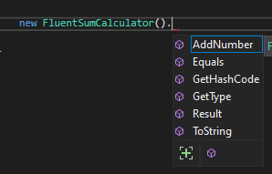

Do you remember the [**internal** access modifier](https://docs.microsoft.com/en-us/dotnet/csharp/language-reference/keywords/internal?wt.mc_id=DT-MVP-5005077 "Internal keyword reference")? It allows you to **access classes, methods and properties only within files in the same assembly**.

But sometimes you need to have info about the internal state of that class but within a different assembly. An example is tests: they live in a different project, so a different assembly, but sometimes they need to access the internal properties of a class.

Let's define a simple class that stores some numbers and calculate its sum:

```cs
namespace FluentSumService
{
    public class FluentSumCalculator
    {
        internal List<int> numbers;

        public FluentSumCalculator()
        {
            numbers = new List<int>();
        }

        public FluentSumCalculator AddNumber(int number)
        {
            numbers.Add(number);
            return this;
        }

        public int Result()
        {
            return numbers.Aggregate((a, b) => a + b);
        }
    }
}
```

A class from another assembly can see only its constructor and the two methods, _AddNumber_ and _Result_, since they are public.

In fact, you can write something like this:

```cs
static void Main(string[] args)
{
    var result = new FluentSumCalculator()
                    .AddNumber(1)
                    .AddNumber(24)
                    .AddNumber(5)
                    .AddNumber(12)
                    .Result();

    Console.WriteLine($"Final result: {result}");
}
```

which will obviously print _Final result: 42_.

As you can see from the screenshot here below, the Intellisense does not show the _numbers_ field, since it is internal.



So how can you access the internal state, for example for testing that you are storing the new numbers in the _numbers_ field?

## InternalsVisibleTo, to the rescue!

For this demonstration I've created a test project, _FluentSum.Tests_. In my example it's a test project with MSTests, but you can do whatever you want.

To allow an assembly to share its internal properties with another one, you must add an attribute to the namespace:

```diff
+ [assembly:InternalsVisibleTo("FluentSum.Tests")]
namespace FluentSumService
{
    public class FluentSumCalculator
    {
      internal List<int> numbers;
```

That's it! This attribute allows the whole assembly to share its internals with a friend assembly. The Intellisense is smart enough to suggest you which are the available assemblies.


Of course, you'd better build the target project to have it discoverable.

Now you can create tests based that can access the _numbers_ field:

```cs
[TestMethod]
public void CheckAddedNumbers()
{
    // Arrange
    var sut = new FluentSumCalculator();

    // Act
    sut.AddNumber(3)
        .AddNumber(6)
        .AddNumber(9);

    // Assert
     CollectionAssert.AreEquivalent(new List<int>() { 3, 6, 9 }, sut.numbers);
}
```

_Wondering what the CollectionAssert class is? Check out the [third part of my series about MSTests](https://www.code4it.dev/blog/mstests-collectionassert-overview "MSTests CollectionAssert overview")!_

## More about InternalsVisibleTo

If you have a look at the [documentation for this attribute](https://docs.microsoft.com/en-us/dotnet/api/system.runtime.compilerservices.internalsvisibletoattribute?wt.mc_id=DT-MVP-5005077 "InternalsVisibleTo documentation"), you'll see some interesting things:

```cs
[System.AttributeUsage(System.AttributeTargets.Assembly, AllowMultiple=true, Inherited=false)]
public sealed class InternalsVisibleToAttribute : Attribute
```

This attribute targets only assemblies, so you can apply it only to the whole assembly and not to a single class; this implies that **every internal member** defined within that assembly can be refenced by its friend assembly.

Notice also the `AllowMultiple` flag: this allows you to share internal properties to more than one assembly. You can do it in 2 ways:

```cs
[assembly:InternalsVisibleTo("AssemblyA")]
[assembly:InternalsVisibleTo("AssemblyB")]
```

and

```cs
[assembly:InternalsVisibleTo("AssemblyA"), InternalsVisibleTo("AssemblyB")]
```

## A real(ish) scenario

_Some readers told me that the FluentSumCalculator example is quite useless, so let me add a more useful scenario._

Say that you have a project that is (or is in contact with) the UI. This can be whatever you want: APIs, Blazor pages or an MVC controller. Also, you have a DAL layer in which you have a class that reads data somewhere, for instance some Markdown text, and returns to the UI project that data as HTML text with some others manipulations.

How can you apply the transformation? I'd go with a different class, which accepts some MD text and returns the related HTML content. This class should be marked as internal, since I want it to be accessible to all the classes within the DAL project, but not outside.

Of course, I should test it: without the InternalsVisibleTo attribute that would be hard, if not impossible.

## Wrapping up

Defining correct access levels to members and classes is crucial for a good design, as well as having good tests.

If you need to access internals from a different assembly, you can rely on the _InternalsVisibleTo_ attribute.

Happy coding!
