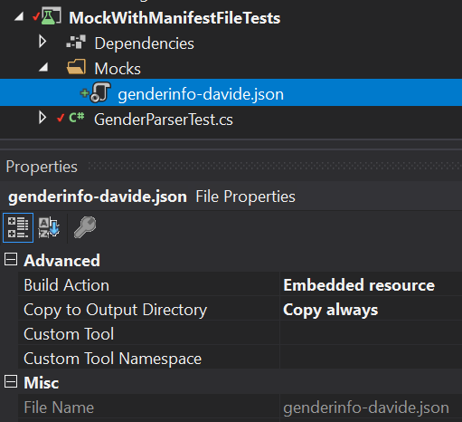
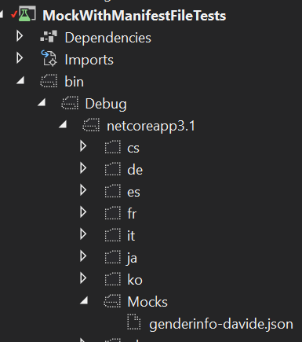

It happened that I needed to read a really complex JSON from an external API and elaborate it to adapt the result to my business needs.

To test the correctness of those elaborations, I obviously set up a test suite. But the object structure from that API was incredibly complex, with lots of dependencies between one field and another; these interdependencies refrained me from creating a mock object with libraries like [AutoFixture](https://github.com/AutoFixture/AutoFixture "AutoFixture on GitHub"), which creates objects by populating each field with a random value (but giving you the possibility populate its fields with predefined values).

Of course, I created unit tests to test the correctness of the single transformations, but I couldn't test the whole structure.

So I decided to use JSON files added to my test project and read them, in order to have the data exactly in the format I needed and, also, to run tests even when the API endpoint had problems, or the data values were changed.

In this article I'll simplify the API endpoint, replacing the real one with the Genderize API: it's the most simple API I found, so it's perfect for this demonstration.

## Setting up the services

Say that you have a service that, given a name, tells you the gender generally associated with it.

_Psst! If you are going to start an argument about how to consider genders and so on, just don't. This is just a demo, not a sociological paper_ 😊

```cs
public interface IGenderParser
{
    Task<GenderInfo> GetGenderInfo(string name);
}

public class GenderParser: IGenderParser
{
    public async Task<GenderInfo> GetGenderInfo(string name)
    {
        GenderInfo genderInfo = null;
        using (var httpClient = new HttpClient())
        {
            var data = await httpClient.GetStringAsync($"https://api.genderize.io/?name={name}");

            genderInfo = System.Text.Json.JsonSerializer.Deserialize<GenderInfo>(data);
        }
        return genderInfo;
    }
}
```

By parsing the result, we can get a GenderInfo object:

```cs
public class GenderInfo
{
    public string name { get; set; }
    public string gender { get; set; }
}
```

Now you can inject it within a class and use the GenderInfo result to print a message based on the gender:

```cs
public class MessageCreator : IMessageCreator
{
    private readonly IGenderParser gender;

    public MessageCreator(IGenderParser gender)
    {
        this.gender = gender;
    }

    public async Task<string> CreateMessage(string name)
    {
        var genderInfo = await gender.GetGenderInfo(name);
        return genderInfo.gender.Equals("male", System.StringComparison.OrdinalIgnoreCase) ? "Hey boy!" : "Hey girl!";
    }
}
```

_You already know how to use Dependency Injection, right? If not, and if you don't know the differences between Singleton, Scoped and Transient lifetimes, head to [Dependency Injection lifetimes in .NET - my epiphany](./dependency-injection-lifetimes "Dependency Injection lifetimes in .NET - my epiphany")!_

## Setting up the tests

It's time to test the MessageCreator class.

I've created a Test library using MSTest and installed [NSubstitute](https://github.com/nsubstitute/NSubstitute "NSubstitute on GitHub") via NuGet. This library allows us to mock libraries and create clearer tests.

```cs
[TestMethod]
public async Task TestWithObjectCreation_Male()
{
    // Arrange
    var fakeObject = new GenderInfo { name = "Davide", gender = "male" };

    var fakeGenderParser = Substitute.For<IGenderParser>();
    fakeGenderParser.GetGenderInfo(default).ReturnsForAnyArgs(fakeObject);

    var sut = new MessageCreator(fakeGenderParser);

    // Act
    var message = await sut.CreateMessage("Davide");

    //Assert
    Assert.AreEqual("Hey boy!", message);
}
```

Even if you've never used NSubstitute the steps are easy to understand, right?

_PSS: do you know that the MSTest framework has lots of useful methods besides the AreEqual? Check them out in [this article](/mstests-assert-overview "MSTest Assert class - an overview")_.

Now, say that instead of the GenderInfo object you need to mock a really complex object, maybe with nested properties, and cross-references between one field and another. You could instantiate that object field by field. Or you could store its JSON representation in a file and reference it.

## Creating manifest resources

**Manifest resources** are files strictly related to its assembly: when you build the library, those files will be copied into the build result.

As per Microsoft docs,

> A manifest resource is a resource (such as an image file) that is embedded in the assembly at compile time.

To create them using Visual Studio 2019, follow these steps:

1. create the file, even within a folder; my file is _Mocks\genderinfo-davide.json_
2. open its properties (_right-click > properties_ or _Alt+Enter_)
3. in the _Build Action_ field, set "Embedded resource"
4. in the _Copy to Output Directory_ field, set "Copy always" or "Copy if newer".



If you prefer editing manually the project, add this item to your project csproj file

```xml
<ItemGroup>
    <EmbeddedResource Include="Mocks\genderinfo-davide.json">
      <CopyToOutputDirectory>Always</CopyToOutputDirectory>
    </EmbeddedResource>
</ItemGroup>
```

Now, when you build your project, the embedded files will be automatically added in the _bin_ folder, maintaining the folder structure.



## Using manifest resources

When you want to get the list of embedded resources associated with the running assembly, you can rely on the _System.Reflection namespace_ and run `Assembly.GetExecutingAssembly().GetManifestResourceNames()`: this method returns an array of strings with the list of available files.

To read and parse the JSON file, you need to call the `GetManifestResourceStream` method and deserialize the returned stream into a GenderInfo object.

```cs
public async Task<GenderInfo> GetFakeGenderInfo()
{
    var fileName = "MockWithManifestFileTests.Mocks.genderinfo-davide.json";

    var stream = Assembly.GetExecutingAssembly()
        .GetManifestResourceStream(fileName);

    return await JsonSerializer.DeserializeAsync<GenderInfo>(stream, new JsonSerializerOptions
    {
        PropertyNameCaseInsensitive = true
    }).ConfigureAwait(false);
}
```

Have a look at the file name: **the file path is delimited by dots**, not slashes.

Now that you have that object, you can update the test:

```diff
- var fakeObject = new GenderInfo { name = "Davide", gender = "male" };
+ var fakeObject = await GetFakeGenderInfo();
```

That's it! You have created a fake object reading from a JSON file instead of populating all the object's fields manually.

If you want to look at the documentation for the GetManifestResourceStream method, just [go to the Microsoft Docs website](https://docs.microsoft.com/en-us/dotnet/api/system.reflection.assembly.getmanifestresourcestream?view=netcore-3.1#System_Reflection_Assembly_GetManifestResourceStream_System_String_ "GetManifestResourceStream documentation").

## Conclusion

Using embedded resources is useful both for unit and integration tests, it depends on your specific use case.
It helps you mock external dependencies, because if you use real data in your tests they can become unavailable or change: by using a static resource you can also version the files.

When you build your project, those files will be copied to the bin folder; this is helpful also for Continuous Integration pipelines, because when you run tests on an external agent you don't know the physical path, but you can easily reference files within the same folder (which is obviously the bin folder).

If you want to try it, here's a [GitHub repo](https://github.com/code4it-dev/MockWithManifestFile "MockWithManifestFile repository on GitHub").

Do you know other ways to achieve a similar result? Let me know!

Happy coding!
