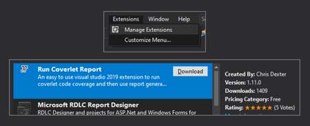
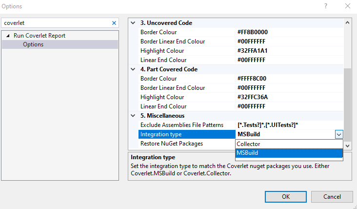
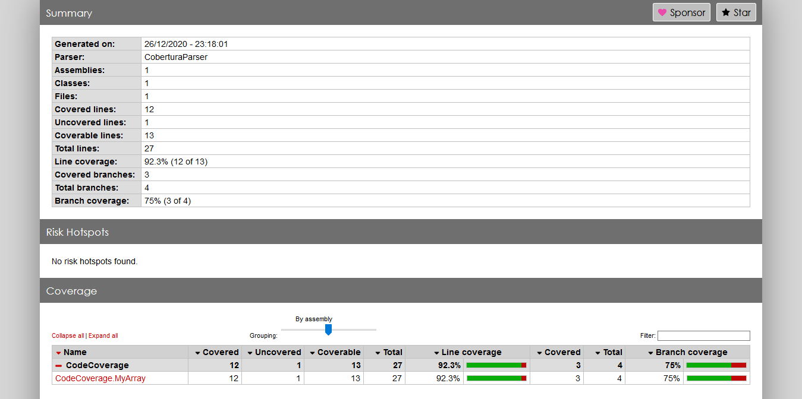
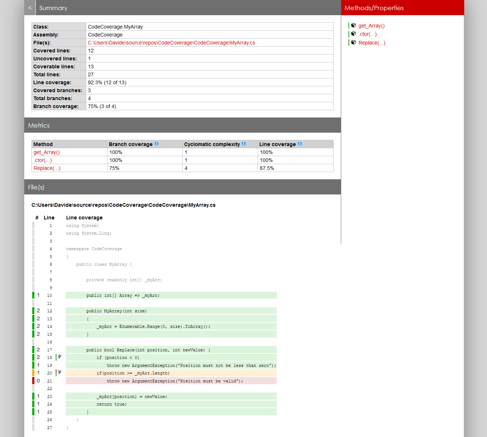
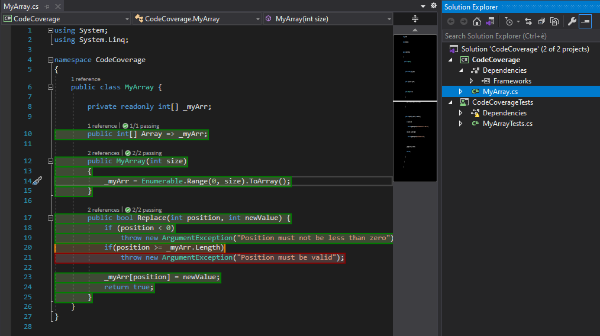

Having a high code coverage percentage boosts your confidence in your code: the more thoroughly your code is tested, the lesser are the possibilities to have bugs. Of course, You'll never have a bug-free project, that's utopian. But you can work toward reducing the possible bugs by testing each and every part of your code.

The term _code coverage_ represents the percentage of code covered by tests: it is calculated basing on two values: **line coverage**, which is about the exact count of lines covered, and **branch coverage** which is about the branches (if-else, switch, try-catch) that have been executed by our test suite.

In this article, we're gonna see how to calculate code coverage on .NET projects and how to visualize a Code Coverage report on Visual Studio 2019.

**Note: there's an update published on 2022-12-16, so don't skip that part!**

## Setting up a simple project

Let's create a class library with a single class with only one method:

```cs
public class MyArray {

    private readonly int[] _myArr;

    public int[] Array => _myArr;

    public MyArray(int size)
    {
        _myArr = Enumerable.Range(0, size).ToArray();
    }

    public bool Replace(int position, int newValue) {
        if (position < 0)
            throw new ArgumentException("Position must not be less than zero");

        if(position >= _myArr.Length)
            throw new ArgumentException("Position must be valid");

        _myArr[position] = newValue;
        return true;
    }
}
```

Then, we have to create a test class and write some tests for the `MyArray` class:

```cs
public class MyArrayTests
{
    [Test]
    public void MyArray_Should_ReplaceValue_When_PositionIsValid()
    {
        var arr = new MyArray(5);
        var result = arr.Replace(2, 99);

        Assert.IsTrue(result);
        Assert.AreEqual(99, arr.Array[2]);
    }

    [Test]
    public void MyArray_Should_ThrowException_When_PositionIsLessThanZero()
    {
        var arr = new MyArray(5);
        Assert.Throws<ArgumentException>(() => arr.Replace(-8, 0));
    }
}
```

The code and the tests are pretty straightforward; but have we really covered the `Replace` method with enough tests to be sure not to have missed something?

## Coverlet - the NuGet Package for code coverage

The first thing to do to add code coverage reports to our project is to install **Coverlet**, a NuGet package, whose documentation can be accessed [on GitHub](https://github.com/coverlet-coverage/coverlet "Coverlet project on GitHub").

You must add _Coverlet.msbuild_ **to every test project** in your solution. So, add it with the NuGet package manager or with the CLI, running the command `dotnet add package coverlet.msbuild`.

This package relies on the _MSBuild_ tool to collect code coverage data and statistics, and save them into a specific file that can be opened with other tools or applications.

## Installing code coverage collector on Visual Studio 2019

The next step is to install in Visual Studio an extension that, given the code coverage report, displays the result in a human-readable format.

The tool we're gonna use is [ReportGenerator](https://github.com/danielpalme/ReportGenerator "ReportGenerator on GitHub"), that provides support for projects based on .NET Core.

To install it, open the **PowerShell with admin privileges** and run the following commands:

```bash
dotnet tool install -g dotnet-reportgenerator-globaltool
dotnet tool install dotnet-reportgenerator-globaltool --tool-path tools
dotnet new tool-manifest
dotnet tool install dotnet-reportgenerator-globaltool
```

These commands install ReportGenerator alongside global .NET tools.

And now, it's time to install the actual Visual Studio extension.

The first step is to head to the _Extensions_ menu and select _Manage Extensions_.
Then, search _Run Coverlet Report_ and install it - you have to close all Visual Studio instances to install it.



Since we are integrating Coverlet with MSBuild, you have to head to _Tools > Options_ and change the _Integration Type_ from _Collector_ to _MSBuild_.



Once everything is installed (remember to install Coverlet in all and only test projects) there's only one thing to do: try them!

## Our first run

First of all, **run all of you tests for the first time**: this helps to initialize correctly all the references to the test projects. You must do this step only the first time.

Now, under the _Tools_ menu, click on _Run Code Coverage_: this command runs the tests, generates a report files and uses it to generate a full report like this:



Here we go! We have our code coverage report!

You can even drill down into details for each class to find out other the values for Branch Coverage, Line Coverage and Cyclomatic complexity.



For each class, you can see the details of the lines covered by tests. But if you are like me, you don't want to open each file to see what to do, but you'd like a way to see it directly in your IDE.

Well, just click on _Toggle Code Coverage Highlighting_ under the _Tools_ menu: you will see all the lines covered by tests in green, and all the ones that aren't covered by any tests in red.



This will help you speed up your development and find out possible bugs and flaws earlier.

_This article first appeared on [Code4IT 🐧](https://www.code4it.dev/)_

## Update 2022-12-16

Coverlet.MsBuild has some known bugs. **You should use Coverlet.Collector instead of Coverlet.MsBuild**, as stated [here](https://github.com/coverlet-coverage/coverlet/issues/859).

This means that you have to install another NuGet package, running `dotnet add package coverlet.collector`, and remove _coverlet.msbuild_.

Then you must head back to _Tools > Options_ and change the _Integration Type_ back from _MSBuild_ to _Collector_.

## Wrapping up

We've seen how easy it is to run code coverage on .NET Core projects.

The installation of the global tool and the extension needs to be done only the very first time. So the only thing to do when you want to see the code coverage report for your projects is to install _coverlet.msbuild_. Quite easy, uh?

Happy coding!
