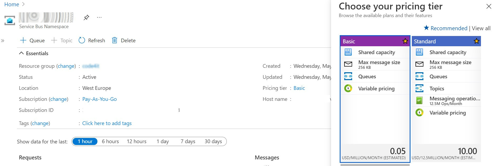
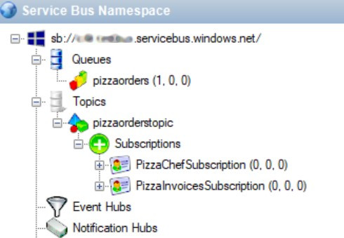
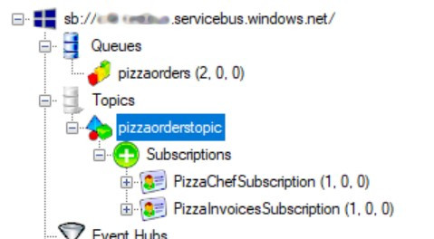

In the previous article, we've seen that with Azure Service Bus, the message broker provided by Microsoft, you can send messages in a queue in a way that the first application that receives it, also removes that message from the queue.

In this article, we're gonna see another capability of Azure Service Bus: _Topics_. **With topics, many different applications can read the same message from the Bus**; the message will be removed from the Bus only when every application has finished processing that message.

This is the second article in this series about Azure Service Bus:

1. [Introduction to Azure Service Bus](https://www.code4it.dev/blog/azure-service-bus-introduction "Introduction to Azure Service Bus")
2. Azure Service Bus: Queues vs Topics
3. [Handling Azure Service Bus errors with .NET](https://www.code4it.dev/blog/azure-service-bus-errors "Handling Azure Service Bus errors with .NET")

So, now, let's dive into Topics.

## Upgrading the Pricing Tier

Azure Service Bus comes with 3 pricing tiers:

- _Basic_: its price depends on how many messages you send. You only have Queues.
- _Standard_: similar to the Basic tier, but allows you to have both Queues and Topics.
- _Premium_: zone-redundant, with both Queues and Topics; of course, quite expensive.

To use Topics, we need to upgrade our subscription tier to _Standard_ or _Premium_.

Open Portal Azure, head to the resource details of the Queue and click on the Pricing Tier section.



Here, select the _Standard_ tier and save.

## Queue vs Topic

**Queues and Topics are similar**: when an application sends a message _somewhere_, a receiver on the other side reads it and performs some operations on the received message.

But there is a key difference between Queues and Topics. With Queues, the first receiver that _completes_ the reading of the message also removes it from the Queue so that the message cannot be processed by other readers.


With Topics, the message is removed only **after every receiver has processed the message**. Every Topic has one or more Subscribers, a _connection_ between the Topic itself and the applications. All the applications _subscribe_ to a specific _Subscription_, and receive messages only from it.

When the message is read from all the Subscribers, the message is removed from the Topic too.


## Subscriptions

As stated [on the official documentation](https://docs.microsoft.com/en-us/azure/service-bus-messaging/service-bus-queues-topics-subscriptions?wt.mc_id=DT-MVP-5005077#topics-and-subscriptions "Topics and subscription explanation on Microsoft docs"):

> A **topic subscription** resembles a virtual queue that receives copies of the messages that are sent to the topic. Consumers receive messages from a subscription identically to the way they receive messages from a queue.

This means that our applications do not access directly the Topic, as we would do if we were talking about Queues. Here we access the Subscriptions to get a copy of the message on the Topic. Once the same message has been removed from all the Subscriptions, the message is also removed from the Topic.

This is important to remember: when using Topics, **the Topic itself is not enough, you also need Subscriptions**.

## Create Topics and Subscriptions on Azure

Once we have upgraded our pricing plan to Standard, we can see the _Topic_ button available:


Click on that button, and start creating your Topic. It's simple, just choose its name and some optional info.

Then, navigate to the newly created Topic page and, on the _Entities_ panel on the right, click on _Subscriptions_. From here, you can manage the subscriptions related to the Topic.


Click on the _add_ button, fill the fields and... voilá! You are ready to go!

Of course, you can see all the resources directly on the browser. But, as I've explained in the previous article, I prefer another tool, **ServiceBusExplorer**, that you can [download from Chocolatey](https://community.chocolatey.org/packages/ServiceBusExplorer).

Open the tool, insert the connection string, and you'll see something like this:



What does this structure tell us?

Here we have a Queue, _pizzaorders_, which is the one we used in the previous example. Then we have a Topic: _pizzaorderstopic_. Linked to the Topic we have two Subscriptions: _PizzaChefSubscription_ and _PizzaInvoicesSubsciption_.

Our applications will send messages into the _pizzaorderstopic_ Topic and read them from the two Subscriptions.

## How to use Azure Service Bus Topics in .NET

For this article, we're gonna rework the code we've seen in the previous article.

Now we are gonna handle the pizza orders not only for the pizza chef but also for keeping track of the invoices.

### How to send a message in a Topic with CSharp

From the developer's perspective, sending messages on a Queue or a Topic is actually the same, so we can reuse the same code I showed in the previous article.

We still need to instantiate a new Sender and send a message through it.

```cs
ServiceBusSender sender = client.CreateSender(TopicName);

// create a message as string

await sender.SendMessageAsync(serializedContents);
```

Of course, we must use the Topic Name instead of the Queue name.

You can easily say that sending a message on a Topic is transparent to the client just by looking at the `CreateSender` signature:

```cs
public virtual ServiceBusSender CreateSender(string queueOrTopicName);
```

Now, if we run the application and order a new pizza, we will see that a new message is ready on the Topic, and it is waiting to be read from all the Subscriptions.



### How to receive a message from a Topic with CSharp

Now that the same message is available for both _PizzaChefSubscription_ and _PizzaInvoicesSubscription_, we need to write the code to connect to the subscriptions.

Again, it is similar to what we've seen for simple queues. We still need to instantiate a Receiver, but this time we have to specify the Topic name and the Subscription name:

```cs
ServiceBusClient serviceBusClient = new ServiceBusClient(ConnectionString);

_ordersProcessor = serviceBusClient.CreateProcessor(TopicName, SubscriptionName);
```

The rest of the code is the same.

As you see, we need only a few updates to move from a Queue to a Topic!

### Final result

To see what happens, I've created a clone of the _PizzaChef_ project, and I've named it _PizzaOrderInvoices_. Both projects reference the same Topic, but each of them is subscribed to its _Subscription_.

When receiving a message, the _PizzaChef_ projects prints it in this way:

```cs
string body = args.Message.Body.ToString();

var processedPizza = JsonSerializer.Deserialize<ProcessedPizzaOrder>(body);

Console.WriteLine($"Processing {processedPizza}");

await args.CompleteMessageAsync(args.Message);
```

and the _PizzaOrderInvoices_ performs the following operations:

```cs
string body = args.Message.Body.ToString();

var processedPizza = JsonSerializer.Deserialize<Pizza>(body);

Console.WriteLine($"Creating invoice for pizza {processedPizza.Name}");

await args.CompleteMessageAsync(args.Message);
```

Similar things, but with two totally unrelated clients.

So now, if we run all three applications and send a new request, we will see the same messages processed by both applications.


## Wrapping up

In this article, we've seen what are the differences between a Queue and a Topic when talking about Azure Service Bus.

As we've learned, you can insert a new message on a Queue or on a Topic in the same way. The main difference, talking about the code, is that to read a message from a Topic you have to subscribe to a Subscription.

Now that we've learned how to manage both Queues and Topics, we need to learn how to manage errors: and that will be the topic of the next article.

Happy coding!
