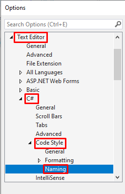
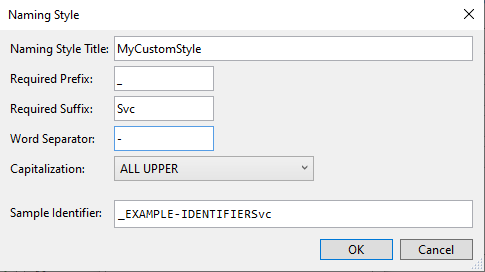

We, as developers, **hate** repetitive tasks, isn't it? In fact, we often auto-generate code by using our IDE's capabilities. Yet, sometimes the auto-generated code does not follow our team rules or our personal taste, so we have to rename stuff every single time.

For instance, say that your golden rule is to have your `readonly` properties named with a **\_** prefix: `private readonly IService _myService` instead of `private readonly IService myService`. Renaming the properties every time is... boring!

In this article, you will learn how to customize Visual Studio 2019 to get the most out of the auto-generated code. In particular, we will customize the names of the `readonly` properties generated when we add a dependency in a class constructor.

## The usual autocomplete

If you work properly, you do heavy use of Dependency Injection. And, if you do it, you will often define dependencies in a class' constructor.

Now, let's have two simple actors: a class, `MyService`, and an interface, `IMyDependency`. We want to inject the `IMyDependency` service into the `MyService` constructor.

```cs
public MyService(IMyDependency myDependency)
{

}
```

To store somewhere the reference to `IMyDependency`, you usually click on the lightbulb that appears on the left navigation or hit _CTRL+._ This command will prompt you with some actions, like creating and initializing a new field:


This automatic task then creates a `private readonly IMyDependency myDependency` and assigns to this value the dependency defined in the constructor.

```cs
private readonly IMyDependency myDependency;

public MyService(IMyDependency myDependency)
{
    this.myDependency = myDependency;
}
```

Now, let's say that we want our properties to have an underscore as a prefix: so we must manually rename `myDependency` to `_myDependency`. Ok, not that big issue, but we can still save some time just by avoiding doing it manually.

## Setting up the right configurations

To configure how automatic properties are generated, head to Visual Studio, and, in the top menu, navigate to _Tools_ and then _Options_.

Then, browse to Text Editor > C# > Code Style > Naming



Here we have all the symbols that we can customize.

The first thing to do is to **create a custom naming style**. On the right side of the options panel, click on the _"Manage naming styles"_ button, and then on the _"+"_ button. You will see a form that you can fill with your custom styles; the _Sample Identifier_ field shows you the result of the generated fields.

In the following picture you can see the result you can obtain if you fill all the fields: our properties will have a `_` prefix, an `Svc` suffix, the words will be separated by a `-` symbol, and the name will be uppercase. As a result, the property name will be `_EXAMPLE-IDENTIFIERSvc`



Since we're only interested in adding a `_` prefix and making the text in camelCase, well... just add those settings! And don't forget to specify a style name, like _\_fieldName_.

Close the form, and add a new Specification on the list: define that the new style must be applied to every _Private or Internal Field_, assign to it the newly created style (in my case, _\_fieldName_). And... we're done!


## Final result

Now that we have everything in place, we can try adding a dependency to our `MyService` class:


As you can see, now the generated property is named `_myDependency` instead of `myDependency`.

And the same happens when you instantiate a new instance of `MyService` and then you pass a new dependency in the constructor: Visual Studio automatically creates a new constructor with the missing dependency and assigns it to a `private` property (but, in this case, is not defined as `readonly`).


## Wrapping up

In this article, we've learned how to configure Visual Studio 2019 to create `private` properties in a custom format, like adding a prefix to the property name.

In my opinion, knowing the capabilities and possible customizations of your IDEs is one of the most underrated stuff. We spend most of our time working on an IDE - in my case, Visual Studio - so we should get to know it better to get the best from it and simplify our dev life.

Are there any other smart customizations that you want to share? Tell us about it in the comment section below!

So, for now, happy coding!

🐧
