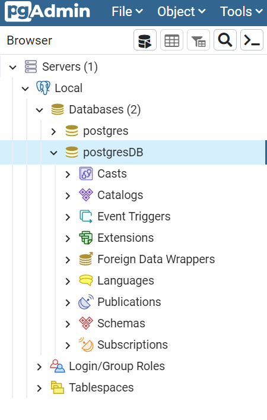
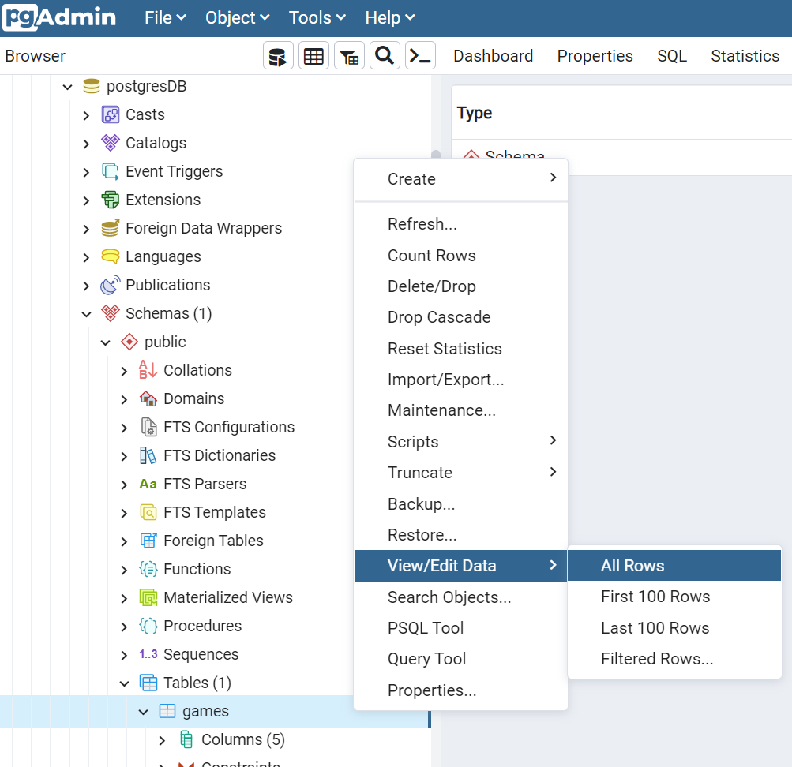
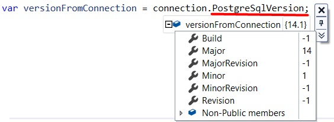

PostgreSQL is one of the most famous relational databases. It has got tons of features, and it is open source.

In a previous article, we've seen how to run an instance of Postgres by using Docker.

In this article, we will learn how to perform CRUD operations in C# by using Npgsql.

## Introducing the project

To query a Postgres database, I've created a simple .NET API application with CRUD operations.

We will operate on a single table that stores info for my board game collection. Of course, we will Create, Read, Update and Delete items from the DB (otherwise it would not be an article about CRUD operations 😅).

Before starting writing, we need to install **Npgsql**, a NuGet package that acts as a dataprovider for PostgreSQL.


## Open the connection

Once we have created the application, we can instantiate and open a connection against our database.

```cs
private NpgsqlConnection connection;

public NpgsqlBoardGameRepository()
{
    connection = new NpgsqlConnection(CONNECTION_STRING);
    connection.Open();
}
```

We simply create a `NpgsqlConnection` object, and we keep a reference to it. We will use that reference to perform queries against our DB.

### Connection string

The only parameter we can pass as input to the `NpgsqlConnection` constructor is the connection string.

You must compose it by specifying the host address, the port, the database name we are connecting to, and the credentials of the user that is querying the DB.

```cs
private const string CONNECTION_STRING = "Host=localhost:5455;" +
    "Username=postgresUser;" +
    "Password=postgresPW;" +
    "Database=postgresDB";
```

If you instantiate Postgres using Docker following the steps I described in a previous article, most of the connection string configurations we use here match the Environment variables we've defined before.

## CRUD operations

Now that everything is in place, it's time to operate on our DB!

We are working on a table, Games, whose name is stored in a constant:

```cs
private const string TABLE_NAME = "Games";
```

The _Games_ table consists of several fields:

| Field name      | Field type        |
| --------------- | ----------------- |
| id              | INTEGER PK        |
| Name            | VARCHAR NOT NULL  |
| MinPlayers      | SMALLINT NOT NULL |
| MaxPlayers      | SMALLINT          |
| AverageDuration | SMALLINT          |

This table is mapped to the `BoardGame` class:

```cs
public class BoardGame
{
    public int Id { get; set; }
    public string Name { get; set; }
    public int MinPlayers { get; set; }
    public int MaxPlayers { get; set; }
    public int AverageDuration { get; set; }
}
```

To double-check the results, you can use a UI tool to access the Database. For instance, if you use _pgAdmin_, you can find the list of databases running on a host.



And, if you want to see the content of a particular table, you can select it under Schemas>public>Tables>tablename, and then select View>AllRows



### Create

First things first, we have to insert some data in our DB.

```cs
public async Task Add(BoardGame game)
{
    string commandText = $"INSERT INTO {TABLE_NAME} (id, Name, MinPlayers, MaxPlayers, AverageDuration) VALUES (@id, @name, @minPl, @maxPl, @avgDur)";
    await using (var cmd = new NpgsqlCommand(commandText, connection))
    {
        cmd.Parameters.AddWithValue("id", game.Id);
        cmd.Parameters.AddWithValue("name", game.Name);
        cmd.Parameters.AddWithValue("minPl", game.MinPlayers);
        cmd.Parameters.AddWithValue("maxPl", game.MaxPlayers);
        cmd.Parameters.AddWithValue("avgDur", game.AverageDuration);

        await cmd.ExecuteNonQueryAsync();
    }
}
```

The `commandText` string contains the full command to be issued. In this case, it's a simple `INSERT` statement.

We use the `commandText` string to create a `NpgsqlCommand`object by specifying the query and the connection where we will perform that query. Note that the command must be Disposed after its use: wrap it in a `using` block.

Then, we will add the parameters to the query. `AddWithValue` accepts two parameters: the first is the name of the key, with the same name defined in the query, but without the `@` symbol; in the query, we use `@minPl`, and as a parameter, we use `minPl`.

**Never, never, create the query by concatenating the input params as a string**, to avoid SQL Injection attacks.

Finally, we can execute the query asynchronously with `ExecuteNonQueryAsync`.

### Read

Now that we have some games stored in our table, we can retrieve those items:

```cs
public async Task<BoardGame> Get(int id)
{
    string commandText = $"SELECT * FROM {TABLE_NAME} WHERE ID = @id";
    await using (NpgsqlCommand cmd = new NpgsqlCommand(commandText, connection))
    {
        cmd.Parameters.AddWithValue("id", id);

        await using (NpgsqlDataReader reader = await cmd.ExecuteReaderAsync())
            while (await reader.ReadAsync())
            {
                BoardGame game = ReadBoardGame(reader);
                return game;
            }
    }
    return null;
}
```

Again, we define the query as a text, use it to create a `NpgsqlCommand`, specify the parameters' values, and then we execute the query.

The `ExecuteReaderAsync` method returns a `NpgsqlDataReader` object that we can use to fetch the data. We update the position of the stream with `reader.ReadAsync()`, and then we convert the current data with `ReadBoardGame(reader)` in this way:

```cs
private static BoardGame ReadBoardGame(NpgsqlDataReader reader)
{
    int? id = reader["id"] as int?;
    string name = reader["name"] as string;
    short? minPlayers = reader["minplayers"] as Int16?;
    short? maxPlayers = reader["maxplayers"] as Int16?;
    short? averageDuration = reader["averageduration"] as Int16?;

    BoardGame game = new BoardGame
    {
        Id = id.Value,
        Name = name,
        MinPlayers = minPlayers.Value,
        MaxPlayers = maxPlayers.Value,
        AverageDuration = averageDuration.Value
    };
    return game;
}
```

This method simply reads the data associated with each column (for instance, `reader["averageduration"]`), then we convert them to their data type. Then we build and return a `BoardGame` object.

### Update

Updating items is similar to inserting a new item.

```cs
public async Task Update(int id, BoardGame game)
{
    var commandText = $@"UPDATE {TABLE_NAME}
                SET Name = @name, MinPlayers = @minPl, MaxPlayers = @maxPl, AverageDuration = @avgDur
                WHERE id = @id";

    await using (var cmd = new NpgsqlCommand(commandText, connection))
    {
        cmd.Parameters.AddWithValue("id", game.Id);
        cmd.Parameters.AddWithValue("name", game.Name);
        cmd.Parameters.AddWithValue("minPl", game.MinPlayers);
        cmd.Parameters.AddWithValue("maxPl", game.MaxPlayers);
        cmd.Parameters.AddWithValue("avgDur", game.AverageDuration);

        await cmd.ExecuteNonQueryAsync();
    }
}
```

Of course, the query is different, but the general structure is the same: create the query, create the Command, add parameters, and execute the query with `ExecuteNonQueryAsync`.

### Delete

Just for completeness, here's how to delete an item by specifying its id.

```cs
public async Task Delete(int id)
{
    string commandText = $"DELETE FROM {TABLE_NAME} WHERE ID=(@p)";
    await using (var cmd = new NpgsqlCommand(commandText, connection))
    {
        cmd.Parameters.AddWithValue("p", id);
        await cmd.ExecuteNonQueryAsync();
    }
}
```

Always the same story, so I have nothing to add.

## ExecuteNonQueryAsync vs ExecuteReaderAsync

As you've seen, some operations use `ExecuteNonQueryAsync`, while some others use `ExecuteReaderAsync`. Why?

`ExecuteNonQuery` and `ExecuteNonQueryAsync` execute commands against a connection. Those methods do not return data from the database, but only the number of rows affected. They are used to perform INSERT, UPDATE, and DELETE operations.

On the contrary, `ExecuteReader` and `ExecuteReaderAsync` are used to perform queries on the database and return a `DbDataReader` object, which is a read-only stream of rows retrieved from the data source. They are used in conjunction with SELECT queries.

## Bonus 1: Create the table if not already existing

Of course, you can also create tables programmatically.

```cs
public async Task CreateTableIfNotExists()
{
    var sql = $"CREATE TABLE if not exists {TABLE_NAME}" +
        $"(" +
        $"id serial PRIMARY KEY, " +
        $"Name VARCHAR (200) NOT NULL, " +
        $"MinPlayers SMALLINT NOT NULL, " +
        $"MaxPlayers SMALLINT, " +
        $"AverageDuration SMALLINT" +
        $")";

    using var cmd = new NpgsqlCommand(sql, connection);

    await cmd.ExecuteNonQueryAsync();
}
```

Again, nothing fancy: create the command text, create a `NpgsqlCommand` object, and execute the command.

## Bonus 2: Check the database version

To check if the database is up and running, and your credentials are correct (those set in the connection string), you might want to retrieve the DB version.

You can do it in 2 ways.

With the following method, you query for the version directly on the database.

```cs
public async Task<string> GetVersion()
{
    var sql = "SELECT version()";

    using var cmd = new NpgsqlCommand(sql, connection);

    var versionFromQuery = (await cmd.ExecuteScalarAsync()).ToString();

    return versionFromQuery;
}
```

This method returns lots of info that directly depend on the database instance. In my case, I see _PostgreSQL 14.1 (Debian 14.1-1.pgdg110+1) on x86_64-pc-linux-gnu, compiled by gcc (Debian 10.2.1-6) 10.2.1 20210110, 64-bit_.

The other way is to use `PostgreSqlVersion`.

```cs
public async Task<string> GetVersion()
{
    var versionFromConnection = connection.PostgreSqlVersion;

    return versionFromConnection;
}
```

`PostgreSqlVersion` returns a `Version` object containing some fields like `Major`, `Minor`, `Revision`, and more.



You can call the `ToString` method of that object to get a value like "14.1".

## Additional readings

In a previous article, we've seen how to download and run a PostgreSQL instance on your local machine using Docker.

🔗 [How to run PostgreSQL locally with Docker | Code4IT](https://www.code4it.dev/blog/run-postgresql-with-docker "Article on how to run Postgres with Docker")

To query PostgreSQL with C#, we used the Npsgql NuGet package. So, you might want to read the official documentation.

🔗 [Npgsql documentation | Npsgql](https://www.npgsql.org/doc/index.html "Npgsql official documentation")

In particular, an important part to consider is the mapping between C# and SQL data types:

🔗 [PostgreSQL to C# type mapping | Npsgql](https://www.npgsql.org/doc/types/basic.html "Mapping between PostgreSQL and C# data types")

When talking about parameters to be passed to the query, I mentioned the _SQL Injection_ vulnerability. Here you can read more about it.

🔗 [SQL Injection | Imperva](https://www.imperva.com/learn/application-security/sql-injection-sqli/ "A description of SQL Injection")

Finally, here you can find the repository used for this article.

🔗 [Repository used for this article | GitHub](https://github.com/code4it-dev/PostgresCrudOperations "GitHub repository used for this article")

_This article first appeared on [Code4IT 🐧](https://www.code4it.dev/)_

## Wrapping up

In this article, we've learned how to perform simple operations on a PostgreSQL database to retrieve and update the content of a table.

This is the most basic way to perform those operations. You explicitly write the queries and issue them without much stuff in between.

In future articles, we will see some other ways to perform the same operations in C#, but using other tools and packages. Maybe Entity Framework? Maybe Dapper? Stay tuned!

Happy coding!

🐧
