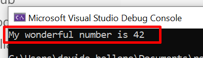
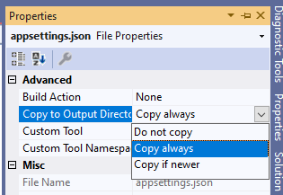
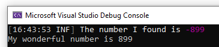

Sometimes, you just want to create a console application to run a complex script. Just because it is a "simple" console application, it doesn't mean that you should not use best practices, such as using Dependency Injection.

Also, you might want to test the code: Depencency Injection allows you to test the behavior of a class without having a strict dependency to the referenced concrete classes: you can use stubs and mocks, instead.

In this article, we're going to learn how to add Dependency Injection in a .NET 7 console application. The same approach can be used for other versions of .NET.

We're going to start small, with the basic parts, and gradually move on to more complex scenarios: configurations and logging.

We will use a simple, silly console application: we will inject a bunch of services, and print a message on console.

We have a root class:

```cs
public class NumberWorker
{
    private readonly INumberService _service;

    public NumberWorker(INumberService service) => _service = service;

    public void PrintNumber()
    {
        var number = _service.GetPositiveNumber();
        Console.WriteLine($"My wonderful number is {number}");

    }
}
```

that injects an `INumberService`, implemented by `NumberService`:

```cs
public interface INumberService
{
    int GetPositiveNumber();
}

public class NumberService : INumberService
{
    private readonly INumberRepository _repo;

    public NumberService(INumberRepository repo) => _repo = repo;

    public int GetPositiveNumber()
    {
        int number = _repo.GetNumber();
        return Math.Abs(number);
    }
}
```

which, in turn, uses an `INumberRepository` implemented by `NumberRepository`:

```cs
public interface INumberRepository
{
    int GetNumber();
}

public class NumberRepository : INumberRepository
{
    public int GetNumber()
    {
        return -42;
    }
}
```

Now, we have to build the dependency tree and inject such services.

## How to create an IHost to use a host for a Console Application

The first step to take is to install some NuGet packages that will allow us to add a custom `IHost` container, so that we can add Dependency Injection and all the customization we usually add in projects that have a StartUp (or a Program) class, such as .NET APIs.

We need to install 2 NuGet packages: *Microsoft.Extensions.Hosting.Abstractions* and *Microsoft.Extensions.Hosting* will be used to create a new `IHost` that will be used to build the dependencies tree.

By navigating your csproj file, you should be able to see something like this:

```xml
<ItemGroup>
    <PackageReference Include="Microsoft.Extensions.Hosting" Version="7.0.1" />
    <PackageReference Include="Microsoft.Extensions.Hosting.Abstractions" Version="7.0.0" />
</ItemGroup>
```

Now we are ready to go! First, add the following `using` statements:

```cs
using Microsoft.Extensions.DependencyInjection;
using Microsoft.Extensions.Hosting;
```

and then, within the Program class, add this method:

```cs
private static IHost CreateHost() => 
  Host.CreateDefaultBuilder()
      .ConfigureServices((context, services) =>
      {
          services.AddSingleton<INumberRepository, NumberRepository>();
          services.AddSingleton<INumberService, NumberService>();
      })     
      .Build();
}
```

`Host.CreateDefaultBuilder()` creates the default `IHostBuilder` - similar to the `IWebHostBuilder`, but without any reference to web components.

Then we add all the dependencies, using `services.AddSingleton<T, K>`. **Notice** that it's not necessary to add `services.AddSingleton<NumberWorker>`: when we will use the concrete instance,  the dependency tree will be resolved, without the need of having indication of the root itself.

Finally, once we have everything in place, we call `Build()` to create a new instance of `IHost`.

Now, we have to run it!

In the `Main` method, create the host by calling `CreateHost()`. Then, by using the `ActivatorUtilities` class (coming from the *Microsoft.Externsions.DependencyInjection* namespace), create a new instance of `NumberWorker`, so that you can call `PrintNumber()`;

```cs
private static void Main(string[] args)
{
  IHost host = CreateHost();
  NumberWorker worker = ActivatorUtilities.CreateInstance<NumberWorker>(host.Services);
  worker.PrintNumber();
}
```

Now you are ready to run the application, and see the message on console:




## Read configurations from appSettings

Now we want to make our system configurable, and place our configurations in an *appsettings.json* file.

As we saw in a recent article, we can use `IOptions<T>` to inject configurations in the constructor. For the sake of this article, I'm gonna use a new class, `NumberConfig`, that is mapped to a configuration section and injected into the classes.

```cs
public class NumberConfig
{
    public int DefaultNumber { get; set; }
}
```

Now we need to **manually create an appsettings.json file** within the project folder, and add a new section that will hold the values of the configuration:

```json
{
  "Number": {
    "DefaultNumber": -899
  }
}
```

and now we can the configuration binding in our `CreateHost()` method, within the `ConfigureServices` section:

```cs
services.Configure<NumberConfig>(context.Configuration.GetSection("Number"));
```

Finally, we can update the `NumberRepository` to accept the configurations in input and use them to return the value:

```cs
public class NumberRepository : INumberRepository
{
    private readonly NumberConfig _config;

    public NumberRepository(IOptions<NumberConfig> options) => _config = options.Value;

    public int GetNumber() => _config.DefaultNumber;
}
```

Now run the project to admire the result, and... BOOM! It will not work! You should see the message "My wonderful number is 0", even though the number we set on the config file is -899.

This happens because we must include the appsettings file in the result of the compilation. Right-click on the file, select the Properties menu, and set the "Copy to Output Directory" to "Copy always": 



Now, build and run the project, and you'll be able to see the correct message: "My wonderful number is 899".

Clearly, the same values can be accessed via `IConfigurations`.

## Add Serilog logging

Finally, we can add Serilog logs to our console applications - as well as defining Sinks.

To add Serilog, you first have to install these NuGet packages:

* *Serilog.Extensions.Hosting* and *Serilog.Formatting.Compact* to add the basics of Serilog;
* *Serilog.Settings.Configuration* to read logging configurations from settings;
* *Serilog.Sinks.Console* and *Serilog.Sinks.File* to add the Console and the File System as Sinks.

Let's get back to the `CreateHost()` method, and add a new section right after `ConfigureServices`:

```cs
.UseSerilog((context, services, configuration) => configuration
    .ReadFrom.Configuration(context.Configuration)
    .ReadFrom.Services(services)
    .Enrich.FromLogContext()
    .WriteTo.Console()
    .WriteTo.File($"report-{DateTimeOffset.UtcNow.ToString("yyyy-MM-dd-HH-mm-ss")}.txt", restrictedToMinimumLevel: LogEventLevel.Warning)
    )
```

Here we're telling that we need to read config from Settings, add logging context, and write both on Console and on File (only if the log message is greater than Warning).

Then, add an `ILogger` here and there, and admire the final result:





## Final result

To wrap up, here's the final implementation of the Program class and the 
CreateHost method:


```cs
private static void Main(string[] args)
{
    IHost host = CreateHost();
    NumberWorker worker = ActivatorUtilities.CreateInstance<NumberWorker>(host.Services);
    worker.PrintNumber();
}

private static IHost CreateHost() => 
  Host
  .CreateDefaultBuilder()
  .ConfigureServices((context, services) =>
  {
      services.Configure<NumberConfig>(context.Configuration.GetSection("Number"));

      services.AddSingleton<INumberRepository, NumberRepository>();
      services.AddSingleton<INumberService, NumberService>();
  })
  .UseSerilog((context, services, configuration) => configuration
      .ReadFrom.Configuration(context.Configuration)
      .ReadFrom.Services(services)
      .Enrich.FromLogContext()
      .WriteTo.Console()
      .WriteTo.File($"report-{DateTimeOffset.UtcNow.ToString("yyyy-MM-dd-HH-mm-ss")}.txt", restrictedToMinimumLevel: LogEventLevel.Warning)
      )
  .Build();
```

 
## Further readings

_This article first appeared on [Code4IT 🐧](https://www.code4it.dev/)_


## Wrapping up


I hope you enjoyed this article! Let's keep in touch on [Twitter](https://twitter.com/BelloneDavide) or [LinkedIn](https://www.linkedin.com/in/BelloneDavide/)! 🤜🤛

Happy coding!

🐧


[ ] Titoli

[ ] Grammatica

[ ] Bold/Italics

[ ] Alt Text per immagini

[ ] Frontmatter

[ ] Nome cartella e slug devono combaciare

[ ] Immagine di copertina
