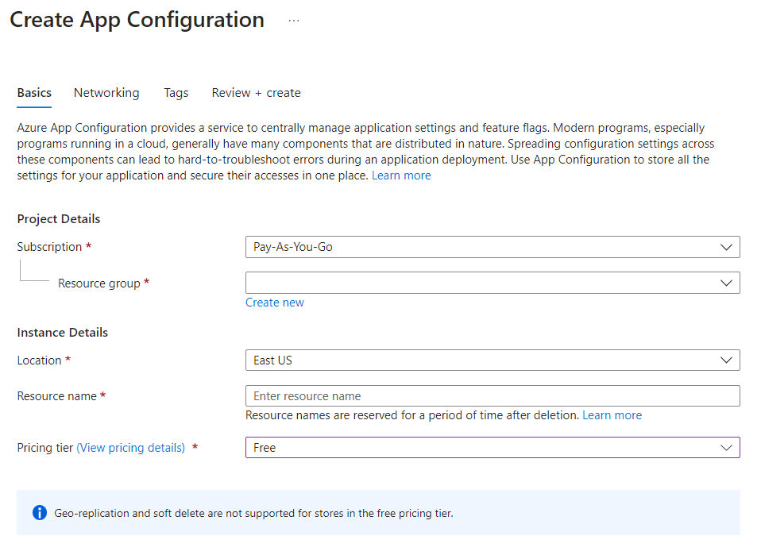
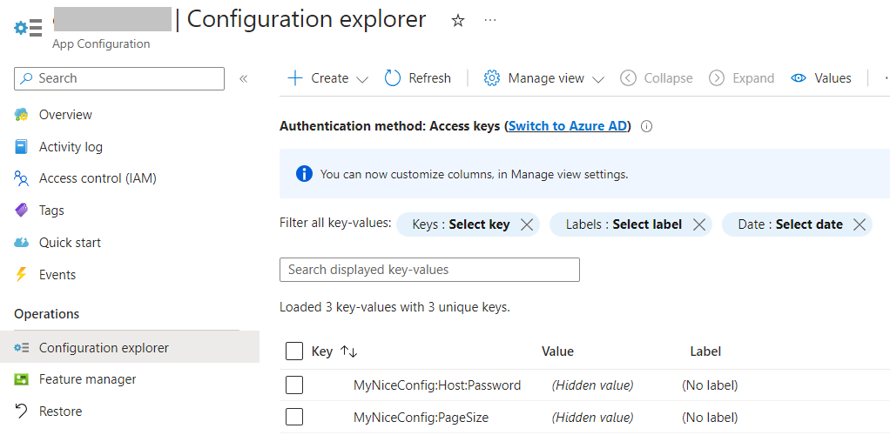

Almost every application requires some sort of configuration: connection strings, default values, and so on.

It's not a good practice to keep all the configurations in your codebase: if your code leaks online, you'll have all your connection strings, private settings, and API keys exposed online.

In previous articles, we've learned [how to set up configurations in a .NET application](https://www.code4it.dev/blog/how-to-set-configurations-values-dotnet/), as well as [how to access them in our code using the IOptions](https://www.code4it.dev/blog/ioptions-ioptionsmonitor-ioptionssnapshot/) family.

In this article, we're gonna **make our application more secure** by moving our configurations to the cloud and using Azure App Configurations to securely use such configs in our applications.

But first, as always, we need a dummy project to demonstrate such capabilities.

I created a simple .NET 7 API project with just one endpoint, _/ConfigDemo_, that returns the values from the settings.

In the _appsettings.json_ file I have these values:

```json
{
  "MyNiceConfig": {
    "PageSize": 6,
    "Host": {
      "BaseUrl": "https://www.mydummysite.com",
      "Password": "123-go"
    }
  }
}
```

These values are mapped to a `MyConfig` class:

```cs
public class MyConfig
{
    public int PageSize { get; set; }
    public MyHost Host { get; set; }
}

public class MyHost
{
    public Uri BaseUrl { get; set; }
    public string Password { get; set; }
}
```

by using this instruction in the `Program` class.

```cs
builder.Services.Configure<MyConfig>(builder.Configuration.GetSection("MyNiceConfig"));
```

Finally, the API Controller just returns the value

```cs
[ApiController]
[Route("[controller]")]
public class ConfigDemoController : ControllerBase
{
    private readonly IOptions<MyConfig> _config;

    public ConfigDemoController(IOptions<MyConfig> config)
        => _config = config;

    [HttpGet()]
    public IActionResult Get()
    {
        return Ok(_config.Value);
    }
}
```

As you can see, it's all pretty straightforward. We can call the endpoint and see the exact same values that are present in our _appsettings_ file.


## How to create an Azure App Configuration instance

Now we can move to the cloud ☁

First of all, head to the [Azure Portal](https://portal.azure.com/) and **create a new App Configuration instance**.

You will be asked to specify the subscription and the resource group, and also to specify the instance location and name.

Finally, you can pick the best Pricing Tier for you:

- **Free**: well, it's free, but with fewer capabilities;
- **Standard**: you pay to have Geo-replication and the possibility to recover deleted configurations.



I will choose the Free tier, and complete the resource creation.

After a while, you will finally see the resource overview with its basics info:


Now we can **update our configurations**. As you recall, the settings structure is:

```json
{
  "MyNiceConfig": {
    "PageSize": 6,
    "Host": {
      "BaseUrl": "https://www.mydummysite.com",
      "Password": "123-go"
    }
  }
}
```

We want to update the page size and the password. Locate _Configuration Explorer_ in the left menu, click on Create, and add a new value for each configuration. Remember: **nested configurations can be defined using the `:` sign**: to update the password, the key must be `MyNiceConfig:Host:Password`. Important: **do not set labels or tags**, for now: they are advanced topics, and require some additional settings that we will probably explore in future articles.

Once you've overridden both values, you should be able to see something like this:



## How to integrate Azure App Configuration in a .NET application

Now we are ready to integrate Azure App Configuration with our .NET APIs.

First things first: we must install the _Microsoft.Azure.AppConfiguration.AspNetCore_ NuGet Package:


Then, we need to find a way to connect to our App Configuration instance. There are two ways: using Azure Active Directory (Azure AD) or using a simple **Access Key**. We're gonna use the latter.

Get back to Azure, and locate the Access Keys menu item. Then head to Read-only keys, and copy the full connection string.


**Do NOT store it on your repository!** There are smarter, more secure ways to store use such connection strings:

- **Environment variables**: for example, run the application with `dotnet run --MYKEY=<your_connection_string>`;
- **launchsettings.json key**: you can use different configurations based on the current profile;
- **secrets store**: hidden values only available on your machine. Can be set using `dotnet user-secrets set MyKey "<your_connection_string>"`;
- **pipeline configurations**: you can define such values in your CI/CD pipelines;

But still, for the sake of this example, I will store the connection string in a local variable 😁

```cs
const string ConnectionString = "Endpoint=https://<my-host>.azconfig.io;Id=<Id>;Secret=<Secret>";
```

Now, integrating the remote configurations is just a matter of adding one instruction:

```cs
builder.Configuration.AddAzureAppConfiguration(ConnectionString);
```

You can now run the APIs and call the previous endpoint to see the new results


## Why should you use Azure App Configuration?

In my opinion, having a proper way to handle configurations is crucial for the success of a project.

Centralizing configurations can be useful in three different ways:

1. **Your application is more secure** since you don't risk having the credentials exposed on the web;
2. You can **share configurations across different services**: say that you have 4 services that access the same external APIs that require a Client Secret. Centralizing the config helps in having consistent values across the different services and, for example, updating the secret for all the applications in just one place;
3. Use **different configs based on the environment**: with Azure App Configuration you can use a set of tags and labels to determine which configs must be loaded in which environment. This simplifies a lot the management of configurations across different environments.

But notice that, using the basic approach that we used in this article, configurations coming from Azure are loaded at the startup of the application: **configs are static until you restart the application**. You can configure your application to **poll Azure App Configuration** to always have the most updated values without the need of restarting the application, but it will be the topic of a future article.

## Further readings

Configuration management is one of the keys to the success of a project: if settings are difficult to manage and difficult to set locally for debugging, you'll lose a lot of time (true story! 😩).

However, there are several ways to set configurations for a .NET application, such as Environment Variables, launchSettings, and so on.

🔗 [3 (and more) ways to set configuration values in .NET | Code4IT](https://www.code4it.dev/blog/how-to-set-configurations-values-dotnet/)

_This article first appeared on [Code4IT 🐧](https://www.code4it.dev/)_

Also, handling config in a smart way is easy, if you know what to do. You can follow some best practices.

🔗[Azure App Configuration best practices | Microsoft Docs](https://learn.microsoft.com/en-us/azure/azure-app-configuration/howto-best-practices)

## Wrapping up

In this article, we've learned a smart way to handle configurations using Azure App Configuration.

This product can be used for free, but, of course, with limitations.

In a future article, we will learn how to make those configurations dynamic so that you can apply updates without restarting the applications.

I hope you enjoyed this article! Let's keep in touch on [Twitter](https://twitter.com/BelloneDavide) or [LinkedIn](https://www.linkedin.com/in/BelloneDavide/)! 🤜🤛

Happy coding!

🐧
