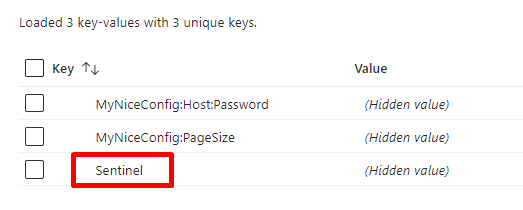
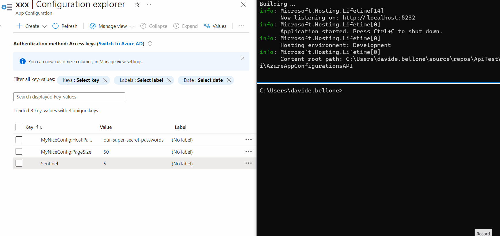

In a previous article, we've learned how to centralize configurations using Azure App Configuration, a service provided by Azure to handle configurations accessible in a secure way. Using Azure App Configuration, you'll be able to store the most critical configurations in a single place and apply them to one or more projects.

We've also learned that, to make changes effective, you have to restart your applications. This way, ASP.NET connects to Azure App Config, loads the configurations in memory, and serves these config until the next application restart.

In this article, we're gonna learn how to make configurations dynamic: by the end of this article, we will be able to apply changes to our application configurations without having to restart the applications. 

## Recap previous article

Since this is a kind of improvement of [the previous article](https://www.code4it.dev/blog/azure-app-configuration-dotnet-api/), you should read it first.

But let me summarize here the code showcased in the previous article. We have a .NET API application whose only purpose is to return the configurations stored in an object, whose shape is this one:

```json
{
  "MyNiceConfig": {
    "PageSize": 6,
    "Host": {
      "BaseUrl": "https://www.mydummysite.com",
      "Password": "123-go"
    }
  }
}
```

In the constructor of the API controller, I injected an `IOptions<MyConfig>` instance that holds the current data of stored in the application.

```cs
 public ConfigDemoController(IOptions<MyConfig> config)
        => _config = config;
```

The only HTTP Endpoint is a GET, and just accesses that value and returns it to the caller.

```cs
[HttpGet()]
public IActionResult Get()
{
    return Ok(_config.Value);
}
```

Finally, I created a new instance of Azure App Configuration, and stored the connection string in a variable (I know, you must not do that in a real project!). Then, I used that connection string to integrate Azure App Configuration with the existing configurations by calling:

```cs
builder.Configuration.AddAzureAppConfiguration(ConnectionString);
```

Now we can move on and make configurations dynamic.

## Sentinel

On Azure App Configuration, you have to update the configurations manually one by one. Unfortunately, there is no way to update them in a batch.

Imagine that you have a service that accesses an external API whose BaseUrl and API Key are stored on Az App Configuration. We now have to move to another API: we then have to update both BaseUrl and API Key.

The application is running, and we want to update the info about the external API. If we update the application configurations every time something is updated on Az App Configuration, we will end up with an invalid state - new BaseUrl with old API Key.

We have to define a configuration value that acts as a versioning key of the whole list of configurations. In Az App Configuration's jargon, it's called *Sentinel*.

**A Sentinel is nothing but version discerning**: it's a string value that is used by the application to understand if it needs to reload the whole list of configurations. Since it's just a string, you can set any value, as long as it changes over time. **My suggestion is to use the UTC date value** of the moment you have updated the value, such as 202306051522. This way, in case of errors you can understand when was the last time any of these values have changed (but, clearly, you won't know which values have changed).

So, head back to the Configuration Explorer page and add a new value: I called it Sentinel.



## Setting dynamic configuration on .NET 

We can finally move to the code!

If you recall, in the previous article we added a NuGet package, *Microsoft.Azure.AppConfiguration.AspNetCore*, and we added Azure App Configuration as a source by calling

```cs
builder.Configuration.AddAzureAppConfiguration(ConnectionString);
```

That instruction is used to load all the configurations, without managing polling and updates. Therefore, we must remove it.

Instad of that instruction, add this one:

```cs
builder.Configuration.AddAzureAppConfiguration(options =>
{
    options
    .Connect(ConnectionString) 
    .Select(KeyFilter.Any, LabelFilter.Null)
    // Configure to reload configuration if the registered sentinel key is modified
    .ConfigureRefresh(refreshOptions =>
              refreshOptions.Register("Sentinel", label: LabelFilter.Null, refreshAll: true)
        .SetCacheExpiration(TimeSpan.FromSeconds(3))
      );
});
```

Let's deep dive into each part:

`options.Connect(ConnectionString)` just tells .NET that the configurations must be loaded from that specific connection string.

`.Select(KeyFilter.Any, LabelFilter.Null)` loads all keys that have no Label;

and, finally, the most important part:

```cs
.ConfigureRefresh(refreshOptions =>
            refreshOptions.Register(key: "Sentinel", label: LabelFilter.Null, refreshAll: true)
      .SetCacheExpiration(TimeSpan.FromSeconds(3))
    );
```

Here we are specifying that all values (`refreshAll: true`) must be refreshed when the key with value="Sentinel" (`key: "Sentinel"`) is updated. Then, store those values for 3 seconds (`SetCacheExpiration(TimeSpan.FromSeconds(3)`).

Here I used 3 seconds as a refresh time. This means that, if the application is used continuously, the application will poll Azure App Configuration every 3 seconds - it's clearly a bad idea! So, pick the correct value depending on the change expectations. By the way, the **default value is 30 seconds**.

Notice that the previous instruction adds Azure App Configuration to the `Configuration` object, and not as a service used by .NET. In fact, the method is `builder.Configuration.AddAzureAppConfiguration`. We need two more steps.

First of all, add Azure App Configuration to the `IServiceCollection` object:

```cs
builder.Services.AddAzureAppConfiguration();
```

Finally, we have to add it to our middlewares by calling

```cs
app.UseAzureAppConfiguration();
```

The final result is this:

```cs
public static void Main(string[] args)
{
    var builder = WebApplication.CreateBuilder(args);

    const string ConnectionString = "......";

    // Load configuration from Azure App Configuration
    builder.Configuration.AddAzureAppConfiguration(options =>
    {
        options.Connect(ConnectionString)
                .Select(KeyFilter.Any, LabelFilter.Null)
                // Configure to reload configuration if the registered sentinel key is modified
                .ConfigureRefresh(refreshOptions =>
                    refreshOptions.Register(key: "Sentinel", label: LabelFilter.Null, refreshAll: true)
                    .SetCacheExpiration(TimeSpan.FromSeconds(3)));
    });

    // Add the service to IServiceCollection
    builder.Services.AddAzureAppConfiguration();

    builder.Services.AddControllers();
    builder.Services.Configure<MyConfig>(builder.Configuration.GetSection("MyNiceConfig"));

    var app = builder.Build();

    // Add the middleware
    app.UseAzureAppConfiguration();

    app.UseHttpsRedirection();

    app.MapControllers();

    app.Run();
}
```


## IOptionsMonitor

It's time to run the project and look at the result: some keys are coming from Azure App Configuration.


Now we can update them: **without restarting the application**, update the PageSize value, and update also the Sentinel. Call again the endpoint, and... nothing happens!

This is because in our controller we are using `IOptions<T>` instead of `IOptionsMonitor<T>`. As we've learned in a previous article, `IOptionsMonitor<T>` is a singleton instance that always gets the most updated config values. It also emits an event when the configurations have been refreshed.

So, head back to the `ConfigDemoController`, and replace the way we retrieve the config:

```cs
[ApiController]
[Route("[controller]")]
public class ConfigDemoController : ControllerBase
{
    private readonly IOptionsMonitor<MyConfig> _config;

    public ConfigDemoController(IOptionsMonitor<MyConfig> config)
    {
        _config = config;
        _config.OnChange(Update);
    }

    [HttpGet()]
    public IActionResult Get()
    {
        return Ok(_config.CurrentValue);
    }

    private void Update(MyConfig arg1, string? arg2)
    {
      Console.WriteLine($"Configs have been updated! PageSize is {arg1.PageSize}, " +
                $" Password is {arg1.Host.Password}");
    }
}
```

When using `IOptionsMonitor<T>`, you can retrieve the current values of the configuration object by accessing the `CurrentValue` property. Also, you can define an event listener that to be attached to the `OnChange` event;

We can finally run the application and update the values on Azure App Configuration.

Again, update the one of the values, update the sentinel, and wait. After 3 seconds, you'll see a message popping up in the console: it's the text defined in the `Update` method.

Then, call again the application (again, without restarting it), and admire the updated values!

You can see a live demo here:



As you can see, the first time after updating the Sentinel value, the values are still the old one. But, in the meantime, the values have been updated, the cache has expired, so that the next time the values will be retrieved from Azure. 

## My 2 cents on timing

As we've learned, the config values are stored in a memory cache, with an expiration time. Every time the cache expires, we need to retrieve again the configurations from Azure App Configuration (in particular, by checking if the Sentinel value has been updated in the meanwhile). **Don't understestimate the cache value**, as there are pros and cons of each kind of value:

* a **short timespan** keeps the **values always up-to-date**, making your application more reactive to changes. But it also mean that you are **polling too often** the Azure App Configuration endpoints, making your application a busier and incurring on limitations due to the requests count;
* a **long timespan**, on the contrary, keeps your application more reactive because there are fewer requests to the Configuration endpoints, but it also forces you to have the configurations updated after a while from the update applied on Azure.

There is also another issue with long timespans: if the same configurations are used by different services, you might incur in an incoherent state. Say that you have UserService and PaymentService, and both use some configurations stored on Azure whose caching expiration is 10 minutes. Now, the following actions happen:

1. UserService starts
2. PaymentService starts
3. Someone updates the values on Azure
4. UserService restarts, while PaymentService don't.

We will end up in a situation where UserService has the most updated values, while PaymentService doesn't. 

So, think thoroughly before choosing an expiration time!

## Further readings

This article is a continuation of a previous one, and I suggest you read the other one to understand how to set up Azure App Configuration and how to integrate it in a .NET API application in case you don't want to use dynamic configuration.

🔗 [Azure App Configuration and .NET API: a smart and secure way to manage configurations | Code4IT](https://www.code4it.dev/blog/azure-app-configuration-dotnet-api/)

_This article first appeared on [Code4IT 🐧](https://www.code4it.dev/)_

Also, we learned tha using `IOptions` stops us from getting the most updated values: in fact, we need to use `IOptionsMonitor`. Check out this article to understand the other differences in the `IOptions` family.

🔗 [Understanding IOptions, IOptionsMonitor, and IOptionsSnapshot in .NET 7 | Code4IT](https://www.code4it.dev/blog/ioptions-ioptionsmonitor-ioptionssnapshot/)

## Wrapping up

As I always say, a smart configuration handling is essential for the hard times when you have to understand why a error is happening only in a specific environment.

Centralizing configurations is a good idea, as it allows developers to simulate a whole environment by just changing a few values on the application.

I hope you enjoyed this article! Let's keep in touch on [Twitter](https://twitter.com/BelloneDavide) or [LinkedIn](https://www.linkedin.com/in/BelloneDavide/)! 🤜🤛

Happy coding!

🐧


[ ] Titoli
[ ] Frontmatter
[ ] Rinomina immagini
[ ] Alt Text per immagini
[ ] Grammatica
[ ] Bold/Italics
[ ] Nome cartella e slug devono combaciare
[ ] Immagine di copertina
[ ] Rimuovi secrets dalle immagini
[ ] Pulizia formattazione
