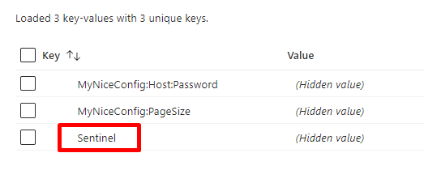
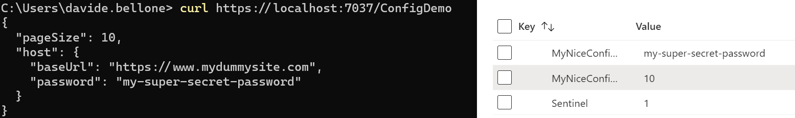
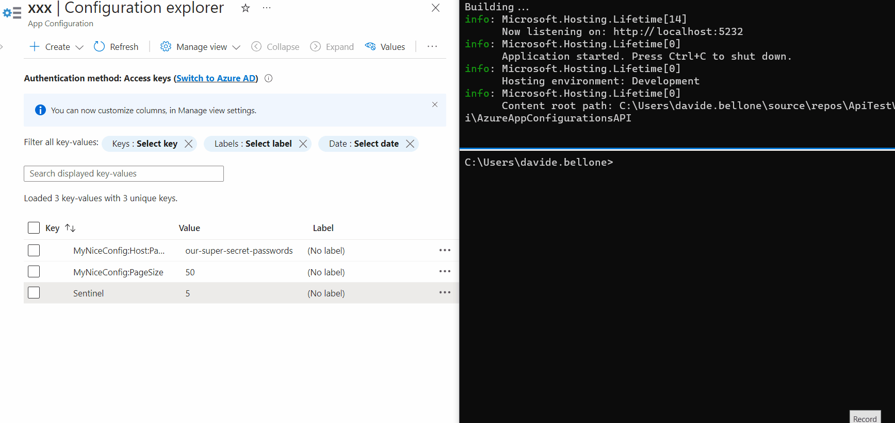

In a previous article, we learned how to centralize configurations using Azure App Configuration, a service provided by Azure to share configurations in a secure way. Using Azure App Configuration, you'll be able to store the most critical configurations in a single place and apply them to one or more environments or projects.

We used a very simple example with a limitation: you have to restart your applications to make changes effective. In fact, ASP.NET connects to Azure App Config, loads the configurations in memory, and serves these configs until the next application restart.

In this article, we're gonna learn **how to make configurations dynamic**: by the end of this article, we will be able to see the changes to our configs reflected in our applications without restarting them.

Since this one is a kind of improvement of [the previous article](https://www.code4it.dev/blog/azure-app-configuration-dotnet-api/), you should read it first.

Let me summarize here the code showcased in the previous article. We have an ASP.NET Core API application whose only purpose is to return the configurations stored in an object, whose shape is this one:

```json
{
  "MyNiceConfig": {
    "PageSize": 6,
    "Host": {
      "BaseUrl": "https://www.mydummysite.com",
      "Password": "123-go"
    }
  }
}
```

In the constructor of the API controller, I injected an `IOptions<MyConfig>` instance that holds the current data stored in the application.

```cs
 public ConfigDemoController(IOptions<MyConfig> config)
        => _config = config;
```

The only HTTP Endpoint is a GET: it just accesses that value and returns it to the client.

```cs
[HttpGet()]
public IActionResult Get()
{
    return Ok(_config.Value);
}
```

Finally, I created a new instance of Azure App Configuration, and I used a connection string to integrate Azure App Configuration with the existing configurations by calling:

```cs
builder.Configuration.AddAzureAppConfiguration(ConnectionString);
```

Now we can move on and make configurations dynamic.

## Sentinel values: a guard value to monitor changes in the configurations

On Azure App Configuration, you have to update the configurations manually one by one. Unfortunately, there is no way to update them in a single batch. You can [import them in a batch](https://learn.microsoft.com/en-us/azure/azure-app-configuration/concept-config-file?wt.mc_id=DT-MVP-5005077), but you have to update them singularly.

Imagine that you have a service that accesses an external API whose BaseUrl and API Key are stored on Az App Configuration. We now need to move to another API: we then have to update both BaseUrl and API Key. The application is running, and we want to update the info about the external API. If we updated the application configurations every time something is updated on Az App Configuration, we would end up with an invalid state - for example, we would have the new BaseUrl and the old API Key.

Therefore, we have to define a configuration value that acts as a sort of versioning key for the whole list of configurations. In Azure App Configuration's jargon, it's called _Sentinel_.

**A Sentinel is nothing but version key**: it's a string value that is used by the application to understand if it needs to reload the whole list of configurations. Since it's just a string, you can set any value, as long as it changes over time. **My suggestion is to use the UTC date value** of the moment you have updated the value, such as 202306051522. This way, in case of errors you can understand when was the last time any of these values have changed (but you won't know which values have changed), and, **depending on the pricing tier you are using, you can compare the current values with the previous ones**.

So, head back to the _Configuration Explorer_ page and add a new value: I called it _Sentinel_.



As I said, you can use any value. For the sake of this article, I'm gonna use a simple number (just for simplicity).

## Define how to refresh configurations using ASP.NET Core app startup

We can finally move to the code!

If you recall, in the previous article we added a NuGet package, _Microsoft.Azure.AppConfiguration.AspNetCore_, and then we added Azure App Configuration as a configurations source by calling

```cs
builder.Configuration.AddAzureAppConfiguration(ConnectionString);
```

That instruction is used to load all the configurations, without managing polling and updates. Therefore, we must remove it.

Instead of that instruction, add this other one:

```cs
builder.Configuration.AddAzureAppConfiguration(options =>
{
    options
    .Connect(ConnectionString)
    .Select(KeyFilter.Any, LabelFilter.Null)
    // Configure to reload configuration if the registered sentinel key is modified
    .ConfigureRefresh(refreshOptions =>
              refreshOptions.Register("Sentinel", label: LabelFilter.Null, refreshAll: true)
        .SetCacheExpiration(TimeSpan.FromSeconds(3))
      );
});
```

Let's deep dive into each part:

`options.Connect(ConnectionString)` just tells ASP.NET that the configurations must be loaded from that specific connection string.

`.Select(KeyFilter.Any, LabelFilter.Null)` loads all keys that have no Label;

and, finally, the most important part:

```cs
.ConfigureRefresh(refreshOptions =>
            refreshOptions.Register(key: "Sentinel", label: LabelFilter.Null, refreshAll: true)
      .SetCacheExpiration(TimeSpan.FromSeconds(3))
    );
```

Here we are specifying that all values must be refreshed (`refreshAll: true`) when the key with value="Sentinel" (`key: "Sentinel"`) is updated. Then, store those values for 3 seconds (`SetCacheExpiration(TimeSpan.FromSeconds(3)`).

Here I used 3 seconds as a refresh time. This means that, if the application is used continuously, the application will poll Azure App Configuration every 3 seconds - it's clearly a bad idea! So, pick the correct value depending on the change expectations. The **default value for cache expiration is 30 seconds**.

Notice that the previous instruction adds Azure App Configuration to the `Configuration` object, and not as a service used by .NET. In fact, the method is `builder.Configuration.AddAzureAppConfiguration`. We need two more steps.

First of all, add Azure App Configuration to the `IServiceCollection` object:

```cs
builder.Services.AddAzureAppConfiguration();
```

Finally, we have to add it to our existing middlewares by calling

```cs
app.UseAzureAppConfiguration();
```

The final result is this:

```cs
public static void Main(string[] args)
{
    var builder = WebApplication.CreateBuilder(args);

    const string ConnectionString = "......";

    // Load configuration from Azure App Configuration
    builder.Configuration.AddAzureAppConfiguration(options =>
    {
        options.Connect(ConnectionString)
                .Select(KeyFilter.Any, LabelFilter.Null)
                // Configure to reload configuration if the registered sentinel key is modified
                .ConfigureRefresh(refreshOptions =>
                    refreshOptions.Register(key: "Sentinel", label: LabelFilter.Null, refreshAll: true)
                    .SetCacheExpiration(TimeSpan.FromSeconds(3)));
    });

    // Add the service to IServiceCollection
    builder.Services.AddAzureAppConfiguration();

    builder.Services.AddControllers();
    builder.Services.Configure<MyConfig>(builder.Configuration.GetSection("MyNiceConfig"));

    var app = builder.Build();

    // Add the middleware
    app.UseAzureAppConfiguration();

    app.UseHttpsRedirection();

    app.MapControllers();

    app.Run();
}
```

## IOptionsMonitor: accessing and monitoring configuration values

It's time to run the project and look at the result: some of the values are coming from Azure App Configuration.



Now we can update them: **without restarting the application**, update the PageSize value, and don't forget to update the Sentinel too. Call again the endpoint, and... nothing happens! 😯

This is because in our controller we are using `IOptions<T>` instead of `IOptionsMonitor<T>`. As we've learned in a previous article, `IOptionsMonitor<T>` is a singleton instance that always gets the most updated config values. It also emits an event when the configurations have been refreshed.

So, head back to the `ConfigDemoController`, and replace the way we retrieve the config:

```cs
[ApiController]
[Route("[controller]")]
public class ConfigDemoController : ControllerBase
{
    private readonly IOptionsMonitor<MyConfig> _config;

    public ConfigDemoController(IOptionsMonitor<MyConfig> config)
    {
        _config = config;
        _config.OnChange(Update);
    }

    [HttpGet()]
    public IActionResult Get()
    {
        return Ok(_config.CurrentValue);
    }

    private void Update(MyConfig arg1, string? arg2)
    {
      Console.WriteLine($"Configs have been updated! PageSize is {arg1.PageSize}, " +
                $" Password is {arg1.Host.Password}");
    }
}
```

When using `IOptionsMonitor<T>`, you can retrieve the current values of the configuration object by accessing the `CurrentValue` property. Also, you can define an event listener that is to be attached to the `OnChange` event;

We can finally run the application and update the values on Azure App Configuration.

Again, update one of the values, update the sentinel, and wait. After 3 seconds, you'll see a message popping up in the console: it's the text defined in the `Update` method.

Then, call again the application (again, without restarting it), and admire the updated values!

You can see a live demo here:



As you can see, the first time after updating the Sentinel value, the values are still the old ones. But, in the meantime, the values have been updated, and the cache has expired, so that the next time the values will be retrieved from Azure.

## My 2 cents on timing

As we've learned, the config values are stored in a memory cache, with an expiration time. Every time the cache expires, we need to retrieve again the configurations from Azure App Configuration (in particular, by checking if the Sentinel value has been updated in the meanwhile). **Don't underestimate the cache value**, as there are pros and cons of each kind of value:

- a **short timespan keeps the values always up-to-date**, making your application more reactive to changes. But it also means that you are **polling too often** the Azure App Configuration endpoints, making your application busier and incurring limitations due to the requests count;
- a **long timespan keeps your application more performant** because there are fewer requests to the Configuration endpoints, but it also forces you to have the configurations updated after a while from the update applied on Azure.

There is also another issue with long timespans: if the same configurations are used by different services, you might end up in a **dirty state**. Say that you have _UserService_ and _PaymentService_, and both use some configurations stored on Azure whose caching expiration is 10 minutes. Now, the following actions happen:

1. UserService starts
2. PaymentService starts
3. Someone updates the values on Azure
4. UserService restarts, while PaymentService doesn't.

We will end up in a situation where UserService has the most updated values, while PaymentService doesn't. There will be a time window (in our example, up to 10 minutes) in which the configurations are misaligned.

Also, **take costs and limitations** into consideration: **with the Free tier you have _1000 requests per day_, while with the Standard tier, you have _30.000 per hour per replica_.** Using the default cache expiration (30 seconds) in an application with a continuous flow of users means that you are gonna call the endpoint 2880 times per day (2 times a minute \* (minutes per day = 1440)). Way more than the available value on the Free tier.

So, **think thoroughly before choosing an expiration time!**

## Further readings

This article is a continuation of a previous one, and I suggest you read the other one to understand how to set up Azure App Configuration and how to integrate it in an ASP.NET Core API application in case you don't want to use dynamic configuration.

🔗 [Azure App Configuration and ASP.NET Core API: a smart and secure way to manage configurations | Code4IT](https://www.code4it.dev/blog/azure-app-configuration-dotnet-api/)

_This article first appeared on [Code4IT 🐧](https://www.code4it.dev/)_

Also, we learned that using `IOptions` we are not getting the most updated values: in fact, we need to use `IOptionsMonitor`. Check out this article to understand the other differences in the `IOptions` family.

🔗 [Understanding IOptions, IOptionsMonitor, and IOptionsSnapshot in ASP.NET Core | Code4IT](https://www.code4it.dev/blog/ioptions-ioptionsmonitor-ioptionssnapshot/)

Finally, I briefly talked about pricing. As of July 2023, there are just 2 pricing tiers, with different limitations.

🔗 [App Configuration pricing | Microsoft Learn](https://azure.microsoft.com/en-us/pricing/details/app-configuration?wt.mc_id=DT-MVP-5005077)

## Wrapping up

In my opinion, smart configuration handling is essential for the hard times when you have to understand why an error is happening only in a specific environment.

Centralizing configurations is a good idea, as it allows developers to simulate a whole environment by just changing a few values on the application.

Making configurations live without restarting your applications manually can be a good idea, but you have to analyze it thoroughly.

I hope you enjoyed this article! Let's keep in touch on [Twitter](https://twitter.com/BelloneDavide) or [LinkedIn](https://www.linkedin.com/in/BelloneDavide/)! 🤜🤛

Happy coding!

🐧
