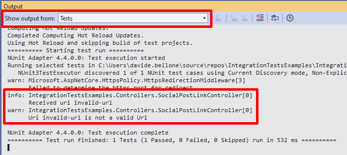

In a [previous article](https://www.code4it.dev/blog/integration-tests-for-dotnet-api/), we learned a quick way to create Integration tests for ASP.NET API by using `WebApplicationFactory`. That was a good introductionary article. But now we will delve into more complex topics and examples.

In my opinion, a few Integration tests and just the necessary number of Unit tests are better that hundreds of unit tests and no integration tests at all. In general, the [Testing Diamond should be preferred over the Testing Pyramid](https://www.code4it.dev/architecture-notes/testing-pyramid-vs-testing-diamond/) (well, in most of the cases).

In this article, we are going to create advanced integration tests by defining custom application settings, customizing dependencies to be used only during tests, defining custom logging, and performing complex operations in our tests.

For the sake of this article, I created a sample API application that exposes one single endpoint whose purpose is to retrieve some info about the URL passed as an input. For example,

```plaintext
GET /SocialPostLink?uri=https%3A%2F%2Ftwitter.com%2FBelloneDavide%2Fstatus%2F1682305491785973760
```

will return

```json
{
  "instanceName": "Real",
  "info": {
    "socialNetworkName": "Twitter",
    "sourceUrl": "https://twitter.com/BelloneDavide/status/1682305491785973760",
    "username": "BelloneDavide",
    "id": "1682305491785973760"
  }
}
```

`instanceName` is a value coming from the *appsettings.json* file. `info` is an object that holds some info about the social post URL passed as an input.

Internally, the code is using the **Chain of responsibility pattern**: there is an handler that "knows" if it can handle a specific URL; if it can, it just elaborates the input; otherwise, it calls the next handler;

There is also a Factory that builds the chain, and finally a Service that instantiates the factory and then resolves the dependencies.

As you can see, this solution can become complex. We could run lots of Unit tests to validate that the Chain of Responsibility works as expected. We can even write a Unit Tests suite for the Factory.

But, in the end of the day, we don't really care about the internal structure of the project: as long as it works as expected, we could even use a huge `switch` block. So, let's write some Integration Tests.

## How to set up IntegrationTestFactory

When creating Integration Tests for .NET APIs you have to instantiate a new instance of `WebApplicationFactory`, a class coming from the `Microsoft.AspNetCore.Mvc.Testing` NuGet Package. 

Since we are going to define it once and reuse it across all the tests, let's create a new class that extends `WebApplicationFactory`, and add some custom behavior in it.

```cs
public class IntegrationTestWebApplicationFactory : WebApplicationFactory<Program>
{

}
```

**Let's focus on the `Program` class**: as you can see, the WebApplicationFactory class requires an entry point. Generally speaking, it's the `Program` class of our application.

If you hover on `WebApplicationFactory<Program>` and  hit *CTRL+.* on Visual Studio, the autocomplete proposes two alternatives: one is the Program class defined in your APIs, the other one is the Program class defined in *Microsoft.VisualStudio.TestPlatform.TestHost*. **Choose the one for your API application**! The WebApplicationFactory class will then instatiate your API following the instructions defined in your Program.cs class, thus resolving all the dependencies and configurations as if you were running your application locally.

**What to do if you don't have the Program class?** If you use top-level statements, you don't have the Program class, because it's "implicit". So you cannot reference the whole class. Unless... You have to create a new `partial class` named `Program`, and leave it empty: this way, you have a class name that can be used to reference the API definition:

```cs
public partial class Program { }
```

Here you can override some definitions of the `WebHost` to be created by calling `ConfigureWebHost`:

```cs
public class IntegrationTestWebApplicationFactory : WebApplicationFactory<Program>
{
    protected override void ConfigureWebHost(IWebHostBuilder builder)
    {
          builder.ConfigureAppConfiguration((host, configurationBuilder) => { });
    }
}
```

## How to use IntegrationTestFactory in your tests

It's time to start working on some real Integration Tests!

As we said before, we have only one HTTP endpoint, defined like this:

```cs

private readonly ISocialLinkParser _parser;
private readonly ILogger<SocialPostLinkController> _logger;
private readonly IConfiguration _config;

public SocialPostLinkController(ISocialLinkParser parser, ILogger<SocialPostLinkController> logger, IConfiguration config)
{
    _parser = parser;
    _logger = logger;
    _config = config;
}

[HttpGet]
public IActionResult Get([FromQuery] string uri)
{
    _logger.LogInformation("Received uri {Uri}", uri);
    if (Uri.TryCreate(uri, new UriCreationOptions {  }, out Uri _uri))
    {
        var linkInfo = _parser.GetLinkInfo(_uri);
        _logger.LogInformation("Uri {Uri} is of type {Type}", uri, linkInfo.SocialNetworkName);

        var instance = new Instance
        {
            InstanceName = _config.GetValue<string>("InstanceName"),
            Info = linkInfo
        };
        return Ok(instance);
    }
    else
    {
        _logger.LogWarning("Uri {Uri} is not a valid Uri", uri);
        return BadRequest();
    }
}
```

We then have 2 flows to validate:

* If the input URI is valid, the HTTP Status code should be 200;
* If the input URI is invalid, the HTTP Status code should be 400;

We could simply write unit tests for this purpose, but let me write Integration Tests instead.

First of all, we have to create a test class and create a new instance of `IntegrationTestWebApplicationFactory`. Then, we will create a new `HttpClient` every time a test is run that will automatically include all the services and configurations defined in the API application. 


```cs
public class ApiIntegrationTests : IDisposable
{
    private IntegrationTestWebApplicationFactory _factory;
    private HttpClient _client;

    [OneTimeSetUp]
    public void OneTimeSetup() => _factory = new IntegrationTestWebApplicationFactory();

    [SetUp]
    public void Setup() => _client = _factory.CreateClient();

    public void Dispose() => _factory?.Dispose();
}
```

As you can see, the test class implements `IDisposable` so that we can call `Dispose()` on the `IntegrationTestWebApplicationFactory` instance.

From now on, we can use the `_client` instance to work with the in-memory instance of the API.

One of the best part of it is that, since it's an in-memory instance, **we can even debug our API application**. When you create a test and put a breakpoint in the production code, you can hit it and look up to the actual values as if you were running the application in a browser.


Now that we have the instance of HttpClient, we can create two tests to ensure that the two cases we defined before are valid. If the input string is a valid URI, return 200:

```cs
[Test]
public async Task Should_ReturnHttp200_When_UrlIsValid()
{
    string inputUrl = "https://twitter.com/BelloneDavide/status/1682305491785973760";

    var result = await _client.GetAsync($"SocialPostLink?uri={inputUrl}");

    Assert.That(result.StatusCode, Is.EqualTo(HttpStatusCode.OK));
}    
```

Otherwise, return Bad Request:

```cs
[Test]
public async Task Should_ReturnBadRequest_When_UrlIsNotValid()
{
    string inputUrl = "invalid-url";

    var result = await _client.GetAsync($"/SocialPostLink?uri={inputUrl}");

    Assert.That(result.StatusCode, Is.EqualTo(HttpStatusCode.BadRequest));
}
```

## InMemory collection

`WebApplicationFactory` is a class that is highly configurable thanks to the `ConfigureWebHost` method. For instance, you can customize the settings injected in your services.

Usually, you want to rely on the exact same configurations defined in your *appsettings.json* to ensure that the system behaves correctly with the "real" configurations. For example, I defined the key "InstanceName" in the appsettings.json file whose value is "Real", and the value is being read from that source as validated from this test:


```cs
[Test]
public async Task Should_ReadInstanceNameFromSettings()
{
    string inputUrl = "https://twitter.com/BelloneDavide/status/1682305491785973760";

    var result = await _client.GetFromJsonAsync<Instance>($"/SocialPostLink?uri={inputUrl}");

    Assert.That(result.InstanceName, Is.EqualTo("Real"));
}
```

But some other times you might want to **override a specific configuration key**.

The `ConfigureAppConfiguration` method allows you to customize how you manage Configurations by adding or removing sources.

If you want to add some configurations specific to the `IntegrationTestWebApplicationFactory`, you can use `AddInMemoryCollection`, a method that allows you to add configurations in a key-value format:

```cs
protected override void ConfigureWebHost(IWebHostBuilder builder)
{
    builder.ConfigureAppConfiguration((host, configurationBuilder) =>
    {
        configurationBuilder.AddInMemoryCollection(
            new List<KeyValuePair<string, string?>>
            {
                new KeyValuePair<string, string?>("InstanceName", "FromTests")
            });
    });
}
```

Now, even if you had the *InstanceName* configured in your *appsettings.json* file, the value is now overridden and set to *FromTests*.

You can validate this change by simply replacing the expected value in the previous test:

```cs
[Test]
public async Task Should_ReadInstanceNameFromSettings()
{
    string inputUrl = "https://twitter.com/BelloneDavide/status/1682305491785973760";

    var result = await _client.GetFromJsonAsync<Instance>($"/SocialPostLink?uri={inputUrl}");

    Assert.That(result.InstanceName, Is.EqualTo("FromTests"));
}
```

If you also want to discard all the other exising configuration sources, you can call `configurationBuilder.Sources.Clear()` before `AddInMemoryCollection` and remove all the other exising configurations.

## Custom depenndencies

Maybe you don't want to resolve all the existing dependencies, but just a subset of them. For example, **you might not want to call external APIs** with a limited number of free API calls. You can then rely on Stub classes that simulate the dependency by giving you the full control of the behavior.

Now we want to replace an existing class with a Stub one: we are going to create a stub class that will be used in place of `SocialLinkParser`:

```cs
public class StubSocialLinkParser : ISocialLinkParser
{
    public LinkInfo GetLinkInfo(Uri postUri) => new LinkInfo
    {
        SocialNetworkName = "test from stub",
        Id = "test id",
        SourceUrl = postUri,
        Username = "test username"
    };
}
```

We can then customize Dependency Injection to use `StubSocialLinkParser` in place of `SocialLinkParser` by specifying the depencency within the `ConfigureTestServices` method:

```cs
builder.ConfigureTestServices(services =>
{
    services.AddScoped<ISocialLinkParser, StubSocialLinkParser>();
});
```

Now, we can create a method to validate this change:

```cs
[Test]
public async Task Should_UseStubName()
{
    string inputUrl = "https://twitter.com/BelloneDavide/status/1682305491785973760";

    var result = await _client.GetFromJsonAsync<Instance>($"/SocialPostLink?uri={inputUrl}");

    Assert.That(result.Info.SocialNetworkName, Is.EqualTo("test from stub"));
}
```

## testihng on resolved dependencies

Now we are going to test that the `SocialLinkParser` does its job, regardless of the internal implementation. Right now we have used the Chain of Responsibility pattern, and we rely on the `ISocialLinksFactory` interface to create the correct sequence of handlers. But we don't know in the future how we will define the code: maybe we will replace it all with a huge *if-else* sequence - **the only important part is that the code works, regardless of the internal implementation**.

Therefore, we have to run tests on the `SocialLinkParser` class. **Not the interface, but the concrete class**. The first step is to add the class to the DI engine in the `Program` class:

```cs
builder.Services.AddScoped<SocialLinkParser>();
```

Now we can create a test to validate that it is working:

```cs
[Test]
public async Task Should_ResolveDependency()
{
    using (var _scope = _factory.Services.CreateScope())
    {
        var service = _scope.ServiceProvider.GetRequiredService<SocialLinkParser>();
        Assert.That(service, Is.Not.Null);
        Assert.That(service, Is.AssignableTo<SocialLinkParser>());
    }
}
```

As you can see, we are creating an `IServiceScope` by calling `_factory.Services.CreateScope()`. Since we have to discard this scope after the test run, we have to place it within a `using` block. Then, we can create a new instance of `SocialLinkParser` by calling `_scope.ServiceProvider.GetRequiredService<SocialLinkParser>()` and create all the tests we want on the concrete implementation of the class. The benefit of this approach is that you have all the internal dependencies already resolved, without relying on mocks. You can then ensure that everything, from that point on, works as you expect.

Here I created the scope within a `using` block. There is another approach that I prefer: create the `scope` instance in the `SetUp` method, and call `Dispose()` on it the the `TearDown` phase:

```cs
protected IServiceScope _scope;
protected SocialLinkParser _sut;
private IntegrationTestWebApplicationFactory _factory;

[OneTimeSetUp]
public void OneTimeSetup() => _factory = new IntegrationTestWebApplicationFactory();

[SetUp]
public void Setup()
{
    _scope = _factory.Services.CreateScope();
    _sut = _scope.ServiceProvider.GetRequiredService<SocialLinkParser>();
}

[TearDown]
public void TearDown()
{
    _sut = null;
    _scope.Dispose();
}

public void Dispose() => _factory?.Dispose();
```

## Logging

Sometimes you just need to see the logs generated by your application to help you debug an issue (yes, you can simply debug the application!). But, unless properly configured, the application logs will not be avaliable to you.

But you can add logs to console easily by customizing the adding the Console sink in your `ConfigureTestServices` method:

```cs
builder.ConfigureTestServices(services =>
{
    services.AddLogging(builder => builder.AddConsole().AddDebug());
});
```

Now you will be able to see all the logs you generated in the Output panel of Visual Studio by selecting the Tests source:



**Beware that you are still reading the configurations for logging from the appsettings file!** If you have specified in your project to log directly to a sink (such as DataDog or SEQ), your tests will send those logs to the specified sinks. Therefore, you should get rid of all the other logging sources by calling `ClearProviders()`:

```cs
services.AddLogging(builder => builder.ClearProviders() .AddConsole().AddDebug());
```

## Full example

In this article, we've configured many parts of our `WebApplicationFactory`. Here's the final result:

```cs
public class IntegrationTestWebApplicationFactory : WebApplicationFactory<Program>
{
    protected override void ConfigureWebHost(IWebHostBuilder builder)
    {
        builder.ConfigureAppConfiguration((host, configurationBuilder) =>
        {
            // remove other settings sources, if necessary
            configurationBuilder.Sources.Clear();

            // create custom key-value pairs to be used as settings
            configurationBuilder.AddInMemoryCollection(
                new List<KeyValuePair<string, string?>>
                {
                    new KeyValuePair<string, string?>("InstanceName", "FromTests")
                });
        });

        builder.ConfigureTestServices(services =>
        {
            // add stub classes
            services.AddScoped<ISocialLinkParser, StubSocialLinkParser>();

            // configure logging
            services.AddLogging(builder => builder.ClearProviders().AddConsole().AddDebug());
        });
    }
}
```


## Further readings

_This article first appeared on [Code4IT 🐧](https://www.code4it.dev/)_

https://www.code4it.dev/architecture-notes/testing-pyramid-vs-testing-diamond/

## Wrapping up


I hope you enjoyed this article! Let's keep in touch on [Twitter](https://twitter.com/BelloneDavide) or [LinkedIn](https://www.linkedin.com/in/BelloneDavide/)! 🤜🤛

Happy coding!

🐧


[ ] Titoli
[ ] Frontmatter
[ ] Rinomina immagini
[ ] Alt Text per immagini
[ ] Grammatica
[ ] Bold/Italics
[ ] Nome cartella e slug devono combaciare
[ ] Immagine di copertina
[ ] Rimuovi secrets dalle immagini
[ ] Pulizia formattazione
