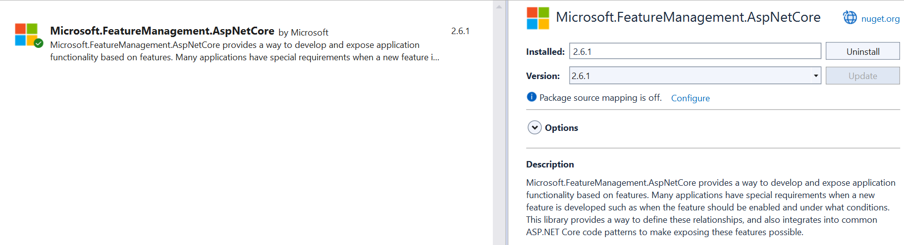

To turn functionalities on or off on an application, you can use simple `if(condition)` statements. That would work, of course. But it would not be flexible, and you'll have to scatter those checks all around the application.

There is another way, though: **Feature Flags**. Feature Flags allow you to effortlessly enable and disable functionalities, such as Middlewares, HTML components, and API controllers. Using .NET, you have Feature Flags almost ready to be used: it's just a matter of installing one NuGet package and using the correct syntax.

In this article, we are going to create and consume Feature Flags in an ASP.NET application. We will start from the very basics and then see how to use complex, built-in filters. We will consume Feature Flags in a generic C# code, and then we will see how to include them in a Razor application and in .NET APIs. 

## How to add the Feature Flags functionality on ASP.NET Core applications

The very first step to do is to install the **Microsoft.FeatureManagement.AspNetCore** NuGet package: 



This package contains everything you need to integrate Feature Flags in an ASP.NET application, from reading configurations from the *appsettings.json* file to the utility methods we will see later in this article.

Now that we have the package installed, we can integrate it into our application. The first step is to call `AddFeatureManagement` on the `IServiceCollection` object available in the Main method:

```cs
var builder = WebApplication.CreateBuilder(args);

builder.Services.AddFeatureManagement();
```

By default, **this method looks for feature flags in a configuration section named `FeatureManagement`**. 

If you want to use another name, you can specify it by accessing the `Configuration` object. For example, if your section name is *MyWonderfulFlags*, you must use this line instead of the previous one:

```cs
builder.Services.AddFeatureManagement(builder.Configuration.GetSection("MyWonderfulFlags"));
```

But, for now, let's stick with the default section name: *FeatureManagement*.

## Define Feature Flag values in the appsettings file

As we saw, we have to create a section named *FeatureManagement* in the *appsettings* file. This section will contain a collection of keys, each representing a Feature Flag and an associated value. 

For now, let's say that the value is a simple boolean (we will see an advanced case later!).

For example, we can define our section like this:

```json
{
    "FeatureManagement": 
    {
        "Header": true,
        "Footer": true,
        "PrivacyPage": false,
    }
}
```

## Using Feature Flags in generic C# code

The simplest way to use Feature Flags is by accessing the value directly in the C# code. 

By calling `AddFeatureManagement`, we have also injected the `IFeatureManager` interface, which comes in handy to check whether a flag is enabled.

You can then inject it in a class constructor and reference it:

```cs
private readonly IFeatureManager _featureManager;

public MyClass(IFeatureManager featureManager)
{
    _featureManager = featureManager;
}

public async Task DoSomething()
{
    bool privacyEnabled = await _featureManager.IsEnabledAsync("PrivacyPage");
    if(privacyEnabled)
    {
        // do something specific
    }
}
```

This is the simplest way. Looks like it's nothing more than a simple `if` statement. Is it?

## Applying a Feature Flag to a Controller or a Razor Model using the FeatureGate attribute

When rolling out new versions of your application, you might want to enable or disable an API Controller or a whole Razor Page, depending on the value of a Feature Flag.

There is a simple way to achieve this result: using the `FeatureGate` attribute.

Suppose you want to hide the "Privacy" Razor page depending on its related flag, *PrivacyPage*. You then have to apply the `FeatureGate` attribute to the whole Model class (in our case, `PrivacyModel`), specifying that the flag to watch out for is `PrivacyPage`:

```cs
[FeatureGate("PrivacyPage")]
public class PrivacyModel : PageModel
{

    public PrivacyModel()
    {
    }

    public void OnGet()
    {
    }
}
```

Depending on the value of the flag, we will have two results:

- if the flag is enabled, we will see the whole page normally;
- if the flag is disabled, we will receive a *404 - Not Found* response.

Let's have a look at the attribute definition:

```cs
//
// Summary:
//     An attribute that can be placed on MVC controllers, controller actions, or Razor
//     pages to require all or any of a set of features to be enabled.
[AttributeUsage(AttributeTargets.Class | AttributeTargets.Method, AllowMultiple = true)]
public class FeatureGateAttribute : ActionFilterAttribute, IAsyncPageFilter, IFilterMetadata
```

As you can see, **you can apply the attribute to any class or method** that is related to API controllers or Razor pages. This allows you to support several scenarios:

- add a flag on a whole API Controller by applying the attribute to the related class;
- add a flag on a specific Controller Action, allowing you, for example, to expose the GET Action but apply the attribute to the POST Action.
- add a flag to a whole Razor Model, hiding or showing the related page depending on the flag value.

You can apply the attribute to a custom class or method unrelated to the MVC pipeline, but **it will be ineffective**.

If you try with

```cs
public void OnGet()
{
    var hello = Hello();
    ViewData["message"] = hello; 
}

[FeatureGate("PrivacyPage")]
private string Hello()
{
    return "Ciao!";
}
```

the `Hello` method will be called as usual. The same happens for the `OnGet` method: yes, it represents the way to access the Razor Page, but you cannot hide it; the only way is to apply the flag to the whole Model.

You can **use multiple Feature Flags on the same `FeatureGate` attribute**. If you need to hide or show a component based on various Feature Flags, you can simply add the required keys in the attribute parameters list:

```cs
[HttpGet]
[FeatureGate("PrivacyPage", "Footer")]
public IActionResult Get()
{
    return Ok("Hey there!");
}
```

Now, the GET endpoint will be available only if both PrivacyPage *and* Footer are enabled.

Finally, you can define that the component is available if *at least one* of the flags is enabled by setting the `requirementType` parameter to `RequirementType.Any`:

```cs
[HttpGet]
[FeatureGate(requirementType:RequirementType.Any,  "PrivacyPage", "Footer")]
public IActionResult Get()
{
    return Ok("Hey there!");
}
```

## How to use Feature Flags in Razor Pages

The *Microsoft.FeatureManagement.AspNetCore* NuGet package brings a lot of functionalities. Once installed, you can use Feature Flags in your Razor pages.

To use such functionalities, though, you have to **add the related *tag helper*: open the *_ViewImports.cshtml* file** and add the following line:

```plain
@addTagHelper *, Microsoft.FeatureManagement.AspNetCore
```

Now, you can use the `feature` tag.

Say you want to show an HTML tag when the *Header* flag is on. You can use the `feature` tag this way:

```xml
<feature name="Header">
    <p>The header flag is on.</p>
</feature>
```

You can also show some content when the flag is off, by setting the `negate` attribute to `true`. This comes in handy when you want to display alternative content when the flag is off:

```xml
<feature name="ShowPicture">
    
</feature>
<feature name="ShowPicture" negate="true">
    <p>There should have been an image, here!</p>
</feature>
```

Clearly, if *ShowPicture* is on, it shows the image; otherwise, it displays a text message.

Similar to the `FeatureGate` attribute, you can apply multiple flags and choose whether all of them or at least one must be *on* to show the content by setting the `requirement` attribute to `Any` (remember: the default value is `All`):

```xml
<feature name="Header, Footer" requirement="All">
    <p>Both header and footer are enabled.</p>
</feature>

<feature name="Header, Footer" requirement="Any">
    <p>Either header or footer is enabled.</p>
</feature>  
```

## Feature Gate Filters: a way to activate flags based on specific advanced conditions

Sometimes, you want to activate features using complex conditions. For example:

- activate a feature only for a percentage of requests;
- activate a feature only during a specific timespan;

Let's see how to use the percentage filter.

The first step is to add the related Feature Filter to the FeatureManagement functionality. In our case, we will add the  *Microsoft.FeatureManagement.FeatureFilters.PercentageFilter*.

```cs
builder.Services.AddFeatureManagement()
    .AddFeatureFilter<PercentageFilter>();
```

Now we just have to define the related flag in the *appsettings* file. We cannot use anymore a boolean value, but we need a complex object. Let's configure the *ShowPicture* flag to use the Percentage filter.

```json
{
    "ShowPicture": {
        "EnabledFor": [
            {
                "Name": "Percentage",
                "Parameters": {
                    "Value": 60
                }
            }
        ]
    }
}
```

Have a look at the structure. Now we have:

- a field named `EnabledFor`;
- `EnabledFor` is an array, not a single object;
- every object within the array is made of two fields: `Name`, which must match the filter name, and `Parameters`, which is a generic object whose value depends on the type of filter.

In this example,  we have set `"Value": 60`. This means that the flag will be active in around 60% of calls. In the remaining 40%, the flag will be off. 

Now, I encourage you to **toy with this filter**:
Apply it to a section or a page.
Run the application.
Refresh the page several times *without restarting the application*. 

You'll see the component appear and disappear.

## Further readings

We learned about setting "simple" configurations in a .NET application in a previous article. You should read it to have a better understanding of how we can define configurations.

🔗[Azure App Configuration and .NET API: a smart and secure way to manage configurations | Code4IT](https://www.code4it.dev/blog/azure-app-configuration-dotnet-api/)

Here, we focused on the feature flags. As we saw, most functionalities come out of the box with .NET. 

In particular, we learned how to use the `<feature>` tag on a Razor page. You can read more on the official documentation (even though we already covered almost everything!):

🔗[FeatureTagHelper Class | Microsoft Docs](https://learn.microsoft.com/en-us/dotnet/api/microsoft.featuremanagement.mvc.taghelpers.featuretaghelper)


_This article first appeared on [Code4IT 🐧](https://www.code4it.dev/)_

## Wrapping up

In this article, we learned how to use Feature Flags in an ASP.NET application on Razor pages and API Controllers.

Feature Flags can be tremendously useful when activating or deactivating a feature in some specific cases. For example, you can roll out a functionality in production by activating the related flag. Suppose you find an error in that functionality. In that case, you just have to turn off the flag and investigate locally the cause of the issue.

I hope you enjoyed this article! Let's keep in touch on [Twitter](https://twitter.com/BelloneDavide) or [LinkedIn](https://www.linkedin.com/in/BelloneDavide/)! 🤜🤛

Happy coding!

🐧
