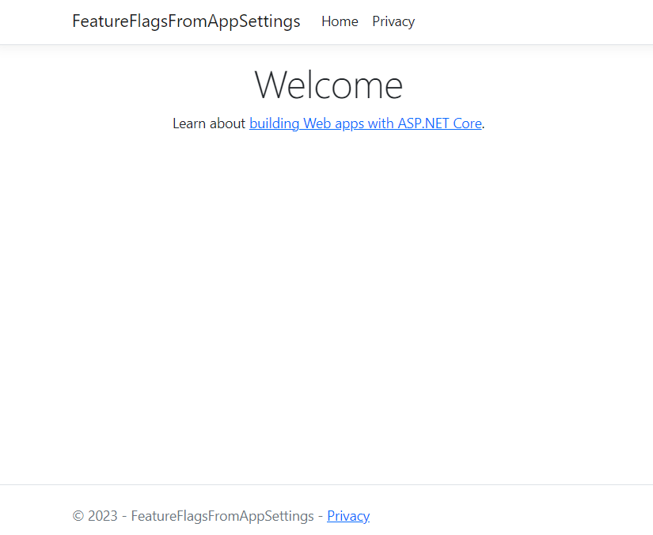

To enable or disable functionalities on an application you can use simple `if(condition)` statements. That would work, of course. But it would not be flexible, and you'll have to scatted those checks all around the application.

There is another way, though: Feature Flags. Feature Flags allow you to enable and disable functionalities, such as Middlewares, HTML components, API controllers, in an easy-to-use way. Using .NET, you have the whole functionality almost ready to be used: it's just a matter of installing one NuGet package and using the correct syntax.

In this article, we are going to define and consume Feature Flags in a Razor website (but we'll also see some tips on how to use Feature Flags with .NET APIs); we will start from the very basics, and then we will see how to use complex, built-in filters.

## Demo project

To showcase this project, I created a simple Razor application. I just scaffolded the base template. You should be able to run it and see something like this:

  

For the sake of this article, we are going to add some content to the homepage. That content will appear or disappear depending on the value of the related Feature Flag.

## How to add the FeatureManagement functionality on ASP.NET Core applications

The very first step to do is to install the **Microsoft.FeatureManagement.AspNetCore** NuGet package: 


This package contains everything you need to integrate Feature Flags in a .NET application: from reading configurations from *appsettings.json* to the utility methods we will see later in this article.

Now that we have the package installed, we can integrate it in our .NET application. The first step is to call `AddFeatureManagement` on the `IServiceCollection` object available in the Main method:

```cs
var builder = WebApplication.CreateBuilder(args);

builder.Services.AddFeatureManagement();
```

By default, **this method looks for feature flags in a configuration section named `FeatureManagement`**. 

If you want to use another name, you can specify it by accessing the `Configuration` object. For example, if your section is name *MyWonderfulFlags*, you must use this line instead of the previous one:

```cs
builder.Services.AddFeatureManagement(builder.Configuration.GetSection("MyWonderfulFlags"));
```

But, for now, let's stick with the default section name: *FeatureManagement*.

## Define Feature Flags values in the appsettings file

As we saw, we have to create a section named *FeatureManagement* in the *appsettings* file. This section will contain a collection of keys, each of them represents a Feature Flag, and an associated value. 

For now, let's say that the value is a simple boolean (we will see an advanced case later!).

For example, we can define our section like this:

```json
{
    "FeatureManagement": 
    {
        "Header": true,
        "Footer": true,
        "PrivacyPage": false,
    }
}
```

## Injecting Feature Flags in the constructor

The simplest way to use Feature Flags is by accessing the value directly in the C# code. 

By calling `AddFeatureManagement` we have also injected the `IFeatureManager` which comes in handy to check whether a flag is enabled or not.

You can the inject it in a class constructor and refernce it:

```cs
private readonly IFeatureManager _featureManager;

public MyClass(IFeatureManager featureManager)
{
    _featureManager = featureManager;
}

public async Task DoSomething()
{
    bool privacyEnabled = await _featureManager.IsEnabledAsync("PrivacyPage");
    if(privacyEnabled)
    {
        // do something specific
    }
}
```

This is the simplest way, nothing more than a simple `if` statement. Is it?


## Adding a Feature Flag to a Controller or a Razor Page using the FeatureGate attribute

When rolling out new versions of your application, you might want to enable or disable an API Controller or a whole Razor Page depending on the value of the Feature Flag.

There's a simple way to achieve this result: using the `FeatureGate` attribute.

Say that you want to hide the Privacy Razor page depending on its related flag, *PrivacyPage*.

In the related Model class, `PrivacyModel`, you can add the FeatureGate attribute by specifying that the flag to watch is `PrivacyPage`:

```cs
[FeatureGate("PrivacyPage")]
public class PrivacyModel : PageModel
{

    public PrivacyModel()
    {
    }

    public void OnGet()
    {
    }
}
```

Depending on the value of the flag, we will have two results:

- if the flag is enabled, we will see the whole page normally;
- if the flag is disabled, we will receive a *404 - Not Found* response.

Let's have a look at the attribute definition:

```cs
//
// Summary:
//     An attribute that can be placed on MVC controllers, controller actions, or Razor
//     pages to require all or any of a set of features to be enabled.
[AttributeUsage(AttributeTargets.Class | AttributeTargets.Method, AllowMultiple = true)]
public class FeatureGateAttribute : ActionFilterAttribute, IAsyncPageFilter, IFilterMetadata
```

As you can see, you can apply the attribute to any class or method that is related to API controllers or Razor pages. This allows you to support several scenarios:

- add a flag on a whole API controller, by applying the attribute to the whole class;
- add a flag on a specific Controller Action, allowing you, for example, to expose the GET Action but apply the attribute to the POST Action.
- add a flag to a whole Razor Model, hiding or showing the relate page depending on the flag value.

Clearly, you can apply the attribute to a custom class or method not related to the MVC pipeline, but it will be ineffective.

If you try with

```cs
public void OnGet()
{
    var hello = Hello();
    ViewData["message"] = hello; 
}

[FeatureGate("PrivacyPage")]
private string Hello()
{

    return "Ciao!";
}
```

the `Hello` method will be called as usual. The same happens for the `OnGet` method: yes, it represents the way to access the Razor Page, but you cannot hide it: the only way is to apply the flag to the whole Model.

You can **use multiple Feature Flags on the same `FeatureGate` attribute**: if you need to hide or show a component based on multiple feature flags, you can simply add the required keys in the attribute parameters list:

```cs
[HttpGet]
[FeatureGate("PrivacyPage", "Footer")]
public IActionResult Get()
{
    return Ok("Hey there!");
}
```

Now the GET endpoint will be available only if both PrivacyPage *and* Footer are enabled.

Finally, you can define that the component if available if *at least one* of the flags is enabled by using setting the `requirementType` parameter to `RequirementType.Any`:

```cs
[HttpGet]
[FeatureGate(requirementType:RequirementType.Any,  "PrivacyPage", "Footer")]
public IActionResult Get()
{
    return Ok("Hey there!");
}
```

## How to use Feature Flags in Razor Pages

The *Microsoft.FeatureManagement.AspNetCore* NuGet package brings a lot of functionalities. Once you have it installed, you can use feature flags in your Razor pages.

To use such functionalities, though, you have to add the related *tag helper*: open the *_ViewImports.cshtml* file and add the following line:

```plain
@addTagHelper *, Microsoft.FeatureManagement.AspNetCore
```

Now you can use the `feature` tag.

Say that you want to show an HTML tag when the *Header* flag is on. You can use the `feature` tag this way:

```xml
<feature name="Header">
    <p>This is the header.</p>
</feature>
```

You can also show some content when the flag is off, by setting the `negate` attribute to `true`. This comes in handy when you want to show an alternative content when the flag is off:

```xml
<feature name="ShowPicture">
    
</feature>
<feature name="ShowPicture" negate="true">
    <p>There should have been an image, here!</p>
</feature>
```

Clearly, if ShowPicture is on, it shows the image; otherwise it displays a text message.

Similar to the `FeatureGate` class, you can define multiple flags, and choose whether all the flags or at least one must be on to show the content by setting the `requirement` attribute to `Any` (remember: the default value is `All`):

```xml
<feature name="Header, Footer" requirement="All">
    <p>Both header and footer are enabled.</p>
</feature>

<feature name="Header, Footer" requirement="Any">
    <p>Either header or footer are enabled.</p>
</feature>  
```

## Feature Gate Filters: a way to activate flags based on specific conditions

Sometimes you want to activate feature using complex conditions. For example:

- activate a feature only for a percentage of requests;
- activate a feature only during a specific timespan;

Let's see how to use the percentage.

The first step is to add the related Feature Filter in the Main method, in this case *Microsoft.FeatureManagement.FeatureFilters.PercentageFilter*.

```cs
builder.Services.AddFeatureManagement()
    .AddFeatureFilter<PercentageFilter>();
```

Now we just have to define the relate flag in the *appsettings* file. We cannot use anymore a boolean value, but we need a complex object. Let's configure the *ShowPicture* flag to use the Percentage filter.

```json
{
    "ShowPicture": {
        "EnabledFor": [
            {
                "Name": "Percentage",
                "Parameters": {
                    "Value": 60
                }
            }
        ]
    }
}
```

Have a look at the structure. Now we have:

- an field named `EnabledFor`;
- `EnabledFor` is an array, not a single object;
- every object within the array is made of two fields: `Name`, that must match the filter name, and `Parameters`, that is a generic object whose valued depend on the type of filter.

Now we have set `"Value": 60`. This means that in around the 60% of calls, the flag will be active. In the remaining 40%, the flag will be off. 

Now I encourage you to **toy with this filter**: apply it to a section or a page, run the application, and refresh the page several times *without restarting the application*. 


You'll see the component appear and disappear.

## Further readings

_This article first appeared on [Code4IT 🐧](https://www.code4it.dev/)_


https://learn.microsoft.com/en-us/dotnet/api/microsoft.featuremanagement.mvc.taghelpers.featuretaghelper

## Wrapping up


I hope you enjoyed this article! Let's keep in touch on [Twitter](https://twitter.com/BelloneDavide) or [LinkedIn](https://www.linkedin.com/in/BelloneDavide/)! 🤜🤛

Happy coding!

🐧


[ ] Titoli
[ ] Frontmatter
[ ] Rinomina immagini
[ ] Alt Text per immagini
[ ] Grammatica
[ ] Bold/Italics
[ ] Nome cartella e slug devono combaciare
[ ] Immagine di copertina
[ ] Rimuovi secrets dalle immagini
[ ] Pulizia formattazione


 