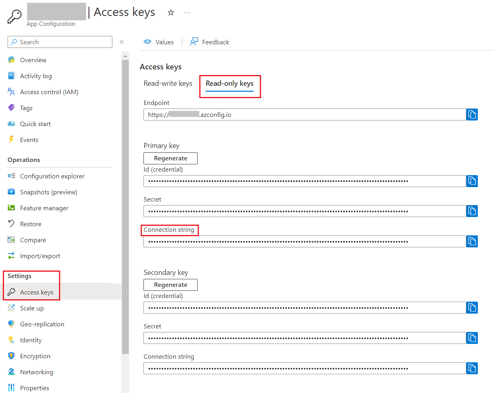

Feature Flags let you control features remotely without code changes. They help you to test, release, personalize, and manage features safely and quickly by driving changes using centralized configurations.

In a previous article, we learned [how to integrate Feature Flags in .NET applications](https://www.code4it.dev/blog/feature-flags-dotnet/). Also, a while ago we learned [how to integrate Azure App Configuration in a .NET application](https://www.code4it.dev/blog/azure-app-configuration-dotnet-api/).

In this article, we are going to join the two streams in a single article: in fact, we will learn how to manage Feature Flags using Azure App Configuration to make our applications able to change the rolled-out functionalities without changing the static configurations and by managing configurations in a central place.

## Riprendi esempio di feature flags

Let's reuse the example shown in the previous example.

We have a .NET application (in that case, we were building a Razor application, but it's not important for the sake of this article), with some configurations defined in the *appsettings* file under the `Feature` key:

```json
{
    "FeatureManagement": {
        "Header": true,
        "Footer": true,
        "PrivacyPage": false,
        "ShowPicture": {
            "EnabledFor": [
                {
                    "Name": "Percentage",
                    "Parameters": { "Value": 60 }
                }
            ]
        }
    }
}
```

We are going to move those flags to Azure App Configuration and integrate it as a configuration source.

If you want to know how to consume Feature Flags in a .NET application I suggest reading the previous article, [here](https://www.code4it.dev/blog/feature-flags-dotnet/).

However, let me summarize it. First of all, once you have the settings defined in the *appsettings.json* file, you have to tell ASP.NET to use feature flags by calling:

```cs
builder.Services.AddFeatureManagement();
```

Then, to consume those flags, you can:

- inject the `IFeatureManager` interface and call `IsEnabled` or `IsEnabledAsync`;
- use the `FeatureGate` attribute on a Controller class or a Razor model;
- use the `<feature>` tag in a Razor page to show or hide a portion of HTML

## Crea Feature Flags base su Azure

Now we can move our Feature Flags to Azure App Configuration. Needless to say, you need an Azure subscription 😉

Log in to the Azure Portal, move to "Create a resource", and create e new App Configuration:


I'm going to reuse the same instance I created in the previous article - you can see the full details in the  [*How to create an Azure App Configuration instance*](https://www.code4it.dev/blog/azure-app-configuration-dotnet-api/#how-to-create-an-azure-app-configuration-instance) section. 

Now we have to configure the same keys we defined in the appsettings file: *Header*, *Footer*, and *PrivacyPage*.

Open the App Configuration instance, and locate the "Feature manager" menu item in the left panel. This is the central place for creating, removing, and managing your Feature Flags. Here you can see I have already added the *Header* and *Footer*, and you can see their current state: "Footer" is enabled, while "Header" is disabled.


How can I add the *PrivacyPage* flag? It's incredibly easy: just click on Create and fill in the fields.

You have to define a Name and a Key (they can also be different), and, if you want, you can add a Label and a Description. You can also define whether the flag should be active by checking the checkbox "Enable feature flag".


## Aggiungi Feature Flags su .NET

We are now ready to integrate Azure App Configuration with our ASP.NET Core application.

Before moving to the code, we have to locate the connection string and store it somewhere. 

Head back to the App Configuration resource and locate the "Access keys" menu item under the "Settings" section. 



From here, copy the connection string (I suggest you to use the Read-only Keys), and store it somewhere.

Now, we can add Azure App Configuration as a source for our configurations by connecting to the connection string and by declaring that we are going to use Feature Flags:

```cs
builder.Configuration.AddAzureAppConfiguration(options =>
    options.Connect(connectionString).UseFeatureFlags()
);
```

That's not enough. We need to tell ASP.NET that we are going to *consume* these configurations by adding such functionalities to the `Services` property.

```cs
builder.Services.AddAzureAppConfiguration();

builder.Services.AddFeatureManagement();
```

Finally, once we have built our application with the usual `builder.Build()`, we have to add the Azure App Configuration middleware:

```cs
app.UseAzureAppConfiguration();
```

Now you can run the application and validate that the flags are being applied. You can change enable or disable those flags on Azure, reload the application, and check that the flags are being applied. Otherwise, you can just wait 30 seconds to have the flags values refreshed and see the changes applied to your application.

## Aggiungi percentage filter 

If you want to enable a functionality only to a percentage of sessions (sessions, not users!), you can use a Percentage Filter. 

In the previous article, we had a specific section dedicated to the *PercentageFilter*. 

As a recap, we defined the flag as:

```json
{
    "ShowPicture": {
        "EnabledFor": [
            {
                "Name": "Percentage",
                "Parameters": {
                    "Value": 60
                }
            }
        ]
    }
}
```

and added the `PercentageFilter` filter to ASP.NET with.

```cs
builder.Services.AddFeatureManagement()
    .AddFeatureFilter<PercentageFilter>();
```

Clearly, we can define such flags on Azure as well.

Head back to the Azure Portal and add a new Feature Flag. This time, you have to add a new Feature Filter. Even though the PercentageFilter is out-of-the-box in the FeatureManagement NuGet package, it is not available on the Azure portal.

Therefore, you have to define the filter with the following values:

- Filter Type must be "Custom";
- Custom filter name must be "Percentage"
- You have to add a new key "Value" with value "60".


The configuration we just added reflects the JSON value we previously had in the *appsettings* file: 60% of the requests will activate the flag, while the remaining 40% 

## Aggiungi cache expiration

By default, **Feature Flags are stored in an internal cache for 30 seconds**.

Sometimes it's not the best for your project; maybe you'd prefer a longer duration to avoid additional calls to the App Configuration platform; some other times you'd prefer to have the changes immediately available.

You can then define the cache expiration interval you need by configuring the options for the feature flags:

```cs
builder.Configuration.AddAzureAppConfiguration(options =>
    options.Connect(connectionString).UseFeatureFlags(featureFlagOptions =>
    {
        featureFlagOptions.CacheExpirationInterval = TimeSpan.FromSeconds(10);
    })
);
```

This way, Feature Flag values are stored in the internal cache for 10 seconds. Then, when you reaload the page, the configurations are read again from Azure App Configuration and the flags are applied correctly.

## Further readings

This is the final article of a path I built during these months to explore how to use configurations in .NET.

We started by learning how to set configuration values in a .NET application, as explained here:

🔗 [3 (and more) ways to set configuration values in .NET](https://www.code4it.dev/blog/how-to-set-configurations-values-dotnet/)

Then, we learned how to read and use them with the `IOptions` family:

🔗 [Understanding IOptions, IOptionsMonitor, and IOptionsSnapshot in .NET 7](https://www.code4it.dev/blog/ioptions-ioptionsmonitor-ioptionssnapshot/)

From here, we learned how to read the same configurations from Azure App Configuration, to centralize our settings:

🔗 [Azure App Configuration and .NET API: a smart and secure way to manage configurations | Code4IT](https://www.code4it.dev/blog/azure-app-configuration-dotnet-api/)

Finally, we introduced Feature Flags in our apps:

🔗 [Feature Flags 101: A Guide for .NET Developers | Code4IT](https://www.code4it.dev/blog/feature-flags-dotnet/)

And then we got to this article!

_This article first appeared on [Code4IT 🐧](https://www.code4it.dev/)_


## Wrapping up

In this article, we have configured an ASP.NET Core application to read the feature flags stored on Azure App Configuration.

Here's the minimal code you need to add Feature Flags for .NET API Controllers:

```cs
var builder = WebApplication.CreateBuilder(args);

string connectionString = "my connection string";

builder.Services.AddControllers();

builder.Configuration.AddAzureAppConfiguration(options =>
    options.Connect(connectionString)
    .UseFeatureFlags(featureFlagOptions =>
        {
            featureFlagOptions.CacheExpirationInterval = TimeSpan.FromSeconds(10);
        }
    )
);

builder.Services.AddAzureAppConfiguration();

builder.Services.AddFeatureManagement()
    .AddFeatureFilter<PercentageFilter>();

var app = builder.Build();

app.UseRouting();
app.UseAzureAppConfiguration();

app.MapControllers();
app.Run();
```

I hope you enjoyed this article! Let's keep in touch on [Twitter](https://twitter.com/BelloneDavide) or [LinkedIn](https://www.linkedin.com/in/BelloneDavide/)! 🤜🤛

Happy coding!

🐧


[ ] Titoli
[ ] Frontmatter
[ ] Rinomina immagini
[ ] Alt Text per immagini
[ ] Grammatica
[ ] Bold/Italics
[ ] Nome cartella e slug devono combaciare
[ ] Immagine di copertina
[ ] Rimuovi secrets dalle immagini
[ ] Pulizia formattazione
[ ] Aggiungi referenza a pacchetto NuGet 