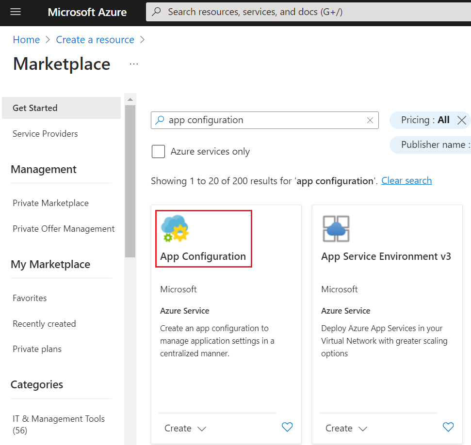
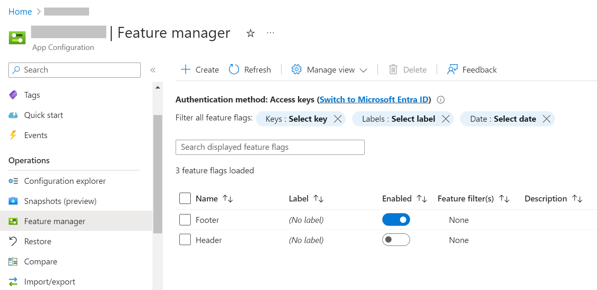
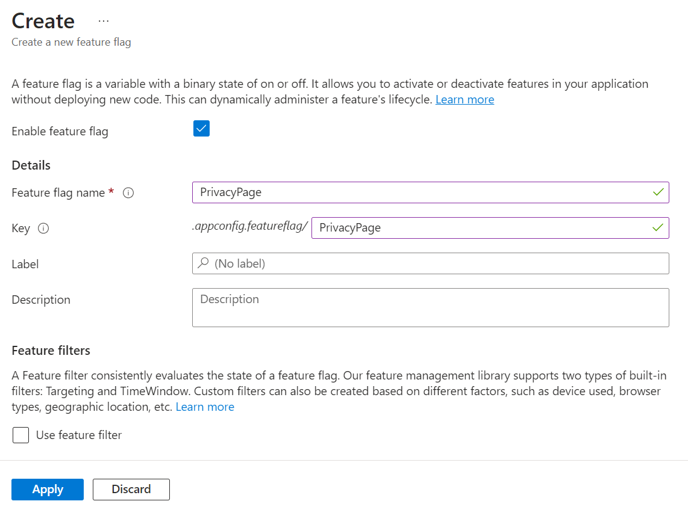
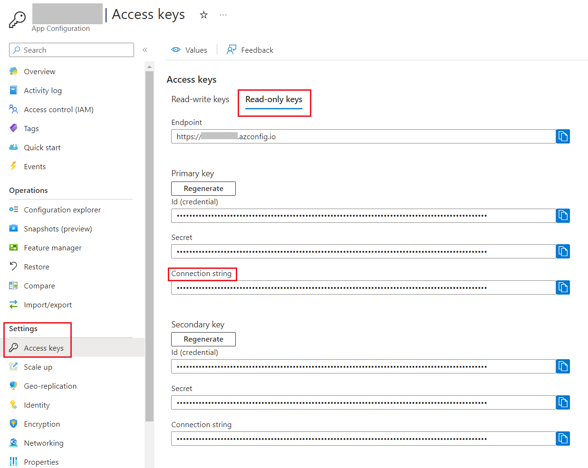
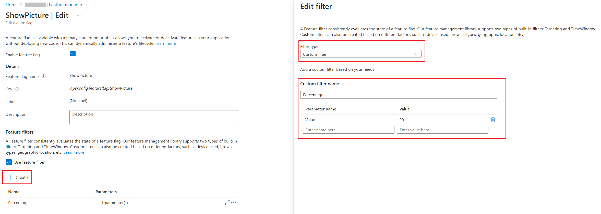

Feature Flags let you remotely control the activation of features without code changes. They help you to test, release, and manage features safely and quickly by driving changes using centralized configurations.

In a previous article, we learned [how to integrate Feature Flags in ASP.NET Core applications](https://www.code4it.dev/blog/feature-flags-dotnet/). Also, a while ago, we learned [how to integrate Azure App Configuration in an ASP.NET Core application](https://www.code4it.dev/blog/azure-app-configuration-dotnet-api/).

In this article, we are going to join the two streams in a single article: in fact, we will learn how to manage Feature Flags using Azure App Configuration to centralize our configurations.

It's a sort of evolution from the previous article. Instead of changing the static configurations and redeploying the whole application, we are going to move the Feature Flags to Azure so that you can enable or disable those flags in **just one click**.

## A recap of Feature Flags read from the appsettings file

Let's reuse the example shown in the previous article.

We have an ASP.NET Core application (in that case, we were building a Razor application, but it's not important for the sake of this article), with some configurations defined in the _appsettings_ file under the `Feature` key:

```json
{
  "FeatureManagement": {
    "Header": true,
    "Footer": true,
    "PrivacyPage": false,
    "ShowPicture": {
      "EnabledFor": [
        {
          "Name": "Percentage",
          "Parameters": { "Value": 60 }
        }
      ]
    }
  }
}
```

We have already dove deep into Feature Flags in an ASP.NET Core application in [the previous article](https://www.code4it.dev/blog/feature-flags-dotnet/). However, let me summarize it.

First of all, you have to **define your flags in the _appsettings.json_ file** using the structure we saw before.

To use Feature Flags in ASP.NET Core you have to install the _Microsoft.FeatureManagement.AspNetCore_ NuGet package.

Then, you have to **tell ASP.NET to use Feature Flags** by calling:

```cs
builder.Services.AddFeatureManagement();
```

Finally, you are able to **consume those flags in three ways**:

- inject the `IFeatureManager` interface and call `IsEnabled` or `IsEnabledAsync`;
- use the `FeatureGate` attribute on a Controller class or a Razor model;
- use the `<feature>` tag in a Razor page to show or hide a portion of HTML

## How to create Feature Flags on Azure App Configuration

We are ready to move our Feature Flags to Azure App Configuration. Needless to say, you need an Azure subscription 😉

Log in to the Azure Portal, head to "Create a resource", and create a new App Configuration:



I'm going to reuse the same instance I created in the previous article - you can see the full details in the [_How to create an Azure App Configuration instance_](https://www.code4it.dev/blog/azure-app-configuration-dotnet-api/#how-to-create-an-azure-app-configuration-instance) section.

Now we have to configure the same keys defined in the appsettings file: _Header_, _Footer_, and _PrivacyPage_.

Open the App Configuration instance and **locate the "Feature Manager" menu item** in the left panel. This is the central place for creating, removing, and managing your Feature Flags. Here, you can see that I have already added the _Header_ and _Footer_, and you can see their current state: "Footer" is enabled, while "Header" is not.



How can I add the _PrivacyPage_ flag? It's elementary: click the "Create" button and fill in the fields.

You have to **define a Name and a Key** (they can also be different), and if you want, you can add a Label and a Description. You can also define whether the flag should be active by checking the "Enable feature flag" checkbox.



## Read Feature Flags from Azure App Configuration in an ASP.NET Core application

It's time to integrate Azure App Configuration with our ASP.NET Core application.

Before moving to the code, we have to **locate the connection string** and store it somewhere.

Head back to the App Configuration resource and locate the "Access keys" menu item under the "Settings" section.



From here, copy the connection string (**I suggest that you use the Read-only Keys**) and store it somewhere.

Before proceeding, you have to install the _Microsoft.Azure.AppConfiguration.AspNetCore_ NuGet package.

Now, we can **add Azure App Configuration as a source for our configurations** by connecting to the connection string and by declaring that we are going to use Feature Flags:

```cs
builder.Configuration.AddAzureAppConfiguration(options =>
    options.Connect(connectionString).UseFeatureFlags()
);
```

That's not enough. We need to **tell ASP.NET that we are going to _consume_ these configurations** by adding such functionalities to the `Services` property.

```cs
builder.Services.AddAzureAppConfiguration();

builder.Services.AddFeatureManagement();
```

Finally, once we have built our application with the usual `builder.Build()`, we have to **add the Azure App Configuration middleware**:

```cs
app.UseAzureAppConfiguration();
```

To try it out, run the application and validate that the flags are being applied. You can enable or disable those flags on Azure, _restart_ the application, and check that the changes to the flags are being applied. Otherwise, you can **wait 30 seconds to have the flag values refreshed** and see the changes applied to your application.

## Using the Percentage filter on Azure App Configuration

Suppose you want to enable a functionality only to a percentage of sessions (_sessions, not users!_). In that case, you can use the Percentage filter.

The previous article had a specific section dedicated to the _PercentageFilter_, so you might want to check it out.

As a recap, we defined the flag as:

```json
{
  "ShowPicture": {
    "EnabledFor": [
      {
        "Name": "Percentage",
        "Parameters": {
          "Value": 60
        }
      }
    ]
  }
}
```

And added the `PercentageFilter` filter to ASP.NET with:

```cs
builder.Services.AddFeatureManagement()
    .AddFeatureFilter<PercentageFilter>();
```

Clearly, we can define such flags on Azure as well.

Head back to the Azure Portal and add a new Feature Flag. This time, you have to **add a new Feature Filter** to any existing flag. **Even though the PercentageFilter is out-of-the-box in the FeatureManagement NuGet package, it is not available on the Azure portal.**

You have to define the filter with the following values:

- _Filter Type_ must be "Custom";
- _Custom filter name_ must be "Percentage"
- You must add a new key, "Value", and set its value to "60".



The configuration we just added reflects the JSON value we previously had in the _appsettings_ file: 60% of the requests will activate the flag, while the remaining 40% will not.

## Define the cache expiration interval for Feature Flags

By default, **Feature Flags are stored in an internal cache for 30 seconds**.

Sometimes, it's not the best choice for your project; you may prefer a longer duration to avoid additional calls to the App Configuration platform; other times, you'd like to have the changes immediately available.

You can then define the cache expiration interval you need by configuring the options for the Feature Flags:

```cs
builder.Configuration.AddAzureAppConfiguration(options =>
    options.Connect(connectionString).UseFeatureFlags(featureFlagOptions =>
    {
        featureFlagOptions.CacheExpirationInterval = TimeSpan.FromSeconds(10);
    })
);
```

This way, Feature Flag values are stored in the internal cache for 10 seconds. Then, when you reload the page, the configurations are reread from Azure App Configuration and the flags are applied with the new values.

## Further readings

**This is the final article of a path** I built during these months to explore how to use configurations in ASP.NET Core.

We started by learning how to set configuration values in an ASP.NET Core application, as explained here:

🔗 [3 (and more) ways to set configuration values in ASP.NET Core](https://www.code4it.dev/blog/how-to-set-configurations-values-dotnet/)

Then, we learned how to read and use them with the `IOptions` family:

🔗 [Understanding IOptions, IOptionsMonitor, and IOptionsSnapshot in ASP.NET Core](https://www.code4it.dev/blog/ioptions-ioptionsmonitor-ioptionssnapshot/)

From here, we learned how to read the same configurations from Azure App Configuration, to centralize our settings:

🔗 [Azure App Configuration and ASP.NET Core API: a smart and secure way to manage configurations | Code4IT](https://www.code4it.dev/blog/azure-app-configuration-dotnet-api/)

Then, we configured our applications to automatically refresh the configurations using a Sentinel value:

🔗 [How to automatically refresh configurations with Azure App Configuration in ASP.NET Core](https://www.code4it.dev/blog/azure-app-configuration-refresh-config/)

Finally, we introduced Feature Flags in our apps:

🔗 [Feature Flags 101: A Guide for ASP.NET Core Developers | Code4IT](https://www.code4it.dev/blog/feature-flags-dotnet/)

And then we got to this article!

_This article first appeared on [Code4IT 🐧](https://www.code4it.dev/)_

## Wrapping up

In this article, we have configured an ASP.NET Core application to read the Feature Flags stored on Azure App Configuration.

Here's the minimal code you need to add Feature Flags for ASP.NET Core API Controllers:

```cs
var builder = WebApplication.CreateBuilder(args);

string connectionString = "my connection string";

builder.Services.AddControllers();

builder.Configuration.AddAzureAppConfiguration(options =>
    options.Connect(connectionString)
    .UseFeatureFlags(featureFlagOptions =>
        {
            featureFlagOptions.CacheExpirationInterval = TimeSpan.FromSeconds(10);
        }
    )
);

builder.Services.AddAzureAppConfiguration();

builder.Services.AddFeatureManagement()
    .AddFeatureFilter<PercentageFilter>();

var app = builder.Build();

app.UseRouting();
app.UseAzureAppConfiguration();
app.MapControllers();
app.Run();
```

I hope you enjoyed this article! Let's keep in touch on [Twitter](https://twitter.com/BelloneDavide) or [LinkedIn](https://www.linkedin.com/in/BelloneDavide/)! 🤜🤛

Happy coding!

🐧
