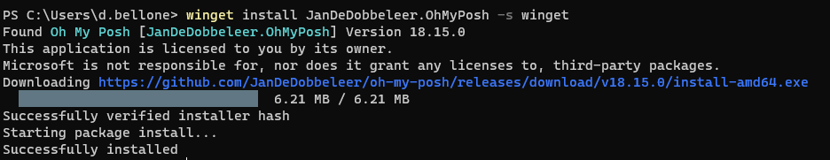
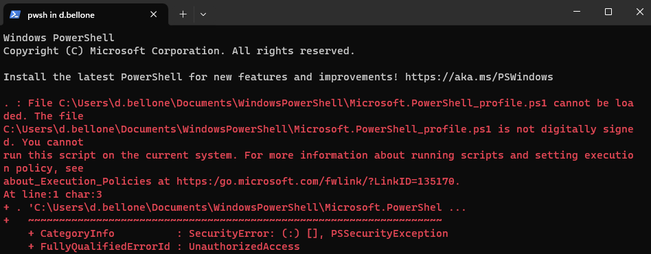
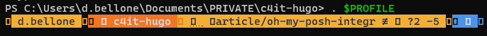

The content of the blog you are reading right now is stored in a Git repository. Every time I create an article, I create a new Git Branch to isolate the changes.

To generate the skeleton of the articles, I use the command line (well, I generally use PowerShell); in particular, given that I'm using both Windows 10 and Windows 11 - depending on the laptop I'm working on - I use the **Integrated Terminal**, which allows you to define the style, the fonts, and so on of every terminal configured in the settings.


The **default profile is pretty basic**: no info is shown except for the current path - I want to customize the appearance.

I want to show the status of the Git repository, including:

- repository name
- branch name
- outgoing commits

There are lots of articles that teach how to use OhMyPosh with Cascadia Code. _Unfortunately, I couldn't make them work._

In this article, I teach you **how I fixed it on my local machine**. It's a **step-by-step guide** I wrote while installing it on my local machine. I hope it works for you as well!

## Step 1: Create the $PROFILE file if it does not exist

In PowerShell, you can customize the current execution by updating the `$PROFILE` file.

Clearly, you first have to **check if the profile file exists**.

Open the PowerShell and type:

```bash
$PROFILE # You can also use $profile lowercase - it's the same!
```

This command shows you the **expected path of this file**. The file, if it exists, is stored in that location.


In this case, the `$Profile` file should be available under the folder `C:\Users\d.bellone\Documents\WindowsPowerShell`. In my case, it does not exist, though!


Therefore, you must create it manually: head to that folder and **create a file named `Microsoft.PowerShell_profile.ps1`.**

Note: it might happen that not even the `WindowsPowerShell` folder exists. If it's missing, well, create it!

## Step 2: Install OhMyPosh using Winget, Scoop, or PowerShell

To use _OhMyPosh_, we have to - of course - install it.

As explained [in the official documentation](https://ohmyposh.dev/docs/installation/windows), we have **three ways to install OhMyPosh**, depending on the tool you prefer.

If you use **Winget**, just run:

```bash
winget install JanDeDobbeleer.OhMyPosh -s winget
```

If you prefer **Scoop**, the command is:

```bash
scoop install https://github.com/JanDeDobbeleer/oh-my-posh/releases/latest/download/oh-my-posh.json
```

And, if you like working with **PowerShell**, execute:

```powershell
Set-ExecutionPolicy Bypass -Scope Process -Force; Invoke-Expression ((New-Object System.Net.WebClient).DownloadString('https://ohmyposh.dev/install.ps1'))
```

I used _Winget_, and you can see the installation process here:



Now, to apply these changes, you have to **restart the PowerShell**.

## Step 3: Add OhMyPosh to the PowerShell profile

Open the `Microsoft.PowerShell_profile.ps1` file and add the following line:

```powershell
oh-my-posh init pwsh | Invoke-Expression
```

This command is executed every time you open the PowerShell with the default profile, and it initializes OhMyPosh to have it available during the current session.

Now, you can save and close the file.

_Hint: you can open the profile file with Notepad by running `notepad $PROFILE`._

## Step 4: Set the Execution Policy to RemoteSigned

Restart the terminal. In all probability, you will see an error like this:



The error message

> The file `<path>\Microsoft.PowerShell_profile.ps1` is
> not digitally signed. You cannot run this script on the current system

means that PowerShell does not trust the script it's trying to load.

To see which Execution Policy is currently active, run:

```powershell
Get-ExecutionPolicy
```

You'll probably see that the value is `AllSigned`.

To enable the execution of scripts created on your local machine, you have to **set the Execution Policy value to `RemoteSigned`**, using this command by **running the PowerShell in administrator mode**:

```powershell
Set-ExecutionPolicy RemoteSigned
```

Let's see the definition of the `RemoteSigned` Execution policy as per [SQLShack's article](https://www.sqlshack.com/choosing-and-setting-a-powershell-execution-policy):

> This is also a **safe PowerShell Execution policy to set in an enterprise environment**. This policy dictates that any script that was not created on the system that the script is running on, should be signed. Therefore, **this will allow you to write your own script and execute it**.

So, yeah, feel free to proceed and set the new Execution policy to have your PowerShell profile loaded correctly every time you open a new PowerShell instance.

Now, OhMyPosh can run in the current profile.

Head to a Git repository and notice that... It's not working!🤬 Or, well, we have the Git information, but we are missing some icons and glyphs.



## Step 5: Use CaskaydiaCove, not Cascadia Code, as a font

We still have to **install the correct font with the missing icons**.

We will install it using [Chocolatey](https://chocolatey.org/install), a package manager available for Windows 11.

To check if you have it installed, run:

```bash
choco -v
```

Now, to install the correct font family, **open a PowerShell with administration privileges** and run:

```bash
choco install cascadia-code-nerd-font
```

Once the installation is complete, you must tell Integrated Terminal to use the correct font by following these steps:

1. open to the _Settings_ page (by hitting `CTRL + ,`)
2. select the profile you want to update (in my case, I'll update the default profile)
3. open the _Appearance_ section
4. under _Font face_ **select CaskaydiaCove Nerd Font**


Now close the Integrated Terminal to apply the changes.

Open it again, navigate to a Git repository, and admire the result.


## Further readings

The first time I read about OhMyPosh, it was on Scott Hanselman's blog. I couldn't make his solution work - and that's the reason I wrote this article. However, in his article, he shows how he customized his own Terminal with more glyphs and icons, so you should give it a read.

🔗 [My Ultimate PowerShell prompt with Oh My Posh and the Windows Terminal | Scott Hanselman's blog](https://www.hanselman.com/blog/my-ultimate-powershell-prompt-with-oh-my-posh-and-the-windows-terminal)

We customized our PowerShell profile with just one simple configuration. However, you can do a lot more. You can read Ruud's in-depth article about PowerShell profiles.

🔗 [How to Create a PowerShell Profile – Step-by-Step | Lazyadmin](https://lazyadmin.nl/powershell/powershell-profile/)

One of the core parts of this article is that we have to use _CaskaydiaCove_ as a font instead of the (in)famous _Cascadia Code_. But why?

🔗 [Why CaskaydiaCove and not Cascadia Code? | GitHub](https://github.com/ryanoasis/nerd-fonts/tree/master/patched-fonts/CascadiaCode#why-caskaydiacove-and-not-cascadia-code)

Finally, as I said at the beginning of this article, I use Git and Git Branches to handle the creation and management of my blog articles. That's just the tip of the iceberg! 🏔️

If you want to steal my (previous) workflow, have a look at the behind-the-scenes of my blogging process (note: in the meanwhile, a lot of things have changed, but these steps can still be helpful for you)

🔗 [From idea to publishing, and beyond: how I automated my blogging workflow with GitHub, PowerShell, and Azure | Code4IT](https://www.code4it.dev/blog/automate-blogging-workflow-github-powershell-azure/)

_This article first appeared on [Code4IT 🐧](https://www.code4it.dev/)_

## Wrapping up

In this article, we learned how to install OhMyPosh in PowerShell and overcome all the errors you (well, I) don't see described in other articles.

I wrote this step-by-step article alongside installing these tools on my local machine, so **I'm confident the solution will work**.

Did this solution work for you? Let me know! 📨

I hope you enjoyed this article! Let's keep in touch on [Twitter](https://twitter.com/BelloneDavide) or [LinkedIn](https://www.linkedin.com/in/BelloneDavide/)! 🤜🤛

Happy coding!

🐧
