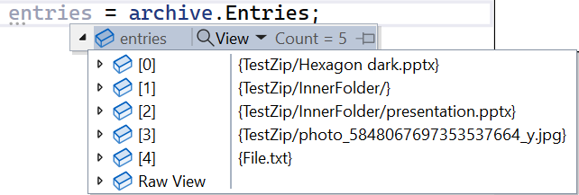
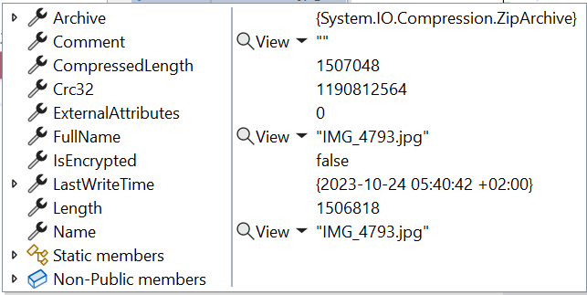
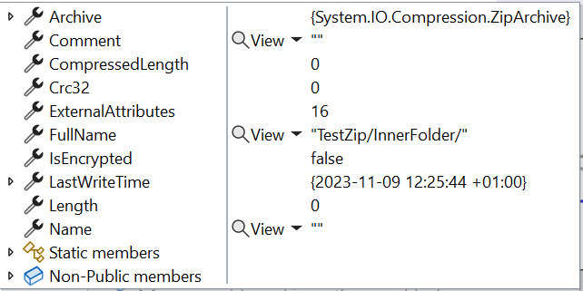

When working with local files, you might need to open, create, or update Zip files.

In this article, we are gonna learn how to work with Zip files in C#. We will learn how to perform the basic operations such as open, extract, and create a Zip file.

The main class we are going to use is called `ZipFile`, and comes from the `System.IO.Compression` namespace. It's been present in C# since .NET Framework 4.5, so we can say it's pretty stable 😉

## How to list all items in a Zip file

Once you have a Zip file, you might want to access the internal items without extracting the whole Zip.

You can use the `ZipFile.Open` method.

```cs
using ZipArchive archive = ZipFile.Open(zipFilePath, ZipArchiveMode.Read);
System.Collections.ObjectModel.ReadOnlyCollection<ZipArchiveEntry> entries = archive.Entries;
```

Notice that I specified the `ZipArchiveMode`. This is an Enum whose values are `Read`, `Create`, and `Update`.

By using the `Entries` property of the `ZipArchive`, you can access the whole list of files stored within the Zip folder, each of them represented by a `ZipArchiveEntry` instance.



The `ZipArchiveEntry` object contains several fields, like the name of the file, the full path (from the root archive).



There are a few key points to remember about the entries listed in the `ZipArchiveEntry`.

1. It is a `ReadOnlyCollection<ZipArchiveEntry>`: it means that even if you find a way to add or update the items in-memory, the changes are not applied to the actual files;
2. **It lists all files and folders**, not only the once at the root level. As you can see from the image above, it lists both the file at root level (*File.txt*), and those in inner folders (*TestZip/InnerFolder/presentation.pptx*);
3. Each file is charachterized by two properties: `Name` is the actual file name (like *presentation.pptx*), and `FullName` also contains the path from the root of the archive (eg *TestZip/InnerFolder/presentation.pptx*);
4. It also lists folders as if they were files: in the image above you can see *TestZip/InnerFolder*. You can recognize them because their `Name` property is empty and they `Length` is 0;



Lastly, remember that **`ZipFile.Open` returns an `IDisposable`**, so you should place the operations within a `using` statement.

❓❓A question for you! Why do we see an item for the *TestZip/InnerFolder* folder, but there is no reference to the *TestZip* folder? Drop a comment below 📩

## How to extract the Zip to a local path

Extracting a Zip folder is easy, but not totally obvious.

We have only one way to do that: by caling the `ZipFile.ExtractToDirectory` method.

It accepts as mandatory parameters the path of the Zip file to be extracted and the path to the destination:

```cs
var zipPath = @"C:\Users\d.bellone\Desktop\TestZip.zip";
var destinationPath = @"C:\Users\d.bellone\Desktop\MyDestination";
ZipFile.ExtractToDirectory(zipPath, destinationPath);
```

Once you run it, you will see the content of the Zip copied and estracted to the *MyDestination* folder.

Note that **this method creates the destination folder** if it does not exist.

This method accepts two more parameters:

- `entryNameEncoding`, by which you can specify the encoding. **The default value is UTF-8**.
- `overwriteFiles` allows you to specify whether it must overwrite existing files. The default value is `false`. If set to false and the destination files already exist, this method throws a `System.IO.IOException` saying that the file already exists.

## Create a Zip from a folder

The key method here is `ZipFile.CreateFromDirectory`, which allows you to create Zip files in a flexible way.

The first mandatory value is, of course, the *source directory path*.

The second mandatory parameter is the destination of the resulted Zip file.

It can be the *local path* to the file:

```cs
string sourceFolderPath = @"\Desktop\myFolder";
string destinationZipPath = @"\Desktop\destinationFile.zip";

ZipFile.CreateFromDirectory(sourceFolderPath, destinationZipPath);
```

Or it can be a `Stream` that you can use later for other operations:

```cs
using (MemoryStream memStream = new MemoryStream())
{
    string sourceFolderPath = @"\Desktop\myFolder";
    ZipFile.CreateFromDirectory(sourceFolderPath, memStream);

    var lenght = memStream.Length;// here the Stream is populated
}
```

You can finally add some optional parameters:

- `compressionLevel`, whose values are `Optimal`, `Fastest`, `NoCompression`, `SmallestSize`.
- `includeBaseDirectory`: a flag that defines if you have to copy only the fist-level files or also the root folder.

## A quick comparison of Compression Levels

As we just saw, we have 4 compression levels: `Optimal`, `Fastest`, `NoCompression`, `SmallestSize`.

What happens if I use the different values to zip all the photos and videos of my latest trip?

The source folder's size is 16.2 GB.

Let me zip it with the four compression levels:

```cs
 private long CreateAndTrack(string sourcePath, string destinationPath, CompressionLevel compression)
 {
     Stopwatch stopwatch = Stopwatch.StartNew();

     ZipFile.CreateFromDirectory(
         sourceDirectoryName: sourcePath,
         destinationArchiveFileName: destinationPath,
         compressionLevel: compression,
         includeBaseDirectory: true
         );
     stopwatch.Stop();

     return stopwatch.ElapsedMilliseconds;
 }

// in Main...

var smallestTime = CreateAndTrack(sourceFolderPath,
    Path.Combine(rootFolder, "Smallest.zip"),
    CompressionLevel.SmallestSize);

var noCompressionTime = CreateAndTrack(sourceFolderPath,
    Path.Combine(rootFolder, "NoCompression.zip"),
    CompressionLevel.NoCompression);

var fastestTime = CreateAndTrack(sourceFolderPath,
    Path.Combine(rootFolder, "Fastest.zip"),
    CompressionLevel.Fastest);

var optimalTime = CreateAndTrack(sourceFolderPath,
    Path.Combine(rootFolder, "Optimal.zip"),
    CompressionLevel.Optimal);
    
 _output.WriteAsJson(new
 {
     Smallest = smallestTime,
     NoCompressionTime = noCompressionTime,
     FastestTime = fastestTime,
     OptimalTime = optimalTime
 });
```

By executing this operation, we have this table:

|  Compression Type | Execution time (ms) | Size (bytes)   | Size on disk (bytes) |
|-------------------|---------------------|----------------|----------------------|
| Optimal           | a                   | b              | c                    |
| Fastest           | d                   | 16,935,519,764 | 17,004,888,064       |
| Smallest          | e                   | 17,339,881,242 | 17,339,883,520       |
| No Compression    | f                   | 17,497,652,162 | 17,497,653,248       |


We can see a weird thing: Fastest compression generates a smaller file than Smallest compression.

## Wrapping up

This was a quick article about one specific class in the .NET ecosystem.

As we saw, even though the class is simple and it's all about 3 methods, there are some things you should keep in mind before using this class in your code.

I hope you enjoyed this article! Let's keep in touch on [Twitter](https://twitter.com/BelloneDavide) or [LinkedIn](https://www.linkedin.com/in/BelloneDavide/)! 🤜🤛

Happy coding!

🐧


[ ] Titoli
[ ] Frontmatter
[ ] Rinomina immagini
[ ] Alt Text per immagini
[ ] Grammatica
[ ] Bold/Italics
[ ] Nome cartella e slug devono combaciare
[ ] Immagine di copertina
[ ] Rimuovi secrets dalle immagini
[ ] Pulizia formattazione
[ ] Controlla se ASP.NET Core oppure .NET
[ ] Metti la giusta OgTitle
[ ] Fai resize della immagine di copertina
 