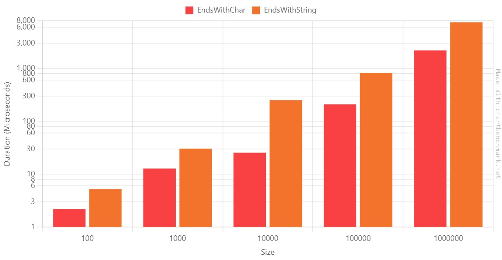
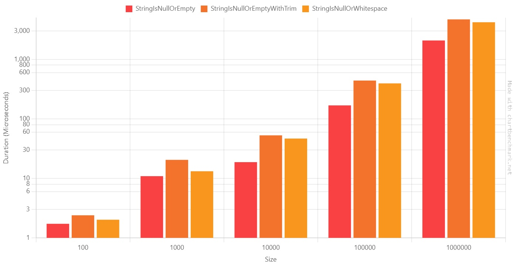
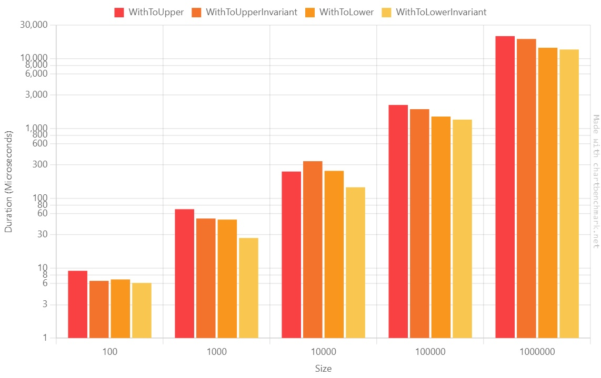
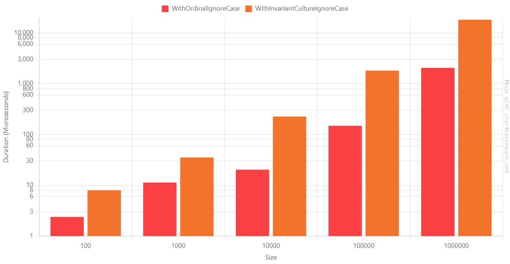

**Sometimes, just a minor change makes a huge difference**. Maybe you won't notice it when performing the same operation a few times. Still, the improvement is significant when repeating the operation thousands of times.

In this article, we will learn five simple tricks to improve the performance of your application when dealing with strings.

Note: this article is part of [C# Advent Calendar 2023](https://csadvent.christmas/), organized by [Matthew D. Groves](https://twitter.com/mgroves): it's maybe the only Christmas tradition I like (yes, I'm kind of a Grinch 😂).

## Benchmark structure, with dependencies

Before jumping to the benchmarks, I want to spend a few words on the tools I used for this article.

The project is a **.NET 8 class library** running on a laptop with an i5 processor.

### Running benchmarks with BenchmarkDotNet

I'm using **BenchmarkDotNet to create benchmarks** for my code. BenchmarkDotNet is a library that runs your methods several times, captures some metrics, and generates a report of the executions. If you follow my blog, you might know I've used it several times - for example, in my old article "[Enum.HasFlag performance with BenchmarkDotNet](https://www.code4it.dev/blog/hasflag-performance-benchmarkdotnet/)".

All the benchmarks I created follow the same structure:

```cs
[MemoryDiagnoser]
public class BenchmarkName()
{
    [Params(1, 5, 10)] // clearly, I won't use these values
    public int Size;

    public string[] AllStrings { get; set; }

    [IterationSetup]
    public void Setup()
    {
        AllStrings = StringArrayGenerator.Generate(Size, "hello!", "HELLO!");
    }

    [Benchmark(Baseline=true)]
    public void FirstMethod()
    {
        //omitted
    }

    [Benchmark]
    public void SecondMethod()
    {
        //omitted
    }
}
```

In short:

- the class is marked with the `[MemoryDiagnoser]` attribute: the benchmark will retrieve info for both time and memory usage;
- there is a property named `Size` with the attribute `[Params]`: this attribute lists the possible values for the `Size` property;
- there is a method marked as `[IterationSetup]`: this method runs before every single execution, takes the value from the `Size` property, and initializes the `AllStrings` array;
- the methods that are parts of the benchmark are marked with the `[Benchmark]` attribute.

### Generating strings with Bogus

I relied on **Bogus to create dummy values**. This NuGet library allows you to generate realistic values for your objects with a great level of customization.

The string array generation strategy is shared across all the benchmarks, so I moved it to a static method:

```cs
 public static class StringArrayGenerator
 {
     public static string[] Generate(int size, params string[] additionalStrings)
     {
         string[] array = new string[size];
         Faker faker = new Faker();

         List<string> fixedValues = [
             string.Empty,
             "   ",
             "\n  \t",
             null
         ];

         if (additionalStrings != null)
             fixedValues.AddRange(additionalStrings);

         for (int i = 0; i < array.Length; i++)
         {
             if (Random.Shared.Next() % 4 == 0)
             {
                 array[i] = Random.Shared.GetItems<string>(fixedValues.ToArray(), 1).First();
             }
             else
             {
                 array[i] = faker.Lorem.Word();
             }
         }

         return array;
     }
 }
```

Here I have a default set of predefined values (`[string.Empty, "   ", "\n  \t", null]`), which can be expanded with the values coming from the `additionalStrings` array. These values are then placed in random positions of the array.

In most cases, though, the value of the string is defined by Bogus.

### Generating plots with chartbenchmark.net

To generate the plots you will see in this article, I relied on **[chartbenchmark.net](https://chartbenchmark.net/), a fantastic tool that transforms the output generated by BenchmarkDotNet on the console in a dynamic, customizable plot**. This tool created by [Carlos Villegas](https://github.com/yv989c) is available on GitHub, and it surely deservs a star!

Please note that **all the plots in this article have a Log10 scale**: this scale allows me to show you the performance values of all the executions in the same plot. If I used the Linear scale, you would be able to see only the biggest values.

We are ready. **It's time to run some benchmarks!**

## Tip #1: StringBuilder is (almost always) better than String Concatenation

Let's start with a simple trick: if you need to concatenate strings, **using a StringBuilder is _generally_ more efficient than concatenating string**.

```cs
[MemoryDiagnoser]
public class StringBuilderVsConcatenation()
{
    [Params(4, 100, 10_000, 100_000)]
    public int Size;

    public string[] AllStrings { get; set; }

    [IterationSetup]
    public void Setup()
    {
        AllStrings = StringArrayGenerator.Generate(Size, "hello!", "HELLO!");
    }

    [Benchmark]
    public void WithStringBuilder()
    {
        StringBuilder sb = new StringBuilder();

        foreach (string s in AllStrings)
        {
            sb.Append(s);
        }

        var finalString = sb.ToString();
    }

    [Benchmark]
    public void WithConcatenation()
    {
        string finalString = "";
        foreach (string s in AllStrings)
        {
            finalString += s;
        }
    }
}
```

**Whenever you concatenate strings with the `+` sign, you create a new instance of a `string`.** This operation takes some time and allocates memory for every operation.

On the contrary, using a `StringBuilder` object, you can add the strings in memory and generate the final string using a performance-wise method.

Here's the result table:

| Method            | Size   |             Mean |          Error |        StdDev |           Median |    Ratio | RatioSD |     Allocated | Alloc Ratio |
| ----------------- | ------ | ---------------: | -------------: | ------------: | ---------------: | -------: | ------: | ------------: | ----------: |
| WithStringBuilder | 4      |         4.891 us |      0.5568 us |      1.607 us |         4.750 us |     1.00 |    0.00 |        1016 B |        1.00 |
| WithConcatenation | 4      |         3.130 us |      0.4517 us |      1.318 us |         2.800 us |     0.72 |    0.39 |         776 B |        0.76 |
|                   |        |                  |                |               |                  |          |         |               |             |
| WithStringBuilder | 100    |         7.649 us |      0.6596 us |      1.924 us |         7.650 us |     1.00 |    0.00 |        4376 B |        1.00 |
| WithConcatenation | 100    |        13.804 us |      1.1970 us |      3.473 us |        13.800 us |     1.96 |    0.82 |       51192 B |       11.70 |
|                   |        |                  |                |               |                  |          |         |               |             |
| WithStringBuilder | 10000  |       113.091 us |      4.2106 us |     12.081 us |       111.000 us |     1.00 |    0.00 |      217200 B |        1.00 |
| WithConcatenation | 10000  |    74,512.259 us |  2,111.4213 us |  6,058.064 us |    72,593.050 us |   666.43 |   91.44 |   466990336 B |    2,150.05 |
|                   |        |                  |                |               |                  |          |         |               |             |
| WithStringBuilder | 100000 |     1,037.523 us |     37.1009 us |    108.225 us |     1,012.350 us |     1.00 |    0.00 |     2052376 B |        1.00 |
| WithConcatenation | 100000 | 7,469,344.914 us | 69,720.9843 us | 61,805.837 us | 7,465,779.900 us | 7,335.08 |  787.44 | 46925872520 B |   22,864.17 |

Let's see it as a plot.

**Beware of the scale in the diagram!: it's a Log10 scale**, so you'd better have a look at the value displayed on the Y-axis.


As you can see, there is a considerable performance improvement.

There are some remarkable points:

1. When there are just a few strings to concatenate, the `+` operator is more performant, both on timing and allocated memory;
2. When you need to concatenate 100000 strings, the concatenation is **~7000 times slower** than the string builder.

In conclusion, use the `StringBuilder` to concatenate more than 5 or 6 strings. Use the string concatenation for smaller operations.

## Tip #2: EndsWith(string) vs EndsWith(char): pick the right overload

One simple improvement can be made if you use `StartsWith` or `EndsWith`, passing a single character.

There are two similar overloads: one that accepts a `string`, and one that accepts a `char`.

```cs
[MemoryDiagnoser]
public class EndsWithStringVsChar()
{
    [Params(100, 1000, 10_000, 100_000, 1_000_000)]
    public int Size;

    public string[] AllStrings { get; set; }

    [IterationSetup]
    public void Setup()
    {
        AllStrings = StringArrayGenerator.Generate(Size);
    }

    [Benchmark(Baseline = true)]
    public void EndsWithChar()
    {
    foreach (string s in AllStrings)
    {
        _ = s?.EndsWith('e');
    }
    }

    [Benchmark]
    public void EndsWithString()
    {
    foreach (string s in AllStrings)
    {
        _ = s?.EndsWith("e");
    }
    }
}
```

We have the following results:

| Method             | Size    |         Mean |       Error |      StdDev |       Median | Ratio |
| ------------------ | ------- | -----------: | ----------: | ----------: | -----------: | ----: |
| **EndsWithChar**   | 100     |     2.189 us |   0.2334 us |   0.6771 us |     2.150 us |  1.00 |
| **EndsWithString** | 100     |     5.228 us |   0.4495 us |   1.2970 us |     5.050 us |  2.56 |
|                    |         |              |             |             |              |       |
| **EndsWithChar**   | 1000    |    12.796 us |   1.2006 us |   3.4831 us |    12.200 us |  1.00 |
| **EndsWithString** | 1000    |    30.434 us |   1.8783 us |   5.4492 us |    29.250 us |  2.52 |
|                    |         |              |             |             |              |       |
| **EndsWithChar**   | 10000   |    25.462 us |   2.0451 us |   5.9658 us |    23.950 us |  1.00 |
| **EndsWithString** | 10000   |   251.483 us |  18.8300 us |  55.2252 us |   262.300 us | 10.48 |
|                    |         |              |             |             |              |       |
| **EndsWithChar**   | 100000  |   209.776 us |  18.7782 us |  54.1793 us |   199.900 us |  1.00 |
| **EndsWithString** | 100000  |   826.090 us |  44.4127 us | 118.5465 us |   781.650 us |  4.14 |
|                    |         |              |             |             |              |       |
| **EndsWithChar**   | 1000000 | 2,199.463 us |  74.4067 us | 217.0480 us | 2,190.600 us |  1.00 |
| **EndsWithString** | 1000000 | 7,506.450 us | 190.7587 us | 562.4562 us | 7,356.250 us |  3.45 |

Again, let's generate the plot using the _Log10_ scale:



They appear to be almost identical, but look closely: _based on this benchmark_, when we have 10000, using `EndsWith(string)` is 10x slower than `EndsWith(char)`.

Also, here, the duration ratio on the 1.000.000-items array is ~3.5. At first, I thought there was an error on the benchmark, but when rerunning it on the benchmark, the ratio did not change.

It looks like you have the best improvement ratio when the array has ~10.000 items.

## Tip #3: IsNullOrEmpty vs IsNullOrWhitespace vs IsNullOrEmpty + Trim

As you might know, `string.IsNullOrWhiteSpace` performs stricter checks than `string.IsNullOrEmpty`.

(If you didn't know, have a look [at this quick explanation](https://www.code4it.dev/csharptips/string-isnullorempty-isnullorwhitespace/) of the cases covered by these methods).

Does it affect performance?

To demonstrate it, I have created three benchmarks: one for `string.IsNullOrEmpty`, one for `string.IsNullOrWhiteSpace`, and another one that lays in between: it first calls `Trim()` on the string, and then calls `string.IsNullOrEmpty`.

```cs
[MemoryDiagnoser]
public class StringEmptyBenchmark
{
    [Params(100, 1000, 10_000, 100_000, 1_000_000)]
    public int Size;

    public string[] AllStrings { get; set; }

    [IterationSetup]
    public void Setup()
    {
        AllStrings = StringArrayGenerator.Generate(Size);
    }

    [Benchmark(Baseline = true)]
    public void StringIsNullOrEmpty()
    {
        foreach (string s in AllStrings)
        {
            _ = string.IsNullOrEmpty(s);
        }
    }

    [Benchmark]
    public void StringIsNullOrEmptyWithTrim()
    {
        foreach (string s in AllStrings)
        {
            _ = string.IsNullOrEmpty(s?.Trim());
        }
    }

    [Benchmark]
    public void StringIsNullOrWhitespace()
    {
        foreach (string s in AllStrings)
        {
            _ = string.IsNullOrWhiteSpace(s);
        }
    }
}
```

We have the following values:

| Method                          | Size    |         Mean |       Error |      StdDev | Ratio |
| ------------------------------- | ------- | -----------: | ----------: | ----------: | ----: |
| **StringIsNullOrEmpty**         | 100     |     1.723 us |   0.2302 us |   0.6715 us |  1.00 |
| **StringIsNullOrEmptyWithTrim** | 100     |     2.394 us |   0.3525 us |   1.0282 us |  1.67 |
| **StringIsNullOrWhitespace**    | 100     |     2.017 us |   0.2289 us |   0.6604 us |  1.45 |
|                                 |         |              |             |             |       |
| **StringIsNullOrEmpty**         | 1000    |    10.885 us |   1.3980 us |   4.0781 us |  1.00 |
| **StringIsNullOrEmptyWithTrim** | 1000    |    20.450 us |   1.9966 us |   5.8240 us |  2.13 |
| **StringIsNullOrWhitespace**    | 1000    |    13.160 us |   1.0851 us |   3.1482 us |  1.34 |
|                                 |         |              |             |             |       |
| **StringIsNullOrEmpty**         | 10000   |    18.717 us |   1.1252 us |   3.2464 us |  1.00 |
| **StringIsNullOrEmptyWithTrim** | 10000   |    52.786 us |   1.2208 us |   3.5222 us |  2.90 |
| **StringIsNullOrWhitespace**    | 10000   |    46.602 us |   1.2363 us |   3.4668 us |  2.54 |
|                                 |         |              |             |             |       |
| **StringIsNullOrEmpty**         | 100000  |   168.232 us |  12.6948 us |  36.0129 us |  1.00 |
| **StringIsNullOrEmptyWithTrim** | 100000  |   439.744 us |   9.3648 us |  25.3182 us |  2.71 |
| **StringIsNullOrWhitespace**    | 100000  |   394.310 us |   7.8976 us |  20.5270 us |  2.42 |
|                                 |         |              |             |             |       |
| **StringIsNullOrEmpty**         | 1000000 | 2,074.234 us |  64.3964 us | 186.8257 us |  1.00 |
| **StringIsNullOrEmptyWithTrim** | 1000000 | 4,691.103 us | 112.2382 us | 327.4040 us |  2.28 |
| **StringIsNullOrWhitespace**    | 1000000 | 4,198.809 us |  83.6526 us | 161.1702 us |  2.04 |

As you can see from the Log10 table, the results are pretty similar:



On average, `StringIsNullOrWhitespace` is ~2 times slower than `StringIsNullOrEmpty`.

So, what should we do? Here's my two cents:

1. For all the data coming from _the outside_ (passed as input to your system, received from an API call, read from the database), use `string.IsNUllOrWhiteSpace`: this way you can ensure that you are not receiving unexpected data;
2. If you read data from an external API, customize your JSON deserializer to convert whitespace strings as empty values;
3. Needless to say, choose the proper method depending on the use case. If a string like "\n \n \t" is a valid value for you, use `string.IsNullOrEmpty`.

## Tip #4: ToUpper vs ToUpperInvariant vs ToLower vs ToLowerInvariant: they look similar, but they are not

Even though they look similar, there is a difference in terms of performance between these four methods.

```cs
[MemoryDiagnoser]
public class ToUpperVsToLower()
{
    [Params(100, 1000, 10_000, 100_000, 1_000_000)]
    public int Size;

    public string[] AllStrings { get; set; }

    [IterationSetup]
    public void Setup()
    {
        AllStrings = StringArrayGenerator.Generate(Size);
    }

    [Benchmark]
    public void WithToUpper()
    {
        foreach (string s in AllStrings)
        {
            _ = s?.ToUpper();
        }
    }

    [Benchmark]
    public void WithToUpperInvariant()
    {
        foreach (string s in AllStrings)
        {
            _ = s?.ToUpperInvariant();
        }
    }

    [Benchmark]
    public void WithToLower()
    {
        foreach (string s in AllStrings)
        {
            _ = s?.ToLower();
        }
    }

    [Benchmark]
    public void WithToLowerInvariant()
    {
        foreach (string s in AllStrings)
        {
            _ = s?.ToLowerInvariant();
        }
    }
}
```

What will this benchmark generate?

| Method               | Size    |          Mean |       Error |       StdDev |        Median |           P95 | Ratio |
| -------------------- | ------- | ------------: | ----------: | -----------: | ------------: | ------------: | ----: |
| WithToUpper          | 100     |      9.153 us |   0.9720 us |     2.789 us |      8.200 us |     14.980 us |  1.57 |
| WithToUpperInvariant | 100     |      6.572 us |   0.5650 us |     1.639 us |      6.200 us |      9.400 us |  1.14 |
| WithToLower          | 100     |      6.881 us |   0.5076 us |     1.489 us |      7.100 us |      9.220 us |  1.19 |
| WithToLowerInvariant | 100     |      6.143 us |   0.5212 us |     1.529 us |      6.100 us |      8.400 us |  1.00 |
|                      |         |               |             |              |               |               |       |
| WithToUpper          | 1000    |     69.776 us |   9.5416 us |    27.833 us |     68.650 us |    108.815 us |  2.60 |
| WithToUpperInvariant | 1000    |     51.284 us |   7.7945 us |    22.860 us |     38.700 us |     89.290 us |  1.85 |
| WithToLower          | 1000    |     49.520 us |   5.6085 us |    16.449 us |     48.100 us |     79.110 us |  1.85 |
| WithToLowerInvariant | 1000    |     27.000 us |   0.7370 us |     2.103 us |     26.850 us |     30.375 us |  1.00 |
|                      |         |               |             |              |               |               |       |
| WithToUpper          | 10000   |    241.221 us |   4.0480 us |     3.588 us |    240.900 us |    246.560 us |  1.68 |
| WithToUpperInvariant | 10000   |    339.370 us |  42.4036 us |   125.028 us |    381.950 us |    594.760 us |  1.48 |
| WithToLower          | 10000   |    246.861 us |  15.7924 us |    45.565 us |    257.250 us |    302.875 us |  1.12 |
| WithToLowerInvariant | 10000   |    143.529 us |   2.1542 us |     1.910 us |    143.500 us |    146.105 us |  1.00 |
|                      |         |               |             |              |               |               |       |
| WithToUpper          | 100000  |  2,165.838 us |  84.7013 us |   223.137 us |  2,118.900 us |  2,875.800 us |  1.66 |
| WithToUpperInvariant | 100000  |  1,885.329 us |  36.8408 us |    63.548 us |  1,894.500 us |  1,967.020 us |  1.41 |
| WithToLower          | 100000  |  1,478.696 us |  23.7192 us |    50.547 us |  1,472.100 us |  1,571.330 us |  1.10 |
| WithToLowerInvariant | 100000  |  1,335.950 us |  18.2716 us |    35.203 us |  1,330.100 us |  1,404.175 us |  1.00 |
|                      |         |               |             |              |               |               |       |
| WithToUpper          | 1000000 | 20,936.247 us | 414.7538 us | 1,163.014 us | 20,905.150 us | 22,928.350 us |  1.64 |
| WithToUpperInvariant | 1000000 | 19,056.983 us | 368.7473 us |   287.894 us | 19,085.400 us | 19,422.880 us |  1.41 |
| WithToLower          | 1000000 | 14,266.714 us | 204.2906 us |   181.098 us | 14,236.500 us | 14,593.035 us |  1.06 |
| WithToLowerInvariant | 1000000 | 13,464.127 us | 266.7547 us |   327.599 us | 13,511.450 us | 13,926.495 us |  1.00 |

Let's see it as the usual Log10 plot:



We can notice a few points:

1. The ToUpper family is generally slower than the ToLower family;
2. The Invariant family is faster than the non-Invariant one; we will see more below;

So, if you have to normalize strings using the same casing, `ToLowerInvariant` is the best choice.

## Tip #5: OrdinalIgnoreCase vs InvariantCultureIgnoreCase: logically (almost) equivalent, but with different performance

Comparing strings is trivial: the `string.Compare` method is all you need.

There are several modes to compare strings: you can specify the comparison rules by setting the `comparisonType` parameter, which accepts a `StringComparison` value.

```cs
[MemoryDiagnoser]
public class StringCompareOrdinalVsInvariant()
{
    [Params(100, 1000, 10_000, 100_000, 1_000_000)]
    public int Size;

    public string[] AllStrings { get; set; }

    [IterationSetup]
    public void Setup()
    {
        AllStrings = StringArrayGenerator.Generate(Size, "hello!", "HELLO!");
    }

    [Benchmark(Baseline = true)]
    public void WithOrdinalIgnoreCase()
    {
        foreach (string s in AllStrings)
        {
            _ = string.Equals(s, "hello!", StringComparison.OrdinalIgnoreCase);
        }
    }

    [Benchmark]
    public void WithInvariantCultureIgnoreCase()
    {
        foreach (string s in AllStrings)
        {
            _ = string.Equals(s, "hello!", StringComparison.InvariantCultureIgnoreCase);
        }
    }
}
```

Let's see the results:

| Method                         | Size    |          Mean |       Error |      StdDev | Ratio |
| ------------------------------ | ------- | ------------: | ----------: | ----------: | ----: |
| WithOrdinalIgnoreCase          | 100     |      2.380 us |   0.2856 us |   0.8420 us |  1.00 |
| WithInvariantCultureIgnoreCase | 100     |      7.974 us |   0.7817 us |   2.3049 us |  3.68 |
|                                |         |               |             |             |       |
| WithOrdinalIgnoreCase          | 1000    |     11.316 us |   0.9170 us |   2.6603 us |  1.00 |
| WithInvariantCultureIgnoreCase | 1000    |     35.265 us |   1.5455 us |   4.4591 us |  3.26 |
|                                |         |               |             |             |       |
| WithOrdinalIgnoreCase          | 10000   |     20.262 us |   1.1801 us |   3.3668 us |  1.00 |
| WithInvariantCultureIgnoreCase | 10000   |    225.892 us |   4.4945 us |  12.5289 us | 11.41 |
|                                |         |               |             |             |       |
| WithOrdinalIgnoreCase          | 100000  |    148.270 us |  11.3234 us |  32.8514 us |  1.00 |
| WithInvariantCultureIgnoreCase | 100000  |  1,811.144 us |  35.9101 us |  64.7533 us | 12.62 |
|                                |         |               |             |             |       |
| WithOrdinalIgnoreCase          | 1000000 |  2,050.894 us |  59.5966 us | 173.8460 us |  1.00 |
| WithInvariantCultureIgnoreCase | 1000000 | 18,138.063 us | 360.1967 us | 986.0327 us |  8.87 |

As you can see, **there's a HUGE difference between Ordinal and Invariant**.

When dealing with 100.000 items, `StringComparison.InvariantCultureIgnoreCase` is **12 times slower** than `StringComparison.OrdinalIgnoreCase`!



Why? Also, why should we use one instead of the other?

Have a look at this code snippet:

```cs
var s1 = "Aa";
var s2 = "A" + new string('\u0000', 3) + "a";

string.Equals(s1, s2, StringComparison.InvariantCultureIgnoreCase); //True
string.Equals(s1, s2, StringComparison.OrdinalIgnoreCase); //False
```

As you can see, `s1` and `s2` represent **equivalent, but not equal, strings**. We can then deduce that `OrdinalIgnoreCase` checks for the exact values of the characters, while `InvariantCultureIgnoreCase` checks the string's _"meaning"_.

So, in most cases, you might want to use `OrdinalIgnoreCase` (as always, it depends on your use case!)

## Tip #6: Newtonsoft vs System.Text.Json: it's a matter of memory allocation, not time

For the last benchmark, I created the exact same model used [as an example](https://github.com/bchavez/Bogus/blob/master/Examples/GettingStarted/Program.cs) in the official documentation.

This benchmark aims to see which JSON serialization library is faster: Newtonsoft or System.Text.Json?

```cs
[MemoryDiagnoser]
public class JsonSerializerComparison
{
    [Params(100, 10_000, 1_000_000)]
    public int Size;
    List<User?> Users { get; set; }

    [IterationSetup]
    public void Setup()
    {
        Users = UsersCreator.GenerateUsers(Size);
    }

    [Benchmark(Baseline = true)]
    public void WithJson()
    {
        foreach (User? user in Users)
        {
            var asString = System.Text.Json.JsonSerializer.Serialize(user);

            _ = System.Text.Json.JsonSerializer.Deserialize<User?>(asString);
        }
    }

    [Benchmark]
    public void WithNewtonsoft()
    {
        foreach (User? user in Users)
        {
            string asString = Newtonsoft.Json.JsonConvert.SerializeObject(user);
            _ = Newtonsoft.Json.JsonConvert.DeserializeObject<User?>(asString);
        }
    }
}
```

As you might know, the .NET team has added lots of performance improvements to the JSON Serialization functionalities, and you can really see the difference!

| Method         | Size    |         Mean |       Error |      StdDev |       Median | Ratio | RatioSD |         Gen0 |      Gen1 |     Allocated | Alloc Ratio |
| -------------- | ------- | -----------: | ----------: | ----------: | -----------: | ----: | ------: | -----------: | --------: | ------------: | ----------: |
| WithJson       | 100     |     2.063 ms |   0.1409 ms |   0.3927 ms |     1.924 ms |  1.00 |    0.00 |            - |         - |     292.87 KB |        1.00 |
| WithNewtonsoft | 100     |     4.452 ms |   0.1185 ms |   0.3243 ms |     4.391 ms |  2.21 |    0.39 |            - |         - |     882.71 KB |        3.01 |
|                |         |              |             |             |              |       |         |              |           |               |             |
| WithJson       | 10000   |    44.237 ms |   0.8787 ms |   1.3936 ms |    43.873 ms |  1.00 |    0.00 |    4000.0000 | 1000.0000 |   29374.98 KB |        1.00 |
| WithNewtonsoft | 10000   |    78.661 ms |   1.3542 ms |   2.6090 ms |    78.865 ms |  1.77 |    0.08 |   14000.0000 | 1000.0000 |   88440.99 KB |        3.01 |
|                |         |              |             |             |              |       |         |              |           |               |             |
| WithJson       | 1000000 | 4,233.583 ms |  82.5804 ms | 113.0369 ms | 4,202.359 ms |  1.00 |    0.00 |  484000.0000 | 1000.0000 | 2965741.56 KB |        1.00 |
| WithNewtonsoft | 1000000 | 5,260.680 ms | 101.6941 ms | 108.8116 ms | 5,219.955 ms |  1.24 |    0.04 | 1448000.0000 | 1000.0000 |  8872031.8 KB |        2.99 |

As you can see, Newtonsoft is 2x slower than System.Text.Json, and it allocates 3x the memory compared with the other library.

So, well, if you don't use library-specific functionalities, I suggest you replace _Newtonsoft_ with _System.Text.Json_.

## Wrapping up

In this article, we learned that even tiny changes can make a difference in the long run.

Let's recap some:

1. Using StringBuilder is generally WAY faster than using string concatenation unless you need to concatenate 2 to 4 strings;
2. Sometimes, the difference is not about execution time but memory usage;
3. EndsWith and StartsWith perform better if you look for a char instead of a string. If you think of it, it totally makes sense!
4. More often than not, string.IsNullOrWhiteSpace performs better checks than string.IsNullOrEmpty; however, there is a huge difference in terms of performance, so you should pick the correct method depending on the usage;
5. ToUpper and ToLower look similar; however, ToLower is quite faster than ToUpper;
6. Ordinal and Invariant comparison return the same value for _almost_ every input; but Ordinal is faster than Invariant;
7. Newtonsoft performs similarly to System.Text.Json, but it allocates way more memory.

_This article first appeared on [Code4IT 🐧](https://www.code4it.dev/)_

My suggestion is always the same: **take your time to explore the possibilities! Toy with your code, try to break it, benchmark it. You'll find interesting takes!**

I hope you enjoyed this article! Let's keep in touch on [Twitter](https://twitter.com/BelloneDavide) or [LinkedIn](https://www.linkedin.com/in/BelloneDavide/)! 🤜🤛

Happy coding!

🐧
