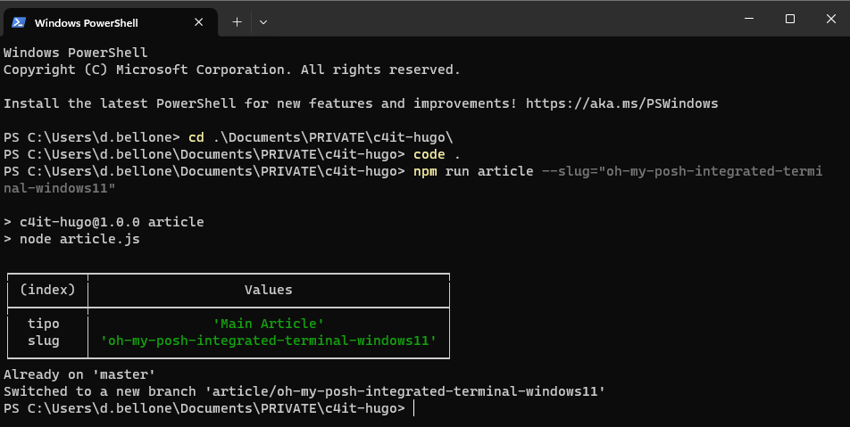
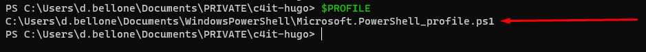
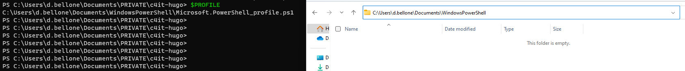
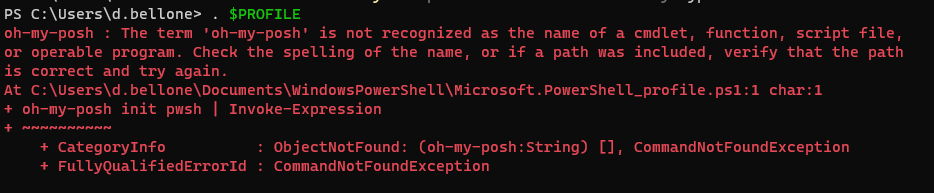
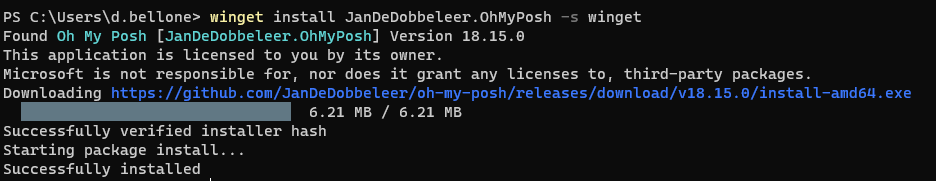
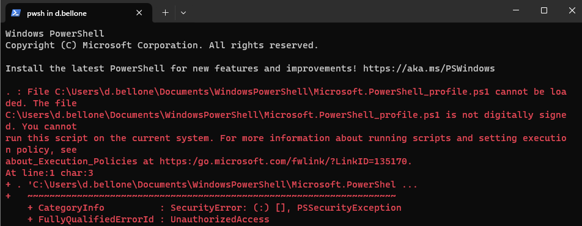
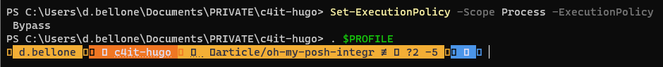
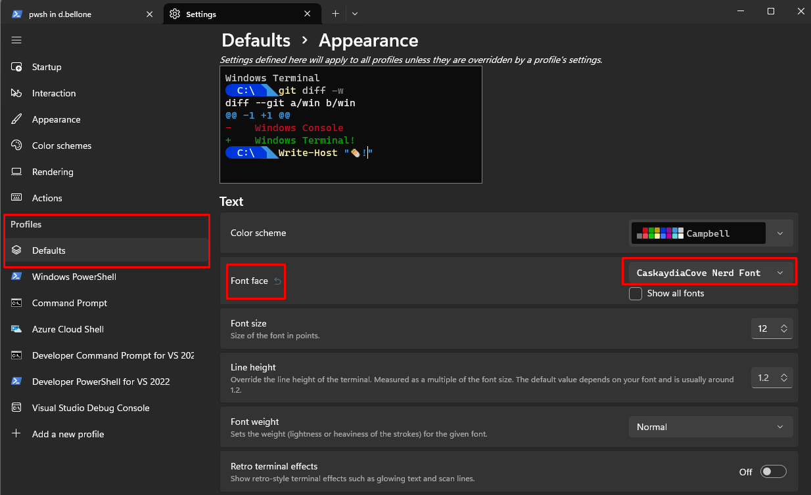

The content of the blog you are reading right now is stored in a GIT repository. Every time I create an article, I create a new GIT Branch to isolate the updates.

To generate the skeleton of the articles I use the command line; in particular, given that I'm using Windows 11, I use the **Integrated Terminal**, which allows you to customize the style, the fonts, and so on of every terminal configured in the settings.



It's a pretty basic setup, and I want to customize it. I want to show the status of the GIT repository, including:

- repository name
- branch name
- outgoing commits

There are lots of articles that teach how to use OhMyPosh with Cascadia Code. *Unfortunately, I couldn't make them work.*

In this article, I teach you how I fixed it in my local machine. It's a step-by-step guide that I wrote while installing it on my local machine. I hope it works for you as well!

## Step 1: Create the $PROFILE if it does not exist

In PowerShell, you can customize the current execution by customizing the `$PROFILE` file.

Clearly, you first have to check is if the profile file exists.

Open the PowerShell and type:

```bash
$PROFILE
```

This command shows you the **expected path of this file**. The file, if exists, is stored in that location.



In this case, the `$Profile` file should be available under the folder `C:\Users\d.bellone\Documents\WindowsPowerShell`. It does not exist, though!



Therefore you have to create it manually: head to that folder, and **create a file named `Microsoft.PowerShell_profile.ps1`.**

## Step 2: Add OhMyPosh to the PowerShell profile

Open the `Microsoft.PowerShell_profile.ps1` file and add the following line:

```bash
oh-my-posh init pwsh | Invoke-Expression
```

Then save and close the file.

*Hint: you can open the profile file with notepad by running `notepad $PROFILE`.*

## Step 3: Run PowerShell with the current profile and fix errors

To execute the current PowerShell instance with the profile we just created, run the command

```bash
. $PROFILE
```

Most probably you will see this error: 

> The file `<path>\Microsoft.PowerShell_profile.ps1` is
not digitally signed. You cannot run this script on the current system.

This happens because the script is potentially unsafe. To allow PowerShell to run the command, you have to _temporarely_ disable these checks by running

```powershell
Set-ExecutionPolicy -Scope Process -ExecutionPolicy Bypass
```

With this command, you are bypassing the checks **only for the current session**.

Run the command, restart the Terminal, and run again `. $PROFILE`. This time, you should be able to see a **different error**:


 
Different error: it means it's a progress! 🚀

## Step 4: Install OhMyPosh

To use [OhMyPosh](https://ohmyposh.dev/docs/installation/windows), we have - of course - to install it.

As explained in the official documentation, we have three ways to install it, depending on the tool you prefer.

If you use **Winget**, just run:

```bash
winget install JanDeDobbeleer.OhMyPosh -s winget
```

If you prefer **Scoop**, the command is:

```bash
scoop install https://github.com/JanDeDobbeleer/oh-my-posh/releases/latest/download/oh-my-posh.json
```

While, if you prefer working with **PowerShell**, just execute:

```bash
Set-ExecutionPolicy Bypass -Scope Process -Force; Invoke-Expression ((New-Object System.Net.WebClient).DownloadString('https://ohmyposh.dev/install.ps1'))
```

I used *Winget*, and you can see the installation process here:



Now, to apply these changes, you have to **restart PowerShell**.

Once you open it again, you will see an error that we already saw:



To fix it **as a temporary workaround**, run again

```powershell
Set-ExecutionPolicy -Scope Process -ExecutionPolicy Bypass
```

Now we can run OhMyPosh in the current profile. To enable it, run

```
. $PROFILE
```

and... **It's not working**! Or, at least, we don't have any icon.



## Step X: Use CaskadyaCove (not Cascadia Code)

We still have to install the right font.

We will install it using [Chocolatey](https://chocolatey.org/install), a package manager available for Windows11.

To check if you have it installed, run

```bash
choco -v
```

Now, to install correct font family, **open a PowerShell with administration privileges** and run:

```bash
choco install cascadia-code-nerd-font
```

Once the installation is complete, you must tell Integrated Terminal to use the correct font:

1. open to the Settings page (by hitting `CTRL + ,`)
2. select the profile you want to update (in my case, I'll update the Default profile)
3. open the Appearance section
4. under Font face select **CaskaydiaCove Nerd Font**



Now close the Integrated Terminal to apply the changes.

Open it again, navigate to a git repository, and admire the result.


## STEP X: Update the ExecutionPolicy

Every time we open the Integrated Terminal we see that terrible _The file `<path>\Microsoft.PowerShell_profile.ps1` is
not digitally signed. You cannot run this script on the current system_ error message.

As a temporary workaround, I suggested to run:

```powershell
Set-ExecutionPolicy -Scope Process -ExecutionPolicy Bypass
```

Now that we know that everything is working correctly, we can (should?) fix it once for all.

To do that, we need to set the Execution Policy to `RemoteSigned`, using this command:

```Get-ExecutionPolicy
# Set the ExecutionPolicy to RemoteSigned:
Set-ExecutionPolicy RemoteSigned
```

Let's see the definition of the `RemoteSigned` Execution policy as per [SQLShack's article](https://www.sqlshack.com/choosing-and-setting-a-powershell-execution-policy):

> This is also a safe PowerShell Execution policy to set in an enterprise environment. This policy dictates that any script that was not created on the system that the script is running on, should be signed. Therefore, this will allow you to write your own script and execute it.

So, yeah, feel free to proceed and set the new Execution policy to have your PowerShell profile loaded correctly every time you open a new PowerShell instance.

## Further readings

The first time I read about OhMyPosh was on Scott Hanselman's blog. I couldn't make his solution work - and that's the reason I wrote this article. However, in his article, he shows how he customized his own Terminal with more glyphs and icons, so you might want to give it a read.

🔗 [My Ultimate PowerShell prompt with Oh My Posh and the Windows Terminal | Scott Hanselman's blog](https://www.hanselman.com/blog/my-ultimate-powershell-prompt-with-oh-my-posh-and-the-windows-terminal)

_This article first appeared on [Code4IT 🐧](https://www.code4it.dev/)_

We customized our PowerShell profile with just one simple configuration. However, there's a lot more. You can read Ruud's in-depth article about PowerShell profiles.

🔗 [How to Create a PowerShell Profile – Step-by-Step | Lazyadmin](https://lazyadmin.nl/powershell/powershell-profile/)

One of the core parts of this article is that we have to use CaskaydiaCove as a font, instead of the (in)famous Cascadia Code. But why?

🔗 [Why CaskaydiaCove and not Cascadia Code? | GitHub](https://github.com/ryanoasis/nerd-fonts/tree/master/patched-fonts/CascadiaCode#why-caskaydiacove-and-not-cascadia-code)

Finally, as I said in the beginning of this article, I use GIT and Git Branches to handle the creation and management of my blog articles. That's just the tip of the iceberg! If you want to steal my (previous) workflow, have a look at the behind the scenes of my blogginh process (note: in the meanwhile a lot of things have changed!)

🔗 [From idea to publishing, and beyond: how I automated my blogging workflow with GitHub, PowerShell, and Azure | Code4IT](https://www.code4it.dev/blog/automate-blogging-workflow-github-powershell-azure/)

## Wrapping up

In this article, we learned how to install OhMyPosh in PowerShell and overcome all the errors you (well, I) don't see described in other articles.

I wrote this step-by-step article alongside installing these tools on my local machine, so I'm pretty confident the solution will work.

Did this solution work for you? Let me know! 📨

I hope you enjoyed this article! Let's keep in touch on [Twitter](https://twitter.com/BelloneDavide) or [LinkedIn](https://www.linkedin.com/in/BelloneDavide/)! 🤜🤛

Happy coding!

🐧

[ ] Titoli
[ ] Frontmatter
[ ] Rinomina immagini
[ ] Alt Text per immagini
[ ] Grammatica
[ ] Bold/Italics
[ ] Nome cartella e slug devono combaciare
[ ] Immagine di copertina
[ ] Rimuovi secrets dalle immagini
[ ] Pulizia formattazione
[ ] Controlla se ASP.NET Core oppure .NET
[ ] Metti la giusta OgTitle
[ ] Fai resize della immagine di copertina
[ ] PowerShell con S maiuscola
[ ] Integrated Terminal con T maiuscola
[ ] Prova con l'altro PC a rifare il giro, ottimizzando il tutto:
 
 - set execution policy (prima, peró, leggi la policy corrente)
 - install OhMyPosh
 - set Profile
 - install font
 - customize PowerShell