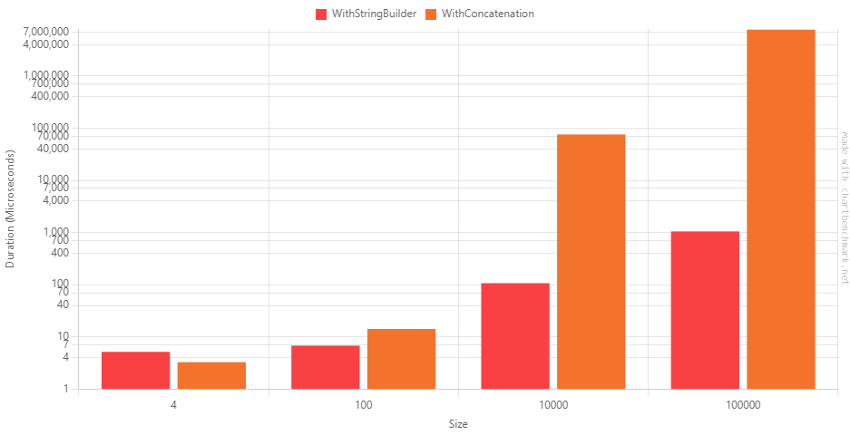
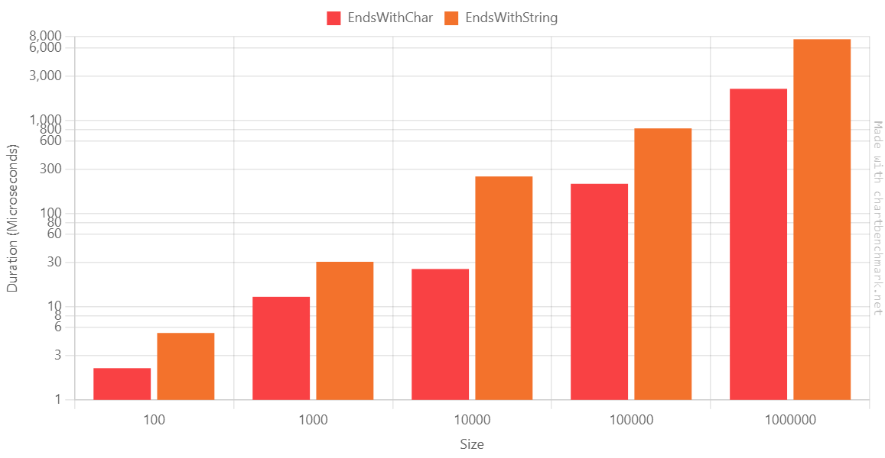
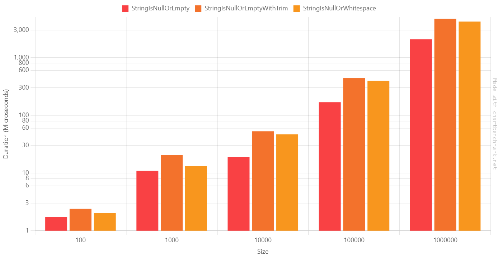
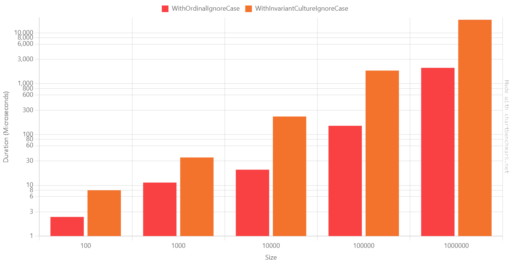

Sometimes, just a minor change makes a huge difference. Maybe you won't notice it when performing the operation a few times, but the improvement is significant when repeating the operation thousands of time.

In this article, we will learn five simple tricks to improve the performance of your application when dealing with strings.

Note: this article is part of [C# Advent Calendar 2023](https://csadvent.christmas/), organized by [Matthew D. Groves](https://twitter.com/mgroves): it's maybe the only Christmas tradition I like (yes, I'm kinda of a Grinch 😂).

## Solution setup

Before jumping to the benchmarks, I want to spend a few words on the tools I used for this article.

### Run benchmarks with BenchmarkDotNet

I'm using **BenchmarkDotNet** to create benchmarks of my code. BenchmarkDotNet is a library that runs your methods several times, captures some metrics, and generates a report of the executions. If you follow my blog, you might know that I've used it several times - for example, in my old article [Enum.HasFlag performance with BenchmarkDotNet](https://www.code4it.dev/blog/hasflag-performance-benchmarkdotnet/).

All the benchmarks I created follow the same structure:

```cs
[MemoryDiagnoser]
[Config(typeof(CsvConfig))]
public class BenchmarkName()
{
    [Params(1, 5, 10)]
    public int Size;

    public string[] AllStrings { get; set; }

    [IterationSetup]
    public void Setup()
    {
        AllStrings = StringArrayGenerator.Generate(Size, "hello!", "HELLO!");
    }

    [Benchmark(Baseline=true)]
    public void FirstMethod()
    {
        //omitted
    }

    [Benchmark]
    public void SecondMethod()
    {
        //omitted
    }
}
```

In short:

- the class is marked with the `[MemoryDiagnoser]` attribute: the benchmark will retrieve info for both time and memory usage;
- the class has the `[Config(typeof(CsvConfig))]` attribute: this attribute adds some custom configurations (see below) that help generating plots and diagrams;
- there is a property named `Size` with the attribute `[Params(1, 5, 10)]`: the `Params` attribute lists the possible values for the `Size` property;
- there is a method marked as `[IterationSetup]`: this method runs before every single execution, takes the value from the `Size` property, and initializes the `AllStrings` array;
- the methods that will be benchmarked are marked with the `[Benchmark]` attribute.

### Generating strings with Bogus

To generate dummy values I relied on **Bogus**: this library allows you to generate realistic values for your objects, with a great level of customizations.

The string array generation strategy is shared across all the benchmarks, so I moved it in a static method:

```cs
 public static class StringArrayGenerator
 {
     public static string[] Generate(int size, params string[] additionalStrings)
     {
         string[] array = new string[size];
         Faker faker = new Faker();

         List<string> fixedValues = [
             string.Empty,
             "   ",
             "\n  \t",
             null
         ];

         if (additionalStrings != null)
             fixedValues.AddRange(additionalStrings);

         for (int i = 0; i < array.Length; i++)
         {
             if (Random.Shared.Next() % 4 == 0)
             {
                 array[i] = Random.Shared.GetItems<string>(fixedValues.ToArray(), 1).First();
             }
             else
             {
                 array[i] = faker.Lorem.Word();
             }
         }

         return array;
     }
 }
```

Here I have a default set of predefined values (`[string.Empty, "   ", "\n  \t", null]`), which can be expanded with the values coming from the `additionalStrings` array, which are placed in random positions of the array.

In most cases, though, the value of the string is defined by Bogus.

### Generating plots with R and chartbenchmark.net

To generate the plots you will see in this article I relied on two methods.

The easiest one was using [chartbenchmark.net](https://chartbenchmark.net/): it's a fantastic tool created by [Carlos Villegas](https://github.com/yv989c) that transforms the output generated by BenchmarkDotNet on console in a dynamic, customizable plot.

We are ready. **It's time to run some benchmarks!**

## StringBuilder vs Concatenation

Let's start with a simple trick: if you need to concatenate strings, **using a StringBuilder is *generally* more efficient than concatenating string**.

```cs
[MemoryDiagnoser]
[Config(typeof(CsvConfig))]
public class StringBuilderVsConcatenation()
{
    [Params(4, 100, 10_000, 100_000)]
    public int Size;

    public string[] AllStrings { get; set; }

    [IterationSetup]
    public void Setup()
    {
        AllStrings = StringArrayGenerator.Generate(Size, "hello!", "HELLO!");
    }

    [Benchmark]
    public void WithStringBuilder()
    {
        StringBuilder sb = new StringBuilder();

        foreach (string s in AllStrings)
        {
            sb.Append(s);
        }

        var finalString = sb.ToString();
    }

    [Benchmark]
    public void WithConcatenation()
    {
        string finalString = "";
        foreach (string s in AllStrings)
        {
            finalString += s;
        }
    }
}
```

Every time you concatenate strings with the `+` sign you create a new instance of a `string`. This operation takes some time, and allocates memory for every operation.

On the contrary, using a `StringBuilder` object you can add the strings in memory and, using a performance-wise method, generate the final string.

Here's the result table:

| Method            | Size   | Mean             | Median           | Gen0         | Gen1         | Gen2         | Allocated     |
|------------------ |------- |-----------------:|-----------------:|-------------:|-------------:|-------------:|--------------:|
| WithStringBuilder | 4      |         5.149 us |         5.150 us |            - |            - |            - |        1008 B |
| WithConcatenation | 4      |         3.264 us |         3.300 us |            - |            - |            - |         840 B |
| WithStringBuilder | 100    |         6.778 us |         6.350 us |            - |            - |            - |        4352 B |
| WithConcatenation | 100    |        14.147 us |        14.600 us |            - |            - |            - |       43336 B |
| WithStringBuilder | 10000  |       106.790 us |       104.300 us |            - |            - |            - |      216392 B |
| WithConcatenation | 10000  |    75,890.430 us |    75,002.300 us |  279000.0000 |  230000.0000 |   39000.0000 |   465784152 B |
| WithStringBuilder | 100000 |     1,049.887 us |     1,046.900 us |            - |            - |            - |     2050920 B |
| WithConcatenation | 100000 | 7,760,510.914 us | 7,643,340.100 us | 2572000.0000 | 2520000.0000 | 2518000.0000 | 47114145576 B |

Let's see it as a plot.

**Beware of the scale in the diagram!**: it's a Log10 scale, so you'd better have a look at the value displayed on the Y axis.



As you can see, there is a considerable performance improvement.

There are some remarkable points:

1. When there are just a few strings to concatenate, the `+` operator is more performant, both on timing and allocated memory;
2. When you need to concatenate 100000 strings, the concatenation is **~7000 times slower** than the string builder.

As a conclusion: use the `StringBuilder` if you need to concatenate more than 5 or 6 strings. Use the string concatenation for smaller operations.

## EndsWith string vs char

One simple improvement can be done if you use `StartsWith` or `EndsWith` passing a single character.

There are two similar overloads: one that accepts a `string`, one that accepts a `char`.


```cs
[MemoryDiagnoser]
[Config(typeof(CsvConfig))]
public class EndsWithStringVsChar()
{
    [Params(100, 1000, 10_000, 100_000, 1_000_000)]
    public int Size;

    public string[] AllStrings { get; set; }

    [IterationSetup]
    public void Setup()
    {
        AllStrings = StringArrayGenerator.Generate(Size);
    }

    [Benchmark(Baseline = true)]
    public void EndsWithChar()
    {
    foreach (string s in AllStrings)
    {
        _ = s?.EndsWith('e');
    }
    }

    [Benchmark]
    public void EndsWithString()
    {
    foreach (string s in AllStrings)
    {
        _ = s?.EndsWith("e");
    }
    }
}
```

We have the following results:


| Method         | Size    | Mean         | Error       | StdDev      | Median       | Ratio |
|--------------- |-------- |-------------:|------------:|------------:|-------------:|------:|
| **EndsWithChar**   | 100     |     2.189 us |   0.2334 us |   0.6771 us |     2.150 us |  1.00 |
| **EndsWithString** | 100     |     5.228 us |   0.4495 us |   1.2970 us |     5.050 us |  2.56 |
|                |         |              |             |             |              |       |
| **EndsWithChar**   | 1000    |    12.796 us |   1.2006 us |   3.4831 us |    12.200 us |  1.00 |
| **EndsWithString** | 1000    |    30.434 us |   1.8783 us |   5.4492 us |    29.250 us |  2.52 |
|                |         |              |             |             |              |       |
| **EndsWithChar**   | 10000   |    25.462 us |   2.0451 us |   5.9658 us |    23.950 us |  1.00 |
| **EndsWithString** | 10000   |   251.483 us |  18.8300 us |  55.2252 us |   262.300 us | 10.48 |
|                |         |              |             |             |              |       |
| **EndsWithChar**   | 100000  |   209.776 us |  18.7782 us |  54.1793 us |   199.900 us |  1.00 |
| **EndsWithString** | 100000  |   826.090 us |  44.4127 us | 118.5465 us |   781.650 us |  4.14 |
|                |         |              |             |             |              |       |
| **EndsWithChar**   | 1000000 | 2,199.463 us |  74.4067 us | 217.0480 us | 2,190.600 us |  1.00 |
| **EndsWithString** | 1000000 | 7,506.450 us | 190.7587 us | 562.4562 us | 7,356.250 us |  3.45 |

Again, let's generate the plot using the **Log10** scale:



They appear to be almost identical, but look closely: **based on this benchmark**, when we have 10000, using `EndsWith(string)` is 10x slower than `EndsWith(char)`. 

Also, here duration ratio on the 1.000.000-items array is ~3.5. At first I thought that there was an error on the benchmark, but when running it again on the benchmark, the ratio does not change.

Looks like you have the best improvement ratio when the array has ~10.000 items.

## IsNullOrEmpty vs IsNullOrEmpty + Trim vs IsNullOrWhitespace

As you might know, `string.IsNullOrWhiteSpace` performs stricter checks than `string.IsNullOrEmpty`.

Does it affect performance?

To demonstrate it, I have created three benchmarks: one for `string.IsNullOrEmpty`, one for `string.IsNullOrWhiteSpace`, and another one that lays in between: it first calls `Trim()` on the string, and then calls  `string.IsNullOrEmpty`.

```cs
[MemoryDiagnoser]
[Config(typeof(CsvConfig))]
public class StringEmptyBenchmark
{
    [Params(100, 1000, 10_000, 100_000, 1_000_000)]
    public int Size;

    public string[] AllStrings { get; set; }

    [IterationSetup]
    public void Setup()
    {
        AllStrings = StringArrayGenerator.Generate(Size);
    }

    [Benchmark(Baseline = true)]
    public void StringIsNullOrEmpty()
    {
        foreach (string s in AllStrings)
        {
            _ = string.IsNullOrEmpty(s);
        }
    }

    [Benchmark]
    public void StringIsNullOrEmptyWithTrim()
    {
        foreach (string s in AllStrings)
        {
            _ = string.IsNullOrEmpty(s?.Trim());
        }
    }

    [Benchmark]
    public void StringIsNullOrWhitespace()
    {
        foreach (string s in AllStrings)
        {
            _ = string.IsNullOrWhiteSpace(s);
        }
    }
}
```

We have the following values:


| Method                      | Size    | Mean         | Error       | StdDev      | Ratio |
|---------------------------- |-------- |-------------:|------------:|------------:|------:|
| **StringIsNullOrEmpty**         | 100     |     1.723 us |   0.2302 us |   0.6715 us |  1.00 |
| **StringIsNullOrEmptyWithTrim** | 100     |     2.394 us |   0.3525 us |   1.0282 us |  1.67 |
| **StringIsNullOrWhitespace**    | 100     |     2.017 us |   0.2289 us |   0.6604 us |  1.45 |
|                             |         |              |             |             |       |
| **StringIsNullOrEmpty**         | 1000    |    10.885 us |   1.3980 us |   4.0781 us |  1.00 |
| **StringIsNullOrEmptyWithTrim** | 1000    |    20.450 us |   1.9966 us |   5.8240 us |  2.13 |
| **StringIsNullOrWhitespace**    | 1000    |    13.160 us |   1.0851 us |   3.1482 us |  1.34 |
|                             |         |              |             |             |       |
| **StringIsNullOrEmpty**         | 10000   |    18.717 us |   1.1252 us |   3.2464 us |  1.00 |
| **StringIsNullOrEmptyWithTrim** | 10000   |    52.786 us |   1.2208 us |   3.5222 us |  2.90 |
| **StringIsNullOrWhitespace**    | 10000   |    46.602 us |   1.2363 us |   3.4668 us |  2.54 |
|                             |         |              |             |             |       |
| **StringIsNullOrEmpty**         | 100000  |   168.232 us |  12.6948 us |  36.0129 us |  1.00 |
| **StringIsNullOrEmptyWithTrim** | 100000  |   439.744 us |   9.3648 us |  25.3182 us |  2.71 |
| **StringIsNullOrWhitespace**    | 100000  |   394.310 us |   7.8976 us |  20.5270 us |  2.42 |
|                             |         |              |             |             |       |
| **StringIsNullOrEmpty**         | 1000000 | 2,074.234 us |  64.3964 us | 186.8257 us |  1.00 |
| **StringIsNullOrEmptyWithTrim** | 1000000 | 4,691.103 us | 112.2382 us | 327.4040 us |  2.28 |
| **StringIsNullOrWhitespace**    | 1000000 | 4,198.809 us |  83.6526 us | 161.1702 us |  2.04 |

As you can see from the Log10 table, the results are quite similar:



On average, `StringIsNullOrWhitespace` ~2 times slower than `StringIsNullOrEmpty`.

So, what should we do? Here's my two cents:

1. For all the data coming from the outside (passed as input to your system, received from an API call, read from the database), use `string.IsNUllOrWhiteSpace`: this way you can ensure that you are not receving unexpected data;
2. If you read data from an external API, customize your JSON deserializer to convert whitespace strings as empty values;
3. Needless to say it, choose the right method depending on the use case. If a string like "\n    \n   \t" is a valid value for you, use `string.IsNullOrEmpty`.

## OrdinalIgnoreCase vs InvariantCultureIgnoreCase 

Comparing strings is trivial: the `string.Compare` method is all you need.

There are several ways to compare string: you can specify the comparison rules by setting the `comparisonType` parameter, which accepts a `StringComparison` value.

Even though they are 

```cs
[MemoryDiagnoser]
[Config(typeof(CsvConfig))]
public class StringCompareOrdinalVsInvariant()
{
    [Params(100, 1000, 10_000, 100_000, 1_000_000)]
    public int Size;

    public string[] AllStrings { get; set; }

    [IterationSetup]
    public void Setup()
    {
        AllStrings = StringArrayGenerator.Generate(Size, "hello!", "HELLO!");
    }

    [Benchmark(Baseline = true)]
    public void WithOrdinalIgnoreCase()
    {
        foreach (string s in AllStrings)
        {
            _ = string.Equals(s, "hello!", StringComparison.OrdinalIgnoreCase);
        }
    }

    [Benchmark]
    public void WithInvariantCultureIgnoreCase()
    {
        foreach (string s in AllStrings)
        {
            _ = string.Equals(s, "hello!", StringComparison.InvariantCultureIgnoreCase);
        }
    }
}
```

| Method                         | Size    | Mean          | Error       | StdDev      | Ratio |
|------------------------------- |-------- |--------------:|------------:|------------:|------:|
| WithOrdinalIgnoreCase          | 100     |      2.380 us |   0.2856 us |   0.8420 us |  1.00 |
| WithInvariantCultureIgnoreCase | 100     |      7.974 us |   0.7817 us |   2.3049 us |  3.68 |
|                                |         |               |             |             |       |
| WithOrdinalIgnoreCase          | 1000    |     11.316 us |   0.9170 us |   2.6603 us |  1.00 |
| WithInvariantCultureIgnoreCase | 1000    |     35.265 us |   1.5455 us |   4.4591 us |  3.26 |
|                                |         |               |             |             |       |
| WithOrdinalIgnoreCase          | 10000   |     20.262 us |   1.1801 us |   3.3668 us |  1.00 |
| WithInvariantCultureIgnoreCase | 10000   |    225.892 us |   4.4945 us |  12.5289 us | 11.41 |
|                                |         |               |             |             |       |
| WithOrdinalIgnoreCase          | 100000  |    148.270 us |  11.3234 us |  32.8514 us |  1.00 |
| WithInvariantCultureIgnoreCase | 100000  |  1,811.144 us |  35.9101 us |  64.7533 us | 12.62 |
|                                |         |               |             |             |       |
| WithOrdinalIgnoreCase          | 1000000 |  2,050.894 us |  59.5966 us | 173.8460 us |  1.00 |
| WithInvariantCultureIgnoreCase | 1000000 | 18,138.063 us | 360.1967 us | 986.0327 us |  8.87 |




```cs
var s1 = "Strasse";
var s2 = "Straße";

s1.Equals(s2, StringComparison.Ordinal);           //false
s1.Equals(s2, StringComparison.InvariantCulture);  //true
```

## Newtonsoft vs System.Json

## Further readings

_This article first appeared on [Code4IT 🐧](https://www.code4it.dev/)_


## Wrapping up


I hope you enjoyed this article! Let's keep in touch on [Twitter](https://twitter.com/BelloneDavide) or [LinkedIn](https://www.linkedin.com/in/BelloneDavide/)! 🤜🤛

Happy coding!

🐧


[ ] Titoli
[ ] Frontmatter
[ ] Rinomina immagini
[ ] Alt Text per immagini
[ ] Grammatica
[ ] Bold/Italics
[ ] Nome cartella e slug devono combaciare
[ ] Immagine di copertina
[ ] Rimuovi secrets dalle immagini
[ ] Pulizia formattazione
[ ] Controlla se ASP.NET Core oppure .NET
[ ] Metti la giusta OgTitle
[ ] Fai resize della immagine di copertina
[ ] Le immagini PNG hanno tutte lo sfondo trasparente. Metti lo sfondi bianco
[ ] rilancia benchmark stringbuilder mettendo baseline. sostituisci tabella e immagine
[ ] Togli riferimenti ad R 