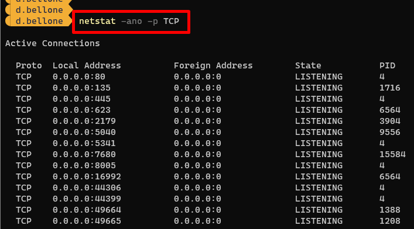
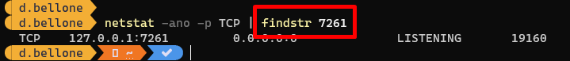
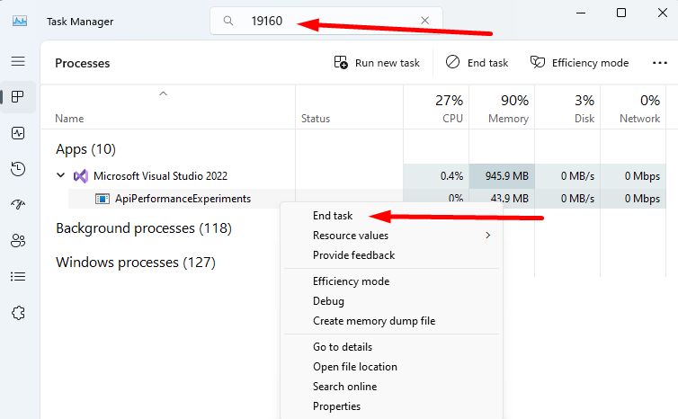
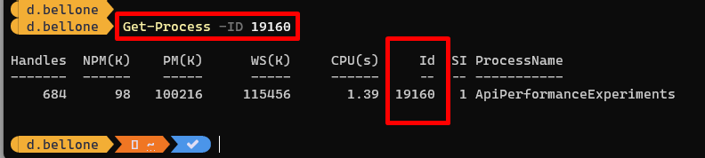

Sometimes, when trying to run your ASP.NET application, there's something stopping you.

Have you ever found a message like this?

> Failed to bind to address https://127.0.0.1:7261: address already in use.

You can try over and over again, you can also restart the application, but the port still appears to be used by another process.

How can you find the process that is running on a local port? How can you kill it to free up the port and, eventually, be able to run your application?

In this article, we will learn how to find the blocking port in Windows 10 and Windows 11, and then we will learn how to kill that process given its PID.

## How to find the process running on a port on Windows 11 using PowerShell

Let's see how to identify the process that is running on port 7261.

Open a PowerShell and run the `netstat` command:

```powershell
netstat
```

NETSTAT is a command that shows info about the **active TCP/IP network connections**. It accepts several options. In this case, we will use:

- `-n`: Displays addresses and port numbers in numerical form.
- `-o`: Displays the owning process ID associated with each connection.
- `-a`: Displays all connections and listening ports;
- `-p`: Filter for a specific protocol (TCP or UDP)

```powershell
netstat -noa -p TCP
```



Notice that **the last column lists the PID (Process ID)** bound to each connection.

From here, we can use the `findstr` command to get only the rows with a specific string (the searched port number).

```powershell
netstat -noa -p TCP | findstr 7261
```



Now, by looking at the last column, we can identify the Process ID: 19160.

## How to kill a process given its PID on Windows or PowerShell

Now that we have the Process ID (PID), we can open the Task Manager, paste the PID value in the topmost textbox, and find the related application.

In our case, it was an instance of Visual Studio running an API application. We can now kill the process by hitting **End Task**.



If you prefer working with PowerShell, you can find the details of the related process by using the `Get-Process` command:

```powershell
Get-Process -ID 19160
```



Then, you can use the `taskkill` command by specifying the PID, using the `/PID` flag, and adding the `/F` flag to _force_ the killing of the process.

```powershell
taskkill /PID 19160 /F
```

We have killed the process related to the running application. Visual Studio is still working, of course.

## Further readings

Hey, what are these fancy colours on the PowerShell?

It's a customization I added to show the current folder and the info about the associated GIT repository. It's incredibly useful while developing and navigating the file system with PowerShell.

🔗 [OhMyPosh and CascadiaCode not working on PowerShell? How to fix it in Windows 10 and Windows 11 Integrated Terminal](https://www.code4it.dev/blog/ohmyposh-integrated-terminal-powershell/)

_This article first appeared on [Code4IT 🐧](https://www.code4it.dev/)_

## Wrapping up

As you can imagine, this article exists because I often forget how to find the process that stops my development.

It's always nice to delve into these topics to learn more about what you can do with PowerShell and which flags are available for a command.

I hope you enjoyed this article! Let's keep in touch on [Twitter](https://twitter.com/BelloneDavide) or [LinkedIn](https://www.linkedin.com/in/BelloneDavide/)! 🤜🤛

Happy coding!

🐧
