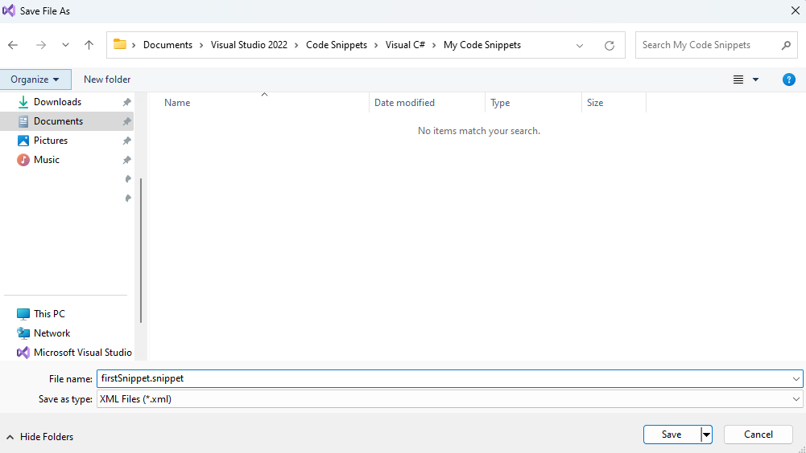
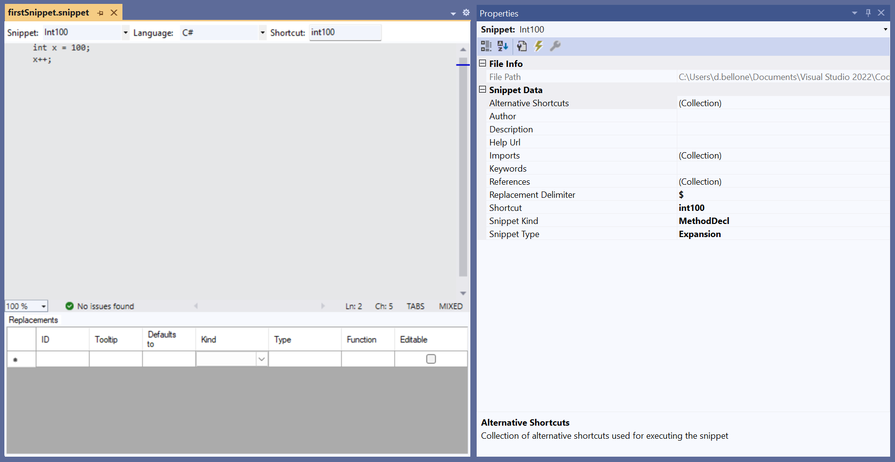
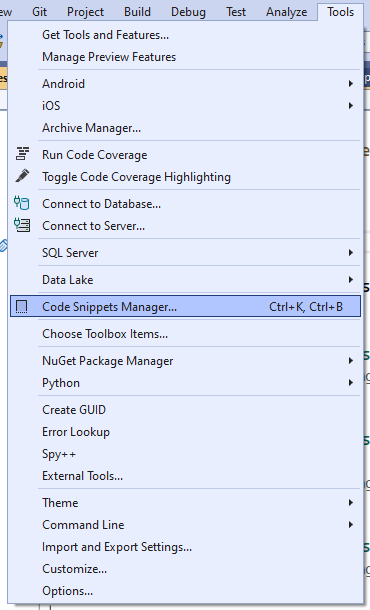
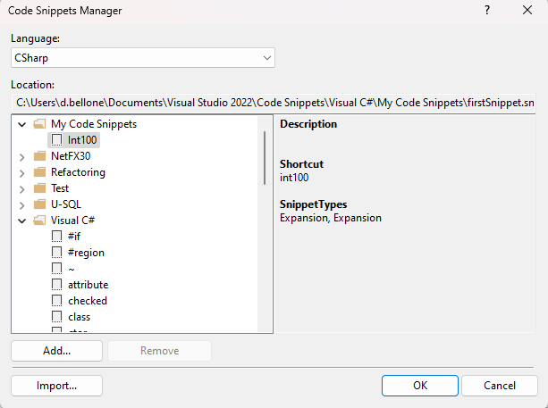
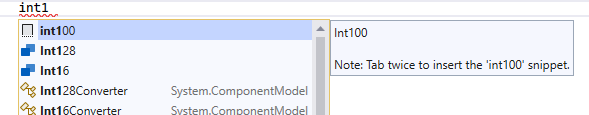
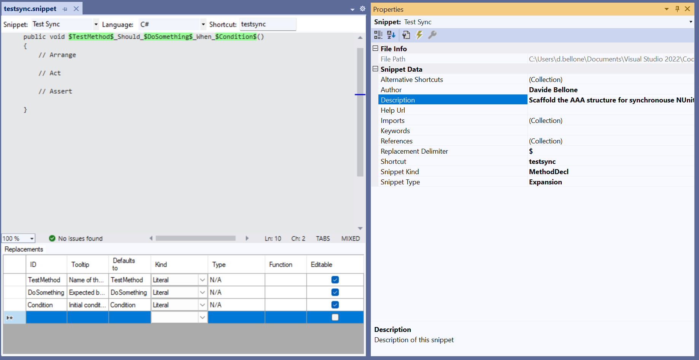
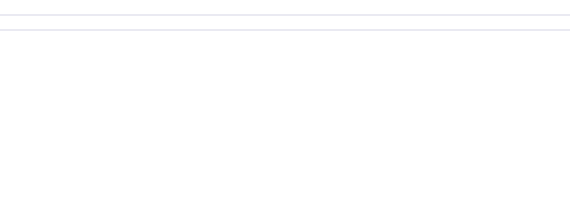
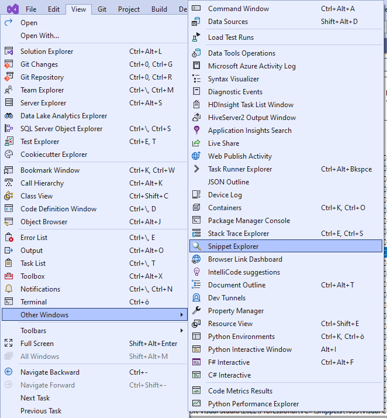
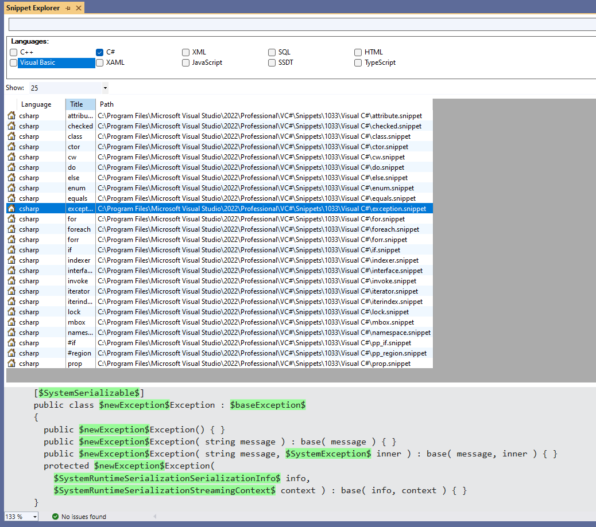

One of the best tricks to boost productivity is **knowing your tools**.

I'm pretty sure you've already used some predefined snippets in Visual Studio. For example, when you type _ctor_ and hit Tab twice, VS automatically creates an empty constructor for the current class.

In this article, we will learn how to create custom snippets: in particular, we will design a snippet that automatically creates a C# Unit Test method with some placeholders and predefined Arrange-Act-Assert blocks.

## Snippet Designer: a Visual Studio 2022 extension to add a UI to your placeholders

**Snippets are defined in XML-like files with `.snippet` extension**. But we all know that working with XMLs can be cumbersome, especially if you don't have a clear idea of the expected structure.

Therefore, even if not strictly necessary, I suggest installing a VS2022 extension called _Snippet Designer 2022_.


This extension, developed by Matthew Manela, can be found on [GitHub](https://github.com/mmanela/SnippetDesigner), where you can view the source code.

This extension gives you a UI to customize the snippet instead of manually editing the XML nodes. It allows you to customize the snippet, the related metadata, and even the placeholders.

## Create a basic snippet in VS2022 using a .snippet file

As we saw, snippets are defined in a simple XML.

In order to have your snippets immediately available in Visual Studio, I suggest you create those files in a specific VS2022 folder under the path `\Documents\Visual Studio 2022\Code Snippets\Visual C#\My Code Snippets\`.

So, create an empty file, change its extension to `.snippet`, and save it to that location.



Now, you can open Visual Studio (it's not necessary to open a project, but I'd recommend you to do so). Then, head to _File > Open_, and open the file you saved under the My Code Snippets directory.

Thanks to Snippet Designer, you will be able to see a nice UI instead of plain XML content.

Have a look at how I filled in the several parts to create a snippet that generates a variable named `x`, assigns to it a value, and then calls `x++`;



Have a look at the main parts:

- the **body**, which contains the snippet to be generated;
- the top layer, where we specified:
  - the Snippet name: Int100; it's the display name of the shortcut
  - the code language: C#;
  - the **shortcut**: int100; it's the string you'll type in that allows you to generate the expected snippet;
- the bottom table, which contains the **placeholders** used in the snippet; more on this later;
- the **properties** tab, on the sidebar: here is where you specify some additional metadata, such as:
  - Author, Description, and Help Url of the snippet, in case you want to export it;
  - the kind of snippet: possible values are MethodBody, MethodDecl and TypeDecl. However, this value is supported only in Visual Basic.

Now, hit save and be ready to import it!

Just for completeness, here's the resulting XML:

```xml
<?xml version="1.0" encoding="utf-8"?>
<CodeSnippets xmlns="http://schemas.microsoft.com/VisualStudio/2005/CodeSnippet">
  <CodeSnippet Format="1.0.0">
    <Header>
      <SnippetTypes>
        <SnippetType>Expansion</SnippetType>
      </SnippetTypes>
      <Title>Int100</Title>
      <Author>
      </Author>
      <Description>
      </Description>
      <HelpUrl>
      </HelpUrl>
      <Shortcut>int100</Shortcut>
    </Header>
    <Snippet>
      <Code Kind="method decl" Language="csharp" Delimiter="$"><![CDATA[int x = 100;
x++;]]></Code>
    </Snippet>
  </CodeSnippet>
</CodeSnippets>
```

Notice that **the actual content of the snippet is defined in the `CDATA` block**.

## Import the snippet in Visual Studio

It's time to import the snippet. Open the Tools menu item and click on Code Snippets Manager.



From here, you can import a snippet by clicking the _Import..._ button. Given that we've already saved our snippet in the correct folder, we'll find it under the My Code Snippets folder.



Now it's ready! Open a C# class, and start typing `int100`. You'll see our snippet in the autocomplete list.



By hitting Tab twice, you'll see the snippet's content being generated.

## How to use placeholders when defining snippets in Visual Studio

Wouldn't it be nice to have the possibility to define customizable parts of your snippets?

Let's see a real example: I want to create a snippet to create the structure of a Unit Tests method with these characteristics:

- it already contains the AAA (Arrange, Act, Assert) sections;
- the method name should follow the pattern "SOMETHING should DO STUFF when CONDITION". I want to be able to replace the different parts of the method name by using placeholders.

**You can define placeholders using the `$` symbol**. You will then see the placeholders in the table at the bottom of the UI. In this example, the placeholders are `$TestMethod$`, `$DoSomething$`, and `$Condition$`. I also added a description to explain the purpose of each placeholder better.



The XML looks like this:

```xml
<?xml version="1.0" encoding="utf-8"?>
<CodeSnippets xmlns="http://schemas.microsoft.com/VisualStudio/2005/CodeSnippet">
  <CodeSnippet Format="1.0.0">
    <Header>
      <SnippetTypes>
        <SnippetType>Expansion</SnippetType>
      </SnippetTypes>
      <Title>Test Sync</Title>
      <Author>Davide Bellone</Author>
      <Description>Scaffold the AAA structure for synchronous NUnit tests</Description>
      <HelpUrl>
      </HelpUrl>
      <Shortcut>testsync</Shortcut>
    </Header>
    <Snippet>
      <Declarations>
        <Literal Editable="true">
          <ID>TestMethod</ID>
          <ToolTip>Name of the method to be tested</ToolTip>
          <Default>TestMethod</Default>
          <Function>
          </Function>
        </Literal>
        <Literal Editable="true">
          <ID>DoSomething</ID>
          <ToolTip>Expected behavior or result</ToolTip>
          <Default>DoSomething</Default>
          <Function>
          </Function>
        </Literal>
        <Literal Editable="true">
          <ID>Condition</ID>
          <ToolTip>Initial conditions</ToolTip>
          <Default>Condition</Default>
          <Function>
          </Function>
        </Literal>
      </Declarations>
      <Code Language="csharp" Delimiter="$" Kind="method decl"><![CDATA[[Test]
public void $TestMethod$_Should_$DoSomething$_When_$Condition$()
{
    // Arrange

    // Act

    // Assert

}]]></Code>
    </Snippet>
  </CodeSnippet>
</CodeSnippets>
```

Now, import it as we already did before.

Then, head to your code, start typing `testsync`, and you'll see the snippet come to life. The placeholders we defined are highlighted. You can then fill in these placeholders, hit tab, and move to the next one.



## Bonus: how to view all the snippets defined in VS

If you want to learn more about your IDE and the available snippets, you can have a look at the Snippet Explorer table.

You can find it under _View_ > _Tools_ > _Snippet Explorer_.



Here, you can see all the snippets, their shortcuts, and the content of each snippet. You can also see the placeholders highlighted in green.



It's always an excellent place to learn more about Visual Studio.

## Further readings

As always, you can read more on Microsoft Docs. It's a valuable resource, although I find it difficult to follow.

🔗 [Create a code snippet in Visual Studio | Microsoft docs](https://learn.microsoft.com/en-us/visualstudio/ide/walkthrough-creating-a-code-snippet?view=vs-2022)

I prefer working with the UI. If you want to have a look at the repo of the extension we used in this article, here's the link:

🔗 [SnippetDesigner extension | GitHub](https://github.com/mmanela/SnippetDesigner/)

_This article first appeared on [Code4IT 🐧](https://www.code4it.dev/)_

## Wrapping up

There are some tips that may improve both the code quality and the developer productivity.

If you want to enforce some structures or rules, add such snippets in your repository; when somebody joins your team, teach them how to import those snippets.

I hope you enjoyed this article! Let's keep in touch on [Twitter](https://twitter.com/BelloneDavide) or [LinkedIn](https://www.linkedin.com/in/BelloneDavide/)! 🤜🤛

Happy coding!

🐧
