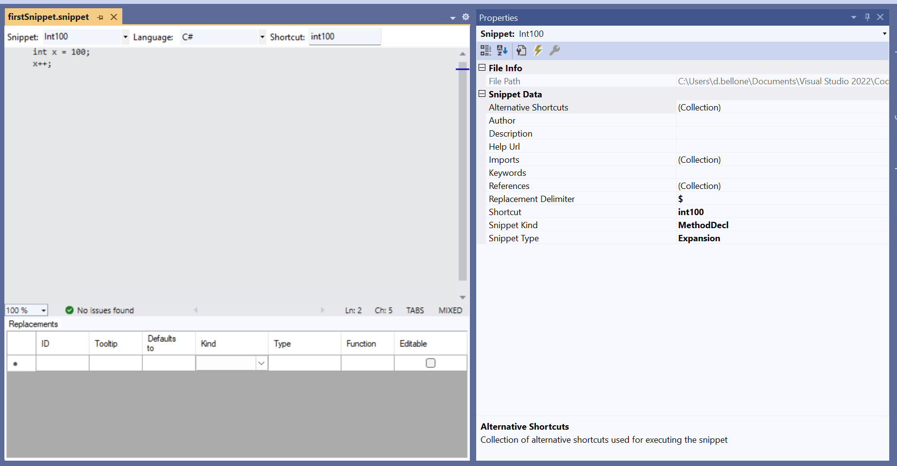
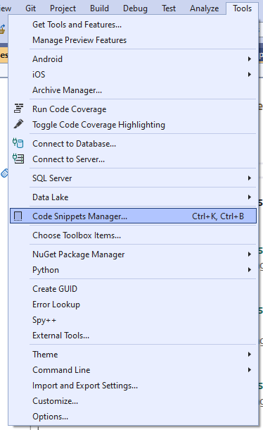
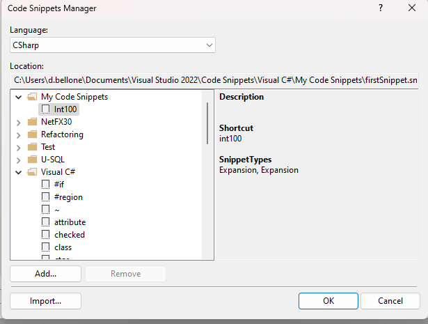
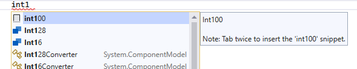
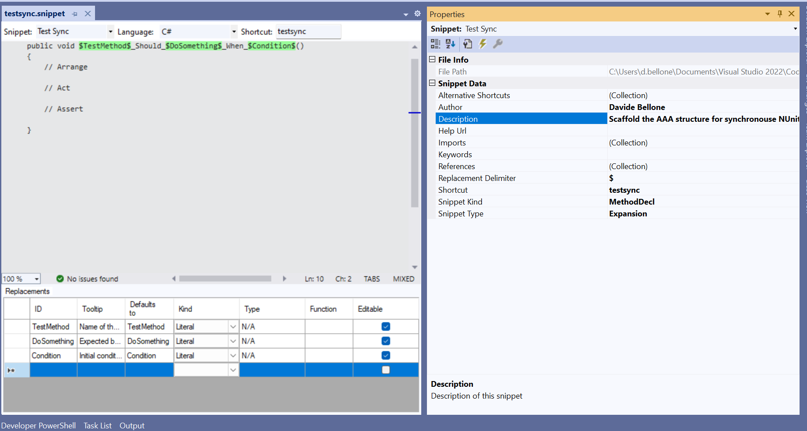
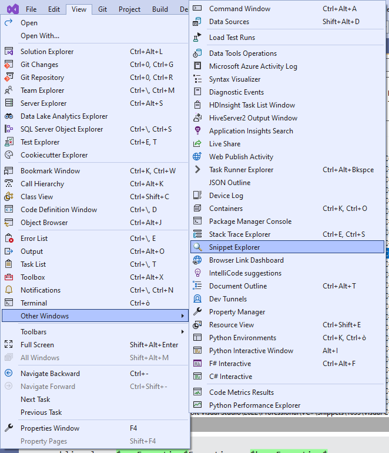
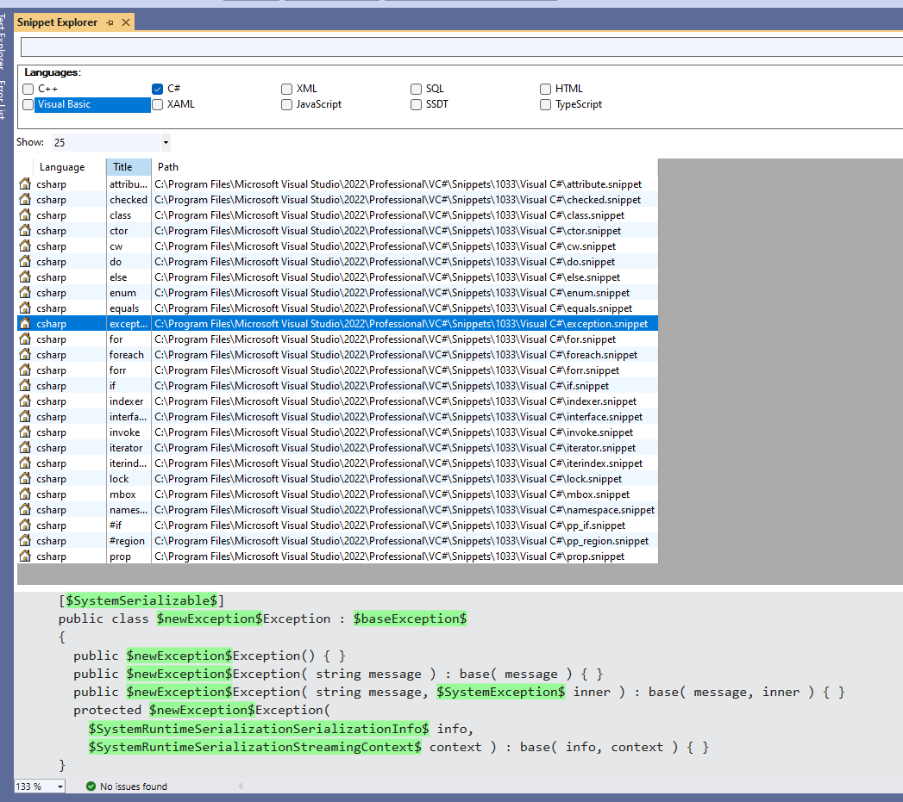

One of the best tricks to boost productivity is knowing your tools.

As you may know, in VisualStudio 2022 you can use predefined snippets. For example, when you type *ctor* and hit Tab twice, VS automatically creates an empty constructor for the current class.

In this article, we are going to learn how to create custom snippets: in particular, we will create a snippet that automatically creates a C# Unit Test method with some placeholders and predefined Arrange-Act-Assert blocks.

## Install SnippetDesigner

Even if not strictly necessary, I suggest you to install a VS2022 extension called *Snippet Designer 2022*.


This extension, developed by Matthew Manela, can be found on [GitHub](https://github.com/mmanela/SnippetDesigner), where you can have a look at the source code.

This extension gives you a UI you can use to customize the 


## Crea file snippet semplice


## Customizza metadati dello snippet

## Snippet complesso con placeholder

## Esecuzione finale

## Bonus: come visualizzare tutti gli snippet in VS

## Further readings

_This article first appeared on [Code4IT 🐧](https://www.code4it.dev/)_


## Wrapping up


I hope you enjoyed this article! Let's keep in touch on [Twitter](https://twitter.com/BelloneDavide) or [LinkedIn](https://www.linkedin.com/in/BelloneDavide/)! 🤜🤛

Happy coding!

🐧


[ ] Titoli
[ ] Frontmatter
[ ] Rinomina immagini
[ ] Alt Text per immagini
[ ] Grammatica
[ ] Bold/Italics
[ ] Nome cartella e slug devono combaciare
[ ] Immagine di copertina
[ ] Rimuovi secrets dalle immagini
[ ] Pulizia formattazione
[ ] Controlla se ASP.NET Core oppure .NET
[ ] Metti la giusta OgTitle
[ ] Fai resize della immagine di copertina


## Appunti

- Installa SnippetDesigner e restart VS
- Apri VS2022, anche senza aprire uno specifico progetto. Sarebbe meglio avere un progetto aperto in modo da testare subito lo snippet
- Crea un nuovo file **vuoto** con estensione .snippet
- Salvalo sotto  \Documents\Visual Studio 2022\Code Snippets\Visual C#\My Code Snippets\firstSnippet.snippet

Click su Apri file, riapri il file di prima, vedi schermata con SnippetDesigner:
customizza il contenuto, poi salva



Aggiungi lo snippet tra quelli disponibili, qui:



Seleziona CSharp, click su Import, seleziona nuovo script




...

XML test sync:



```xml
<?xml version="1.0" encoding="utf-8"?>
<CodeSnippets xmlns="http://schemas.microsoft.com/VisualStudio/2005/CodeSnippet">
  <CodeSnippet Format="1.0.0">
    <Header>
      <SnippetTypes>
        <SnippetType>Expansion</SnippetType>
      </SnippetTypes>
      <Title>Test Sync</Title>
      <Author>Davide Bellone</Author>
      <Description>Scaffold the AAA structure for synchronous NUnit tests</Description>
      <HelpUrl>
      </HelpUrl>
      <Shortcut>testsync</Shortcut>
    </Header>
    <Snippet>
      <Declarations>
        <Literal Editable="true">
          <ID>TestMethod</ID>
          <ToolTip>Name of the method to be tested</ToolTip>
          <Default>TestMethod</Default>
          <Function>
          </Function>
        </Literal>
        <Literal Editable="true">
          <ID>DoSomething</ID>
          <ToolTip>Expected behavior or result</ToolTip>
          <Default>DoSomething</Default>
          <Function>
          </Function>
        </Literal>
        <Literal Editable="true">
          <ID>Condition</ID>
          <ToolTip>Initial conditions</ToolTip>
          <Default>Condition</Default>
          <Function>
          </Function>
        </Literal>
      </Declarations>
      <Code Language="csharp" Delimiter="$" Kind="method decl"><![CDATA[[Test]
public void $TestMethod$_Should_$DoSomething$_When_$Condition$()
{
    // Arrange

    // Act

    // Assert 

}]]></Code>
    </Snippet>
  </CodeSnippet>
</CodeSnippets>
```


per vedere gli altri snippet





https://learn.microsoft.com/en-us/visualstudio/ide/walkthrough-creating-a-code-snippet?view=vs-2022

https://github.com/mmanela/SnippetDesigner/wiki/Creating-a-snippet-from-scratch