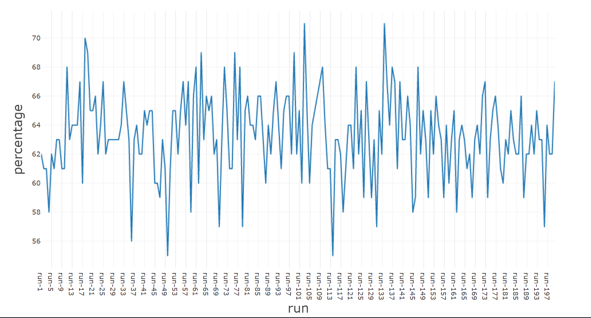

One of the most common operations when dealing with collections of items it to retrieve a subset of these elements, taken randomly.

Before .NET 8, the most common way to retrieve random items was to order the collection using a random value, and then take a subset of the newly sorted collection.

From .NET 8 on, we have a new method in the `Random` class: `GetItems`.

So, my question is: should we use this method, or stick to the previous version?

For the sake of this article, I created a simple `record` type, `CustomRecord`, which just contains two properties.

```cs
public record CustomRecord(int Id, string Name);
```

I then stored a collection of such elements in an array. The final goal of this article is to find which is the *best* way to retrieve a random subset of such items.

## Random.GetItems

Since .NET 8, released in 2023, we now have a new method belonging to the `Random` class: `GetItems`.

There are three overloads:

```cs
public T[] GetItems<T>(T[] choices, int length);
public T[] GetItems<T>(ReadOnlySpan<T> choices, int length);
public void GetItems<T>(ReadOnlySpan<T> choices, Span<T> destination);
```

We are going to focus on the first overload, which accepts in input an array of items (`choices`) and returns an array of size `length`.

We can use it as such:

```cs
CustomRecord[] randomItems = Random.Shared.GetItems(Items, TotalItemsToBeRetrieved);
```

## Shuffle a copy of the items

Another approach is to shuffle the whole initial array using `Random.Shuffle`. It takes in input an array and **shuffles the items in-place**.

```cs
CustomRecord[] copy = [.. Items];

Random.Shared.Shuffle(copy);
CustomRecord[] randomItems = copy.Take(TotalItemsToBeRetrieved).ToArray();
```

If you need to preserve the initial order of the items, you should create a copy of the initial array, and shuffle only the copy. If you just need some random items, and you don't care anymore about the initial array, you can just shuffle it without making a copy.

Once we've shuffled the array, we can just pick the first N items to get a subset of random elements.

## Order by Guid

Before .NET 8, one of the most used approaches was to order the whole collection by a random value, usually a newly-generated `Guid`, and then take the first N items.

```cs
var randomItems = Items
    .OrderBy(_ => Guid.NewGuid())
    .Take(TotalItemsToBeRetrieved)
    .ToArray();
```

This approach works fine, but has the disadvantage that, for every item in the collection, it instantiates a new `Guid` value - which is a memory-wise expensive operation.

## Order by Number

Another approach was to generate a random number used as a discriminator to order the collection; then, again, we used to get the get the first N items.

```cs
var randomItems = Items
    .OrderBy(_ => Random.Shared.Next())
    .Take(TotalItemsToBeRetrieved)
    .ToArray();

_ = randomItems.Length;
```

This approach is slight better, because generating a random integer is way faster than generationg a new Guid.

## Benchmark

It's time to compare the approaches.

We use BenchmarkDotNet to generate the reports, and ChartBenchmark to generate a visual representation of the results.

Let's see how I structured the benchmark.

```cs
[MemoryDiagnoser]
public class RandomItemsBenchmark
{
    [Params(100, 10_000, 1_000_000)]
    public int Size;

    private CustomRecord[] Items;
    private int TotalItemsToBeRetrieved;
    private CustomRecord[] Copy;

    [IterationSetup]
    public void Setup()
    {
        var ids = Enumerable.Range(0, Size).ToArray();
        Items = ids.Select(i => new CustomRecord(i, $"Name {i}")).ToArray();
        Copy = [.. Items];

        TotalItemsToBeRetrieved = Random.Shared.Next(Size);
    }

    [Benchmark(Baseline = true)]
    public void WithRandomGetItems()
    {
        CustomRecord[] randomItems = Random.Shared.GetItems(Items, TotalItemsToBeRetrieved);
        _ = randomItems.Length;
    }

    [Benchmark]
    public void WithRandomGuid()
    {
        CustomRecord[] randomItems = Items
            .OrderBy(_ => Guid.NewGuid())
            .Take(TotalItemsToBeRetrieved)
            .ToArray();

        _ = randomItems.Length;
    }

    [Benchmark]
    public void WithRandomNumber()
    {
        CustomRecord[] randomItems = Items
            .OrderBy(_ => Random.Shared.Next())
            .Take(TotalItemsToBeRetrieved)
            .ToArray();

        _ = randomItems.Length;
    }

    [Benchmark]
    public void WithShuffle()
    {
        CustomRecord[] copy = [.. Items];

        Random.Shared.Shuffle(copy);
        CustomRecord[] randomItems = copy.Take(TotalItemsToBeRetrieved).ToArray();

        _ = randomItems.Length;
    }

    [Benchmark]
    public void WithShuffleNoCopy()
    {
        Random.Shared.Shuffle(Copy);
        CustomRecord[] randomItems = Copy.Take(TotalItemsToBeRetrieved).ToArray();

        _ = randomItems.Length;
    }
}
```

We are going to run the benchmarks on arrays with different sizes. We will start from a smaller array with 100 items and move to a bigger one, with one million items.

For every iteration, we generate the initial array of `CustomRecord` instances and store it in the `Items` property. Then, we randomly choose the number of items to get from the `Items` array, and store it in the `TotalItemsToBeRetrieved` property.

We also generate a copy of the initial array at every iteration: this way we can run `Random.Shuffle` without modifying the original array.

Finally, we define the benchmarks, using the implementations we saw before.

Notice: I marked the benchmark for the `GetItems` method as baseline, using `[Benchmark(Baseline = true)]`. This way, we can easily see the ratio of the results for the other methods compared to this specific method.

When we run the benchmark, we can see this final result (for semplicity, I removed the Error, StdDev, and Median columns):


| Method             | Size    | Mean           | Ratio | Allocated  | Alloc Ratio |
|------------------- |-------- |---------------:|------:|-----------:|------------:|
| WithRandomGetItems | 100     |       6.442 us |  1.00 |      424 B |        1.00 |
| WithRandomGuid     | 100     |      39.481 us |  6.64 |     3576 B |        8.43 |
| WithRandomNumber   | 100     |      22.219 us |  3.67 |     2256 B |        5.32 |
| WithShuffle        | 100     |       7.038 us |  1.16 |     1464 B |        3.45 |
| WithShuffleNoCopy  | 100     |       4.254 us |  0.73 |      624 B |        1.47 |
|                    |         |                |       |            |             |
| WithRandomGetItems | 10000   |      58.401 us |  1.00 |     5152 B |        1.00 |
| WithRandomGuid     | 10000   |   2,369.693 us | 65.73 |   305072 B |       59.21 |
| WithRandomNumber   | 10000   |   1,828.325 us | 56.47 |   217680 B |       42.25 |
| WithShuffle        | 10000   |     180.978 us |  4.74 |    84312 B |       16.36 |
| WithShuffleNoCopy  | 10000   |     156.607 us |  4.41 |     3472 B |        0.67 |
|                    |         |                |       |            |             |
| WithRandomGetItems | 1000000 |  15,069.781 us |  1.00 |  4391616 B |        1.00 |
| WithRandomGuid     | 1000000 | 319,088.446 us | 42.79 | 29434720 B |        6.70 |
| WithRandomNumber   | 1000000 | 166,111.193 us | 22.90 | 21512408 B |        4.90 |
| WithShuffle        | 1000000 |  48,533.527 us |  6.44 | 11575304 B |        2.64 |
| WithShuffleNoCopy  | 1000000 |  37,166.068 us |  4.57 |  6881080 B |        1.57 |


By looking at the numbers we can notice that:

* `GetItems` is the most performant method, both for time and memory allocation;
* using `Guid.NewGuid` is the worse approach: it's 10 to 60 times slower than `GetItems`, and it allocates, on average, 4x the memory;
* sorting by random number lays in the middle: it's 30 times slower that `GetItems`, and it allocates around 3 times more memory;
* shuffling the array in-place and taking the first N elements is 4x slower than GetItems; if you also have to preserve the original array, notice that you'll lose some memory allocation performance because you have to allocate more memory to create the cloned array.

Here's the chart with the performance values. **Notice that, for better readability, I used a Log10 scale**.


If we move our focus to the array with one million items, we can have a better idea of the impact of choosing one approach instead of the other. Notice: **here I used a linear scale**, since values are on the same magnitude order.

The purple line represents the memory allocation, in bytes.


So, should we use `GetItems` all over the place? Well, no! Let me tell you why.

## Repeated elements

**There's a huge problem with the `GetItems` method: it returns duplicate items**. So, if you need to get N items without duplicates, **`GetItems` is not the best method**.

Here's how you can demonstrate it.

First, create an array of 100 items. Then, using `Random.Shared.GetItems`, retrieve 100 items.

The final array will have 100 items; the array may or may not contain duplicates.

```cs
int[] source = Enumerable.Range(0, 100).ToArray();

StringBuilder sb = new StringBuilder();

for (int i = 1; i <= 200; i++)
{
    HashSet<int> ints = Random.Shared.GetItems(source, 100).ToHashSet();
    sb.AppendLine($"run-{i}, {ints.Count}");
}

var finalCsv = sb.ToString();
```

To check the number of distinct intems, I put the resulting array in an `HashSet<int>`. **The final size of the HashSet will give us the exact percentage of unique values**.

For simplicity, I decided to format the result CSV format, so that I can generate plots with it.



As you can see, **on average we have 65% of unique items, and 35% of duplicate items**.

## Further readings

_This article first appeared on [Code4IT 🐧](https://www.code4it.dev/)_


## Wrapping up

We can say that you should not replace the way you get random items from the array by using `Random.GetItems`. Unless you are ok with having duplicates. 

If you need unique values, you should rely on other methods, such as `Random.Shuffle`.

I hope you enjoyed this article! Let's keep in touch on [Twitter](https://twitter.com/BelloneDavide) or [LinkedIn](https://www.linkedin.com/in/BelloneDavide/)! 🤜🤛

Happy coding!

🐧


- [ ] Grammatica
- [ ] Titoli
- [ ] Frontmatter
- [ ] Immagine di copertina
- [ ] Fai resize della immagine di copertina
- [ ] Metti la giusta OgTitle
- [ ] Bold/Italics
- [ ] Nome cartella e slug devono combaciare
- [ ] Rinomina immagini
- [ ] Alt Text per immagini
- [ ] Trim corretto per bordi delle immagini
- [ ] Rimuovi secrets dalle immagini
- [ ] Controlla se ASP.NET Core oppure .NET
- [ ] Pulizia formattazione
- [ ] Add wt.mc_id=DT-MVP-5005077 to links
- [ ] Aggiorna diagrammi, mettendo Shuffle
- [X] Spiega Shuffle
- [X] Aggiungi che come performance sta nel mezzo, e puó migliorare se non devo far la copia dell'array perché non interessa quello iniziale
- [X] genera plot dal file CSV degli elementi duplicati

