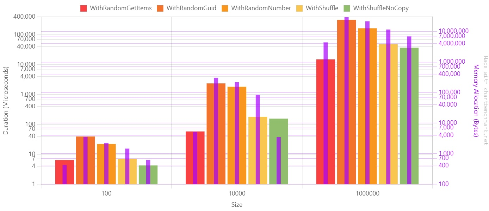
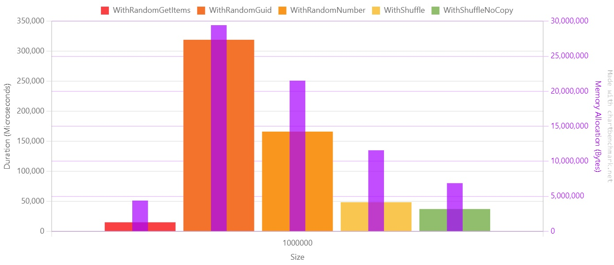
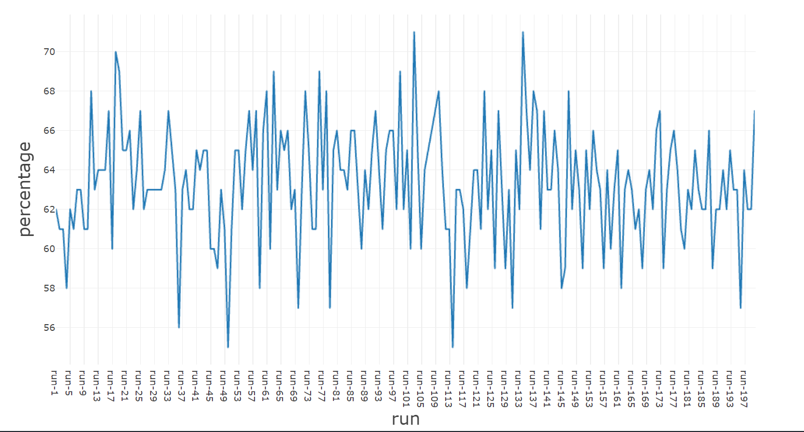

One of the most common operations when dealing with collections of items is to retrieve a subset of these elements taken randomly.

Before .NET 8, the most common way to retrieve random items was to order the collection using a random value and then take the first N items of the now sorted collection.

From .NET 8 on, we have a new method in the `Random` class: `GetItems`.

So, should we use this method or stick to the previous version? Are there other alternatives?

For the sake of this article, I created a simple `record` type, `CustomRecord`, which just contains two properties.

```cs
public record CustomRecord(int Id, string Name);
```

I then stored a collection of such elements in an array. This article's final goal is to find the _best_ way to retrieve a random subset of such items. Spoiler alert: it all depends on your definition of _best_!

## Method #1: get random items with Random.GetItems

Starting from .NET 8, released in 2023, we now have a new method belonging to the `Random` class: `GetItems`.

There are three overloads:

```cs
public T[] GetItems<T>(T[] choices, int length);
public T[] GetItems<T>(ReadOnlySpan<T> choices, int length);
public void GetItems<T>(ReadOnlySpan<T> choices, Span<T> destination);
```

We will focus on the first overload, which accepts an array of items (`choices`) in input and returns an array of size `length`.

We can use it as such:

```cs
CustomRecord[] randomItems = Random.Shared.GetItems(Items, TotalItemsToBeRetrieved);
```

Simple, neat, efficient. Or is it?

## Method #2: get the first N items from a shuffled copy of the initial array

Another approach is to shuffle the whole initial array using `Random.Shuffle`. It takes in input an array and **shuffles the items in-place**.

```cs
Random.Shared.Shuffle(Items);
CustomRecord[] randomItems = copy.Take(TotalItemsToBeRetrieved).ToArray();
```

If you need to preserve the initial order of the items, you should create a copy of the initial array and shuffle only the copy. You can do this by using this syntax:

```cs
CustomRecord[] copy = [.. Items];
```

If you just need some random items and don't care about the initial array, you can shuffle it without making a copy.

Once we've shuffled the array, we can pick the first N items to get a subset of random elements.

## Method #3: order by Guid, then take N elements

Before .NET 8, one of the most used approaches was to order the whole collection by a random value, usually a newly generated `Guid`, and then take the first N items.

```cs
var randomItems = Items
    .OrderBy(_ => Guid.NewGuid()) // THIS!
    .Take(TotalItemsToBeRetrieved)
    .ToArray();
```

This approach works fine but has the disadvantage that it instantiates a new `Guid` value for every item in the collection, which is an expensive memory-wise operation.

## Method #4: order by Number, then take N elements

Another approach was to generate a random number used as a discriminator to order the collection; then, again, we used to get the first N items.

```cs
var randomItems = Items
    .OrderBy(_ => Random.Shared.Next()) // THIS!
    .Take(TotalItemsToBeRetrieved)
    .ToArray();
```

This approach is slightly better because generating a random integer is way faster than generating a new Guid.

## Benchmarks of the different operations

It's time to compare the approaches.

I used BenchmarkDotNet to generate the reports and ChartBenchmark to represent the results visually.

Let's see how I structured the benchmark.

```cs
[MemoryDiagnoser]
public class RandomItemsBenchmark
{
    [Params(100, 10_000, 1_000_000)]
    public int Size;

    private CustomRecord[] Items;
    private int TotalItemsToBeRetrieved;
    private CustomRecord[] Copy;

    [IterationSetup]
    public void Setup()
    {
        var ids = Enumerable.Range(0, Size).ToArray();
        Items = ids.Select(i => new CustomRecord(i, $"Name {i}")).ToArray();
        Copy = [.. Items];

        TotalItemsToBeRetrieved = Random.Shared.Next(Size);
    }

    [Benchmark(Baseline = true)]
    public void WithRandomGetItems()
    {
        CustomRecord[] randomItems = Random.Shared.GetItems(Items, TotalItemsToBeRetrieved);
        _ = randomItems.Length;
    }

    [Benchmark]
    public void WithRandomGuid()
    {
        CustomRecord[] randomItems = Items
            .OrderBy(_ => Guid.NewGuid())
            .Take(TotalItemsToBeRetrieved)
            .ToArray();

        _ = randomItems.Length;
    }

    [Benchmark]
    public void WithRandomNumber()
    {
        CustomRecord[] randomItems = Items
            .OrderBy(_ => Random.Shared.Next())
            .Take(TotalItemsToBeRetrieved)
            .ToArray();

        _ = randomItems.Length;
    }

    [Benchmark]
    public void WithShuffle()
    {
        CustomRecord[] copy = [.. Items];

        Random.Shared.Shuffle(copy);
        CustomRecord[] randomItems = copy.Take(TotalItemsToBeRetrieved).ToArray();

        _ = randomItems.Length;
    }

    [Benchmark]
    public void WithShuffleNoCopy()
    {
        Random.Shared.Shuffle(Copy);
        CustomRecord[] randomItems = Copy.Take(TotalItemsToBeRetrieved).ToArray();

        _ = randomItems.Length;
    }
}
```

We are going to run the benchmarks on arrays with different sizes. We will start with a smaller array with 100 items and move to a bigger one with one million items.

We generate the initial array of `CustomRecord` instances for every iteration and store it in the `Items` property. Then, we randomly choose the number of items to get from the `Items` array and store it in the `TotalItemsToBeRetrieved` property.

We also generate a copy of the initial array at every iteration; this way, we can run `Random.Shuffle` without modifying the original array.

Finally, we define the body of the benchmarks using the implementations we saw before.

Notice: I marked the benchmark for the `GetItems` method as a baseline, using `[Benchmark(Baseline = true)]`. This way, we can easily see the results ratio for the other methods compared to this specific method.

When we run the benchmark, we can see this final result (for simplicity, I removed the Error, StdDev, and Median columns):

| Method             | Size    |           Mean | Ratio |  Allocated | Alloc Ratio |
| ------------------ | ------- | -------------: | ----: | ---------: | ----------: |
| WithRandomGetItems | 100     |       6.442 us |  1.00 |      424 B |        1.00 |
| WithRandomGuid     | 100     |      39.481 us |  6.64 |     3576 B |        8.43 |
| WithRandomNumber   | 100     |      22.219 us |  3.67 |     2256 B |        5.32 |
| WithShuffle        | 100     |       7.038 us |  1.16 |     1464 B |        3.45 |
| WithShuffleNoCopy  | 100     |       4.254 us |  0.73 |      624 B |        1.47 |
|                    |         |                |       |            |             |
| WithRandomGetItems | 10000   |      58.401 us |  1.00 |     5152 B |        1.00 |
| WithRandomGuid     | 10000   |   2,369.693 us | 65.73 |   305072 B |       59.21 |
| WithRandomNumber   | 10000   |   1,828.325 us | 56.47 |   217680 B |       42.25 |
| WithShuffle        | 10000   |     180.978 us |  4.74 |    84312 B |       16.36 |
| WithShuffleNoCopy  | 10000   |     156.607 us |  4.41 |     3472 B |        0.67 |
|                    |         |                |       |            |             |
| WithRandomGetItems | 1000000 |  15,069.781 us |  1.00 |  4391616 B |        1.00 |
| WithRandomGuid     | 1000000 | 319,088.446 us | 42.79 | 29434720 B |        6.70 |
| WithRandomNumber   | 1000000 | 166,111.193 us | 22.90 | 21512408 B |        4.90 |
| WithShuffle        | 1000000 |  48,533.527 us |  6.44 | 11575304 B |        2.64 |
| WithShuffleNoCopy  | 1000000 |  37,166.068 us |  4.57 |  6881080 B |        1.57 |

By looking at the numbers, we can notice that:

- `GetItems` is the most performant method, both for time and memory allocation;
- using `Guid.NewGuid` is the worse approach: it's 10 to 60 times slower than `GetItems`, and it allocates, on average, 4x the memory;
- sorting by random number is a bit better: it's 30 times slower than `GetItems`, and it allocates around three times more memory;
- shuffling the array in place and taking the first N elements is 4x slower than GetItems; if you also have to preserve the original array, notice that you'll lose some memory allocation performance because you must allocate more memory to create the cloned array.

Here's the chart with the performance values. **Notice that, for better readability, I used a Log10 scale**.



If we move our focus to the array with one million items, we can better understand the impact of choosing one approach instead of the other. Notice that **here I used a linear scale** since values are on the same magnitude order.

The purple line represents the memory allocation in bytes.



So, should we use `GetItems` all over the place? Well, no! Let me tell you why.

## The problem with Random.GetItems: repeated elements

**There's a huge problem with the `GetItems` method: it returns duplicate items**. So, if you need to get N items without duplicates, **`GetItems` is not the right choice**.

Here's how you can demonstrate it.

First, create an array of 100 distinct items. Then, using `Random.Shared.GetItems`, retrieve 100 items.

The final array will have 100 items; the array may or may not contain duplicates.

```cs
int[] source = Enumerable.Range(0, 100).ToArray();

StringBuilder sb = new StringBuilder();

for (int i = 1; i <= 200; i++)
{
    HashSet<int> ints = Random.Shared.GetItems(source, 100).ToHashSet();
    sb.AppendLine($"run-{i}, {ints.Count}");
}

var finalCsv = sb.ToString();
```

To check the number of distinct elements, I put the resulting array in a `HashSet<int>`. **The final size of the HashSet will give us the exact percentage of unique values**.

If the HashSet size is exactly 100, it means that `GetItems` retrieved each element from the original array exactly once.

For simplicity, I formatted the result in CSV format so that I could generate plots with it.



As you can see, **on average, we have 65% of unique items and 35% of duplicate items**.

## Further readings

I used the `Enumerable.Range` method to generate the initial items.

I wrote an article to explain how to use it, which are some parts to consider when using it, and more.

🔗 [LINQ's Enumerable.Range to generate a sequence of consecutive numbers | Code4IT
](https://www.code4it.dev/csharptips/enumerable-range/)

_This article first appeared on [Code4IT 🐧](https://www.code4it.dev/)_

## Wrapping up

You should not replace the way you get random items from the array by using `Random.GetItems`. Well, unless you are okay with having duplicates.

If you need unique values, you should rely on other methods, such as `Random.Shuffle`.

All in all, always remember to validate your assumptions by running experiments on the methods you are not sure you can trust!

I hope you enjoyed this article! Let's keep in touch on [Twitter](https://twitter.com/BelloneDavide) or [LinkedIn](https://www.linkedin.com/in/BelloneDavide/)! 🤜🤛

Happy coding!

🐧
