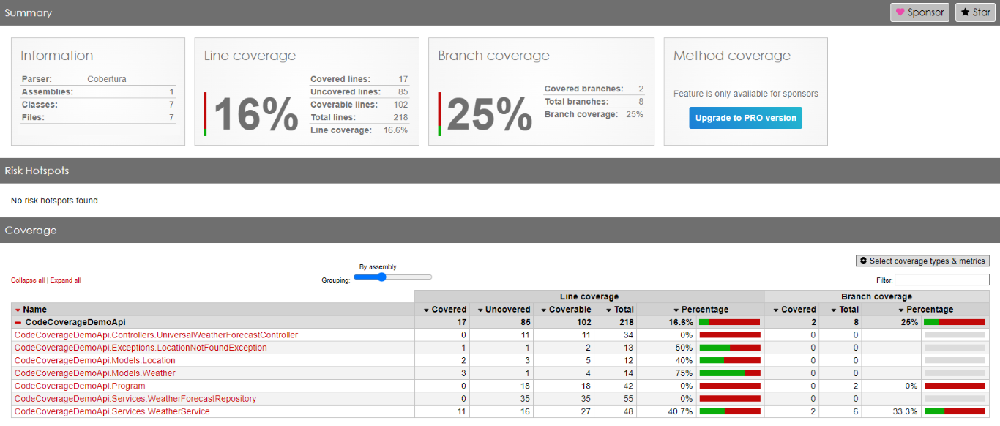
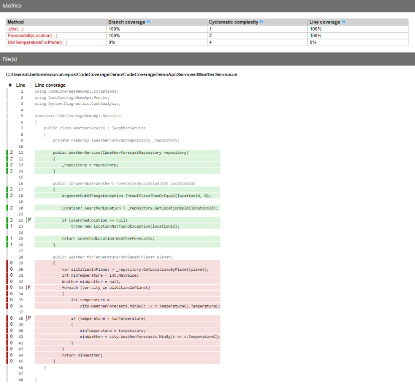
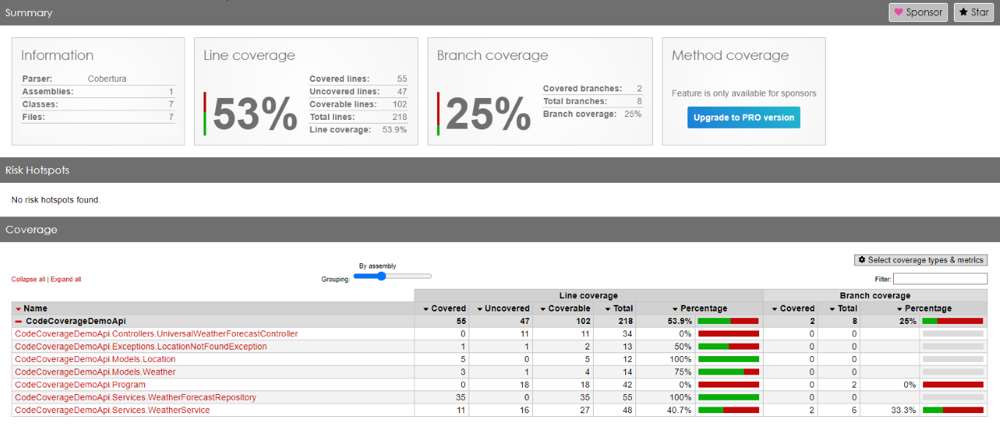
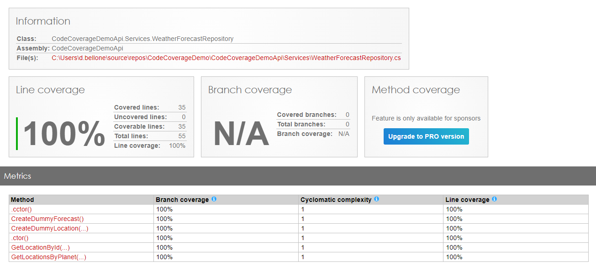
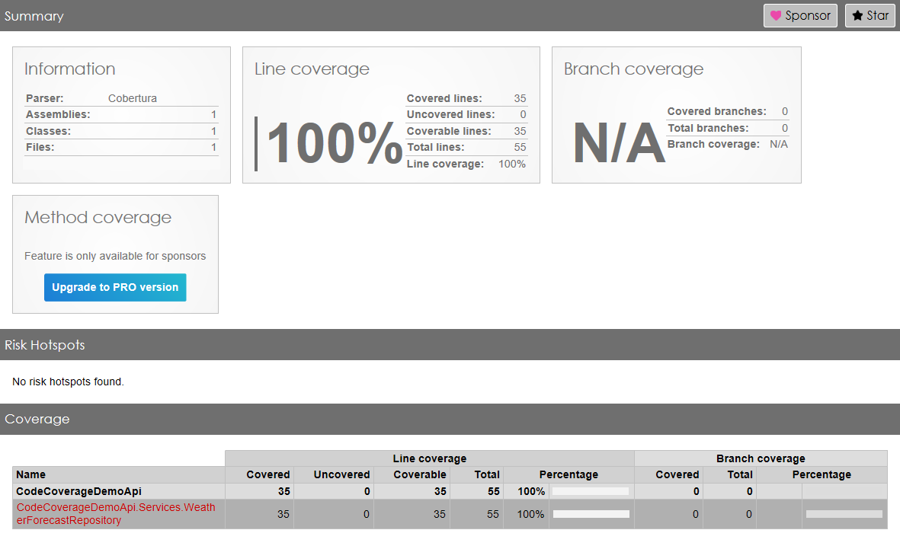

Code Coverage is a valuable metric in software development, especially when it comes to testing. It provides insights into how much of your codebase is exercised by your test suite.

However, we must recognize that Code Coverage alone should not be the ultimate goal of your testing strategy. It has some known limitations, and 100% Code Coverage does not guarantee your code to be bug-free.

In this article, we'll explore why Code Coverage matters, its limitations, and how to balance achieving high coverage and effective testing. We'll use C# to demonstrate when Code Coverage works well and how you can cheat on the result.

## What Is Code Coverage?

Code Coverage measures the percentage of code lines, branches, or statements executed during testing. It helps answer questions like:

- How much of my code is tested?
- Are there any untested paths or dead code?
- Which parts of the application need additional test coverage?

In C#, tools like **Cobertura**, **dotCover**, and **Visual Studio's built-in coverage analysis** provide Code Coverage reports.

You may be tempted to think that the higher the coverage, the better the quality of your tests. However, we will soon demonstrate why this assumption is misleading.

## Why Code Coverage Matters

Clearly, **if you write valuable tests**, Code Coverage is a great ally.

A high value of Code Coverage helps you with:

1. **Risk mitigation**: High Code Coverage reduces the risk of undiscovered defects. If a piece of code isn't covered, it will likely contain bugs.
2. **Preventing regressions**: code is destined to evolve over time. If you ensure that most of your code is covered by tests, whenever you'll add some more code you will discover which parts of the existing system are impacted by your changes. If you update the production code and no test fails, it might be a _bad_ sign: you probably need to cover the code you are modifying with enough tests.
3. **Quality assurance**: Code Coverage ensures that critical parts of your application are tested thoroughly. Good tests focus on the functional aspects of the code (_what_) rather than on the technical aspects (_how_). A good test suite is a safety net against regressions.
4. **Guidance for Testing Efforts**: Code Coverage highlights areas that need more attention. It guides developers in writing additional tests where necessary.

## The Limitations of Code Coverage

While Code Coverage is valuable, it has limitations:

1. **False Sense of Security**: Achieving 100% coverage doesn't guarantee bug-free software. It's possible to have well-covered code that still contains subtle defects. **This is especially true when mocking dependencies**.
2. **They focus on Lines, Not Behavior**: Code Coverage doesn't consider the quality of tests. It doesn't guarantee that the tests covers all possible scenarios.
3. **Ignored Edge Cases**: Some code paths (exception handling, rare conditions) are complex to cover. High coverage doesn't necessarily mean thorough testing.

## 3 Practical reasons why Code Coverage percentage can be misleading

For the sake of this article, I've created a dummy .NET API project with the typical three layers: controller, service, and repository.

It contains a Controller with two endpoints:

```cs
[ApiController]
[Route("[controller]")]
public class UniversalWeatherForecastController : ControllerBase
{
    private readonly IWeatherService _weatherService;

    public UniversalWeatherForecastController(IWeatherService weatherService)
    {
        _weatherService = weatherService;
    }

    [HttpGet]
    public IEnumerable<Weather> Get(int locationId)
    {
        var forecast = _weatherService.ForecastsByLocation(locationId);
        return forecast.ToList();
    }

    [HttpGet("minByPlanet")]
    public Weather GetMinByPlanet(Planet planet)
    {
        return _weatherService.MinTemperatureForPlanet(planet);
    }
}
```

The Controller uses the Service:

```cs
public class WeatherService : IWeatherService
{
    private readonly IWeatherForecastRepository _repository;

    public WeatherService(IWeatherForecastRepository repository)
    {
        _repository = repository;
    }

    public IEnumerable<Weather> ForecastsByLocation(int locationId)
    {
        ArgumentOutOfRangeException.ThrowIfLessThanOrEqual(locationId, 0);

        Location? searchedLocation = _repository.GetLocationById(locationId);

        if (searchedLocation == null)
            throw new LocationNotFoundException(locationId);

        return searchedLocation.WeatherForecasts;
    }

    public Weather MinTemperatureForPlanet(Planet planet)
    {
        var allCitiesInPlanet = _repository.GetLocationsByPlanet(planet);
        int minTemperature = int.MaxValue;
        Weather minWeather = null;
        foreach (var city in allCitiesInPlanet)
        {
            int temperature =
                city.WeatherForecasts.MinBy(c => c.TemperatureC).TemperatureC;

            if (temperature < minTemperature)
            {
                minTemperature = temperature;
                minWeather = city.WeatherForecasts.MinBy(c => c.TemperatureC);
            }
        }
        return minWeather;
    }
}
```

Finally, the Service calls the Repository, omitted for brevity (it's just a bunch of items in an in-memory `List`).

I then created an NUnit test project to generate the unit tests, focusing on the `WeatherService`:

```cs

public class WeatherServiceTests
{
    private readonly Mock<IWeatherForecastRepository> _mockRepository;
    private WeatherService _sut;

    public WeatherServiceTests() => _mockRepository = new Mock<IWeatherForecastRepository>();

    [SetUp]
    public void Setup() => _sut = new WeatherService(_mockRepository.Object);

    [TearDown]
    public void Teardown() =>_mockRepository.Reset();

    // Tests

}
```

This class covers two cases, both related to the `ForecastsByLocation` method of the Service.

_Case 1_: when the location exists in the repository, this method must return the related info.

```cs
[Test]
public void ForecastByLocation_Should_ReturnForecast_When_LocationExists()
{
    //Arrange
    var forecast = new List<Weather>
        {
            new Weather{
                Date = DateOnly.FromDateTime(DateTime.Now.AddDays(1)),
                Summary = "sunny",
                TemperatureC = 30
            }
        };

    var location = new Location
    {
        Id = 1,
        WeatherForecasts = forecast
    };

    _mockRepository.Setup(r => r.GetLocationById(1)).Returns(location);

    //Act
    var resultForecast = _sut.ForecastsByLocation(1);

    //Assert
    CollectionAssert.AreEquivalent(forecast, resultForecast);
}
```

_Case 2_: when the location does not exist in the repository, the method should throw a `LocationNotFoundException`.

```cs
[Test]
public void ForecastByLocation_Should_Throw_When_LocationDoesNotExists()
{
    //Arrange
    _mockRepository.Setup(r => r.GetLocationById(1)).Returns<Location?>(null);

    //Act + Assert
    Assert.Catch<LocationNotFoundException>(() => _sut.ForecastsByLocation(1));
}
```

We then can run the Code Coverage report and see the result:



Tests cover 16% of lines and 25% of branches, as shown in the report displayed above.

Delving into the details of the `WeatherService` class, we can see that we have reached 100% Code Coverage for the `ForecastsByLocation` method.



Can we assume that that method is bug-free? Not at all!

### Not all cases may be covered by tests

Let's review the method under test.

```cs
public IEnumerable<Weather> ForecastsByLocation(int locationId)
{
    ArgumentOutOfRangeException.ThrowIfLessThanOrEqual(locationId, 0);

    Location? searchedLocation = _repository.GetLocationById(locationId);

    if (searchedLocation == null)
        throw new LocationNotFoundException(locationId);

    return searchedLocation.WeatherForecasts;
}
```

Our tests only covered two cases:

- the location exists;
- the location does not exist.

However, these tests do not cover the following cases:

- the `locationId` is less than zero;
- the `locationId` is exactly zero (are we sure that 0 is an invalid `locationId`?)
- the `_repository` throws an exception (right now, that exception is not handled);
- the location does exist, but it has no weather forecast info; is this a valid result? Or should we have thrown another custom exception?

So, well, **we have 100% Code Coverage for this method, yet we have plenty of uncovered cases**.

### You can cheat on the result by adding pointless tests

There's a simple way to have high Code Coverage without worrying about the quality of the tests: calling the methods and ignoring the result.

To demonstrate it, we can create one single test method to reach 100% coverage for the Repository, without even knowing what it actually does:

```cs
public class WeatherForecastRepositoryTests
{
    private readonly WeatherForecastRepository _sut;

    public WeatherForecastRepositoryTests() =>
        _sut = new WeatherForecastRepository();

    [Test]
    public void TotallyUselessTest()
    {
        _ = _sut.GetLocationById(1);
        _ = _sut.GetLocationsByPlanet(Planet.Jupiter);

        Assert.That(1, Is.EqualTo(1));
    }
}
```

Here we are: we have reached 53% of total Code Coverage by adding one single test, which does not provide any value!



As you can see, in fact, the WeatherForecastRepository has now reached 100% Code Coverage.



Great job! Or is it?

### You can cheat by excluding parts of the code

In C# there is a handy attribute that you can apply to methods and classes: `ExcludeFromCodeCoverage`.

While **this attribute can be useful for classes that you cannot test**, it can be used to inflate the Code Coverage percentage by applying it to classes and methods you don't want to test (maybe because you are lazy?).

We can, in fact, add that attribute to every single class like this:

```cs

[ApiController]
[Route("[controller]")]
[ExcludeFromCodeCoverage]
public class UniversalWeatherForecastController : ControllerBase
{
    // omitted
}

[ExcludeFromCodeCoverage]
public class WeatherService : IWeatherService
{
    // omitted
}

[ExcludeFromCodeCoverage]
public class WeatherForecastRepository : IWeatherForecastRepository
{
    // omitted
}
```

You can then add the same attribute to all the other classes - even the `Program` class! - to reach 100% Code Coverage without writing lots of test.



_Note: to reach 100% I had to exclude everything but the tests on the Repository: otherwise, if I had exactly zero methods under tests, the final Code Coverage would've been 0._

## Beyond Code Coverage: Effective Testing Strategies

As we saw, high Code Coverage is not enough. It's a good starting point, but it must not be the final goal.

We can, indeed, focus our efforts in different areas:

1. **Test Quality**: Prioritize writing meaningful tests over chasing high coverage. Focus on edge cases, boundary values, and scenarios that matter to users.
2. **Exploratory Testing**: Manual testing complements automated tests. Exploratory testing uncovers issues that automated tests might miss.
3. **Mutation Testing**: Instead of just measuring coverage, consider mutation testing. It introduces artificial defects and checks if tests catch them.

Finally, my suggestion is to focus on integration tests rather than on unit tests: this testing strategy is called Testing Diamond.

## Further readings

To generate Code Coverage reports, I used Coverlet, as I explained in this article (which refers to Visual Studio 2019, but the steps are still valid with newer versions).

🔗 [How to view Code Coverage with Coverlet and Visual Studio | Code4IT](https://www.code4it.dev/blog/code-coverage-vs-2019-coverlet/)

In my opinion, we should not focus all our efforts on Unit Tests. On the contrary, we should write more Integration Tests to ensure that the functionality, as a whole, works correctly.

This way of defining tests is called Testing Diamond, and I explained it here:

🔗 [Testing Pyramid vs Testing Diamond (and how they affect Code Coverage)](https://www.code4it.dev/architecture-notes/testing-pyramid-vs-testing-diamond/)

_This article first appeared on [Code4IT 🐧](https://www.code4it.dev/)_

Finally, I talked about Code Coverage on YouTube as a guest on the VisualStudio Toolbox channel. Check it out here!



## Wrapping up

Code Coverage is a useful metric but should not be the end goal. Aim for a balance: maintain good coverage while ensuring effective testing. Remember that quality matters more than mere numbers. Happy testing! 🚀

I hope you enjoyed this article! Let's keep in touch on [Twitter](https://twitter.com/BelloneDavide) or [LinkedIn](https://www.linkedin.com/in/BelloneDavide/)! 🤜🤛

Happy coding!

🐧

- [ ] Immagine di copertina
- [ ] Fai resize della immagine di copertina
- [ ] Pulizia formattazione
