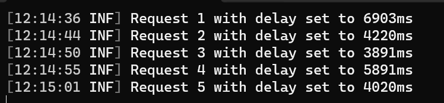
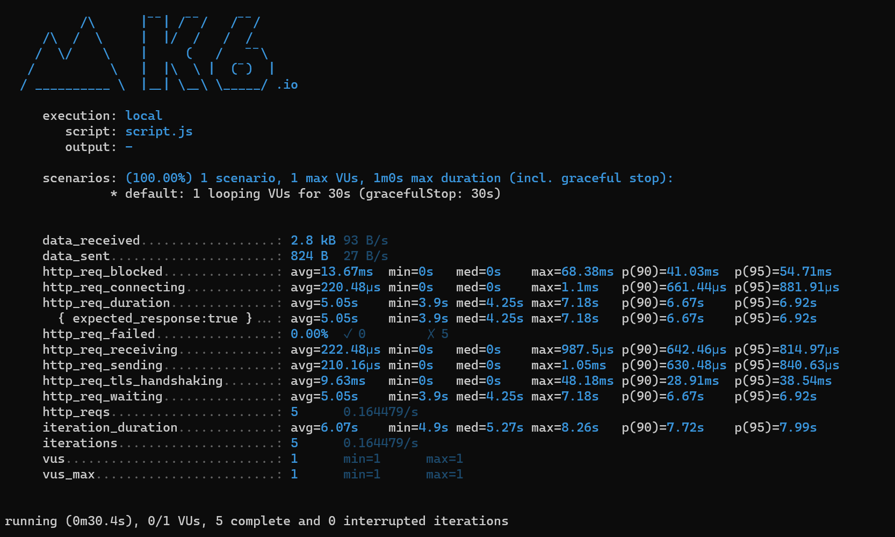

Understanding how your system reacts to incoming network traffic is crucial to understand if it's stable, if it can meet the expected [SLO](https://www.code4it.dev/architecture-notes/sli-vs-slo-vs-sla/), and if the underlying infrastructure and architecture are fine.

How can we simulate lots of incoming requests? How can we *harvest* the results of our API calls?

In this article, we will learn how to use K6, Prometheus, and Grafana to run load tests and display the final result locally in Windows11. You can actually run K6 and Grafana on cloud, but here I will explain how to run everything on your local machine, in case you don't want to use the cloud version for whichever reason.

## Load testing

Load testing simulates real-world usage conditions to ensure that the software can handle high traffic without compromising performance or user experience. 

The importance of load testing lies in its ability to **identify bottlenecks and weak points** in the system that could lead to slow response times, errors, or crashes when under stress. 

By conducting load testing, developers can make necessary optimizations and improvements, ensuring the software is robust, reliable, and scalable. It's an essential step in delivering a quality product that meets user expectations and maintains business continuity during peak usage times. If you think of it, if the system is not able to handle the incoming traffic, it may completely or partially fail, leading to user dissatisfaction, loss of revenue, and damage to the company's reputation. 

Ideally, you should plan to have automatic load tests in place in your Continuous Delivery pipelines, or, at least, ensure that you run Load tests in your production environment now and then. You then want to compare the test results with the previous ones, to ensure that you haven't introduced bottlenecks in the last releases.


## The demo project

For the sake of this article, I created a simple .NET API project: it exposes just one endpoint, `/randombook`, which returns a random book from an in-memory Entity Framework DB context.

```cs
int requestCount = 0;
int concurrentExecutions = 0;
object _lock = new();

app.MapGet("/randombook", async (CancellationToken ct) =>
{
    Book? thisBook = default;
    var delayMs = Random.Shared.Next(10, 10000);
    try
    {
        lock (_lock)
        {
            requestCount++;
            concurrentExecutions++;
            app.Logger.LogInformation("Request {Count}. Concurrent Executions {Executions}. Delay: {DelayMs}ms",
                requestCount,
                concurrentExecutions,
                delayMs
                );
        }

        using (ApiContext context = new ApiContext())
        {
            var allbooks = await context.Books.ToArrayAsync(ct);
            await Task.Delay(delayMs);
            if (ct.IsCancellationRequested)
            {
                app.Logger.LogWarning("Cancellation requested");
                throw new OperationCanceledException();
            }
            thisBook = Random.Shared.GetItems(allbooks, 1).First();
        }
    }
    catch (Exception ex)
    {
        app.Logger.LogError(ex, "An error occurred");
        return Results.Problem(ex.Message);
    }
    finally
    {
        lock (_lock)
        {
            concurrentExecutions--;
        }
    }

    return TypedResults.Ok(thisBook);
});
```

There are some details that I want to highlight before moving on with the demo.

As you can see, **I added a random delay** to simulate a random RTT for accessing the database:

```cs
var delayMs = Random.Shared.Next(10, 10000);
// omit
await Task.Delay(delayMs);
```

Also, I added a **thread-safe counter** to keep track of the active operations. I increase the value when the request begins, and decrease it when the request completes. The log message is defined in the `lock` section to avoid concurrency issues. 

```cs
lock (_lock)
{
    requestCount++;
    concurrentExecutions++;

    app.Logger.LogInformation("Request {Count}. Concurrent Executions {Executions}. Delay: {DelayMs}ms",
        requestCount,
        concurrentExecutions,
        delayMs
        );
}

// and then

lock (_lock)
{
    concurrentExecutions--;
}
```

## Install and configure K6

The first tool we are going to use is [K6](https://k6.io/).

With K6 you can run the Load Tests by defining the endpoint to call, the number of requests per minute, and some other configurations.

It's a free tool, and you can install it using *Winget*:

```bash
winget install k6 --source winget
```

You can ensure that you have installed it correctly by opening a Bash (and not a PowerShell) and executing the following command.

```bash
k6 --version
```

The `--version` prints the version installed, as well as the id of the latest GIT commit belonging to the installed package. For example, you will see *k6.exe v0.50.0 (commit/f18209a5e3, go1.21.8, windows/amd64)*.

Now we can initialize the tool. Open a **Bash** and run the following command:

```bash
k6 new
```

This command generates a *script.js* file, which you will need to configure in order to set up the Load Testing configurations.

Here's the scaffolded file (I removed the comments that refer parts we are not going to cover in this article):

```js
import http from 'k6/http';
import { sleep } from 'k6';

export const options = {
  // A number specifying the number of VUs to run concurrently.
  vus: 10,
  // A string specifying the total duration of the test run.
  duration: '30s',
};

export default function() {
  http.get('https://test.k6.io');
  sleep(1);
}
```

Let's analyze the main parts:

- `vus: 10`: `VUs` are the Virtual Users: they simulate the incoming requests that can be executed concurrenlty.
- `duration: '30s'`: this value represents the duration of the whole test run;
- `http.get('https://test.k6.io');`: it's the main function. We are going to call the specified endpoint and keep track of the responses, metrics, timings, and so on;
- `sleep(1)`: it's the sleep time between each iteration.

To run it, you just need to call

```bash
k6 run script.js
```

### Running K6 with API

VUs, Iterations, Sleep time... how do they work together?

I updated the *script.js* file to clarify how K6 works, and how it affects the API calls.

The new version of file is this:

```js
import http from 'k6/http';
import { sleep } from 'k6';

export const options = {
  vus: 1,
  duration: '30s',  
};

export default function() {
  http.get('https://localhost:7261/randombook');
  sleep(1);
}
```

We are saying "Run the load testing for 30 seconds. I want only ONE execution to exist at a time. After each execution, sleep for 1 second".

Have a look at what happens:


Let's see what happens:

1. K6 starts, and immediately calls the API.
2. On the API, we can see the first incoming call. The API sleeps for  





```txt
execution: local
      script: script.js
      output: -

    scenarios: (100.00%) 1 scenario, 1 max VUs, 1m0s max duration (incl. graceful stop):
            * default: 1 looping VUs for 30s (gracefulStop: 30s)


    data_received..................: 2.8 kB 93 B/s
    data_sent......................: 824 B  27 B/s
    http_req_blocked...............: avg=13.67ms  min=0s   med=0s    max=68.38ms p(90)=41.03ms  p(95)=54.71ms
    http_req_connecting............: avg=220.48µs min=0s   med=0s    max=1.1ms   p(90)=661.44µs p(95)=881.91µs
    http_req_duration..............: avg=5.05s    min=3.9s med=4.25s max=7.18s   p(90)=6.67s    p(95)=6.92s
      { expected_response:true }...: avg=5.05s    min=3.9s med=4.25s max=7.18s   p(90)=6.67s    p(95)=6.92s
    http_req_failed................: 0.00%  ✓ 0        ✗ 5
    http_req_receiving.............: avg=222.48µs min=0s   med=0s    max=987.5µs p(90)=642.46µs p(95)=814.97µs
    http_req_sending...............: avg=210.16µs min=0s   med=0s    max=1.05ms  p(90)=630.48µs p(95)=840.63µs
    http_req_tls_handshaking.......: avg=9.63ms   min=0s   med=0s    max=48.18ms p(90)=28.91ms  p(95)=38.54ms
    http_req_waiting...............: avg=5.05s    min=3.9s med=4.25s max=7.18s   p(90)=6.67s    p(95)=6.92s
    http_reqs......................: 5      0.164479/s
    iteration_duration.............: avg=6.07s    min=4.9s med=5.27s max=8.26s   p(90)=7.72s    p(95)=7.99s
    iterations.....................: 5      0.164479/s
    vus............................: 1      min=1      max=1
    vus_max........................: 1      min=1      max=1


running (0m30.4s), 0/1 VUs, 5 complete and 0 interrupted iterations
```

## Install Prometheus

## Install Grafana

## Run the tests


## Further readings

_This article first appeared on [Code4IT 🐧](https://www.code4it.dev/)_

https://grafana.com/docs/k6/latest/examples/


## Wrapping up


I hope you enjoyed this article! Let's keep in touch on [Twitter](https://twitter.com/BelloneDavide) or [LinkedIn](https://www.linkedin.com/in/BelloneDavide/)! 🤜🤛

Happy coding!


- [ ] Grammatica
- [ ] Titoli
- [ ] Frontmatter
- [ ] Immagine di copertina
- [ ] Fai resize della immagine di copertina
- [ ] Metti la giusta OgTitle
- [ ] Bold/Italics
- [ ] Nome cartella e slug devono combaciare
- [ ] Rinomina immagini
- [ ] Alt Text per immagini
- [ ] Trim corretto per bordi delle immagini
- [ ] Rimuovi secrets dalle immagini
- [ ] Controlla se ASP.NET Core oppure .NET
- [ ] Pulizia formattazione
- [ ] Add wt.mc_id=DT-MVP-5005077 to links
---
===== Installa Prometheus =====

https://prometheus.io/download/#prometheus

scarica zip e lancia exe con .\prometheus.exe --web.enable-remote-write-receiver per abilitare l'endpoint di receiver

Accedi a prometheus sotto http://localhost:9090/


======= Installa K6 ======
 
winget install k6 --source winget

======= Inizializza K6 ========

Crea file di config, in una cartella (usando CMD, non Powershell, a meno che non setti il comando globalmente) lanciando

k6 new

Di default, ci sono 10 VU (virtual user) e lo script dura 30 secondi

====== Lancia k6 ======

k6 run script.js

questo poi mostra i risultati a console, in maniera testuale
https://k6.io/docs/get-started/results-output/

aggiungi i custom metric per capire meglio il dettaglio:

https://k6.io/docs/using-k6/metrics/reference/

====== 


https://stackoverflow.com/questions/76679217/how-to-configure-grafana-agent
 


===== Installa Grafana ======

installa pacchetto msi
Disponibile sotto http://localhost:3000/, accedi con admin - admin.

Sotto Connections, aggiungi Prometheus come data source, specificando Localhost:9090

Sotto dashboards, crea quella di default di Prometheus

