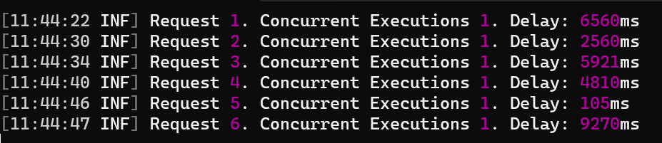
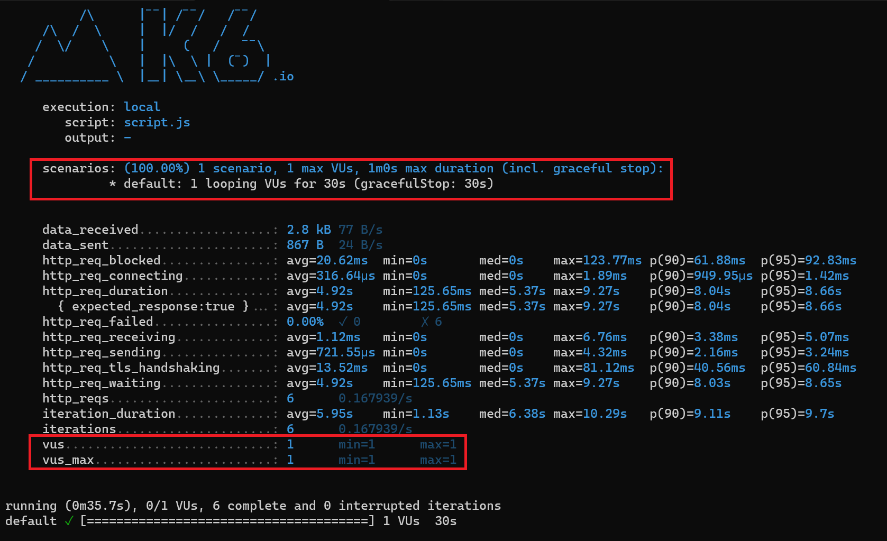
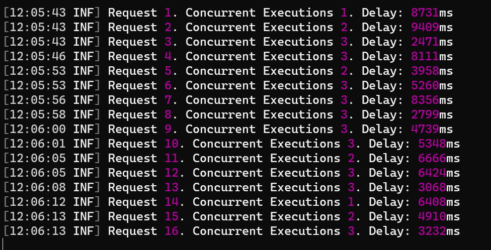
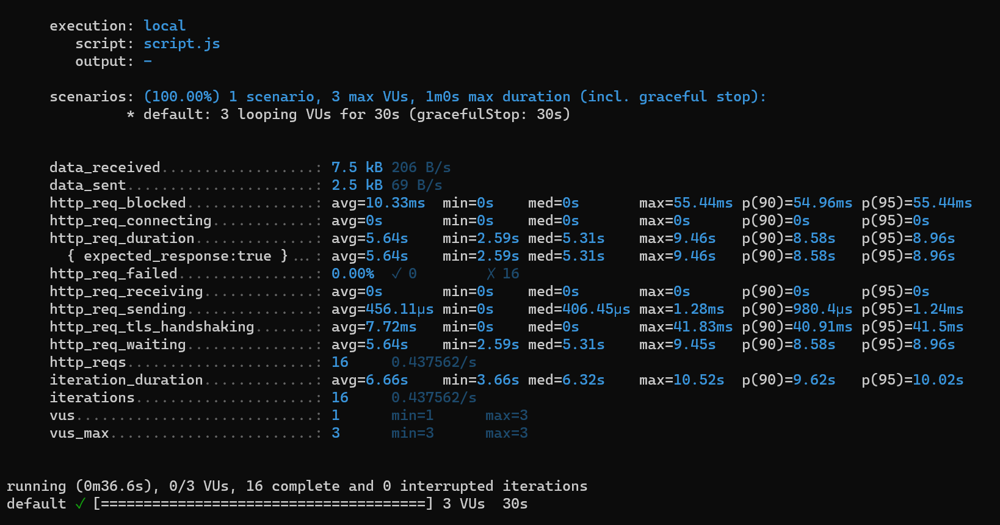
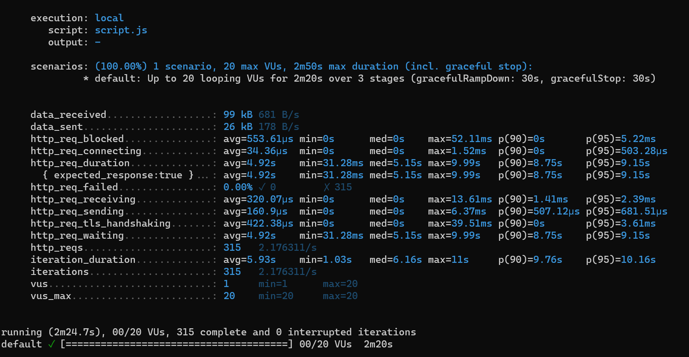

Understanding how your system reacts to incoming network traffic is crucial to determining whether it's stable, able to meet the expected [SLO](https://www.code4it.dev/architecture-notes/sli-vs-slo-vs-sla/), and if the underlying infrastructure and architecture are fine.

How can we simulate many incoming requests? How can we _harvest_ the results of our API calls?

In this article, we will learn how to use K6 to run load tests and display the final result locally in Windows 11.

This article will be the foundation of future content, in which I'll explore more topics related to load testing, performance tips, and more.

## What is Load Testing?

Load testing simulates real-world usage conditions to ensure the software can handle high traffic without compromising performance or user experience.

The importance of load testing lies in its ability to **identify bottlenecks and weak points** in the system that could lead to slow response times, errors, or crashes when under stress.

By conducting load testing, developers can make necessary optimizations and improvements, ensuring the software is robust, reliable, and scalable. It's an essential step in delivering a quality product that meets user expectations and maintains business continuity during peak usage times. If you think of it, a system unable to handle the incoming traffic may entirely or partially fail, leading to **user dissatisfaction, loss of revenue, and damage to the company's reputation**.

**Ideally, you should plan to have automatic load tests in place in your Continuous Delivery pipelines**, or, at least, ensure that you run Load tests in your production environment now and then. You then want to compare the test results with the previous ones to ensure that you haven't introduced bottlenecks in the last releases.

## The demo project

For the sake of this article, I created a simple .NET API project: it exposes just one endpoint, `/randombook`, which returns info about a random book stored in an in-memory Entity Framework DB context.

```cs
int requestCount = 0;
int concurrentExecutions = 0;
object _lock = new();
app.MapGet("/randombook", async (CancellationToken ct) =>
{
    Book ? thisBook =
        default;
    var delayMs = Random.Shared.Next(10, 10000);
    try
    {
        lock(_lock)
        {
            requestCount++;
            concurrentExecutions++;
            app.Logger.LogInformation("Request {Count}. Concurrent Executions {Executions}. Delay: {DelayMs}ms", requestCount, concurrentExecutions, delayMs);
        }
        using(ApiContext context = new ApiContext())
        {
            await Task.Delay(delayMs);
            if (ct.IsCancellationRequested)
            {
                app.Logger.LogWarning("Cancellation requested");
                throw new OperationCanceledException();
            }
            var allbooks = await context.Books.ToArrayAsync(ct);
            thisBook = Random.Shared.GetItems(allbooks, 1).First();
        }
    }
    catch (Exception ex)
    {
        app.Logger.LogError(ex, "An error occurred");
        return Results.Problem(ex.Message);
    }
    finally
    {
        lock(_lock)
        {
            concurrentExecutions--;
        }
    }
    return TypedResults.Ok(thisBook);
});
```

There are some details that I want to highlight before moving on with the demo.

As you can see, **I added a random delay** to simulate a random RTT (round-trip time) for accessing the database:

```cs
var delayMs = Random.Shared.Next(10, 10000);
// omit
await Task.Delay(delayMs);
```

I then added a **thread-safe counter** to keep track of the active operations. I increase the value when the request begins, and decrease it when the request completes. The log message is defined in the `lock` section to avoid concurrency issues.

```cs
lock (_lock)
{
    requestCount++;
    concurrentExecutions++;

    app.Logger.LogInformation("Request {Count}. Concurrent Executions {Executions}. Delay: {DelayMs}ms",
        requestCount,
        concurrentExecutions,
        delayMs
 );
}

// and then

lock (_lock)
{
    concurrentExecutions--;
}
```

Of course, it's not a perfect solution: it just fits my need for this article.

## Install and configure K6 on Windows 11

With [K6](https://k6.io/), you can run the Load Tests by defining the endpoint to call, the number of requests per minute, and some other configurations.

It's a free tool, and you can install it using _Winget_:

```bash
winget install k6 --source winget
```

You can ensure that you have installed it correctly by opening a Bash (and not a PowerShell) and executing the following command.

```bash
k6 --version
```

_Note: You can actually use PowerShell, but you have to modify some system keys to make K6 recognizable as a command._

The `--version` prints the version installed and the id of the latest GIT commit belonging to the installed package. For example, you will see _k6.exe v0.50.0 (commit/f18209a5e3, go1.21.8, windows/amd64)_.

Now, we can initialize the tool. Open a **Bash** and run the following command:

```bash
k6 new
```

**This command generates a _script.js_ file**, which you will need to configure in order to set up the Load Testing configurations.

Here's the scaffolded file (I removed the comments that refer to parts we are not going to cover in this article):

```js
import http from "k6/http"
import { sleep } from "k6"

export const options = {
  // A number specifying the number of VUs to run concurrently.
  vus: 10, // A string specifying the total duration of the test run.
  duration: "30s",
}

export default function () {
  http.get("https://test.k6.io")
  sleep(1)
}
```

Let's analyze the main parts:

- `vus: 10`: `VUs` are the **Virtual Users**: they simulate the incoming requests that can be executed concurrently.
- `duration: '30s'`: this value represents the duration of the whole test run;
- `http.get('https://test.k6.io');`: it's the main function. We are going to call the specified endpoint and keep track of the responses, metrics, timings, and so on;
- `sleep(1)`: it's the sleep time between each iteration.

To run it, you need to call:

```bash
k6 run script.js
```

## Understanding Virtual Users (VUs) in K6

VUs, Iterations, Sleep time... how do they work together?

I updated the _script.js_ file to clarify how K6 works, and how it affects the API calls.

The new version of the file is this:

```js
import http from "k6/http"
import { sleep } from "k6"

export const options = {
  vus: 1,
  duration: "30s",
}

export default function () {
  http.get("https://localhost:7261/randombook")
  sleep(1)
}
```

We are saying "Run the load testing for 30 seconds. I want only ONE execution to exist at a time. After each execution, sleep for 1 second".

Make sure to run the API project, and then run `k6 run script.js`.

Let's see what happens:

1. K6 starts, and immediately calls the API.
2. On the API, we can see the first incoming call. The API sleeps for 1 second, and then starts sending other requests.

By having a look at the logs printed from the application, we can see that we had no more than one concurrent request:



From the result screen, we can see that we have run our application for 30 seconds (plus another 30 seconds for graceful-stop) and that the max number of VUs was set to 1.



Here, you can find the same results as plain text, making it easier to follow.

```txt
execution: local
script: script.js
output: -

scenarios: (100.00%) 1 scenario, 1 max VUs, 1m0s max duration (incl. graceful stop):
 * default: 1 looping VUs for 30s (gracefulStop: 30s)


data_received..................: 2.8 kB 77 B/s
data_sent......................: 867 B   24 B/s
http_req_blocked...............: avg=20.62ms   min=0s       med=0s     max=123.77ms p(90)=61.88ms   p(95)=92.83ms
http_req_connecting............: avg=316.64µs min=0s       med=0s     max=1.89ms   p(90)=949.95µs p(95)=1.42ms
http_req_duration..............: avg=4.92s     min=125.65ms med=5.37s max=9.27s     p(90)=8.04s     p(95)=8.66s
{ expected_response:true }...: avg=4.92s     min=125.65ms med=5.37s max=9.27s     p(90)=8.04s     p(95)=8.66s
http_req_failed................: 0.00%   ✓ 0         ✗ 6
http_req_receiving.............: avg=1.12ms   min=0s       med=0s     max=6.76ms   p(90)=3.38ms   p(95)=5.07ms
http_req_sending...............: avg=721.55µs min=0s       med=0s     max=4.32ms   p(90)=2.16ms   p(95)=3.24ms
http_req_tls_handshaking.......: avg=13.52ms   min=0s       med=0s     max=81.12ms   p(90)=40.56ms   p(95)=60.84ms
http_req_waiting...............: avg=4.92s     min=125.65ms med=5.37s max=9.27s     p(90)=8.03s     p(95)=8.65s
http_reqs......................: 6       0.167939/s
iteration_duration.............: avg=5.95s     min=1.13s     med=6.38s max=10.29s   p(90)=9.11s     p(95)=9.7s
iterations.....................: 6       0.167939/s
vus............................: 1       min=1       max=1
vus_max........................: 1       min=1       max=1


running (0m35.7s), 0/1 VUs, 6 complete and 0 interrupted iterations
default ✓ [======================================] 1 VUs   30s
```

Now, let me run the same script but update the VUs. We are going to run this configuration:

```js
export const options = {
  vus: 3,
  duration: "30s",
}
```

The result is similar, but this time we had performed 16 requests instead of 6. That's because, as you can see, there were up to 3 concurrent users accessing our APIs.



The final duration was still 30 seconds. However, we managed to accept 3x users without having impacts on the performance, and without returning errors.



## Customize Load Testing properties

We have just covered the surface of what K6 can do. Of course, there are many resources in [the official K6 documentation](https://grafana.com/docs/k6/latest/), so I won't repeat everything here.

There are some parts, though, that I want to showcase here (so that you can deep dive into the ones you need).

### HTTP verbs

In the previous examples, we used the `post` HTTP method. As you can imagine, there are [other methods](https://grafana.com/docs/k6/latest/javascript-api/k6-http/) that you can use.

Each HTTP method has a corresponding Javascript function. For example, we have

- `get()` for the GET method
- `post()` for the POST method
- `put()` for the PUT method
- `del()` for the DELETE method.

### Stages

You can **create stages to define the different parts of the execution**:

```js
export const options = {
  stages: [
    { duration: "30s", target: 20 },
    { duration: "1m30s", target: 10 },
    { duration: "20s", target: 0 },
  ],
}
```

With the previous example, I defined three stages:

1. the first one lasts 30 seconds, and brings the load to 20 VUs;
2. next, during the next 90 second, the number of VUs decreases to 10;
3. finally, in the last 20 seconds, it slowly shuts down the remaining calls.



As you can see from the result, the total duration was 2m20s (which corresponds to the sum of the stages), and the max amount of requests was 20 (the number defined in the first stage).

### Scenarios

Scenarios allow you to define the details of requests iteration.

We always use a [scenario](https://grafana.com/docs/k6/latest/using-k6/scenarios/), even if we don't create one: in fact, we use the `default` scenario that gives us a predetermined time for the `gracefulStop` value, set to 30 seconds.

We can define custom scenarios to tweak the different parameters used to define how the test should act.

A scenario is nothing but a JSON element where you define arguments like duration, VUs, and so on.

By defining a scenario, you can also decide to run tests on the same endpoint but using different behaviours: you can create a scenario for a gradual growth of users, one for an immediate peak, and so on.

## A glimpse to the final report

Now, we can focus on the meaning of the data returned by the tool.

Let's use again the image we saw after running the script with the complex stages:


We can see lots of values whose names are mostly self-explaining.

We can see, for example, `data_received` and `data_sent`, which tell you the size of the data sent and received.

We have information about the duration and response of HTTP requests (`http_req_duration`, `http_req_sending`, `http_reqs`), as well as information about the several phases of an HTTP connection, like `http_req_tls_handshaking`.

We finally have information about the configurations set in K6, such as `iterations`, `vus`, and `vus_max`.

You can see the average value, the min and max, and some percentiles for most of the values.

## Wrapping up

K6 is a nice tool for getting started with load testing.

You can see more examples in the [official documentation](https://grafana.com/docs/k6/latest/examples/). I suggest to take some time and explore all the possibilities provided by K6.

_This article first appeared on [Code4IT 🐧](https://www.code4it.dev/)_

As I said before, this is just the beginning: in future articles, we will use K6 to understand how some technical choices impact the performance of the whole application.

I hope you enjoyed this article! Let's keep in touch on [LinkedIn](https://www.linkedin.com/in/BelloneDavide/) or [Twitter](https://twitter.com/BelloneDavide)! 🤜🤛

Happy coding!
