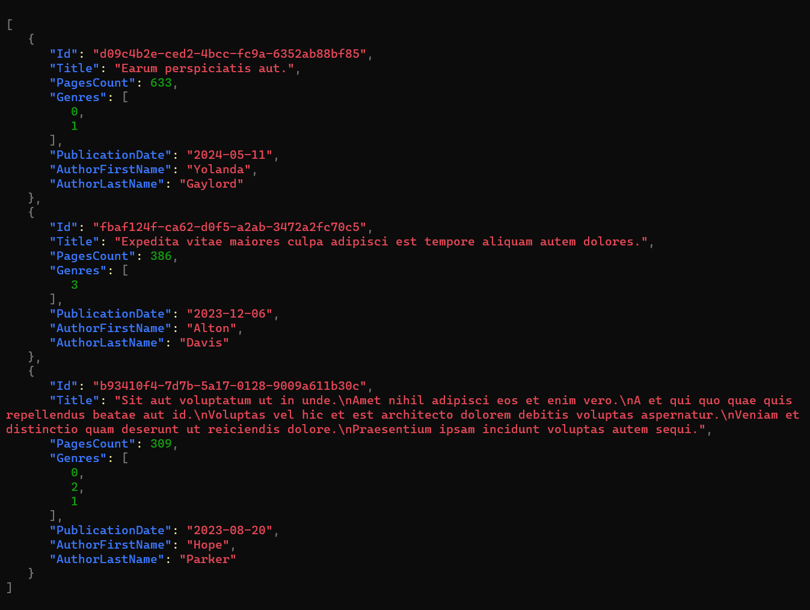

Sometimes, you want to experiment with some features or create a demo project, but you don't want to instantiate a real database instance.

Also, you might want to use some realistic data - not just "test1", 123, and so on. These values are easy to set but not very practical when demonstrating functionalities.

In this article, we're going to solve this problem by using Bogus and Entity Framework: you will learn how to generate realistic data and how to store them in an in-memory database.

## Bogus, a C# library for generating realistic data

[Bogus](https://github.com/bchavez/Bogus) is a popular library for **generating realistic data** for your tests. It allows you to choose the category of dummy data that best suits your needs.

It all starts by installing Bogus via NuGet by running `Install-Package Bogus`.

From here, you **can define the so-called Fakers**, whose purpose is to generate dummy instances of your classes by auto-populating their fields.

Let's see a simple example. We have this POCO class named `Book`:

```cs
public class Book
{
    public Guid Id { get; set; }
    public string Title { get; set; }
    public int PagesCount { get; set; }
    public Genre[] Genres { get; set; }
    public DateOnly PublicationDate { get; set; }
    public string AuthorFirstName { get; set; }
    public string AuthorLastName { get; set; }
}

public enum Genre
{
    Thriller, Fantasy, Romance, Biography
}
```

_Note: for the sake of simplicity, I used a dumb approach: author's first and last name are part of the Book info itself, and the Genres property is treated as an array of enums and not as a [flagged enum](https://www.code4it.dev/blog/5-things-enums-csharp/#4-flagged-enums)._

From here, we can start creating our `Faker` by specifying the referenced type:

```cs
Faker<Book> bookFaker = new Faker<Book>();
```

We can add one or more `RuleFor` methods to create rules used to generate each property.

The simplest approach is to use the overload where the first parameter is a Function pointing to the property to be populated, and the second is a Function that calls the methods provided by Bogus to create dummy data.

Think of it as this pseudocode:

```cs
faker.RuleFor(sm => sm.SomeProperty, f => f.SomeKindOfGenerator.GenerateSomething());
```

Another approach is to pass as the first argument the name of the property like this:

```cs
faker.RuleFor("myName", f=> f.SomeKindOfGenerator.GenerateSomething())
```

A third approach is to define a generator for a specific type, saying "every time you're trying to map a property with this type, use this generator":

```cs
bookFaker.RuleForType(typeof(DateOnly), f => f.Date.PastDateOnly());
```

Let's dive deeper into Bogus, generating data for common types.

### Generate random IDs with Bogus

We can generate random GUIDs like this:

```cs
bookFaker.RuleFor(b => b.Id, f => f.Random.Guid());
```

In a similar way, you can generate _Uuid_ by calling `f.Random.Uuid()`.

### Generate random text with Bogus

We can generate random text, **following the Lorem Ipsum structure**, to pick a single word or a longer text:

Using `Text` you generate random text:

```cs
bookFaker.RuleFor(b => b.Title, f => f.Lorem.Text());
```

However, you can use several other methods to generate text with different lengths, such as `Letter`, `Word`, `Paragraphs`, `Sentences`, and more.

### Working with Enums with Bogus

If you have an enum, you can rely again on the `Random` property of the Faker and get a random subset of the enums like this:

```cs
bookFaker.RuleFor(b => b.Genres, f => f.Random.EnumValues<Genre>(2));
```

As you can see, I specified the number of random items to use (in this case, 2). If you don't set it, it will take a random number of items.

However, the previous method returns an array of elements. If you want to get a single enum, you should use `f.Random.Enum<Genre>()`.

### Person-related dummy values with Bogus

One of the most exciting features of Bogus is the ability to generate realistic data for common entities, such as a person.

In particular, you can use the `Person` property to generate data related to the first name, last name, Gender, UserName, Phone, Website, and much more.

You can use it this way:

```cs
bookFaker.RuleFor(b => b.AuthorFirstName, f => f.Person.FirstName);
bookFaker.RuleFor(b => b.AuthorLastName, f => f.Person.LastName);
```

### Generate final class instances with Bogus

We can generate the actual items now that we've defined our rules.

You just need to call the `Generate` method; you can also specify the number of items to generate by passing a number as a first parameter:

```cs
List<Book> books = bookFaker.Generate(2);
```

Suppose you want to generate a random quantity of items. In that case, you can use the `GenerateBetween` method, specifying the top and bottom limit:

```cs
List<Book> books = bookFaker.GenerateBetween(2, 5);
```

### Wrapping up the Faker example

Now that we've learned how to generate a Faker, we can refactor the code to make it easier to read:

```cs
private List<Book> GenerateBooks(int count)
{
    Faker<Book> bookFaker = new Faker<Book>()
        .RuleFor(b => b.Id, f => f.Random.Guid())
        .RuleFor(b => b.Title, f => f.Lorem.Text())
        .RuleFor(b => b.Genres, f => f.Random.EnumValues<Genre>())
        .RuleFor(b => b.AuthorFirstName, f => f.Person.FirstName)
        .RuleFor(b => b.AuthorLastName, f => f.Person.LastName)
        .RuleFor(nameof(Book.PagesCount), f => f.Random.Number(100, 800))
        .RuleForType(typeof(DateOnly), f => f.Date.PastDateOnly());

    return bookFaker.Generate(count);
}
```

If we run it, we can see it generates the following items:



## Seeding InMemory Entity Framework with dummy data

[Entity Framework](https://learn.microsoft.com/en-us/ef/?wt.mc_id=DT-MVP-5005077) is among the most famous ORMs in the .NET ecosystem. Even though it supports many integrations, sometimes you just want to store your items in memory without relying on any specific database implementation.

### Using Entity Framework InMemory provider

To add this in-memory provider, you must install the `Microsoft.EntityFrameworkCore.InMemory` NuGet Package.

Now you can **add a new `DbContext`** - which is a sort of container of all the types you store in your database - ensuring that the class inherits from `DbContext`.

```cs
public class BooksDbContext : DbContext
{
    public DbSet<Book> Books { get; set; }
}
```

You then have to declare the type of database you want to use by defining it the int `OnConfiguring` method:

```cs
protected override void OnConfiguring(DbContextOptionsBuilder optionsBuilder)
{
    optionsBuilder.UseInMemoryDatabase("BooksDatabase");
}
```

_Note: even though it's an in-memory database, you still need to declare the database name._

### Seeding the database with data generated with Bogus

You can seed the database using the data generated by Bogus by overriding the `OnModelCreating` method:

```cs
protected override void OnModelCreating(ModelBuilder modelBuilder)
{
    base.OnModelCreating(modelBuilder);

    var booksFromBogus = BogusBookGenerator.GenerateBooks(15);

    modelBuilder.Entity<Book>().HasData(booksFromBogus);
}
```

Notice that we first create the items and then, using `modelBuilder.Entity<Book>().HasData(booksFromBogus)`, we set the newly generated items as content for the Books `DbSet`.

### Consume dummy data generated with EF Core

To wrap up, here's the complete implementation of the `DbContext`:

```cs
public class BooksDbContext : DbContext
{
    public DbSet<Book> Books { get; set; }

    protected override void OnConfiguring(DbContextOptionsBuilder optionsBuilder)
    {
     optionsBuilder.UseInMemoryDatabase("BooksDatabase");
    }

    protected override void OnModelCreating(ModelBuilder modelBuilder)
    {
        base.OnModelCreating(modelBuilder);

        var booksFromBogus = BogusBookGenerator.GenerateBooks(15);

        modelBuilder.Entity<Book>().HasData(booksFromBogus);
    }
}
```

We are now ready to instantiate the `DbContext`, ensure that the Database has been created and seeded with the correct data, and perform the operations needed.

```cs
using var dbContext = new BooksDbContext();
dbContext.Database.EnsureCreated();

var allBooks = await dbContext.Books.ToListAsync();

var thrillerBooks = dbContext.Books
        .Where(b => b.Genres.Contains(Genre.Thriller))
        .ToList();
```

## Further readings

In this blog, we've already discussed the Entity Framework. In particular, we used it to perform CRUD operations on a PostgreSQL database.

🔗 [How to perform CRUD operations with Entity Framework Core and PostgreSQL | Code4IT](https://www.code4it.dev/blog/postgres-crud-entityframework/)

_This article first appeared on [Code4IT 🐧](https://www.code4it.dev/)_

I suggest you explore the potentialities of Bogus: there are a lot of functionalities that I didn't cover in this article, and they may make your tests and experiments meaningful and easier to understand.

🔗 [Bogus repository | GitHub](https://github.com/bchavez/Bogus/)

## Wrapping up

Bogus is a great library for creating unit and integration tests. However, I find it useful to generate dummy data for several purposes, like creating a stub of a service, populating a UI with realistic data, or trying out other tools and functionalities.

I hope you enjoyed this article! Let's keep in touch on [Twitter](https://twitter.com/BelloneDavide) or [LinkedIn](https://www.linkedin.com/in/BelloneDavide/)! 🤜🤛

Happy coding!

🐧
