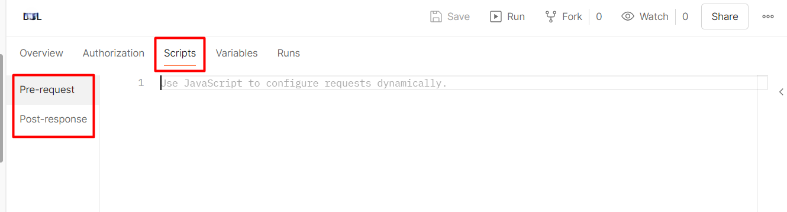
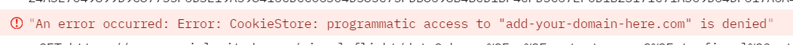
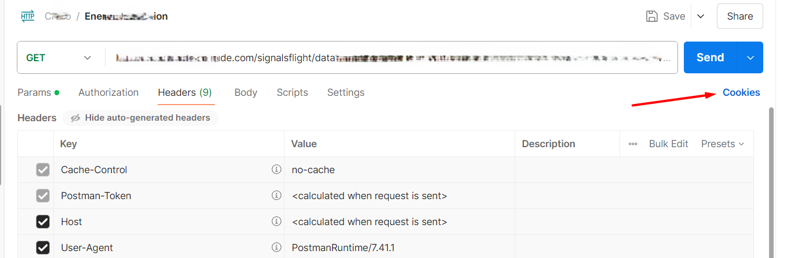
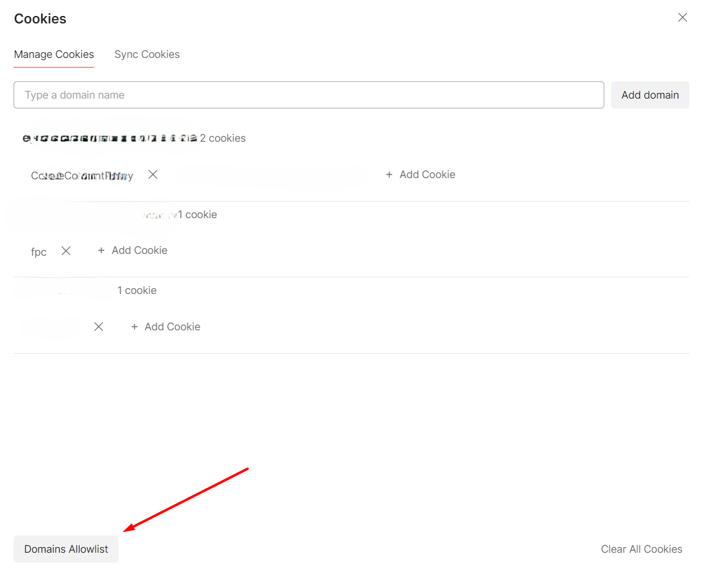
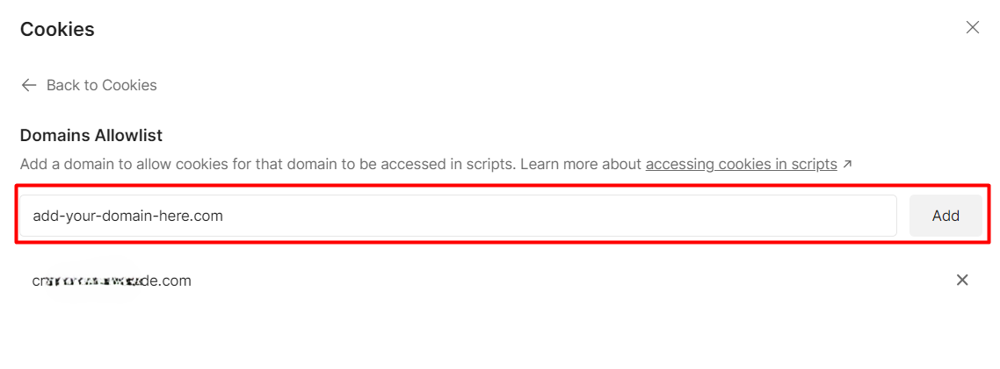
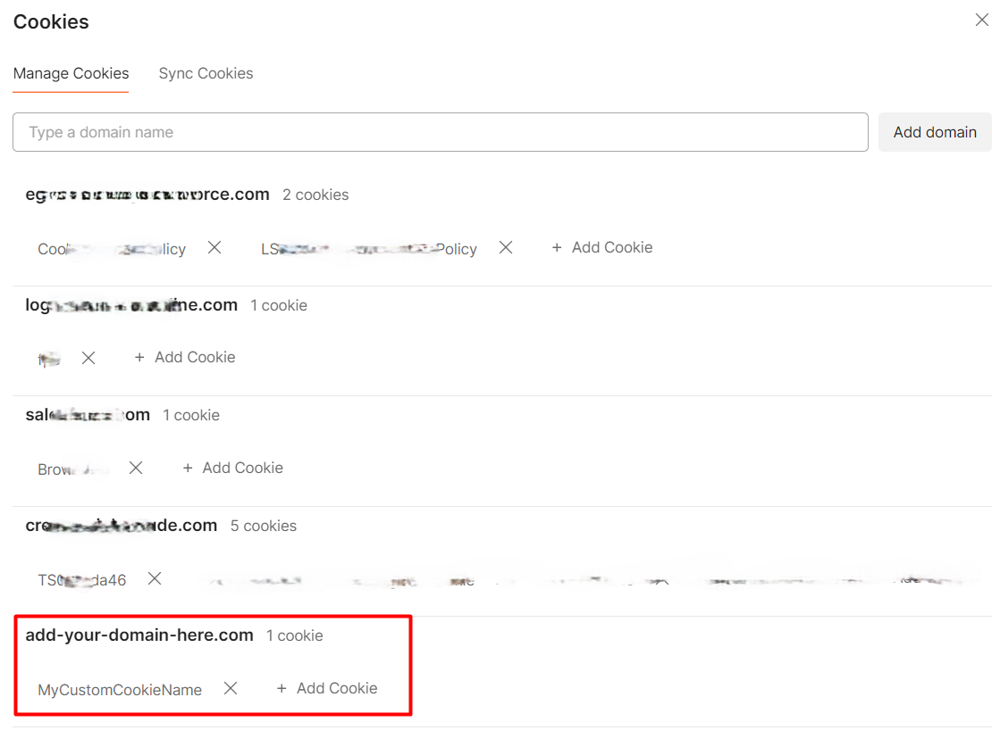

Nowadays, it's rare to find services that use Cookie Authentication, yet they still exist. How can we configure Cookie Authentication with Postman? How can we centralize the definition using pre-request scripts?

I had to answer these questions when I had to integrate a third-party system that was using Cookie Authentication. Instead of generating a new token manually, I decided to centralize the Cookie creation in a single place, making it automatically available to every subsequent request.

In order to generate the token, I had to send a request to the Authentication endpoint, sending a JSON payload with data coming from Postman's variables.

In this article, I'll recap what I learned, teach you some basics of creating pre-request scripts with Postman, and provide a full example of how I used it to centralize the generation and usage of a cookie for a whole Postman collection.

## Introducing Postman's pre-request scripts

As you probably know, **Postman allows you to create scripts that are executed before and after an HTTP call**.

These scripts are written in JavaScript and can use some objects and methods that come out of the box with Postman.

You can create such scripts for a single request or the whole collection. In the second case, you write the script once so that it becomes available for all the requests stored within that collection.



The operations defined in the Scripts section of the collection are then executed before (or after) every request in the collection.

Here, you can either use the standard JavaScript code—like the dear old `console.log`— or the `pm` object to reference the context in which the script will be executed.

For example, you can print the value of a Postman variable by using:

```javascript
const tokenUrl = pm.variables.get("TokenUrl")
console.log(tokenUrl)
```

## How to send a POST request with JSON body in Postman pre-request scripts

How can we issue a POST request in the pre-request script, specifying a JSON body?

Postman's `pm` object, along with some other methods, exposes the `sendRequest` function. Its first parameter is the "description" of the request; its second parameter is the callback to execute after the request is completed.

```javascript
pm.sendRequest(request, (errorResponse, successfulResponse) => {
  // do something here
})
```

You have to carefully craft the `request`, by specifying the HTTP method, the body, and the content type:

```javascript
var authenticationBody = {
  UserName: username,
  Password: password,
}

const request = {
  method: "POST",
  url: tokenUrl,
  body: {
    mode: "raw",
    raw: JSON.stringify(authenticationBody),
    options: {
      raw: {
        language: "json",
      },
    },
  },
}
```

**Pay particular attention to the `options` node**: it tells Postman how to treat the body content and what the content type is. Because I was missing this node, I spent too many minutes trying to figure out why this call was badly formed.

```javascript
options: {
  raw: {
    language: "json"
  }
}
```

Now, the result of the operation is used to execute the callback function. Generally, you want it to be structured like this:

```javascript
pm.sendRequest(request, (err, response) => {
  if (err) {
    // handle error
  }
  if (response) {
    // handle success
  }
})
```

## Storing Cookies in Postman (using a Jar)

You have received the response with the token, and you have parsed the response to retrieve the value. Now what?

**You cannot store Cookies directly as it they were simple variables**. Instead, **you must store Cookies in a Jar**.

Postman allows you to programmatically operate with cookies only by accessing them via a _Jar_ (yup, pun intended!), that can be initialized like this:

```js
const jar = pm.cookies.jar()
```

From here, you can add, remove or retrieve cookies by working with the `jar` object.

**To add a new cookie, you must use the `set()` method of the `jar` object**, specifying the domain the cookie belongs to, its name, its value, and the callback to execute when the operation completes.

```javascript
const jar = pm.cookies.jar()

jar.set(
  "add-your-domain-here.com",
  "MyCustomCookieName",
  newToken,
  (error, cookie) => {
    if (error) {
      console.error(`An error occurred: ${error}`)
    } else {
      console.log(`Cookie saved: ${cookie}`)
    }
  }
)
```

You can try it now: execute a request, have a look at the console logs, and...



We've received a strange error:

> An error occurred: Error: CookieStore: programmatic access to "add-your-domain-here.com" is denied

Wait, what? What does "programmatic access to X is denied" mean, and how can we solve this error?

**For security reasons, you cannot handle cookies _via code_ without letting Postman know that you explicitly want to operate on the specified domain**. To overcome this limitation, you need to **whitelist the domain associated with the cookie** so that Postman will accept that the operation you're trying to achieve via code is legit.

To enable a domain for cookies operations, you first have to **navigate to the headers section** of any request under the collection and **click the Cookies button**.



From here, **select Domains Allowlist**:



Finally, add your domain to the list of the allowed ones.



Now Postman knows that if you try to set a cookie via code, it's because you actively want it, allowing you to add your cookies to the jar.

If you open again the Cookie section (see above), you will be able to see the current values for the cookies associated with the domain:



## Further readings

Clearly, we've just scratched the surface of what you can do with pre-request scripts in Postman. To learn more, have a look at the official documentation:

🔗 [Write pre-request scripts to add dynamic behavior in Postman | Postman docs](https://learning.postman.com/docs/tests-and-scripts/write-scripts/pre-request-scripts/)

_This article first appeared on [Code4IT 🐧](https://www.code4it.dev/)_

If you want to learn more about how to use the Jar object and what operations are available, you can have a look at the following link:

🔗 [Scripting with request cookie | Postman docs](https://learning.postman.com/docs/tests-and-scripts/write-scripts/postman-sandbox-api-reference/#scripting-with-request-cookies)

## Wrapping up (with complete example)

In this article, we learned what pre-request scripts are, how to execute a POST request passing a JSON object as a body, and how to programmatically add a Cookie in Postman by operating on the Jar object.

For clarity, here's the complete code I used in my pre-request script.

```javascript
const tokenUrl = pm.variables.get("TokenUrl")
const username = pm.variables.get("ClientID")
const password = pm.variables.get("ClientSecret")

var authBody = {
  UserName: username,
  Password: password,
}

const getTokenRequest = {
  method: "POST",
  url: tokenUrl,
  body: {
    mode: "raw",
    raw: JSON.stringify(authBody),
    options: {
      raw: {
        language: "json",
      },
    },
  },
}

pm.sendRequest(getTokenRequest, (err, response) => {
  if (err) {
    throw new Error(err)
  }
  if (response) {
    var jresponse = response.json()

    var newToken = jresponse["Token"]

    console.log("token: ", newToken)

    if (newToken) {
      const jar = pm.cookies.jar()

      jar.set(
        "add-your-domain-here.com",
        "MyCustomCookieName",
        newToken,
        (error, cookie) => {
          if (error) {
            console.error(`An error occurred: ${error}`)
          } else {
            console.log(`Cookie saved: ${cookie}`)
          }
        }
      )
    } else {
      throw new Error("Token not available")
    }
  }
})
```

Notice that to parse the response from the authentication endpoint I used the `.json()` method, that allows me to access the internal values using the property name, as in `jresponse["Token"]`.

I hope you enjoyed this article! Let's keep in touch on [Twitter](https://twitter.com/BelloneDavide) or [LinkedIn](https://www.linkedin.com/in/BelloneDavide/)! 🤜🤛

Happy coding!

🐧
