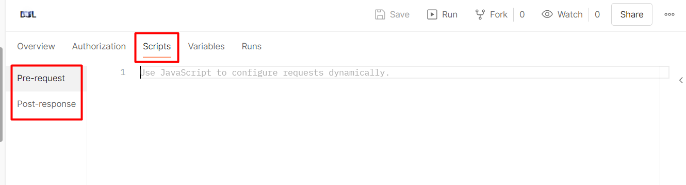
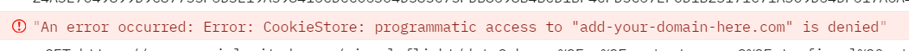
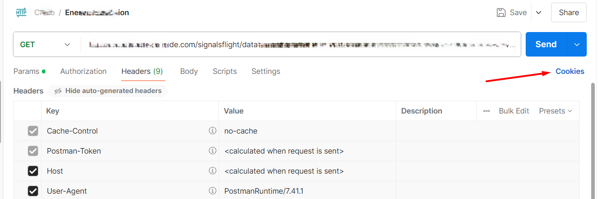
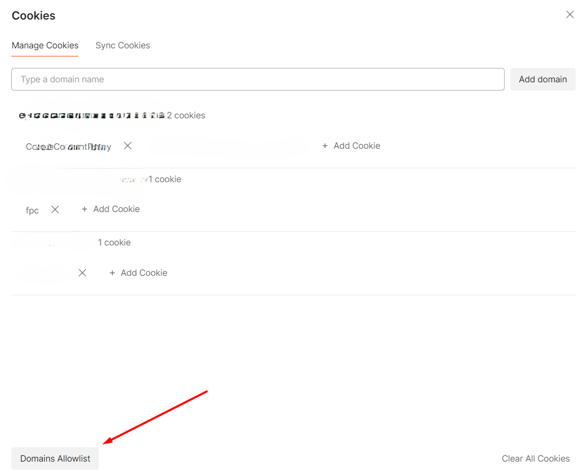
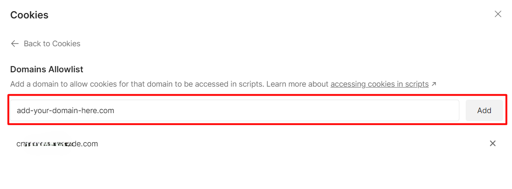
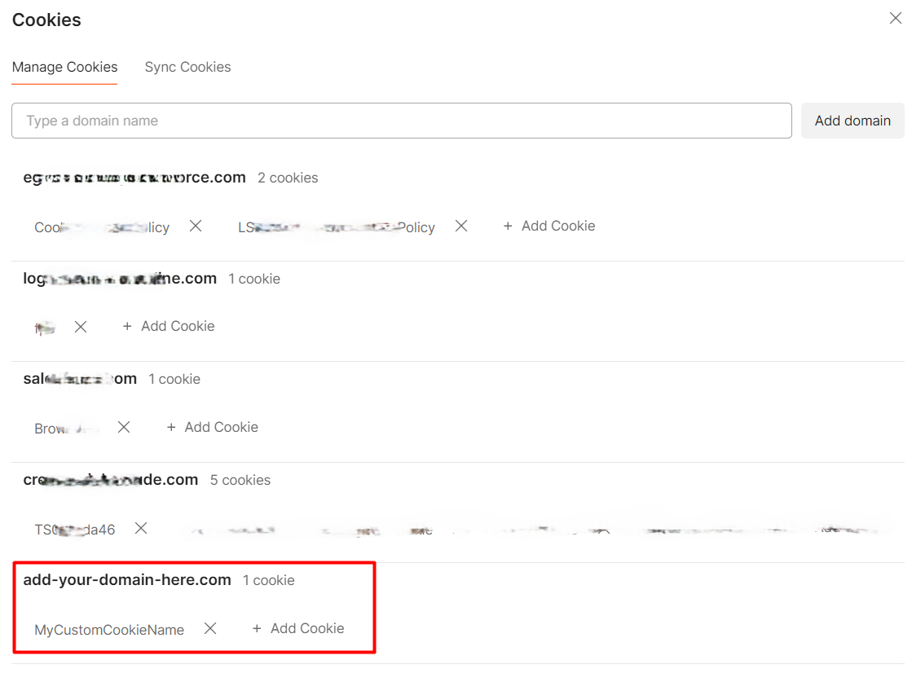

Even though it's rare to find services that still use Cookie Authentication, they exist. How to configure Cookie Authentication with Postman? How can we centralize the definition using pre-request scripts?

These are questions I had to answer when working on a specific functionality on my work project: in order to access a third-party API, I had to configure Cookie Authentication; to retrieve the Cookie, I had to send, via POST, a JSON payload with data coming from Postman's variables.

In this article, I'll recap what I learned, teach you some basics of creating pre-request scripts with Postman, and provide a full example of how I used it to centralize the generation and usage of a cookie for a whole Postman collection.

## Introducing Postman's pre-request scripts

As you probably know, Postman allows you to create scripts that are executed before and after an HTTP call.

These scripts are written in JavaScript and can use some objects and methods that come out-of-the-box with Postman.

You can decide to create such scripts for a single request or for the whole collection. In the second case, you write the script once so that it becomes available for all the requests stored within that collection.



Here, you can either use the standard JavaScript code - like a dear old `console.log` - or use the `pm` object to reference the context in which the script will be executed.

For example, you can retrieve the value of a Postman variable by using:

```javascript
const tokenUrl = pm.variables.get("TokenUrl");
const username = pm.variables.get("ClientID");
const password = pm.variables.get("ClientSecret");
```

## How to send a POST request with JSON body in Postman pre-request scripts

How can we issue a POST request in the pre-request script, specifying a JSON body?

Postman, along with some other methods, exposes the `sendRequest` function. Its first parameter is the "description" of the request; its second parameter is the callback to execute in case of an error or a successful response.

```javascript
pm.sendRequest(request, (err, response) => {
    // do something here
});
```

You have to carefully craft the `request`, by specifying the verb, the body, and the content type:

```javascript
var authBody = {
    'UserName' : username ,
    'Password' : password ,
};

const getTokenRequest = {
    method: 'POST',
    url: tokenUrl,
    body: {
        mode: 'raw',
        raw: JSON.stringify(authBody),
    options: {
        raw: {
            language: "json"
 }
 }
 }
};
```

**Pay particular attention to the `options` node**: it tells Postman how to treat the body's content and what the content type is. Because I was missing this node, I spent too many minutes figuring out why this call was badly formed.

```javascript
options: {
 raw: {
 language: "json"
 }
 }
```

Now, the result of the operation is used to execute the callback function. Generally, you want it to be structured like this:

```javascript
pm.sendRequest(request, (err, response) => {
    if(err)
 {
        // handle error
 }
    if(response)
 {
        // handle success
 }
});
```


## Storing Cookies in Postman (using a Jar)

Now you have received the response with the token, and you have parsed the response to retrieve the value. Now what?

**You cannot store Cookies directly as it they were simple variables**. Instead, **you must store Cookies in a Jar**.

Postman allows you to programmatically operate with cookies only by accessing them via a *Jar* (yes, pun intended!), that can be initialized like this:

```js
const jar = pm.cookies.jar();
```


From here, you can add, remove or retrieve cookies by working with the `jar` object.

You can use the `set()` method of the `jar` object specifying the domain the cookie belongs to, the name of the cookie, the value, and the callbacks to call when the operation completes.

```javascript
const jar = pm.cookies.jar();
jar.set("add-your-domain-here.com", "MyCustomCookieName", newToken, (error, cookie) => {
  if (error) {
    console.error(`An error occurred: ${error}`);
 } else {
    console.log(`Cookie saved: ${cookie}`);
 }
});
```

Now execute a request, have a look at the console logs, and...



We've received a strange error:

> An error occurred: Error: CookieStore: programmatic access to "add-your-domain-here.com" is denied

Wait, what?

For security reasons, you cannot handle cookies *via code* without control on the related domain. To overcome this limitation, you first have to **head to the headers section** of any request under the collection, and **click the Cookies button**.



From here, select Domains Allowlist:




and, finally, add your domain to the list of the allowed ones.



Now that Postman knows that if you try to set a cookie via code it's because you actively want it, you can add your cookies to the jar.

If open again the Cookie section (see above), you will be able to see the current values for the cookies associated to the domain:



## Further readings

_This article first appeared on [Code4IT 🐧](https://www.code4it.dev/)_

https://learning.postman.com/docs/tests-and-scripts/write-scripts/postman-sandbox-api-reference/#scripting-with-request-cookies


## Wrapping up


[ ] JAR
[ ] esempio completo


I hope you enjoyed this article! Let's keep in touch on [Twitter](https://twitter.com/BelloneDavide) or [LinkedIn](https://www.linkedin.com/in/BelloneDavide/)! 🤜🤛

Happy coding!

🐧


- [ ] Grammatica
- [ ] Titoli
- [ ] Frontmatter
- [ ] Immagine di copertina
- [ ] Fai resize della immagine di copertina
- [ ] Metti la giusta OgTitle
- [ ] Bold/Italics
- [ ] Nome cartella e slug devono combaciare
- [ ] Rinomina immagini
- [ ] Alt Text per immagini
- [ ] Trim corretto per bordi delle immagini
- [ ] Rimuovi secrets dalle immagini
- [ ] Controlla se ASP.NET Core oppure .NET
- [ ] Pulizia formattazione
- [ ] Add wt.mc_id=DT-MVP-5005077 to links

## Appunti

```javascript

const tokenUrl = pm.variables.get("TokenUrl");
const username = pm.variables.get("ClientID");
const password = pm.variables.get("ClientSecret");

var authBody = {
     'UserName' : username ,
            'Password' : password ,
            'ClientMachine': 'PostmanClient' ,
           'CreatePersistentSession': true ,
            'ForceLogOffOtherUsers' : 'true' 
};

const getTokenRequest = {
    method: 'POST',
    url: tokenUrl,
    body: {
        mode: 'raw',
        raw: JSON.stringify(authBody),
    options: {
        raw: {
            language: "json"
 }
 }
 }
};

pm.sendRequest(getTokenRequest, (err, response) => {
    console.log("err ", err);
    console.log("ok ", response);
    // const jsonResponse = response.json();
    // const newAccessToken = jsonResponse.access_token;
    // pm.variables.set('Token', newAccessToken);

    if(err){
        throw new Error(err);
 }
    if(response){
       var jresponse = response.json();
       console.log(jresponse);
       var newToken = jresponse["Token"];
console.log("token: ", newToken);
if(newToken){
const jar = pm.cookies.jar();
jar.set("creso.eniplenitude.com", ".BAX_TKN", newToken, (error, cookie) => {
  if (error) {
    console.error(`An error occurred: ${error}`);
 } else {
    console.log(`Cookie saved: ${cookie}`);
 }
});

}else{
    throw new Error("Token not available");
}
 }
});
```


 